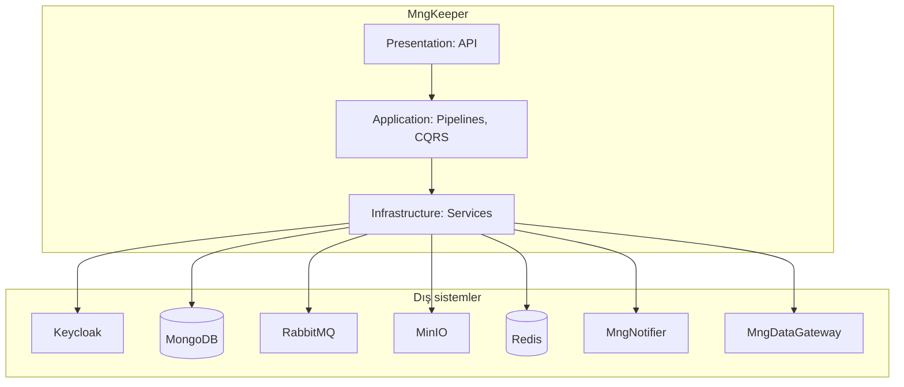

# MngKeeper Architecture Guide

## Genel Bakış

MngKeeper, MonitraNG platformunun **Identity & Access Management (IAM)** servisidir. Merkezi kimlik doğrulama ve yetkilendirme sağlar; multi-tenant domain yönetimi, kullanıcı/grup yönetimi, JWT tabanlı oturum ve lisans kontrolünden sorumludur.

**Temel sorumluluklar:**

- **Domain yönetimi** — Her müşteri (tenant) bir *domain* ile temsil edilir; domain başına izole veritabanı, Keycloak realm ve object storage.
- **Kimlik doğrulama** — Keycloak ile OIDC/OAuth2; JWT access/refresh token, custom claim’ler (domain, roller, gruplar).
- **Kullanıcı ve grup yönetimi** — Domain içinde kullanıcı CRUD, grup atamaları, profil/foto, şifre sıfırlama.
- **Lisanslama** — Trial ve gerçek lisans; operasyon bazlı kontrol (token üretimi, CRUD, okuma).
- **Entegrasyon** — RabbitMQ event’leri, MngDataGateway senkronu, MinIO (foto/locale), MngNotifier (e-posta).

Detaylı API listesi için [Technical Specs](../../main/TECHNICAL_SPECS.md) kullanılır.

---

## Katmanlı yapı (Clean Architecture)

MngKeeper, bağımlılıkların domain merkezine doğru akıtıldığı katmanlı bir yapı kullanır.

| Katman | Klasör / proje | Sorumluluk | Örnek |
|--------|-----------------|------------|--------|
| **Domain** | `Core/MngKeeper.Domain` | Entity’ler, enum’lar, domain kuralları. Dış bağımlılık yok. | `Domain`, `User`, `Group`, `LicenseInfo`, `DomainStatus` |
| **Application** | `Core/MngKeeper.Application` | Use case’ler (CQRS/MediatR), pipeline’lar, interface’ler, DTO’lar. | `CreateDomainCommand`, `DomainCreationPipeline`, `IKeycloakService`, `IDomainRepository` |
| **Infrastructure** | `Infrastructure/MngKeeper.Infrastructure` | Dış sistemlere erişim: Keycloak, MongoDB, Redis, RabbitMQ, MinIO, e-posta. | `KeycloakService`, `DomainRepository`, `RedisCacheService`, `RabbitMqService`, `MinioService` |
| **Presentation** | `Presentation/MngKeeper.Api` | HTTP API, controller’lar, middleware, auth attribute’ları. | `AuthController`, `DomainController`, `JwtClaimsMiddleware`, `ManagerAuthorizationAttribute` |

Bağımlılık yönü: **Presentation → Application → Domain** ve **Infrastructure → Application → Domain**. Domain hiçbir dış katmana referans vermez.

---

## Multi-tenant modeli

Her **domain** bir tenant’ı temsil eder. Aynı MngKeeper örneği birçok domain’i yönetir; veri ve kimlik alanları domain bazında izole edilir.

| Kaynak | Domain başına örnek | Açıklama |
|--------|----------------------|----------|
| **MongoDB** | Bir veritabanı | `databaseName` genelde `mng_{domainName}` (örn. `mng_meral`). Domain meta bilgisi merkezi bir DB’de `domains` koleksiyonunda; kullanıcı/grup verisi ilgili domain DB’sinde `@users`, `@groups` koleksiyonlarında. |
| **Keycloak** | Bir realm | `realmName` = domain adı. Kullanıcılar ve gruplar bu realm içinde; token’da `domain_name` / `domain_id` claim’leri ile eşleşir. |
| **MinIO** | Bir bucket | Bucket adı `mng-{domainName}` (ör. `mng-meral`). Kullanıcı fotoğrafları `data/users/{userId}/photo.*` altında. |
| **Redis** | Key prefix | `domain:{domainName}:*` ile domain bazlı cache anahtarları (kullanıcı/grup bilgisi, vb.). |

Böylece bir domain’e yapılan işlemler diğer domain’lerin verisine karışmaz; tüm API istekleri JWT veya parametre ile domain bağlamı taşır.

---

## Domain oluşturma pipeline'ı

Yeni bir domain eklenirken **DomainCreationPipeline** kullanılır. Tüm adımlar sırayla çalışır; bir adım hata dönerse pipeline durur, sonuç `CreateDomainResponse` içinde `IsSuccess: false`, `FailedStep` ve `ErrorMessage` ile raporlanır.

**Adım sırası ve kısa açıklama:**

| # | Adım | Açıklama |
|---|------|----------|
| 1 | **ValidateDomain** | Domain adı formatı ve benzersizliği kontrol edilir; aynı isimde domain varsa hata. |
| 2 | **CreateDomainEntity** | MongoDB’de domain meta kaydı oluşturulur (name, displayName, databaseName, realmName, bucket, status=Pending). |
| 3 | **CreateDatabase** | Domain’e özel MongoDB veritabanı (`mng_{domainName}`) oluşturulur. |
| 4 | **InitializeDatabaseCollections** | `@datasets`, `@dataset_categories` vb. koleksiyonlar açılır. |
| 5 | **InitializeInitialData** | Şablon varsa `mng_templates` verisi domain DB’sine kopyalanır. |
| 6 | **InitializeDataGatewayCollections** | DataGateway ile uyumlu `@users`, `@groups` koleksiyonları oluşturulur. |
| 7 | **CreateIndexes** | Kullanıcı ve grup koleksiyonları için gerekli indeksler tanımlanır. |
| 8 | **CreateKeycloakRealm** | Keycloak’ta domain adıyla yeni realm oluşturulur; realm ayarları uygulanır. |
| 9 | **CreateDefaultGroups** | Realm içinde varsayılan gruplar (Admins, Managers, Users, Guests) ve Keycloak grupları yaratılır. |
| 10 | **CreateAdminUser** | İlk yönetici kullanıcısı oluşturulur; Admin grubuna atanır. |
| 11 | **PublishDomainCreatedEvent** | RabbitMQ’ya `system.mngkeeper.domain.created` event’i gönderilir (domainId, domainName, databaseName, realmName, adminEmail vb.). |
| 12 | **InitializeDomainCache** | Redis’te domain’e ait kullanıcı/grup önbellek anahtarları doldurulur. |
| 13 | **CreateMinIOBucket** | Domain’e ait MinIO bucket oluşturulur. |
| 14 | **CreateLicense** | Domain için trial lisans oluşturulur. |
| 15 | **ActivateDomain** | Domain durumu `Active` yapılır. |
| 16 | **SendDomainCreatedEmail** | İlgili kişiye “domain oluşturuldu” e-postası gönderilir (MngNotifier; kritik olmayan adım). |

Pipeline sınıfı: `Application.Pipelines.DomainCreation.DomainCreationPipeline`; context: `DomainCreationContext`. Her adım `IPipelineStep<DomainCreationContext>` uygular.

---

## Kimlik ve erişim

**Keycloak:** Tüm kimlik doğrulama Keycloak üzerinden yapılır. Her domain bir realm; kullanıcılar ve gruplar realm içinde tanımlıdır. Token almak için `POST /api/auth/token` (username, password, domain) kullanılır; yanıtta `accessToken` ve `refreshToken` döner.

**JWT ve custom claim’ler:** Token’da aşağıdaki claim’ler kullanılır (Admin mapper’lar ile eklenir):

- `domain_name` — Kullanıcının domain’i (realm adı).
- `domain_id` — Domain’in MongoDB ObjectId’si.
- `user_groups` — Kullanıcının grup listesi (Keycloak group membership).
- `isAdmin` — Yönetici mi (user attribute’tan).

**Yetkilendirme attribute’ları:**

- **AuthenticatedAuthorization** — Geçerli bir JWT ve domain bilgisi yeterli.
- **ManagerAuthorization** — Token’da `IsAdmin` veya `IsManager` gerekir; Manager ve Admin erişir. User/Group CRUD, photo, request-password-reset vb. bu attribute ile korunur.
- **AdminAuthorization** — Sadece Admin; örn. create-reset-token, bazı admin endpoint’leri.

**Middleware:** `JwtClaimsMiddleware` isteğin `Authorization: Bearer` header’ından token’ı okur, claim’leri parse edip `HttpContext.Items["TokenClaims"]` içine koyar; controller’lar ve attribute’lar buradan domain/user bilgisine erişir.

---

## Veri ve cache

**MongoDB:**

- **Merkezi (keeper) DB:** Domain meta verisi; koleksiyon adı proje ayarına göre (genelde `domains` veya benzeri).
- **Domain DB’leri:** Her domain için ayrı DB (`mng_{domainName}`). İçinde:
  - `@users` — Kullanıcı kayıtları (Keycloak ile senkron, DataGateway ile paylaşılacak alanlar).
  - `@groups` — Grup kayıtları.
  - İsteğe bağlı: `@datasets`, `@dataset_categories` vb. (pipeline ve şablonlara göre).

**Redis:**

- Domain ve kullanıcı/grup bilgisini önbelleklemek için kullanılır.
- Pipeline’da **InitializeDomainCacheStep** domain oluşturulunca ilgili domain için Redis anahtarlarını doldurur (örn. `domain:{domainName}:users`, gruplar).
- `IRedisService` / `RedisCacheService` üzerinden erişilir; session ve lisans kontrollerinde de kullanılabilir. TTL ve strateji uygulama ayarlarına bağlıdır.

---

## Dış sistemler ve olaylar

| Sistem | Amaç | MngKeeper’daki kullanım |
|--------|------|--------------------------|
| **Keycloak** | Kimlik ve realm yönetimi | Realm oluşturma, kullanıcı/grup CRUD, token verme/yenileme/iptal, şifre güncelleme, realm mapper yapılandırması. |
| **MongoDB** | Kalıcı veri | Domain, kullanıcı, grup; domain bazlı DB’ler. |
| **Redis** | Önbellek / oturum | Domain ve kullanıcı/grup cache; (opsiyonel) session. |
| **RabbitMQ** | Olay dağıtımı | Domain oluşturulunca `system.mngkeeper.domain.created` event’i yayınlanır; diğer servisler abone olabilir. |
| **MinIO** | Object storage | Kullanıcı fotoğrafları (domain bucket’ında); sistem geneli locale dosyaları (system bucket). |
| **MngNotifier** | E-posta | Şifre sıfırlama mailleri, domain oluşturuldu bildirimi. |
| **MngDataGateway** | Veri API’si | Kullanıcı/grup verisi DataGateway MongoDB’ye sync edilir (`SyncController`: users, groups, all). |

---

## Lisanslama

Lisans türleri: **Trial** ve **Real**. Her domain için en geçerli lisans (öncelik: Real > Trial) kullanılır; süre ve özellik sınırları `LicenseFeatures` ve `ExpirationBehavior` ile tanımlanır.

**Operasyon kontrolü:** `LicenseOperation` enum’ı — `TokenGeneration`, `CrudOperation`, `GetOperation`. Bu işlemlerden önce `ILicenseService.IsOperationAllowedAsync(domainName, operation)` ile lisans kontrolü yapılabilir; yetkisiz ise istek reddedilir.

**Lisans dosyası:** Gerçek lisans yüklenebilir/indirilebilir; şifreleme `ILicenseEncryptionService` ile yapılır. Trial lisans pipeline içinde otomatik oluşturulur.

Detaylı endpoint ve alan açıklamaları için [Technical Specs — License bölümü](../../main/TECHNICAL_SPECS.md#5-license--apilicense) kullanılır.

---

## Diyagramlar

### Üst seviye bileşen diyagramı

Aşağıdaki diyagram, MngKeeper’ın dış sistemlerle ilişkisini ve ana bileşenlerini özetler.

*Şekil: MngKeeper katmanları ve dış bağımlılıklar. İstekler API’den girer; Application use case ve pipeline’ları çalıştırır; Infrastructure Keycloak, MongoDB, RabbitMQ, MinIO, Redis, MngNotifier ve MngDataGateway ile konuşur.*

### Domain oluşturma akışı (özet)

```mermaid
flowchart LR
    A[Validate] --> B[Domain Entity]
    B --> C[Create DB]
    C --> D[Init Collections]
    D --> E[Keycloak Realm]
    E --> F[Default Groups]
    F --> G[Admin User]
    G --> H[RabbitMQ Event]
    H --> I[Redis Cache]
    I --> J[MinIO Bucket]
    J --> K[License]
    K --> L[Activate]
    L --> M[Send Email]
```

*Şekil: Domain oluşturma pipeline’ının sırası (özet). Validasyon ve entity’den başlayıp DB, koleksiyonlar, Keycloak, gruplar, admin, event, cache, MinIO, lisans, aktivasyon ve e-posta adımlarıyla biter.*

---

## İlgili dokümantasyon

- [Technical Specs](../../main/TECHNICAL_SPECS.md) — Tüm API endpoint’leri, request/response alanları.
- [Gateway Integration](../guides/GATEWAY_INTEGRATION.md) — MngGateway üzerinden erişim ve yönlendirme.
- [API Overview](../guides/API_OVERVIEW.md) — API’ye genel bakış.
- [Changelog](../../main/CHANGELOG.md) — Sürüm bazlı değişiklikler.
- [Mimari içerik planı](ARCHITECTURE_CONTENT_PLAN.md) — Bu rehberin bölümlerinin nasıl doldurulacağına dair plan.
