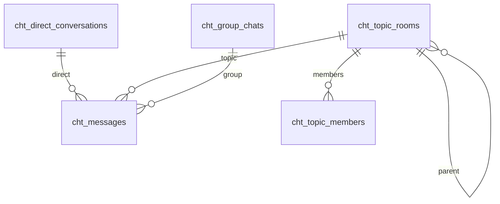

# Chat Room — Yol Haritası ve Planlama

**Oluşturulma:** 27 Nisan 2026  
**Son güncelleme:** 30 Nisan 2026 — **§10** Mng.Ui sohbet odası (scroll/tema, DM hizalama, yazar kimliği / `expand=false` notu). Önceki: 29 Nisan 2026 — **§3.2b** DG→Hub→istemci sözleşmesi (F2 MVP 3A). **F2 işletme:** [BACKEND_DOCKER_STEPS.md](BACKEND_DOCKER_STEPS.md); servis roadmap’leri (MngHub, DG, Gateway, Notifier) güncellendi. **DG setup:** `scripts/tests/MngDataGateway/chat-room/setup-chat-room-datasets.ps1`. **F1 şema:** §3.1b. **F0 kararları:** yan dal **MVP’de**; konuyu **herkes** açabilir, **açan = yönetici**; mention için **anında push bildirim MVP’de** (MngHub + **MngNotifier** hattı, §8.2); kullanıcı grubu kaynağı **MngKeeper** (Keycloak kullanıcı / grup bilgisi); §8.4 için **planlama varsayılanları** aşağıda (üyelik düşünce tam erişim kesintisi; tenant = mevcut DG domain + Hub group öneki). Önceki kararlar: mention **Task Manager** ile hizalı UI/token; **saklama süresi sınırı yok**; canlı **DG + SignalR** / **MngHub** + `hub` store; MQTT sohbet ana hattı yok. **DG `publish_mode`:** §3.1a. **Backend:** MVP’de **yeni sohbet-only mikroservis yok** — §3.3.

**Durum:** F0 ürün kararları kapatıldı; **F1 şema taslağı** §3.1b. **§8.3(6)** ve **§8.2(4)** varsayılanları F2/F3’te yine netleştirilebilir.

Bu belge, MonitraNG içinde **sohbet** özelliği için planlama çerçevesidir. Amaç, ürün kapsamını, veri/gerçek zamanlı modelini ve faz sırasını sohbet / PR’ler boyunca güncel tutmaktır.

---

## 1. Vizyon (onaylı ürün özeti)

| Soru | Karar / not |
|------|-------------|
| **Kimler kullanacak?** | Oturum açmış kullanıcılar; birbirleriyle **birebir** sohbet edebilirler. |
| **Konu sohbeti** | Bir **konu** açılır; sohbet bu konu etrafında yürür. **Konuyu açan kullanıcı** konunun **yöneticisidir**; **başkalarını ekleyebilir** (üyelik yönetimi). Ürün hissi, önceki “herkesin açtığı sohbet odası” beklentisinin karşılığıdır; adı ve sorumluluklar **konu** üzerinden tanımlanır. |
| **Kullanıcı grubu ve grup sohbeti** | **MngKeeper** üzerinden sunulan **Keycloak** kullanıcı / grup üyeliği “kullanıcı grubu” kaynağıdır (DG’de `cht_group_chats` yalnızca Keycloak grup ↔ oda eşlemesi; master grup listesi Keeper, §8.3 / §3.1b). Bu grubun **kendi içindeki** sohbet = **grup sohbeti**. “Konu açıp davet” akışından ayrıdır. |
| **Mention** | Mesaj gövdesinde kişiler **mention** edilebilir (bildirim ve UI vurgusu §7). Task Manager’daki `@[userId]` benzeri token veya `@displayName` çözümlemesi değerlendirilecek. |
| **Canlı sohbet** | Mesajlar **gerçek zamanlı** iletilir; kalıcılık için sunucu kaydı + anlık kanal (**hibrit** model, §3). |
| **Yetkilendirme** | Hem **platform (RBAC / politika)** hem **konu yöneticisi** hem **kullanıcı grubu üyeliği** kuralları birlikte işler (§2.1). |

---

## 2. Ürün modeli — kavramlar

Aşağıdaki isimler uygulama şemasında İngilizce alan adlarına çevrilebilir; belgede Türkçe kavram + önerilen teknik karşılık birlikte durur.

| Kavram | Açıklama | Notlar |
|--------|-----------|--------|
| **Birebir sohbet (DM)** | İki kullanıcı arasında doğrudan konuşma | İki `userId` ile eşsiz **conversation** veya eşdeğeri. |
| **Konu sohbeti** | Çok kişili, **konu** etrafında tanımlı sohbet | **Konuyu açan = yönetici**; başkalarını ekleyebilir / çıkarabilir (MVP kapsamı netlenir). Başlık, açıklama vb. konu meta verisi. |
| **Kullanıcı grubu** | Keycloak tarafındaki grup; UI ve yetki için **MngKeeper** | Üyelik “gerçek kaynak” Keeper/Keycloak; sohbet sadece güncel üyelere açılır (§8.4). |
| **Grup sohbeti** | Yalnızca bir **kullanıcı grubunun** iç sohbeti | Sohbet odasının üyeleri = **o kullanıcı grubunun üyeleri** (konu yöneticisinin serbest davet akışı yok; üyelik grup üzerinden yönetilir). |
| **Mesaj** | DM, konu sohbeti veya grup sohbeti altında zaman sıralı içerik | Gövde + isteğe bağlı `mentions[]`. |
| **Mention** | Metinde kullanıcı atıfı | Bildirim §8.2 / §6. |

**Hiyerarji (onaylı ayrım):**

```text
Birebir (DM)
└── Message

Konu sohbeti (Topic room)
├── Konu meta (başlık vb.)
├── Üyeler (konuyu açan = owner/yönetici; davet edilenler = üye)
└── Message

Kullanıcı grubu (User group) — Keycloak / MngKeeper
├── Üyelik (Keeper’dan güncel grup üyeleri)
└── Grup sohbeti (sadece bu üyelere açık oda)
      └── Message
```

### 2.1 Yetkilendirme katmanları

| Katman | Kapsam | Örnek |
|--------|--------|--------|
| **Platform (RBAC / politika)** | Sohbet modülü, kullanıcı arama / davet üst sınırı, tenant | Davet listesi organizasyon kurallarına uygun filtrelenir. |
| **Konu sohbeti** | **Yönetici** = konuyu açan; **üye** = eklenenler | Yönetici: konu ayarı, üye ekle/çıkar (MVP sınırı). |
| **Kullanıcı grubu + grup sohbeti** | Mesajı görmek için **o kullanıcı grubunun üyesi** olmak | Grup üyeliği değişince grup sohbeti erişimi otomatik hizalanır. |

**Tutarlı denetim:** Her mesaj / üyelik eylemi, ilgili bağlamda (DM / konu / kullanıcı grubu) **sunucuda** doğrulanır; platform politikası hiçbir bağlamda bypass edilmez.

İleride: Konu tarafında **yardımcı yönetici** veya **sahiplik devri** — §4.2.

### 2.2 Ürün hissi (referans)

Liste, bildirimler ve “oda açıp insan ekleme” kolaylığı **konu sohbeti** akışıyla hizalanır (WhatsApp benzeri his burada). **Grup sohbeti**, kurumsal / rol bazlı **kullanıcı grubu** içi resmi kanal gibi düşünülebilir.

### 2.3 Yan / alt dal konu (ürün kararı)

Ana konu altında **yan dal veya alt konu** (thread / alt başlık) desteği **ürün olarak istenmektedir** ve **MVP kapsamına alınmıştır** (29 Nisan 2026). Şema tarafında `parentTopicId` veya ayrı `cht_topic_threads` (veya eşdeğeri) **F1’de** kesinleştirilir; UI’da ana konu ↔ yan dal gezinmesi F3 ile birlikte planlanır.

---

## 3. Teknik yönelim — canlı + kalıcı (MonitraNG)

Canlı sohbet için yalnızca REST + polling genelde yetersiz; aşağıdaki **hibrit** desen önerilir (karar kaydı).

| Katman | Rol | Not |
|--------|-----|-----|
| **Kalıcılık + tarihçe** | **MngDataGateway** dataset’leri; tümü **`cht_`** ile başlar (ayrıntılı örnek listesi §3.1). Tek veya birleşik mesaj tablosu F1’de kesinleşir. | İlk yükleme, sayfa yenileme, arama, denetim. |
| **Gerçek zamanlı** | **MngHub** (SignalR Hub + RabbitMQ tüketimi); **Mng.Ui** mevcut **`stores/hub.ts`** ile tek bağlantı + filtreli abonelik | JWT (`access_token` query / gateway `/hub` proxy). Domain / oda grupları genişletilecek. |
| **Hibrit akış** | İstemci mesajı **DG API** ile yazar → kalıcı kayıt → `publish_mode` ≠ `none` iken DG’nin mevcut yolu **RabbitMQ**’ya event basar → **MngHub** tüketip SignalR ile dağıtır → UI `hub` store ile güncellenir | Tek yazar: **DG**. İlk fazda **ayrı “chat publisher” servisi şart değil**; payload / routing §3.1a ve §3.3 ile hizalanır. İleride ince event + MngHub’ta map gerekirse F2’de netleşir. |

| Seçenek | Artı | Eksi / risk | Karar |
|---------|------|-------------|--------|
| **DG + MngHub (SignalR)** | Projede **zaten var**; çok kiracılı domain room deseni; UI pattern dokümante | Sohbet için yeni routing key / room adlandırması ve hub method sözleşmesi tanımlanmalı | **Seçildi** |
| **DG + doğrudan MQTT (istemci)** | Broker hazır | Auth, kalıcılık–anlık tutarlılığı, istemci karmaşıklığı | Sohbet **ana hattı için hayır** |
| **Yalnız DG + kısa polling** | Basit | Canlı his zayıf | MVP dışı |

### 3.1a Dataset `publish_mode` — dokümantasyon ve kod gerçeği

Şema alanı **`publish_mode`**: `"none"` \| `"basic"` \| `"full"` (`DatasetSchema.publish_mode`, create/update DTO validasyonu). Amaç: CRUD sonrası RabbitMQ’ya ne kadar bilgi gideceği (`docs/.../ROADMAP_MngDataGateway.md` §6, `DATASET_SCHEMA_SUMMARY.md`).

**Kodda bugün (MngDataGateway.Persistence `DataService`):**

| Davranış | Açıklama |
|----------|-----------|
| Yayın eşiği | `ShouldPublishEvent` yalnızca `schema.publish_mode != "none"` kontrolü yapar — **`basic` ile `full` aynı kapıdan geçer** (“Phase 1: simple check” yorumu kodda mevcut). |
| **`none`** | CRUD sonrası **NotificationService** + **EventPublisher** yolu tetiklenmez (`skipEventPublish` false iken). |
| **`basic` / `full`** | İkisi de yayın **açık**; `basic`’in dokümante edilen “minimal payload” ayrımı **`NotificationService.BuildEventPayload` içinde uygulanmıyor** — `Data` alanında tam kayıt nesnesi gönderilir. |
| Çift yayın | `publish_mode != "none"` iken: (1) **Legacy:** exchange `monitra.data.events.{domain}`, routing key `dataset.{datasetName}.{created\|updated\|deleted\|restored}`, gövde `DataEventDto`. (2) **Unified (EventPublisher):** exchange `mngdatagateway.events`, routing key `{domainId}.{EventType}` (örn. `meral.datacreatedevent`), gövde `DataCreatedEvent` / `DataUpdatedEvent` vb. |
| **Bypass** | API’de `skipEventPublish=true` ise dataset `publish_mode` **yok sayılır** (`DataController` açıklaması). |

**Sohbet tasarımı için sonuç:** `cht_messages` (ve ilgili `cht_*`) için `publish_mode: "basic"` seçmek **şu an tek başına payload küçültmez**; ya **NotificationService / DataService’te `basic` vs `full` ayrımı implemente edilir**, ya da yüksek frekanslı mesajlarda **tüm istemcilere giden event’te yalnız id + meta** taşınacak şekilde ayrı bir sözleşme (MngHub tarafında map) tanımlanır, detay **DG GET** ile çekilir. Bir sonraki adımda Room / routing önerisi bu gerçeğe göre verilecektir.

### 3.2 MngHub ↔ Mng.Ui (yorum ve öneri)

**Sizin öneriniz (MngHub’un Mng.Ui iletişimi)** mevcut mimariyle uyumludur: **MngHub** zaten SignalR gateway olarak tasarlanmış; **Mng.Ui** `hubUrl` / gateway **`/hub`** üzerinden bağlanıyor (`Mng.Ui/stores/hub.ts`, `docs/content/Mng.Ui/support/architecture/hub-subscription-pattern.md`).

**Önerilen sorumluluk ayrımı:**

| Bileşen | Rol |
|---------|-----|
| **MngDataGateway** | `cht_*` üzerinde mesaj / konu / üyelik CRUD; yetki doğrulaması burada veya API gateway katmanında. |
| **Event yayını** | Mesaj yazımı sonrası **RabbitMQ** unified **`DataCreatedEvent` / `DataUpdatedEvent`** (§3.2b). İleride isteğe bağlı ayrı routing (ör. `chat.{tenant}.room.{id}`) **3B** kapsamında değerlendirilir. |
| **MngHub** | Kuyruktan okuyup ilgili **SignalR group**’larına `ReceiveMessage` (veya chat’e özel method) ile itme; bağlantı ve JWT doğrulama Hub’da. |
| **Mng.Ui** | `useHubStore().subscribe('chat-room', { filter, handler })` ile sadece ilgili oda / routing key’leri işleme; optimistic UI isteğe bağlı DG yanıtı ile hizalanır. |

**Dikkat edilmesi gerekenler:** (1) SignalR grubunun **oda üyeliği** ile eşlenmesi — kullanıcı bağlanırken `JoinRoom(roomId)` benzeri bir hub çağrısı veya sunucunun connection id ↔ user eşlemesi. (2) İlk yükleme yine **DG’den** sayfalama; SignalR yalnız **incremental** güncelleme. (3) MngHub ROADMAP’teki domain room modeli ile **tenant** hizası (§8.4 ile birlikte).

**Alternatif (genelde gerekmez):** SignalR’ı DG sürecine gömme — ölçek ve güvenlik ayrımı için **MngHub ayrı kalması** tercih edilir.

### 3.2b F2 — DG → RabbitMQ → MngHub → istemci (MVP **3A**, 29 Nisan 2026)

Bu bölüm, **ek bir chat-only routing key veya `JoinChatRoom` olmadan** mevcut hattın nasıl çalıştığını sabitler. Amaç: **Mng.Ui** ve diğer istemcilerin `ReceiveMessage` içinde **aynı sözleşmeyle** `cht_messages` (ve diğer dataset’ler) ayırt etmesi.

| Katman | Gerçek (kodla uyumlu) |
|--------|------------------------|
| **Exchange** | `mngdatagateway.events` (`MngDataGateway` `RabbitMqService`, `MngHub` `DataGatewayExchangeName`). |
| **Routing key** | `{domainSegment}.{eventType}` biçimi. `EventPublisher` `typeof(T).Name.ToLower()` kullanır; ör. oluşturma: **`{domainSegment}.datacreatedevent`**, güncelleme: **`{domainSegment}.dataupdatedevent`**, silme: **`{domainSegment}.datadeletedevent`**. |
| **`{domainSegment}`** | `DataService` unified yayında `PublishAsync(@event, domainName)` çağrıldığı için pratikte **JWT `domain_name` ile aynı tenant segmenti** (örn. `meral`). Bu, dokümantasyondaki “domainId ObjectId” ifadesinden farklı olabilir; Hub tarafında **`{domainName}.*`** deseni bu yüzden de kullanılır (`RoutingKeyHelper`, `MessageRouter`). |
| **Gövde (C#)** | `DataCreatedEvent`: `datasetName`, `dataId`, `data` (tam kayıt sözlüğü), `userId`, `userEmail`, `ipAddress` + `BaseDataEvent`: `id`, `type`, `domainId`, `timestamp`, `correlationId`. JSON serileştirmede alan adları tipik olarak **camelCase** (`datasetName`, `data`, …). |
| **MngHub** | Bağlantı başına kuyruk `mngdatagateway.events`’e bağlanır; `RoutingKeyHelper` içinde **`{domainId}.*`** (JWT’de `domain_id` varsa) ve **`{domainName}.*`** birlikte tanımlıdır. Gelen mesaj **`MessageRouter`** ile **domain SignalR grubuna** (`domain.{domainName}`) **`ReceiveMessage`** olarak iletilir; payload **`MessageDto`**: `routingKey`, `message`, `timestamp`. |
| **`cht_messages`** | `publish_mode != "none"` ise create/update/delete sonrası **aynı** unified event tipleri üretilir; `datasetName == "cht_messages"` ile ayırt edilir. **`data`** içinde şema alanları (`roomKind`, `roomRecordId`, `body`, `authorPersonId`, …) bulunur. |
| **`skipEventPublish=true`** | CRUD isteğinde verilirse event **yayınlanmaz**; canlı güncelleme gelmez (§3.1a). |

**İstemci filtresi (öneri):** `ReceiveMessage` alındığında:

1. `routingKey` soneki `datacreatedevent` / `dataupdatedevent` / `datadeletedevent` ile sınırla (isteğe bağlı).
2. `message` nesnesinden `datasetName === 'cht_messages'` (veya eşdeğer büyük/küçük harf) kontrolü.
3. Sohbet odasına göre: `message.data.roomKind` + `message.data.roomRecordId` (güncellemede tam `data` gövdesi; silmede yalnız meta — silme için ayrıca `dataId` / `datasetName` kullanılır).

**Gizlilik / ölçek notu (3A):** Event, **tenant domain SignalR grubundaki tüm bağlı istemcilere** gider; **oda bazlı üyelik** SignalR seviyesinde **filtrelenmez**. Yetkilendirme **DG’de** zaten uygulanır; istemci yalnızca ilgili `roomRecordId` için UI’da süzer. İleride **3B** (`JoinChatRoom` + dar grup) ile trafik daraltılabilir (§3.2 “Dikkat” maddeleri).

**Örnek routing key:** `meral.datacreatedevent`  
**Örnek `message` (mantıksal şekil):** `{ "datasetName": "cht_messages", "dataId": "<uuid>", "data": { "roomKind": "direct", "roomRecordId": "...", "body": "...", "authorPersonId": "...", ... }, "userId": "...", "type": "DataCreatedEvent", "domainId": "meral", ... }`

### 3.3 Mevcut backend yığını — MVP kapsamı (yeni mikroservis kararı)

**Karar:** Sohbet **MVP**’si için **ayrı bir “MngChat” / sohbet-only backend projesi açılmaz.** Mevcut uygulamalar yeterli kabul edilir; iş **şema (`cht_*`), event/routing, MngHub ve UI aboneliği** genişletmeleriyle yürütülür.

| Bileşen | MVP’de rolü | Not |
|---------|-------------|-----|
| **MngDataGateway** | `cht_*` CRUD, şema doğrulama, `publish_mode` ile RMQ yayını | Kaynak gerçek; iş kuralları mümkün olduğunca şema + validation ile. |
| **MngHub** | RMQ → **SignalR** dağıtımı, (F2) sohbet odası / group eşlemesi | Zaten SignalR + domain room deseni; chat için consumer / method ekleri. |
| **MngKeeper / MngGateway** | JWT, istemci → DG / Hub erişimi | Mevcut hat korunur. |
| **MngNotifier** | İsteğe bağlı mention / e-posta | Ayrı sohbet runtime’ı değil. |

**Ne zaman ayrı backend düşünülür?** (§4.2 ile uyumlu, ileri faz) Ölçek veya ekip sınırı DG’yi rahatsız ederse; çok ağır arama / moderasyon / medya pipeline tek serviste toplanmak istenirse; DG’yi yalnız depo bırakıp **sohbet API’sini** ayrı süreçte toplamak istenirse — o zaman **MngChat** veya benzeri değerlendirilir. MVP öncesi şart değildir.

**Orchestration:** Karmaşık çok adımlı akışlar MVP’de şişerse, önce **MngGateway üzerinde ince bir chat route katmanı** tercih edilir; bu da otomatik olarak yeni repo demek zorunda değildir.

### 3.1 MngDataGateway — `cht_` dataset adlandırması

Sohbet özelliği için oluşturulacak **tüm yeni dataset’ler** `cht_` öneki ile adlandırılır (küçük harf, alt çizgi). Görev yöneticisindeki `tm_*` ayrımıyla uyumludur.

| Dataset (örnek isim) | Amaç (taslak) |
|----------------------|----------------|
| `cht_direct_conversations` | DM: iki katılımcı + `canonicalKey` (§3.1b); ayrı üye tablosu yok |
| `cht_topic_rooms` | Konu / **yan dal** odası; kök veya `parentTopicRoomId` ile hiyerarşi (§3.1b) |
| `cht_topic_members` | Kök konu odaları için davetli üyeler + rol; yan dal üyeliği §3.1b kuralı |
| `cht_group_chats` | Keycloak grup id ↔ grup sohbet odası; üyelik Keeper (§8.3) |
| `cht_messages` | Birleşik mesaj gövdesi: `roomKind` + `roomRecordId` + mention alanları (§3.1b) |

**Kural:** Sohbet kodu ve setup script’leri yalnızca `cht_*` dataset adlarını kullanır; önek dışı yeni sohbet tablosu eklenmez.

**Ön yüz:** `Mng.Ui` (Nuxt): `/apps/chat-room` kabuğu; liste + ayrıntı; **MngHub** üzerinden SignalR (`hub` store); mention için Task Manager bileşen / yardımcılarından uyarlama (§6).

**Kimlik:** Mevcut auth / `userStore` — mesajda `authorId` veya `sub`; mention hedefi kullanıcı kimliği ile aynı uzayda olmalı.

### 3.1b F1 — Şema taslağı (onaylı, 29 Nisan 2026)

Bu bölüm, setup script ve DG şema JSON’ları için **çalışma taslağıdır**; alan adları uygulamada `camelCase` / DG konvansiyonuna göre uyarlanır.

#### Tasarım kararları

| Karar | Seçim | Gerekçe |
|--------|--------|---------|
| Mesaj tablosu | **Tek `cht_messages`** | Tek sorgu şekli, Hub event tek payload iskeleti; bağlam `roomKind` + `roomRecordId` ile ayrılır. |
| Yan dal | **`cht_topic_rooms.parentTopicRoomId`** (self-relation); ayrı `cht_topic_threads` tablosu **MVP’de yok** | Ürün “alt konu / dal” ile uyumlu; tek entity lifecycle (başlık, owner, arşiv). |
| DM üyeleri | **İki alan veya `canonicalKey`**; `cht_direct_members` **yok** | İki kişilik sabit küme; üyelik başka tabloya dağıtılmaz. |
| Grup sohbeti | **`cht_group_chats`** satırı başına bir Keycloak grubu | Keeper’dan gelen `keycloakGroupId` stabil eş anahtar; üyelik DG’de tutulmaz. |
| `persons` / kimlik | Task Manager ile uyum: **MngKeeper person id** (DG `persons` tipi kullanılabilir yerlerde) | Mention ve üye listesi tek id uzayı. |

#### ER özeti (Mermaid)



#### `cht_direct_conversations`

| Alan | DG tip (öneri) | Zorunlu | Açıklama |
|------|----------------|---------|----------|
| `canonicalKey` | text | evet | İki katılımcı id’sinin **sıralı** birleşimi (`min|max`); çift başına tek konuşma; **unique** index. |
| `participantAId` | text veya persons | evet | Keeper kullanıcı id (veya DG persons tek değer). |
| `participantBId` | text veya persons | evet | İkinci katılımcı. |
| `lastMessageAt` | datetime | hayır | Liste sıralaması için özet (isteğe bağlı, mesajdan da türetilebilir). |
| `createdAt` | datetime | evet | |

**Kural:** `participantAId` / `participantBId` sırası şema seviyesinde zorunlu kılınmaz; `canonicalKey` oluşturma **API / validation** (MngWorkflow veya Gateway) ile sabittlenir.

#### `cht_topic_rooms`

| Alan | DG tip (öneri) | Zorunlu | Açıklama |
|------|----------------|---------|----------|
| `title` | text | evet | Konu veya yan dal başlığı. |
| `description` | text | hayır | |
| `ownerPersonId` | persons / text | evet | Konuyu / dalı **açan** kullanıcı (yönetici). |
| `parentTopicRoomId` | relation → `cht_topic_rooms` | hayır | **Null** = kök konu; **dolu** = yan dal (bir üst kök veya ara düğüm — MVP’de tek seviye üst yeterli; çok seviye ileride). |
| `archived` | bool | hayır | Varsayılan `false`. |
| `createdAt` / `updatedAt` | datetime | evet / hayır | |

**Yan dal üyeliği (MVP):** Child oda (`parentTopicRoomId` dolu) için **`cht_topic_members` satırı yazılmaz** (öneri). Okuma/yazma: kullanıcı **kök atada** (parent zincirinin kökü) `cht_topic_members` üzerinde üyeyse **veya** `ownerPersonId` yan dalı açan ise erişir. Böylece “konuya eklenen herkes alt dalı görür” beklentisi sağlanır; API doğrulaması parent zinciri ile yapılır.

#### `cht_topic_members`

| Alan | DG tip (öneri) | Zorunlu | Açıklama |
|------|----------------|---------|----------|
| `topicRoomId` | relation → `cht_topic_rooms` | evet | **Yalnızca kök** konu odası (`parentTopicRoomId` null) için kayıt. |
| `memberPersonId` | persons / text | evet | Davetli üye. |
| `role` | text | evet | `member` (sabit); kökte **owner** ayrıca `cht_topic_rooms.ownerPersonId` ile taşınır, satırda tekrarlanmayabilir. |
| `joinedAt` | datetime | hayır | Setup script’te mevcut; audit / sıralama için. |

**Not:** Konuyu açanın üyelik satırı isteğe bağlı; yetki kontrolü öncelikle `ownerPersonId` ile yapılır.

#### `cht_group_chats` (Keeper / Keycloak eşlemesi)

| Alan | DG tip (öneri) | Zorunlu | Açıklama |
|------|----------------|---------|----------|
| `keycloakGroupId` | text | evet | Keeper’ın döndürdüğü Keycloak grup kimliği; **domain + keycloakGroupId** unique. |
| `displayNameCache` | text | hayır | UI performansı için son bilinen ad (Keeper ile senkron güncellenir). |
| `createdAt` | datetime | evet | İlk oluşturma (ilk mesajda lazy create de olabilir — F2 kararı). |

Üyelik doğrulaması: **MngKeeper** API; DG’de `cht_*` üye tablosu **yok** (§8.3).

#### `cht_messages`

| Alan | DG tip (öneri) | Zorunlu | Açıklama |
|------|----------------|---------|----------|
| `roomKind` | text | evet | `direct` \| `topic` \| `group`. |
| `roomRecordId` | text | evet | İlgili kaydın `__dataId`: `cht_direct_conversations` / `cht_topic_rooms` / `cht_group_chats`. |
| `body` | text | evet | Gövde (Task Manager yorumları ile aynı mention token kuralları — §6). |
| `mentions` | object veya persons (dizi) | hayır | Mention hedefi id listesi veya `{ personId, offset }[]` — Task Manager `tm_comments` / global mentions modeli ile hizalanır. |
| `authorPersonId` | persons / text | evet | Gönderen. |
| `createdAt` | datetime | evet | |
| `updatedAt` | datetime | hayır | Düzenleme MVP dışı bırakılabilir (§4.2). |

**İndeks (öneri):** `{ "roomKind": 1, "roomRecordId": 1, "createdAt": 1 }` — sayfalı tarihçe.

**Tutarlılık:** `roomKind=topic` iken `roomRecordId`, kök veya yan dal `cht_topic_rooms` id’si olabilir; üyelik kontrolü yukarıdaki yan dal kuralına göre **parent kök** üzerinden yapılır.

#### `publish_mode` (F2 ön notu)

| Dataset | Önerilen `publish_mode` (F2) | Not |
|---------|------------------------------|-----|
| `cht_messages` | `basic` (veya `full` geçici) | §3.1a: `basic` ayrımı kodda yoksa payload küçültme Hub tarafında veya NotificationService güncellemesiyle yapılır. |
| `cht_topic_members`, `cht_topic_rooms`, `cht_direct_conversations`, `cht_group_chats` | `basic` veya `none` | Üye/oda değişikliği canlı liste için event gerekebilir; mesajdan ayrı abonelik F2’de netlenir. |

#### Keeper ↔ `cht_group_chats`

1. UI, kullanıcının görebildiği Keycloak gruplarını **MngKeeper** üzerinden listeler.  
2. Kullanıcı bir grup sohbetini açtığında: `keycloakGroupId` ile `cht_group_chats` sorgulanır; yoksa ilk mesaj öncesi bir kayıt oluşturulur (lazy).  
3. Mesaj yazma / okuma öncesi: sunucu (DG validation HTTP veya Gateway) **Keeper’da güncel grup üyeliğini** doğrular; değilse §8.4 tam kesinti uygulanır.

#### Setup script (DG dataset oluşturma)

| Dosya | Açıklama |
|-------|-----------|
| [`scripts/tests/MngDataGateway/chat-room/setup-chat-room-datasets.ps1`](../../../scripts/tests/MngDataGateway/chat-room/setup-chat-room-datasets.ps1) | Önce **`chat_room_datasets`** adlı dataset kategorisini listeler; yoksa oluşturur. Her `cht_*` için **GET `/datasets/{name}`** ile varlık kontrolü yapılır — **200 ise POST atlanır**; yalnız yoksa oluşturulur ve tüm kayıtlar bu kategoriye bağlanır. Token: `auth/load-token.ps1` (Task Manager `setup-task-manager-datasets.ps1` ile aynı yol). **Seed yok** (Keycloak / Keeper id ortama özel). |

Örnek (repo kökünden): `pwsh -File scripts/tests/MngDataGateway/chat-room/setup-chat-room-datasets.ps1`

---

## 4. Kapsam — MVP vs sonrası

### 4.1 MVP (ürün gereksinimlerine göre güncellendi)

- [ ] **Birebir** sohbet: konuşma başlatma, mesaj listesi, yeni mesaj (canlı)
- [ ] **Konu sohbeti**: **oturum açmış herkes** konu açabilir; **açan = yönetici**; başkalarını ekleme/çıkarma (§2.1); konu altında mesajlar (canlı); davet / arama **platform RBAC** ile uyumlu filtre
- [ ] **Yan / alt dal konu** (§2.3): **MVP’de** ana konu altında alt akış / dallanma (şema F1)
- [ ] **Kullanıcı grubu içi grup sohbeti**: **MngKeeper → Keycloak** grup üyeliği ile hizalı tek akış (canlı); DG’de yalnızca mesaj / oda eşlemesi gerekirse minimal `cht_*` (§8.3)
- [ ] **Mention**: metinde mention; **MVP’de anında push bildirim** (SignalR ve/veya **MngNotifier**, §8.2)
- [ ] **Gerçek zamanlı**: DG yazımı + RMQ event + **MngHub** SignalR + `hub` store aboneliği (uçtan uca POC)

### 4.2 Sonraki fazlar

- İhtiyaç halinde **ayrı sohbet mikroservisi** (ör. yoğun ölçek, DG dışı API yüzeyi, ayrı deploy) — §3.3 “ne zaman” maddeleri
- Konu tarafında **yardımcı yönetici**, **sahiplik devri**, “yalnızca yönetici mesaj atar” gibi gelişmiş ayarlar
- Dosya / görüntü eki, emoji tepkileri, mesaj düzenleme / silme politikası
- “Şu an yazıyor”, okundu bilgisi, son görülme
- Moderasyon, arşiv, tam metin arama, rate limit
- Mobil / harici API sözleşmesi; Slack vb. entegrasyon

---

## 5. Faz planı (yüksek seviye)

| Faz | İçerik | Çıktı |
|-----|--------|--------|
| **F0** | Ürün kararları (çoğunlukla §8’de kapatıldı — 29 Nisan 2026) | Bu belge §8 güncellemesi |
| **F1** | `cht_*` ER + yan dal; Keeper `keycloakGroupId` eşlemesi | **§3.1b** + [`setup-chat-room-datasets.ps1`](../../../scripts/tests/MngDataGateway/chat-room/setup-chat-room-datasets.ps1) |
| **F2** | **Mevcut** DG + Hub: `cht_*` şemaları, `publish_mode` / routing, **MngHub** group veya consumer genişletmesi (**yeni mikroservis yok**, §3.3) | Setup script, Hub PR’ları |
| **F3** | UI: liste, oda, composer, mention autocomplete | Sayfa/store yolları bu belgeye |
| **F4** | Güvenlik (oda erişimi), hız sınırı, gözlemlenebilirlik | Checklist |

---

## 6. Mention — Task Manager’dan yeniden kullanım

**Karar:** Mention davranışı ve mümkün olduğunca UI parçaları **Task Manager görev yorumları** ile hizalanır; sıfırdan icat edilmez.

| Kaynak (Mng.Ui) | Not |
|-----------------|-----|
| `components/apps/task-manager/TmIssueComments.vue` | Mention’lı metin, yazar, düzenleme / silme kuralları referansı |
| `utils/taskManagerIssueComments.ts` | Token / parse yardımcıları (`@[userId]` vb.) |
| `stores/apps/taskManager.ts` | `issueComments` / CRUD örüntüsü (sohbet store’una uyarlanır) |
| `docs/content/task_manager/TASK_MANAGER_PLANNING.md` | `tm_issue_comments`, mention, i18n |

**Sohbet için uyarlanacaklar:** Oda üyeliği süzgeci (yalnızca üyeler mention listesinde — §8.2(4)), `cht_messages` gövdesi + `mentions[]`.

**Bildirim (MVP):** Mention alan kullanıcıya **anında bildirim** hedeflenir: uygulama açıkken **MngHub** SignalR ile “mention” olayı; arka planda / e-posta vb. için **MngNotifier** (mevcut hat) ile hizalanır. Uygulama içi unread ile birlikte çalışır.

**Kod (29 Nisan 2026, MVP):** `cht_messages` **create** sonrası DG, `MngDataGatewaySettings:Actors:MngNotifier` tanımlıysa `POST /api/v1/notifications/chat-mention` çağrır; hedef id’ler `mentions[]` ve gövdedeki `@[userId]` token’larından toplanır (yazar çıkarılır). Notifier şu an **yapılandırılmış log** + 200 `accepted` döner; e-posta / RMQ sonraki adımda. **İç API anahtarı:** `MngNotifierSettings:InternalNotifyApiKey` doluysa istekte **`X-Monitra-Notify-Key`** zorunludur; DG’de aynı değer `MngDataGatewaySettings:Actors:MngNotifierNotifyApiKey` (Docker: `INTERNAL_NOTIFY_API_KEY`) ile verilir.

---

## 7. Bildirim ve güvenlik (özet)

- **Oda erişimi (istemci güvenilmez):** DM’de iki taraflı üyelik; **konu sohbetinde** `cht_topic_members` + konu yöneticisi rolü; **grup sohbetinde** **MngKeeper / Keycloak** grup üyeliği (DG’de isteğe bağlı yansıma veya salt doğrulama) zorunlu.
- **Konu yönetimi:** Üye ekleme/çıkarma ve konu meta güncelleme **yalnızca konuyu açan yönetici** (ve §4.2 ile genişletilen roller) için açık olmalı.
- **Kullanıcı grubu sohbeti:** Mesaj yazma/okuma, **Keeper/Keycloak** güncel grup üyeliğine bağlanır; üyelik düşünce erişim §8.4 varsayılanına göre kesilir.
- **Platform yetkisi:** Sohbet modülü, arama ve davet üst sınırı **RBAC / organizasyon** ile sınırlıdır; hiçbir bağlam platform politikasının üstüne çıkamaz (§2.1).
- **Mention spam:** Rate limit ve sessize alma ileri fazda; MVP’de minimum throttle düşünülebilir.

---

## 8. Kapanan kararlar (özet) ve açık noktalar

### 8.0 Kapananlar

| Konu | Karar |
|------|--------|
| Yan / alt dal konu | **İsteniyor ve MVP’de** — §2.3; şema §3.1 / F1 |
| Konu açma | **Oturum açmış herkes** konu açabilir; **açan = yönetici** (§2.1) — ek “sadece şu rol açar” kuralı MVP’de yok |
| Mention bildirimi | **MVP’de anında push** — Hub + **MngNotifier** ile §6 |
| Kullanıcı grubu kaynağı | **MngKeeper** (Keycloak kullanıcı / grup) — §8.3 |
| Mention | **Task Manager** ile hizalı yeniden kullanım — §6 |
| Saklama süresi | **Üst sınır yok** (zorunlu retention / otomatik silme politikası yok) |
| Canlı iletim | **MngDataGateway + SignalR**, dağıtım **MngHub** + mevcut **`hub` store** — §3, §3.2 |
| MQTT | Sohbet ana hattı için **seçilmedi** |
| MVP backend | **Yeni sohbet-only mikroservis yok** — **MngDataGateway + MngHub** (+ Gateway) — §3.3 |

### 8.1 Konu sohbeti — **kapatıldı (29 Nisan 2026)**

1. Konuyu **herkes** (oturum açmış kullanıcı) açabilir; **konuyu açan = yönetici**.
2. **Yan dal** **MVP’de** yer alır (§2.3).

### 8.2 Mention ve bildirim — **kapatıldı / varsayılan**

3. Mention’da **anında bildirim** **MVP şartı** (§6, MngHub + MngNotifier).
4. **Varsayılan (planlama):** Mention hedefi **yalnızca aynı oda üyeleri** (DM / konu / grup bağlamında güncel üyelik). Oda dışı kullanıcı autocomplete’te çıkmaz; sunucu tarafında da doğrulanır.

### 8.3 Kullanıcı grubu ve grup sohbeti — **kapatıldı / varsayılan**

5. **Kullanıcı grubu** üyeliği **MngKeeper** üzerinden **Keycloak** ile hizalanır; grup ↔ sohbet odası eşlemesi **`cht_group_chats`** (§3.1b); master grup listesi Keeper.
6. **Varsayılan (planlama — MVP UI):** **Birleşik konuşma listesi**; her öğede bağlam etiketi (**DM / Konu / Grup**), konu veya grup adı; üstte **filtre** (tümü / yalnız grup / yalnız konu vb.). İleride sekme veya pin §4.2.

### 8.4 Operasyon ve üyelik — **varsayılanlar (planlama, 29 Nisan 2026)**

7. ~~Saklama süresi~~ — **Kapatıldı:** süre sınırı yok (§8.0).

8. **Gruptan çıkarılan kullanıcı (Keycloak / Keeper üyeliği düşünce):** **MVP varsayılanı — tam erişim kesintisi:** kullanıcı o **grup sohbetine** hem canlı hem **geçmiş mesajlar** için **erişemez** (liste görünmez, DG GET ve Hub group üyeliği reddedilir). Gerekçe: basit güvenlik modeli, tek doğruluk kaynağı “güncel üyelik”. İleride “salt okunur arşiv” veya denetim görünümü §4.2’de ayrı politika olarak açılabilir.

9. **Tenant / domain:** `cht_*` kayıtları mevcut DG **domain / tenant** modeli ile aynı alanda tutulur (projedeki `domainId` veya eşdeğeri alan adı **F2** setup / şema PUT ile sabitlenir; §3.1b taslağında implicit domain). **RabbitMQ:** mevcut **unified** veya domain önekli routing ile **tenant/domain segmenti zorunlu** (ör. `{domainId}.…` veya mevcut `DataService` / MngHub tüketici sözleşmesiyle aynı). **SignalR:** MngHub’daki **domain room** desenine uyumlu grup adı: sohbet odası kimliği **domain öneki + room id** ile birleşik (ARCHITECTURE_PLAN ile uyum); çapraz tenant sızıntısı önlenir.

---

## 9. İlgili doküman ve kod

- **F1 şema + DG setup:** `CHAT_ROOM_ROADMAP.md` §3.1b; `scripts/tests/MngDataGateway/chat-room/setup-chat-room-datasets.ps1`
- **F2 backend + Docker sırası:** [BACKEND_DOCKER_STEPS.md](BACKEND_DOCKER_STEPS.md) — servis roadmap güncellemeleri: MngHub, MngDataGateway, MngGateway, MngNotifier `docs/content/.../main/ROADMAP.md` ve `MngHub/ROADMAP.md`
- **Sohbet UI (kabuk):** `Mng.Ui/pages/apps/chat-room.vue`, `Mng.Ui/assets/css/chat-room-wa.css` — uygulama ayrıntıları **§10**
- **SignalR istemci:** `Mng.Ui/stores/hub.ts` — `docs/content/Mng.Ui/support/architecture/hub-subscription-pattern.md`
- **MngHub:** `MngHub/README.md`, `docs/content/MngHub/support/architecture/ARCHITECTURE_PLAN.md`
- **MngDataGateway:** `publish_mode` / event — `docs/content/MngDataGateway/support/guides/ROADMAP_MngDataGateway.md` (§6), `docs/content/MngDataGateway/support/guides/DATASET_SCHEMA_SUMMARY.md`; kod: `MngDataGateway/.../DataService.cs` (`ShouldPublishEvent`), `NotificationService.cs`, `EventPublisher.cs`
- **Mention / yorum:** `docs/content/task_manager/TASK_MANAGER_PLANNING.md` — `TmIssueComments.vue`, `utils/taskManagerIssueComments.ts`
- **Kullanıcı / grup kaynağı:** MngKeeper API ve dokümantasyonu (Keycloak eşlemesi)
- Proje doküman kökü: `docs/content/`

---

## 10. Mng.Ui — sohbet odası uygulama kaydı (30 Nisan 2026)

Bu bölüm, **sohbet odası** (`/apps/chat-room`) ekranında yapılan UI / istemci düzeltmelerini ve **DataGateway liste sorgusu** ile ilgili operasyon notunu sabitler. Amaç: ileride PR veya hata ayıklamada aynı kök nedenlere dönülmesin.

### 10.1 Sayfa kabuğu ve yerleşim

| Dosya / bileşen | Ne yapıldı |
|-------------------|------------|
| `Mng.Ui/pages/apps/chat-room.vue` | Üstteki ayrı **canlı feed** kartı kaldırıldı; oda içi odak sadeleştirildi. **Hub** bağlantısı sohbet sayfasına özel tekrar abonelik yerine, global **`plugins/chat-cht-messages-hub.client.ts`** ile `cht_messages` olaylarının işlenmesi korunur (sayfa açıkken mesaj birleştirme). |
| `Mng.Ui/components/apps/chats/ChatRoomSidebarHeader.vue` | Sol panel başlık satırında **Hub bağlantı durumu** (chip + tooltip); “Sohbetler” başlığı ile aynı hizada. |
| `Mng.Ui/components/apps/chats/ChatRoomSidebar.vue` | Üst başlık alanı yeni header bileşenine taşındı. |

### 10.2 Tema ve CSS (WhatsApp tarzı kabuk)

| Dosya | Ne yapıldı |
|-------|------------|
| `Mng.Ui/assets/css/chat-room-wa.css` | Harici CSS’te geçersiz olan **`:deep()`** seçicileri kaldırıldı; düz seçicilerle derlenir. Tema uyumu için Vuetify **`rgb(var(--v-theme-…))`** kullanımı. `align-items-start` gibi Vuetify grid sınıfları **`align-start`** ile hizalandı. Sidebar’da hub chip için **`--with-status`** sınıfı. |

### 10.3 Mesaj ipliği: sağ/sol (DM) ve yazar

| Dosya | Ne yapıldı |
|-------|------------|
| `Mng.Ui/components/apps/chats/ChatRoomThread.vue` | **Kendi mesajlar sağda**, karşı taraf solda. `isMine` için **`myMessageAuthorIds`** (computed) ve **`sessionMessageAuthorAliasSet`**; JWT `sub` ile şema alanı farklı yazıldığında eşleşme. Yazar id’si çıkarılamazsa **`waUnknownAuthor`** ve **`hasMessagesMissingAuthor`** ile kullanıcıya `v-alert` + i18n ipucu. |
| `Mng.Ui/utils/chatRoomPersonId.ts` | `sessionMessageAuthorAliasSet`, `messageAuthorIsCurrentUser`, `participantMatchesAnyAlias` vb. — DM katılımcı id’leri ile mesaj yazarının tek uzayda karşılaştırılması. |
| `Mng.Ui/stores/apps/chatRoomWorkspace.ts` | `pickAuthorPersonId` / `mapMessage`: alternatif alan adları, iç içe **`data`** gövdesi. Gelen hub / API gövdesinde **`authorPersonId` nesne** (person genişlemesi) ise `__dataId`, `keycloakUserId` vb. üzerinden id okuma; `String(object)` ile **“[object Object]”** hatası engellendi. **`loadMessages`** isteğine **`expand=false`** eklendi (aşağı §10.4). |
| `Mng.Ui/utils/locales/tr.json`, `en.json` | `waMissingAuthorHint`, `waUnknownAuthor` metinleri. |

### 10.4 DataGateway: `authorPersonId` API’de görünmüyor (Mongo’da var)

**Gözlem:** `GET …/data/cht_messages?filter=…` yanıtında `authorPersonId` bazen hiç yok; MongoDB’de alan dolu olsa bile.

**Kök neden:** Liste sorgusunda **`expand` varsayılan `true`**. Şemada `authorPersonId` **`persons`** tipindeyse pipeline, değeri **`@users`** (veya eşdeğer) ile genişletmeye çalışır; JWT **`sub`** ile Keeper **`__dataId`** eşleşmezse lookup boş kalır, alan **null** olur ve JSON serileştirmede **özellik düşebilir**.

**İstemci çözümü (uygulandı):** `chatRoomWorkspace` içinde mesaj listesi yüklenirken **`expand=false`** kullanılır; böylece person **lookup atlanır**, ham **string `authorPersonId`** döner ve UI tarafında “kim yazdı” / sağ-sol hizalama tutar.

**Alternatifler (ileri):** Şemada alanı **`text`** yapmak; veya backend’de persons lookup’ı **`sub` / `keycloakUserId`** ile de eşleştirmek.

### 10.5 Hızlı dosya listesi (referans)

```
Mng.Ui/pages/apps/chat-room.vue
Mng.Ui/plugins/chat-cht-messages-hub.client.ts
Mng.Ui/components/apps/chats/ChatRoomSidebar.vue
Mng.Ui/components/apps/chats/ChatRoomSidebarHeader.vue
Mng.Ui/components/apps/chats/ChatRoomThread.vue
Mng.Ui/stores/apps/chatRoomWorkspace.ts
Mng.Ui/utils/chatRoomPersonId.ts
Mng.Ui/utils/chatRoomDgHub.ts
Mng.Ui/assets/css/chat-room-wa.css
Mng.Ui/types/apps/chatRoom.ts
```

---

*Sonraki adım: **F2** — MngHub chat routing / SignalR group sözleşmesi, DG HTTP validation (Keeper grup üyeliği), `publish_mode` / payload (§3.1a); **F3** — birleşik liste + mention + push bildirim uçları. (Dataset oluşturma script’i hazır — §3.1b Setup script.)*
