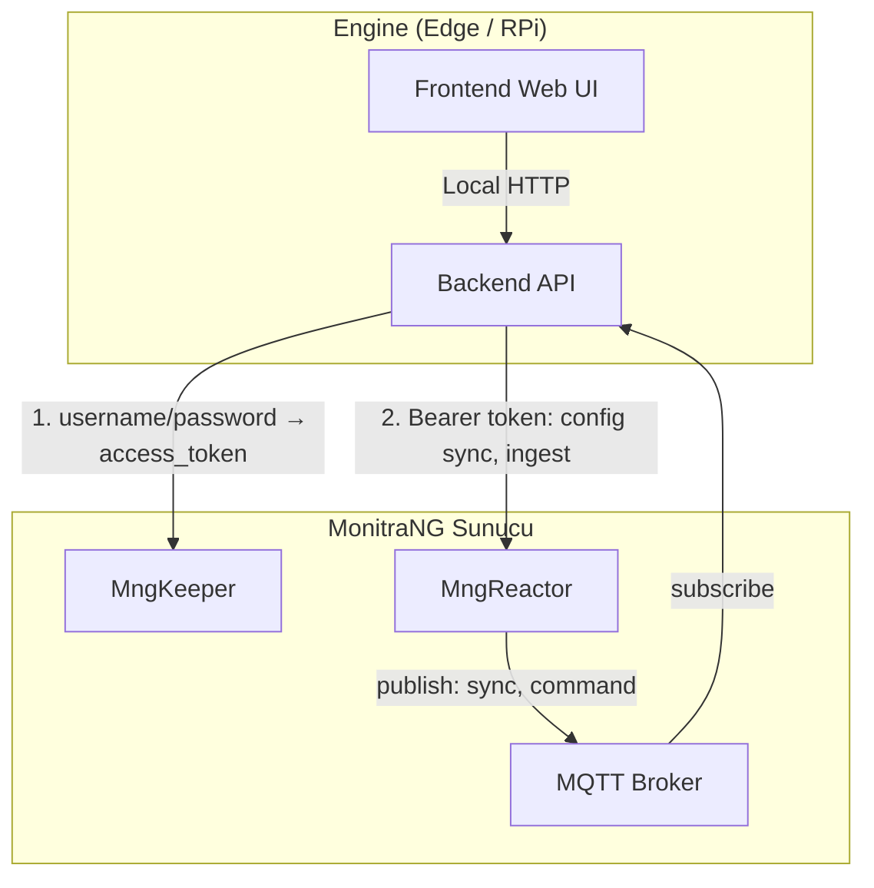
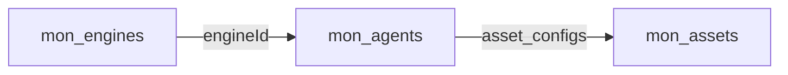
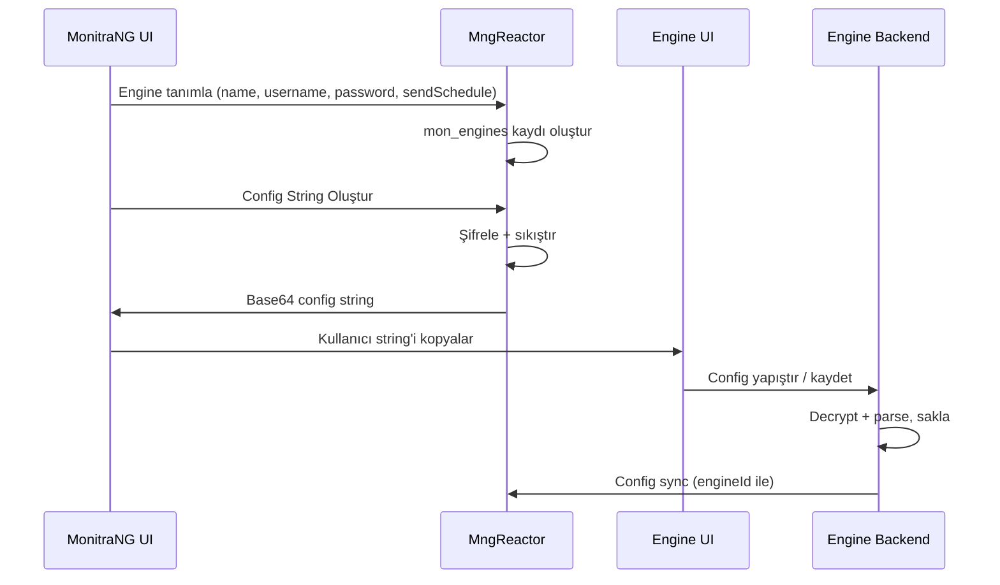
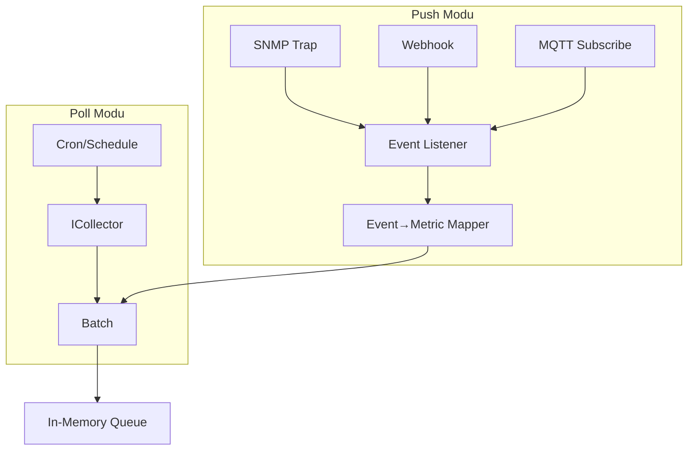
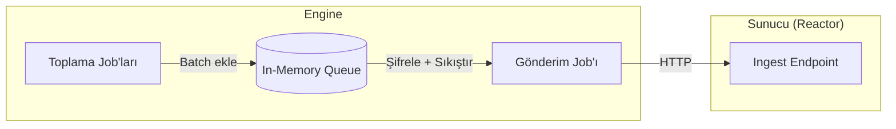

# MngEngine Mimarisi

Bu doküman, MonitraNG Monitoring'de **MngEngine**'in mimarisini, bileşenlerini ve sunucu ile etkileşimini tanımlar. Planlama özeti için [MonitraNG Monitoring planlama](monitrang_monitoring_planlama.md) dokümanına bakınız.

---

## 1. Genel Yapı

Engine **2 uygulama**dan oluşur; her ikisi de **Raspberry Pi** üzerinde çalışacak şekilde hafif tutulur.



| Bileşen | Rol | Teknoloji |
|---------|-----|-----------|
| **Backend** | Config sync, veri toplama, ingest gönderimi, job yönetimi | .NET 9 minimal host, Quartz.NET |
| **Frontend** | Config string girişi, toplama durumu | Nuxt 3 (Vue) |

**Prensipler:**

- Engine **logic içermez**; kararlar sunucudan gelir.
- Engine config: **sunucu URL, kullanıcı adı, şifre**. Engine bu credential'larla **Keeper'dan access_token** alır; Reactor endpoint'lerine **Bearer token** ile gider.
- Backend + Frontend tek süreçte veya ayrı süreçlerde çalışabilir; RPi için tek process önerilir.
- Engine, MonitraNG ortamının **dışında** (edge, şube, RPi vb.) konumlandırılır.

---

## 2. Engine Kimliği ve Kayıt

### 2.1 Agent–Engine Ataması

Engine hangi agent tanımları üzerinde çalışacak?

**Karar:** Yeni **mon_engines** dataset oluşturulur. `mon_agents`'e **engineId** (relation to `mon_engines`) eklenir. Bir agent tek bir Engine'e atanır; bir Engine birden fazla agent çalıştırır. Engine, config sync sırasında `engineId` ile sunucudan kendisine atanmış agent'ları alır.



### 2.2 mon_engines Dataset (yeni)

Mevcut `engines` collection'dan **ayrı**, yeni bir dataset. Config string üretimi için Engine'e özel bilgiler (username, password, sendSchedule) burada tutulur.

| Alan | Tip | Açıklama |
|------|-----|----------|
| name | text | Engine adı (domain içinde unique) |
| description | text | Opsiyonel açıklama |
| status | text | `active` \| `inactive` \| `maintenance` |
| domain | text | Tenant domain (opsiyonel; DG zaten domain bazlı DB kullanır) |
| username | text | Engine'in sunucuya (config sync, ingest) auth için kullanıcı adı |
| password | text | Şifrelenmiş saklanır. Config string'e decrypt edilip konur. |
| sendSchedule | text | Veri gönderim cron ifadesi (örn. `0 */2 * * *` = her 2 dk) |
| configSyncPeriodMinutes | number | Config sync periyodu (dakika). Varsayılan 10. Config string'e dahil edilir. |
| lastSeenAt | datetime | Son görülme zamanı. Reactor her başarılı ingest veya heartbeat'te günceller. UI'da Engine online/offline göstermek için kullanılır. |

**Konum:** `mng_{domain_name}` veritabanında.

**Not:** Agent ataması `mon_agents.engineId` ile yapılır; Engine sayfasında hangi agent'ların bu Engine'e atandığı listelenir. Config string'de agent listesi yok; Engine config sync ile `engineId` kullanarak agent'ları alır.

**engineId elde etme:** Config string içinden. Sunucu tarafında Engine tanımı oluşturulurken `engineId` (mon_engines __dataId) üretilir; config string'e dahil edilir.

### 2.3 DG Şeması (mon_engines)

```json
{
  "Name": "mon_engines",
  "Description": "Monitoring – Engine tanımları (veri toplama cihazları).",
  "ForceSchema": true,
  "Logging": "none",
  "PublishMode": "none",
  "Fields": [
    {
      "fieldType": "text",
      "name": "name",
      "title": "Engine adı",
      "mandatory": true,
      "unique": true,
      "isArray": false
    },
    {
      "fieldType": "text",
      "name": "description",
      "title": "Açıklama",
      "mandatory": false,
      "isArray": false
    },
    {
      "fieldType": "text",
      "name": "status",
      "title": "Durum (active | inactive | maintenance)",
      "mandatory": true,
      "isArray": false
    },
    {
      "fieldType": "text",
      "name": "domain",
      "title": "Tenant domain",
      "mandatory": false,
      "isArray": false
    },
    {
      "fieldType": "text",
      "name": "username",
      "title": "Engine auth kullanıcı adı",
      "mandatory": true,
      "isArray": false
    },
    {
      "fieldType": "text",
      "name": "password",
      "title": "Engine auth şifresi (şifrelenmiş)",
      "mandatory": true,
      "isArray": false
    },
    {
      "fieldType": "text",
      "name": "sendSchedule",
      "title": "Veri gönderim cron ifadesi",
      "mandatory": true,
      "isArray": false
    },
    {
      "fieldType": "number",
      "name": "configSyncPeriodMinutes",
      "title": "Config sync periyodu (dakika, varsayılan 10)",
      "mandatory": false,
      "isArray": false
    },
    {
      "fieldType": "datetime",
      "name": "lastSeenAt",
      "title": "Son görülme zamanı (Reactor günceller)",
      "mandatory": false,
      "isArray": false
    }
  ],
  "IndexList": [
    { "name": "idx_name", "fields": { "name": 1 }, "unique": true },
    { "name": "idx_status", "fields": { "status": 1 }, "unique": false }
  ]
}
```

### 2.4 mon_agents – engineId Alanı

`mon_agents` dataset'ine eklenir:

| Alan | Tip | Açıklama |
|------|-----|----------|
| engineId | relation | `mon_engines` __dataId. Bu agent'ı çalıştıracak Engine. Zorunlu. |

---

## 3. Config String Akışı

### 3.1 MonitraNG UI – Engine Tanım Sayfası

Engine tanımları bu sayfada yapılır. Alanlar:

| Alan | Açıklama |
|------|----------|
| id (engineId) | mon_engines __dataId — otomatik üretilir |
| name | Engine adı |
| description | Opsiyonel |
| status | active / inactive / maintenance |
| username | Engine'in sunucuya auth için kullanıcı adı |
| password | Engine auth şifresi (Reactor şifreleyerek saklar) |
| sendSchedule | Veri gönderim cron (örn. her 2 dk) |
| Agent ataması | Hangi agent'lar bu Engine'de çalışacak (mon_agents.engineId ile) |

### 3.2 Config String Üretimi

**"Config String Oluştur"** butonu:

1. Sunucu, mon_engines kaydından ve ortam bilgilerinden config payload oluşturur:
   - `engineId`, `serverUrl`, `tokenUrl`, `username`, `password`, `sendSchedule`, `configSyncPeriodMinutes` (varsayılan 10), `domain`, `mqttUrl` (opsiyonel)
2. Payload **şifrelenir** ve **sıkıştırılır**.
3. Base64 string üretilir; kullanıcı kopyalar.

**Şifreleme:** Mevcut Reactor mimarisinde CompressPbk/CompressPrk kullanılıyor; benzer yaklaşım devam ettirilebilir. Anahtar yönetimi (sunucu–Engine paylaşılan anahtar veya mevcut Reactor key'leri) implementasyonda netleşecek.

### 3.3 Engine UI – Config Girişi

1. Kullanıcı config string'i yapıştırır.
2. Engine string'i **çözer** (decompress + decrypt).
3. `engineId`, `serverUrl`, `tokenUrl`, `username`, `password`, `sendSchedule`, `configSyncPeriodMinutes`, `mqttUrl` vb. Engine içinde saklanır. Engine, periyodik config sync'i `configSyncPeriodMinutes` aralığıyla yapar; tokenUrl ile Keeper'dan access_token alır; mqttUrl ile MQTT broker'a subscribe eder; Reactor REST çağrılarında Bearer token kullanır.
4. Config sync ve ingest bu bilgilerle çalışır.

### 3.4 Akış Diyagramı



---

## 4. Config Sync Tetikleyicileri

Engine, aşağıdaki durumlarda sunucudan config çeker:

| Tetikleyici | Açıklama |
|-------------|----------|
| **Başlangıç** | Uygulama açıldığında |
| **Periyodik** | `configSyncPeriodMinutes` aralığıyla (mon_engines → config string; varsayılan 10 dk) |
| **Event** | MQTT veya RabbitMQ'dan "config değişti" mesajı |

**Karar:** İlk sürümde **üç tetikleyici de** dahil: Başlangıç, periyodik, event (MQTT/RabbitMQ).

---

## 5. Sync API Sözleşmesi

### 5.1 Auth Akışı

Engine, config string'deki **username/password** ile önce **MngKeeper**'dan access_token alır. Config sync ve ingest dahil tüm Reactor çağrılarında `Authorization: Bearer {access_token}` kullanılır. Token süresi dolmadan önce yenileme (refresh) veya 401 durumunda yeniden login; implementasyonda token cache kararı.

### 5.2 İstek

```
GET /api/v1/engine/config?engineId={id}
Authorization: Bearer {access_token}
```

`engineId` config string'den, `access_token` Keeper'dan (username/password ile) alınır.

### 5.3 Yanıt

Sunucu, Engine'e şu bilgileri **tek response** ile verir:

```json
{
  "engineId": "...",
  "domain": "acme",
  "agents": [
    {
      "agentId": "...",
      "name": "...",
      "status": "active",
      "defaultPeriod": { "expression": "0/1 * * * * ?" },
      "defaultSchedule": { "type": "always" }
    }
  ],
  "assetConfigs": [
    {
      "agentId": "...",
      "assetId": "...",
      "itemId": "...",
      "period": { "expression": "*/5 * * * *" },
      "schedule": { "type": "scheduled", "config": { "weekdays": [1,2,3,4,5], "startTime": "08:00", "endTime": "19:00" } },
      "active": true,
      "connectionInfo": { "address": "...", "port": 22, "userName": "...", "password": "..." },
      "collectionMethod": "ssh",
      "collectibles": [
        { "code": "cpu_usage", "enabled": true, "params": {} }
      ]
    }
  ]
}
```

- Sunucu `connection_info`'yu **dekripte edip** gönderir (Engine güvenilir edge cihaz).
- `collectibles`: type + asset override birleşimi; sadece `enabled: true` olanlar.
- `period` / `schedule`: asset_config → agent default → Engine global sırasına göre çözülmüş.
- `collectionMethod`: type'ın `collection_method` değeri; collector seçimi için.

---

## 6. Veri Toplama Mekanizması (Collector Abstraction)

Engine, farklı kaynaklardan (SSH, WMI, SNMP, HTTP vb.) ve farklı modlarda (periyodik poll, anlık event) veri toplar. Bu bölüm abstraction ve genişletilebilirliği tanımlar.

### 6.1 Toplama Modları

| Mod | Açıklama | Örnek |
|-----|----------|-------|
| **Poll (periyodik)** | Engine belirli aralıklarla kaynağa gidip veri okur. Cron/schedule ile tetiklenir. | Network cihazı SNMP, sunucu WMI, REST API |
| **Push (event)** | Kaynak/sensör veriyi Engine'e gönderir. Engine dinler, gelen veriyi işler. | PDU yangın sensörü (SNMP trap, webhook), IoT cihaz (MQTT) |

Her iki mod da aynı **batch formatına** ve **ingest akışına** dökülür. Fark, tetikleme şeklindedir: Poll = job ile, Push = listener ile.



### 6.2 Collector Abstraction (Poll Modu)

**Arayüz:**

```
ICollector
├── string Method { get; }   // "ssh", "wmi", "snmp", "http", ...
└── Task<CollectResult> CollectAsync(CollectContext context, CancellationToken ct);
```

- **CollectContext:** connectionInfo, collectibles, assetId, itemId, agentId, domain
- **CollectResult:** success, metrics (code, value, unit), errors (kısmi başarı için)

**Registry:** `collectionMethod` (string) → `ICollector` implementasyonu. Sync API'den gelen `assetConfig.collectionMethod` ile seçilir. Bilinmeyen method → log, asset atlanır.

**Connection info (method bazlı):** Her method kendi şemasına sahip. Reactor validasyonu `type.collection_method`'a göre.

| Method | connection_info örneği |
|--------|------------------------|
| ssh | `{ address, port?, userName, password? \| privateKey? }` |
| wmi | `{ address, userName, password, domain? }` |
| snmp | `{ address, port?, community }` (v2c) veya auth/priv (v3) |
| http | `{ url, method?, headers?, auth? }` |

**Collectible kaynağı:** Method'a göre yorumlanır — ssh: command/script, wmi: wmiClass/property, snmp: oid, http: url/path. Sync API bu bilgileri çözülmüş gönderir.

### 6.3 Push Modu (Event-Driven)

**Tetikleyiciler:** SNMP trap, webhook, MQTT subscribe vb.

**Akış:**
1. Engine **listener** açık tutar (örn. SNMP trap receiver, HTTP webhook endpoint, MQTT client).
2. Event gelir → **asset eşlemesi** (kaynak IP, topic, payload'daki identifier ile hangi asset'e ait olduğu bulunur).
3. **Event→metric** dönüşümü; aynı batch formatına çevrilir.
4. Batch in-memory queue'ya eklenir; gönderim job'ı aynı şekilde işler.

**Asset eşlemesi:** `connection_info` veya asset metadata'da event kaynağı bilgisi (örn. trap source IP, webhook path'te assetId, MQTT topic pattern). Config sync'te bu bilgi Engine'e iletilir.

**Örnek senaryolar:**
- **PDU yangın sensörü:** SNMP trap → Engine trap listener → assetId (IP veya trap OID mapping) → metric `fire_alarm: 1` → queue.
- **IoT cihaz:** MQTT `devices/{deviceId}/events` → Engine subscribe → deviceId→assetId mapping → queue.

### 6.4 Genişletilebilirlik

Yeni method veya push kaynağı:
1. **Poll:** `ICollector` implement et, registry'ye ekle.
2. **Push:** Listener ekle, event→metric mapper tanımla, config sync'te mapping bilgisini ilet.
3. `mon_asset_types`'ta yeni `collection_method` veya `collection_mode: push` tanımı.
4. Reactor'da `connection_info` validasyonu.

**collection_mode:** `mon_asset_types`'a veya asset_config'e `collection_mode: "poll" | "push"` eklenebilir. Varsayılan `poll`. Push asset'ler için listener ve mapping config sync'te iletilir.

Bu yapı zamanla zenginleştirilecektir; ilk sürümde poll ağırlıklı, push modu kademeli eklenebilir.

---

## 7. Job İnşası (Engine Backend)

**Poll modu** için:

- Her **asset** (poll modundaki) için ayrı Quartz job veya asset+period kombinasyonu.
- **Cron:** `period.expression` kullanılır.
- **Schedule window:** Job içinde `schedule.config` kontrol edilir; window dışındaysa toplama atlanır.
- **Collector:** [Bölüm 6.2](#62-collector-abstraction-poll-modu) registry'den `collectionMethod` ile seçilir.
- Config sync sonrası: mevcut job'lar iptal edilir, yeni config'e göre job'lar yeniden oluşturulur.

**Push modu:** Listener'lar config sync'te tanımlı asset'lere göre başlatılır/durdurulur; ayrı job yok.

---

## 8. Engine–Sunucu Veri İletişimi

### 8.1 Genel Akış



### 8.2 Toplama

- **Collector job'lar:** Kendi zamanlamasına göre (period/schedule) asset'lerden veri toplar.
- **Sonuç:** Batch formatında [MONITORING_DATA_PRODUCTION](MONITORING_DATA_PRODUCTION.md) ile uyumlu.
- **Depolama:** Batch'ler **in-memory queue**'ya eklenir. Offline buffer yok; gönderilemeyen veri tutulmaz.

### 8.3 Gönderim (Ayrı Cron Job)

- **Gönderim job'ı:** Periyodik olarak (örn. her 1–5 dk) çalışır.
- **İşlem:** Birikmiş batch'leri alır → **şifreler** → **sıkıştırır** → sunucuya gönderir.
- **Başarı:** Gönderilen batch'ler queue'dan silinir.
- **Hata:** Gönderim başarısız olursa veri **atılır** (offline buffer yok).

### 8.4 Transport (Karar)

**Karar:** İlk sürümde **HTTP** ile başlanacak. MQTT ileride değerlendirilebilir.

- Endpoint: `POST /api/v1/ingest/metrics`
- Auth: `Authorization: Bearer {access_token}` — token Keeper'dan (config'teki username/password ile) alınır
- Payload: `{ "batches": [batch1, batch2, ...] }` — şifrelenmiş + sıkıştırılmış. Reactor yanıt: `savedCount`, `failedCount`, `errorList`.

### 8.5 Şifreleme ve Sıkıştırma

- Sunucuya gönderilmeden önce payload **şifrelenir** (örn. sunucu public key ile).
- Payload **sıkıştırılır** (örn. gzip, Brotli).
- Reactor: Dekripte → decompress → batch'i işle → MongoDB Time Series'e yaz.

### 8.6 Offline Davranış

- **Karar:** Offline'da veri **buffer'lanmaz**. Gönderim başarısızsa veri atılır.
- Sebep: RPi kısıtları, basitlik, veri kaybı kabul edilebilir (metrikler periyodik tekrar üretilir).

---

## 9. Hafiflik Önlemleri (Raspberry Pi)

| Önlem | Açıklama |
|-------|----------|
| Minimal host | ASP.NET Core minimal API; gereksiz middleware yok |
| Tek process | Frontend, Backend'in static dosyalarını serve edebilir |
| Hafif runtime | .NET 9 self-contained, `linux-arm` / `linux-arm64` publish |
| Quartz | RAM tabanlı job store (ADO.NET persistence opsiyonel) |
| In-memory | Toplama → in-memory queue → gönderim; kalıcı DB yok, offline buffer yok |
| Collector | Sadece gerekli collector'lar yüklü (Linux/Windows/SNMP vb.) |

---

## 10. Frontend Kapsamı

| Özellik | Açıklama |
|---------|----------|
| Config | Config string yapıştırma (MonitraNG UI'dan kopyalanan şifreli string) |
| Bağlantı durumu | Sunucuya erişim: OK / Hata |
| Sync durumu | Son sync zamanı, agent/asset sayısı |
| Toplama durumu | Son çalışan job'lar, başarı/hata sayısı |
| Basit log | Son N satır (opsiyonel) |

**Teknoloji (karar):** **Nuxt 3** (Vue tabanlı). Config, durum ve log ekranları için minimal SPA. Build sonrası static export; Backend static dosyaları serve edebilir (RPi için tek process). API çağrıları Backend'e (local) yönelir.

---

## 11. Server → Engine MQTT (İlk sürümde dahil)

**Karar:** Sunucunun Engine'e mesaj göndermesi için **MQTT** kullanılır. Multi-tenant topic yapısı.

### 11.1 Topic'ler

| Topic | Açıklama |
|-------|----------|
| `monitoring/{domain}/engine/{engineId}/sync` | Config sync tetiklemesi. Mesaj gelince Engine config sync yapar. |
| `monitoring/{domain}/engine/{engineId}/command` | Genel komut kanalı. İleride sunucunun Engine'e komut göndermesi (örn. kaynağa veri yazma) için. Şu an örnek yok; altyapı hazır olsun. |

**Engine davranışı:** Config string'deki domain ve engineId ile kendi topic'lerini subscribe eder (`monitoring/{domain}/engine/{engineId}/sync`, `.../command`). MQTT broker adresi config string'e `mqttUrl` olarak eklenebilir. `sync` mesajı gelince config sync tetiklenir. `command` ileride kullanılacak (örn. kaynağa yazma komutu).

### 11.2 Periyodik Sync

Periyodik sync yedek olarak devam eder; MQTT mesajı gelmezse periyodik çalışır.

---

## 12. Engine Heartbeat (lastSeenAt)

**Karar:** Reactor her başarılı ingest'te ilgili Engine için `mon_engines.lastSeenAt` alanını günceller. Ayrı heartbeat endpoint'i ilk sürümde zorunlu değil; ingest zaten periyodik çağrıldığı için yeterli sinyal sağlar. MonitraNG UI'da Engine'in online/offline durumu bu alana göre gösterilir.

---

## 13. Değişiklik Özeti (Mevcut Koddan)

| Mevcut | Hedef |
|--------|-------|
| Config: EngineInfo (host, domain, engineId, collectInterval) | Config string (MonitraNG UI'dan); engineId, serverUrl, username, password, sendSchedule |
| Tek cron, tek CollectorJob | Asset/period bazlı dinamik job'lar |
| Asset listesi `engineId` ile | Agent listesi `engineId` ile; asset_configs dahil |
| Veri sadece loglanıyor | Ingest endpoint'e batch gönderim |
| Frontend yok | Minimal config + status UI |

---

## 14. Açık Kararlar (Implementasyon Öncesi)

1. ~~**mon_engines:** Yeni dataset mi, mevcut `engines` migration mı?~~ **Karar:** Yeni `mon_engines` dataset oluşturulacak. Agent'lar `engineId` ile Engine'e bağlanacak.
2. ~~**Frontend stack:** Blazor Server, Razor Pages, minimal SPA?~~ **Karar:** Nuxt 3 uygulaması.
3. ~~**Buffer:** Offline'da veri buffer'lansın mı?~~ **Karar:** Hayır. Veri in-memory tutulur; gönderim job'ı periyodik çalışır. Başarısız gönderimde veri atılır.
4. ~~**Veri taşıma (Transport):** HTTP endpoint mi, MQTT mu?~~ **Karar:** İlk sürümde HTTP. MQTT ileride.
5. ~~**MQTT/RabbitMQ (config sync):** İlk sürümde event tabanlı sync dahil mi?~~ **Karar:** Evet, dahil.
6. ~~**engineId elde etme:** İlk bağlantıda self-register mi, config'te önceden mi?~~ **Karar:** Config string. MonitraNG UI'da Engine tanımı yapılır, config string oluşturulur; Engine bu string ile config alır (engineId dahil).

---

## 15. Uygulama Standartları

Engine yeniden yazımında [MonitraNG Monitoring planlama](monitrang_monitoring_planlama.md) Bölüm 8'deki standartlara uyulacak. Mevcut deneysel kod sıfırdan plana uygun yazılacak; referans olarak tutulabilir. Backend: API versioning, Health check, Serilog, MngEngineSettings, GlobalExceptionHandlerMiddleware, MediatR Features yapısı.

---

## 16. Öneriler ve Uygulama Notları

### 16.1 Açık Noktalar (İmplementasyonda Netleşecek)

| Konu | Not |
|------|-----|
| ~~**Config sync periyodu**~~ | **Karar:** mon_engines.configSyncPeriodMinutes (varsayılan 10). Config string'e dahil edilir. |
| ~~**engineId vs instanceId**~~ | **Karar:** `meta.engineId` = mon_engines __dataId. Tek Engine = tek mon_engines. İleride scale-out gerekirse instanceId eklenebilir. |
| **Config saklama** | Engine'de decrypt edilen config nereye yazılır? Dosya (config.txt), env, encrypted local store. Güvenlik (dosya izinleri) dikkate alınmalı. |
| **collection_mode** | Push modu için `mon_asset_types` veya asset seviyesinde `collection_mode: poll \| push` alanı eklenecek. Şema güncellemesi push implementasyonuyla. |

### 16.2 Öneriler

| Öneri | Açıklama |
|-------|----------|
| **Health endpoint** | Engine Backend'de `/health` veya `/api/health` — basit sağlık kontrolü; üst sistem izlemesi için. |
| **Yapılandırılmış loglama** | Serilog/structured logging; log seviyesi config veya env ile. RPi'de disk dolmaması için log rotation. |
| **Collector hata davranışı** | Toplama başarısız olunca: logla, batch'e ekleme (veya partial batch), bir sonraki periyotta tekrar dene. |
| **Config değişikliği** | Config string yenilendiğinde (Engine UI'dan): Backend'e iletilmeli, uygulama yeniden başlatılmadan veya hot-reload ile job'lar güncellenebilmeli. |
| **sendSchedule formatı** | Cron ifadesi (standart 5 veya Quartz 6 alan). Örn. `0 */2 * * *` = her 2 dakika. |

### 16.3 Engine UI – Backend API (Nuxt → .NET)

Engine Frontend (Nuxt) Backend'e local HTTP ile istek atar. Önerilen endpoint'ler:

| Endpoint | Açıklama |
|----------|----------|
| `POST /api/config` | Config string kaydet; Backend decrypt edip saklar, sync tetikler. |
| `GET /api/config/status` | Config yüklü mü, engineId, son sync zamanı. |
| `GET /api/status` | Toplama durumu, agent/asset sayısı, son job sonuçları. |
| `GET /api/health` | Basit health check. |

---

## 17. Referanslar

- [MonitraNG Monitoring planlama](monitrang_monitoring_planlama.md)
- [Monitoring Agent Architecture](MONITORING_AGENT_ARCHITECTURE.md)
- [Monitoring Data Production](MONITORING_DATA_PRODUCTION.md)
- [Monitoring Asset Datasets](MONITORING_ASSET_DATASETS.md)
