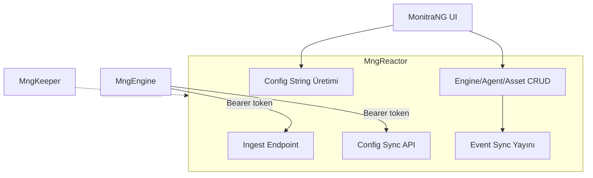

# MngReactor Mimarisi (Monitoring)

Bu doküman, MonitraNG Monitoring'de **MngReactor**'ın Engine ile etkileşimini, ingest, config sync ve veri kalıcılığını tanımlar. Planlama özeti için [MonitraNG Monitoring planlama](monitrang_monitoring_planlama.md) dokümanına bakınız.

---

## 1. Genel Rol

Reactor, Monitoring veri akışının **sunucu tarafı**dır:

- **Engine'den gelen metrikleri** alır, MongoDB Time Series'e yazar
- **Engine config sync** API'si sağlar (agent, asset, connection_info, period, schedule)
- **Config string** üretir (MonitraNG UI → Engine cihaz)
- **Engine, Agent, Asset** CRUD (DataGateway HTTP API üzerinden – MngReactor doğrudan MongoDB’ye erişmez)
- **Event sync sinyali** yayınlar (agent/asset/engine değişince)
- **Tenant varsayılanları** — Keeper'ın RabbitMQ `domain.created` event'ini dinleyerek (birincil) veya domain init API ile (yedek) mon_schedules, mon_collection_periods oluşturur

---

## 2. Auth

**Karar:** Engine, **Keeper**'dan access_token alır; Reactor endpoint'lerine `Authorization: Bearer {access_token}` ile gider.

**Reactor sorumluluğu:** Gelen token'ı **doğrular** — Keeper ile JWT verify (signature, expiry) veya token introspection. Geçersiz token → 401.

**Kapsam:** Ingest, config sync ve Engine'e yönelik tüm endpoint'ler Bearer token gerektirir.

---

## 3. Ingest Endpoint

**Endpoint:** `POST /api/v1/ingest/metrics`

**Auth:** `Authorization: Bearer {access_token}`

**Payload:** Engine'den gelen **batch array** — şifrelenmiş + sıkıştırılmış. `{ "batches": [batch1, batch2, ...] }` formatı. Detay: [MONITORING_DATA_PRODUCTION](MONITORING_DATA_PRODUCTION.md) Bölüm 4.

**Not:** Poll (periyodik) ve push (event, örn. yangın sensörü) verisi **aynı endpoint** üzerinden gelir. Her ikisi de aynı batch formatında; Reactor ayırım yapmaz.

**İşlem:**

1. Token doğrula
2. Payload decrypt + decompress
3. Her batch için: Her metriği Time Series dokümanına dönüştür
4. MongoDB `mon_metrics` koleksiyonuna yaz (`mng_{domain_name}` veritabanı)
5. **Paralel:** Her yazılan metrik RabbitMQ'ya publish edilir — MngWorkflow queue'dan consume eder. DG publish mode benzeri; mesaj Workflow okumadan kuyrukta kalır.
6. **Heartbeat:** Her başarılı ingest'te ilgili engine için `mon_engines.lastSeenAt` güncellenir (UI'da Engine online/offline göstermek için)
7. **Yanıt:** `savedCount`, `failedCount`, `errorList` (partial success). Detay: [MONITORING_DATA_PRODUCTION](MONITORING_DATA_PRODUCTION.md) Bölüm 4.3.

**Workflow entegrasyonu:** Detay [Monitoring Workflow](MONITORING_WORKFLOW.md).

**TTL:** `MONITORING_METRICS_TTL_DAYS` env ile; Reactor başlangıcında veya `collMod` ile güncellenir.

---

## 4. Config Sync API

**Endpoint:** `GET /api/v1/engine/config?engineId={id}`

**Auth:** `Authorization: Bearer {access_token}`

**İşlem:**

1. Token doğrula
2. `engineId` ile mon_engines kontrolü; engine bu domain'e ait mi?
3. mon_agents (engineId), mon_assets, mon_collection_periods, mon_schedules birleştir
4. connection_info decrypt et (Reactor'da şifrelenmiş saklanıyor)
5. Tek response: agents, assetConfigs (period/schedule çözülmüş, collectibles enabled)

**Yanıt formatı:** [MONITORING_ENGINE_ARCHITECTURE](MONITORING_ENGINE_ARCHITECTURE.md) Bölüm 5.3.

---

## 5. Config String Üretimi

**Konum:** MonitraNG UI Engine tanım sayfasında "Config String Oluştur" butonu → Reactor API.

**Payload içeriği:** `engineId`, `serverUrl`, `tokenUrl`, `username`, `password`, `sendSchedule`, `configSyncPeriodMinutes` (varsayılan 10), `domain`, `mqttUrl` (opsiyonel)

- **tokenUrl:** Keeper token endpoint. Engine bu URL'den access_token alır.
- **configSyncPeriodMinutes:** Periyodik config sync aralığı (dakika). mon_engines'ten alınır.
- **mqttUrl:** MQTT broker adresi. Engine sync/command topic'lerini subscribe etmek için bağlanır.

**İşlem:** mon_engines + ortam bilgisi → JSON payload → şifrele + sıkıştır → Base64 string. Kullanıcı kopyalar, Engine UI'a yapıştırır.

---

## 6. Engine / Agent / Asset CRUD

- **mon_engines, mon_agents, mon_assets** ve ilgili dataset'ler **MngDataGateway (DG)** üzerinden.
- Reactor, CRUD endpoint'leri sağlar; DG data API kullanır.
- **connection_info** içindeki hassas alanlar Reactor'da şifrelenip DG'ye yazılır.
- **Asset CRUD:** connection_info validasyonu `type.collection_method`'a göre.

---

## 7. Server → Engine MQTT Altyapısı

**Karar:** Sunucunun Engine'e mesaj göndermesi için **MQTT** kullanılır. Multi-tenant yapıya uygun topic hiyerarşisi.

### 7.1 Topic Yapısı

| Topic | Açıklama |
|-------|----------|
| `monitoring/{domain_name}/engine/{engineId}/sync` | Config sync tetiklemesi. Mesaj gelince Engine config sync yapar. |
| `monitoring/{domain_name}/engine/{engineId}/command` | Genel komut kanalı. İleride sunucunun Engine'e komut göndermesi (örn. kaynağa yazma) için. Şu an örnek yok; altyapı hazır olsun. |

**Prefix:** Ortamda `MQTT_TOPIC_PREFIX` (örn. `MNG`) varsa topic `{prefix}/monitoring/{domain}/engine/{engineId}/sync` olabilir. Implementasyonda netleşir.

### 7.2 Sync Tetikleyicileri

**Tetikleyiciler:** Agent, asset veya engine CRUD (create, update, delete).

**Reactor sorumluluğu:** CRUD sonrası ilgili engine(ler) için sync topic'ine mesaj yayınla. Hedeflenmiş yayın: Agent değişince sadece o agent'ın engineId'si; asset değişince o asset'i kullanan agent'ların engine'leri.

**Mesaj formatı:** Minimal — boş veya `{ "action": "sync" }`. Engine sadece "sync yap" sinyalini alır.

---

## 8. Veri Kalıcılığı

| Veri | Konum | Erişim |
|------|-------|--------|
| mon_metrics | MongoDB Time Series, `mng_{domain_name}` | Reactor doğrudan yazar (DG dışı) |
| mon_engines, mon_agents, mon_assets, mon_items, mon_collection_periods, mon_schedules, mon_asset_types, mon_asset_type_family | `mng_{domain_name}` | DG data API üzerinden |

---

## 9. Tenant Varsayılan Kayıtları

**Karar:** Tenant oluşturulduğunda `mon_schedules` ("Sürekli") ve `mon_collection_periods` ("1 dakika") otomatik oluşturulacak.

**Mekanizma (öncelik sırasıyla):**

1. **RabbitMQ event (birincil):** Keeper zaten domain oluşturduğunda `system.mngkeeper.domain.created` event'ini yayınlar (exchange: `mng.topics`, routingKey: `system.mngkeeper.domain.created`). Reactor bu event'i **dinleyerek** varsayılan kayıtları oluşturur. Event payload: `domainName`, `databaseName` vb.
2. **Reactor API (yedek / manuel):** `POST /api/v1/admin/domain/{domain}/init` — Keeper entegrasyonu gecikirse veya manuel tetikleme gerekiyorsa kullanılır. Auth: Yetkili (admin) token gerekir.

Reactor, DG üzerinden `mng_{domain_name}` veritabanında varsayılan kayıtları oluşturur.

---

## 10. Öneriler

### 10.1 Ingest endpoint

| Öneri | Açıklama |
|-------|----------|
| ~~**Batch array**~~ | **Karar:** `{ "batches": [...] }` formatı. |
| ~~**Partial success**~~ | **Karar:** `savedCount`, `failedCount`, `errorList` ile. |
| **Koleksiyon oluşturma** | Reactor başlangıcında `mon_metrics` Time Series koleksiyonu yoksa oluştursun (TTL ile). İlk ingest'te hata çıkmasın. |

### 10.2 Config sync

| Öneri | Açıklama |
|-------|----------|
| **Kısa TTL cache** | engineId başına 1–2 dakika cache. Aynı Engine sık sync yapsa DB yükü azalsın. |
| **Conditional (opsiyonel)** | `If-None-Match: {configVersion}` ile değişmediyse 304 dön. İlk sürümde zorunlu değil. |

### 10.3 Event sync (MQTT)

| Öneri | Açıklama |
|-------|----------|
| ~~**Hedeflenmiş yayın**~~ | **Karar:** Agent değişince sadece o agent'ın engineId'si; asset değişince o asset'i kullanan agent'ların engine'leri için. |

### 10.4 Güvenlik

| Öneri | Açıklama |
|-------|----------|
| ~~**Ingest rate limit**~~ | **Karar:** Engine/token başına dakikada 30–60 istek; geniş limit. Öncelik: token–engineId sonrası. |
| **Token–engineId uyumu** | Ingest'te token'daki subject/claim ile istekteki engineId/domain uyumunu kontrol et. Engine sadece kendi verisini gönderebilsin. |

### 10.5 Tenant varsayılanları

| Öneri | Açıklama |
|-------|----------|
| ~~**RabbitMQ event + API**~~ | **Karar:** Birincil: Keeper'ın `system.mngkeeper.domain.created` event'ini dinle. Yedek: Domain init API (manuel tetikleme). |

### 10.6 Observability

| Öneri | Açıklama |
|-------|----------|
| **Ingest metrikleri** | Batch sayısı, başarılı/başarısız sayısı, gecikme. İleride Prometheus/OpenTelemetry ile. |
| **Structured logging** | Ingest ve config sync için yapılandırılmış log; engineId, domain, hata kodu. Debug kolaylığı. |

### 10.7 Öncelik (ilk sürüm)

1. **Önce:** Koleksiyon oluşturma, partial success, batch array.
2. **Sonra:** Kısa TTL cache, rate limit, token–engineId kontrolü, RabbitMQ domain.created consumer, domain init API (yedek).
3. **İleride:** Ingest metrikleri.

---

## 11. Uygulama Standartları

Reactor yeniden yazımında [MonitraNG Monitoring planlama](monitrang_monitoring_planlama.md) Bölüm 8'deki standartlara uyulacak: API versioning, Health check, Serilog, MngReactorSettings, GlobalExceptionHandlerMiddleware, MediatR Features yapısı.

---

## 12. Açık Kararlar

1. ~~**Ingest payload:** Tek batch mi, batch array mi? Hata yanıt formatı?~~ **Karar:** Batch array (`batches`). Yanıt: `savedCount`, `failedCount`, `errorList` (batchIndex, metricIndex, code, message).
2. ~~**Event sync:** MQTT mi, RabbitMQ mi? Topic/exchange ve mesaj formatı?~~ **Karar:** MQTT. Topic: `monitoring/{domain}/engine/{engineId}/sync`. Ek: `monitoring/{domain}/engine/{engineId}/command` (ileride komut kanalı).
3. ~~**Tenant varsayılanları:** Oluşturma yeri?~~ **Karar:** RabbitMQ event (Keeper `system.mngkeeper.domain.created` dinleyerek) birincil; domain init API yedek/manuel.
4. ~~**Rate limiting:** Ingest endpoint için gerekli mi?~~ **Karar:** Evet, planlanacak. İlk sürümde geniş limitlerle (Engine/token başına dakikada 30–60 istek). Öncelik: token–engineId kontrolünden sonra; implementasyon "Sonra" aşamasında.

---

## 13. Referanslar

- [MonitraNG Monitoring planlama](monitrang_monitoring_planlama.md)
- [Monitoring Engine Architecture](MONITORING_ENGINE_ARCHITECTURE.md)
- [Monitoring Data Production](MONITORING_DATA_PRODUCTION.md)
- [Monitoring Agent Architecture](MONITORING_AGENT_ARCHITECTURE.md)
- [Monitoring Asset Datasets](MONITORING_ASSET_DATASETS.md)
