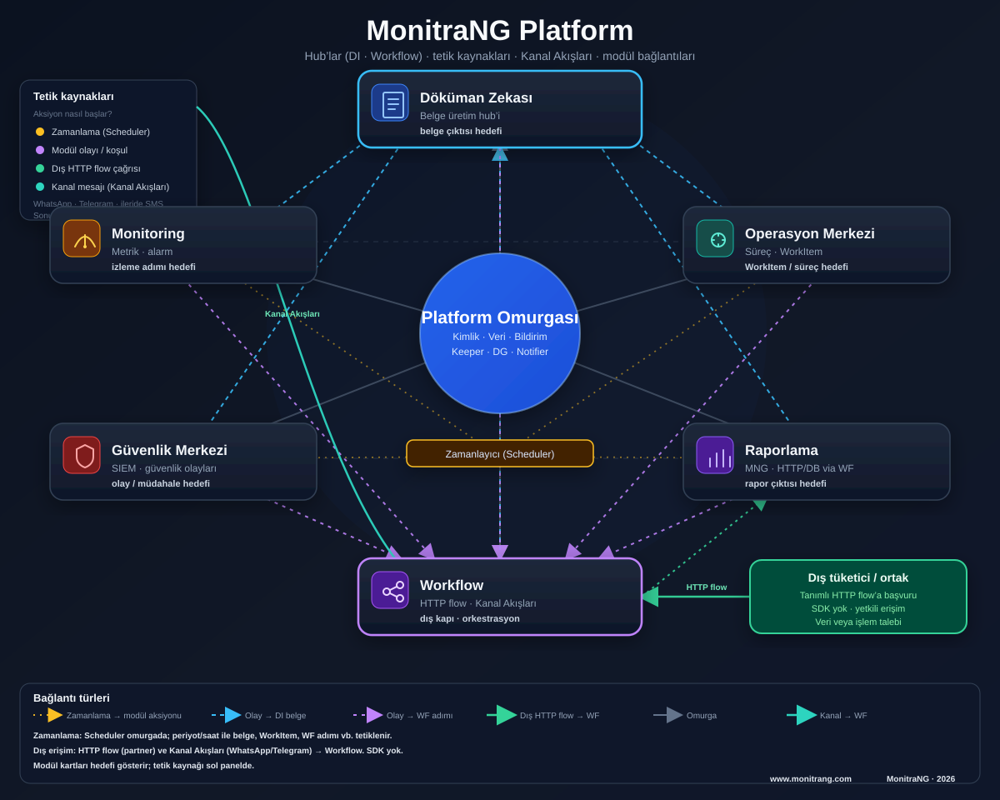

# MonitraNG

### Kurumsal operasyon platformu

**Operasyon, belge, güvenlik, karar — yapay zeka destekli içgörüyle tek platformda.**

**www.monitrang.com**

---

## Kurumunuz için ne ifade ediyor?

MonitraNG; dosyaların farklı klasörlerde, onayların e-postada, alarmların geç fark edildiği, raporların elle hazırlandığı ortamlarda **tek, güvenilir ve denetlenebilir** bir çalışma katmanı sunar.

Modüler yapı sayesinde yalnızca ihtiyaç duyduğunuz bileşenlerle başlayabilir; platform birlikte büyüdükçe süreçleriniz, belgeleriniz, raporlarınız ve güvenlik operasyonunuz **aynı omurgada** birleşir.

Üretim ortamında doğrulanmış altyapı; bankacılık, lojistik, üretim ve hizmet sektörlerinde aynı mimariyle uygulanabilir.

---

## Tanıdık sorunlar, net yanıtlar

| Kurumda sık duyulan | MonitraNG ile |
|---------------------|---------------|
| «Hangi Excel güncel?» | Merkezi kayıt, yetki ve sürüm takibi |
| «Kim onayladı, ne zaman?» | Numaralı iş kaydı ve tam geçmiş |
| «Alarmı geç gördük» | Operasyon ve güvenlik için erken uyarı |
| «Binlerce evrakta aradığımı bulamıyoruz» | AI içerik etiketleme ve anlamlı arama |
| «Çok alarm var — hangisi gerçekten önemli?» | Anomaly tespiti ve akıllı alarm önceliklendirme |
| «Rapor her seferinde yeniden» | Canlı veriden güncel tablolar ve export |
| «Belgeyi elle birleştiriyoruz» | Şablon ve veri ile otomatik resmi çıktı |
| «Her dil için ayrı Word kopyası tutuyoruz» | AI ile çeviri, dil varyantı ve çift dilli sürüm |

---

## Üç temel ilke

**Modüler yatırım** — Büyük projeler yerine aşamalı devreye alma; risk ve maliyet kontrolü sizde.

**Tek omurga** — Kullanıcı, veri ve bildirim altyapısı tüm modüllerde ortaktır; her yeni modül için sıfırdan kurulum gerekmez.

**Birlikte çalışan parçalar** — Operasyon kaydı, belge, rapor, izleme ve otomasyon birbirinden kopuk adalar değildir; olay bir modülde başlar, gerektiğinde diğerinde sonuç üretir.

**Yapay zeka omurgada** — İçerik anlama, anomaly tespiti ve özetleme ayrı bir «ek paket» değil; Döküman Zekası ve Monitoring ile birlikte çalışır; kurallarınız tanımlıysa doğrudan iş sürecine bağlanır.

---

## Yapay zeka — aramadan aksiyona

MonitraNG’de yapay zeka yalnızca «akıllı arama» değildir. Belge ve izleme verisini **okur**, **sınıflandırır**, **uyarır** — gerektiğinde operasyonu tetikler.

| Alan | Size ne kazandırır? |
|------|---------------------|
| **Döküman Zekası** | PDF, tarama ve resmi belgeler otomatik etiketlenir; içerikten aranır. Özet, benzer kayıt ve soru-yanıt (RAG) ile evrak yığını yerine cevap alırsınız. **Çok dilli çalışma:** tam belge veya bölüm çevirisi, tek tık dil varyantı, çift dilli sürüm — kurumsal terim sözlüğüyle tutarlılık. Etiket ve kural eşleşmesinde inceleme veya onay süreci devreye girebilir. |
| **Monitoring** | Sabit eşiklerin ötesinde **anomaly detection** ile olağandışı davranışı erken görürsünüz. Alarm açıklaması, trend ve kapasite notları ile «ne oldu?» sorusuna daha hızlı yanıt verirsiniz. |
| **Güven ve kontrol** | AI içeriği anlar; **gizlilik sınıfı ve yetkiler** kurum politikanızda kalır. Tüm AI erişimi mevcut klasör ve kullanıcı izinleriyle sınırlıdır. |

---

## Platform mimarisi — bir bakışta

| Haritada | Anlamı |
|----------|--------|
| **Ortada — Platform omurgası** | Kurumsal kimlik, merkezi veri, bildirim; zamanlanmış işler |
| **Döküman Zekası** | Resmi belge ve kurumsal içeriğin üretim merkezi |
| **Workflow** | Çok adımlı otomasyon; dış sistem ve mesajlaşma kanallarına açılan kapı |
| **Çevre modüller** | Operasyon, raporlama, izleme, güvenlik |
| **Renkli bağlantılar** | Zamanlama, olay tetikleri, partner entegrasyonu ve kanal mesajları |

---

## Platform modülleri

Modüller ve platform yetenekleri **aynı kimlik, veri ve bildirim omurgası** üzerinde çalışır; birlikte veya ihtiyaca göre aşamalı devreye alınır.

| Modül / yetenek | Ne sunar? |
|-----------------|-----------|
| **Operasyon Merkezi** | Workspace ile talep, görev, iş emri ve onay süreçlerini **numaralı kayıt**, pano, atama ve tam geçmişle yürütün. Dinamik süreç formları, SLA, bildirim politikaları ve kurallar; alarm, belge veya zamanlanmış iş ile otomatik WorkItem açılabilir. |
| **Döküman Zekası** | **Sayfa**, yüklenen **dosya** ve resmi **Office dökümanları** tek ağaçta; şablon + veri ile otomatik üretim, tarayıcıda düzenleme. AI: etiketleme, arama, özet, **dil çeviri / varyant**; kurallarla inceleme veya onay. OC, Raporlama ve Workflow resmi belge üretebilir. |
| **Raporlama** | Tek **katalogdan** parametreli tablo raporları. **Veri katmanları:** platform içi kayıtlar (operasyon, envanter, eğitim…), tanımlı **dış HTTP/API** kaynakları ve **veritabanı** sorguları. **Çalıştırma:** kullanıcı tıklaması, koşul/olay tetikleyicisi veya **zamanlanmış** üretim; expand, export, paylaşım, embed; satırdan DI ile resmi belge. |
| **Monitoring** | Sunucu, servis, ağ, veritabanı ve saha sensörleri — envanter, kontrol merkezi, harita ve canlı widget. Eşik alarmları + **anomaly detection**; üretim emrine metrik köprüsü. *(Güvenlik log analizi → Güvenlik Merkezi.)* |
| **Güvenlik Merkezi (SIEM)** | Güvenlik olaylarını toplar ve normalize eder; eşik, korelasyon ve senaryo kurallarıyla SOC **alarm kuyruğu**. Özet paneller, parser profilleri; operasyon kaydına not köprüsü. |
| **Workflow** | Onay, bekleme, HTTP çağrısı ve belge adımları — çok adımlı otomasyon tek playbook’ta. **Kanal Akışları** (WhatsApp/Telegram); olay tetikleri, schedule trigger; OC, DI ve Notifier ile entegrasyon. |
| **Dinamik Form** | DataGateway şemasından **kod yazmadan** liste ve kayıt ekranları — genel veri tabloları (zimmet, envanter…), **OC süreç formları** (geçiş kuralları, zorunlu alanlar) ve **rapor parametre** panelleri. |
| **Widget & Dashboard** | Modüllerden canlı KPI, tablo ve özet kartlar; **şablon katalogundan** panel oluşturma. Workspace panosu, SIEM brifingi, yönetici özeti — dağınık ekranlar yerine tek canlı görünüm. |
| **Zamanlanmış işler (Scheduler)** | Platformun **tek zamanlayıcısı** — periyodik operasyon görevi, rapor tetikleme, workflow adımı, yedekleme ve dizin senkronu. Modül başına ayrı cron kurulumu gerekmez; basit tetik Scheduler, çok adımlı senaryo Workflow. |

---

## Dış dünya ile entegrasyon

MonitraNG, kurumunuzu yalnızca iç kullanıcılarla sınırlamaz.

| Yüzey | Kim kullanır? | Örnek senaryo |
|-------|---------------|---------------|
| **HTTP flow** | ERP, tedarikçi, kurum içi portal | Stok sorgusu → onay → resmi belge |
| **Kanal Akışları** | Müşteri, vatandaş, saha personeli | WhatsApp veya Telegram üzerinden bilgi talebi → doğrulama → anlık yanıt |

Entegrasyonlar **tasarımınıza göre** kurulur: hangi verinin sorulacağı, nasıl doğrulanacağı ve neyin döndürüleceği sizin süreç tanımınızdır. Ayrı bir yazılım geliştirme kiti gerektirmez.

---

## Kimler için?

| Rol | MonitraNG’den ne bekler? |
|-----|--------------------------|
| **Üst yönetim** | Operasyon, rapor ve güvenliğin tek resmi |
| **Operasyon ve IT** | İş kaydı, izleme, alarm ve otomasyon |
| **Üretim ve kalite** | İş emri, uygunsuzluk kaydı, belge ve saha verisi |
| **Güvenlik ekibi** | Olay, alarm ve müdahale süreci |
| **İş birimleri** | Form ve raporla günlük self-servis |
| **Entegrasyon sorumluları** | ERP ve dijital kanallarla güvenli bağlantı |

---

## Neden MonitraNG?

- **Kanıtlanmış zemin** — Üretim ortamında doğrulanmış referans mimarisi  
- **Yapay zeka entegre** — Belge zekası ve operasyonel anomaly; kurallarla iş sürecine bağlanır  
- **Sektörden bağımsız** — Aynı platform; farklı süreç ve organizasyon modelleri  
- **Uçtan uca görünürlük** — «Olay oldu» ile «iş tamamlandı» arasındaki boşluğu kapatır  
- **Geleceğe açık** — Modül modül büyüyen, entegrasyon dostu yapı  

---

## Daha fazla bilgi

**Web:** [www.monitrang.com](https://www.monitrang.com)

Güncel ürün tanıtımı, modül detayları ve iletişim için web sitemizi ziyaret edin.

---

*© MonitraNG · iSIM Platform · Temmuz 2026*
