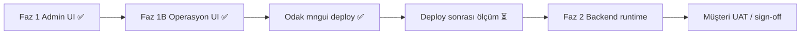

# Operasyon Merkezi — Çalışma Alanı Performans Analizi

**Tarih:** 2 Haziran 2026  
**Kapsam:** Günlük kullanım ekranları (workspace explorer, board, profil, dashboard, yeni iş)  
**Referans ölçüm:** [DIAGNOSTIC_REPORT_2026-06-02.md](./DIAGNOSTIC_REPORT_2026-06-02.md)  
**Admin ekranları (Faz 1):** [PERFORMANCE_ROADMAP.md](./PERFORMANCE_ROADMAP.md) — ✅ Odak deploy (2 Haz 2026)  
**Durum:** Faz 1B uygulandı + Odak deploy — deploy sonrası ölçüm **ertelendi**

---

## 1. Yönetici özeti

Operasyon alanı, workspace tanımlama ekranından **farklı bir profil** taşıyor:

| | Workspace tanımlama (admin) | Operasyon alanı (günlük kullanım) |
|---|---------------------------|----------------------------------|
| **Ana sorun** | Eager tab + tekrarlı katalog (UI) | Workspace ağacında **tüm workspace’lerin panolarını** önceden yükleme |
| **Backend** | DG ağırlıklı | **MngOperations runtime** ağırlıklı |
| **İyi haber** | ✅ Faz 1 deploy | Board list, profil-view mimarisi **zaten iyi tasarlanmış**; ✅ Faz 1B deploy |
| **Kötü haber** | ~~20–30 sn~~ → UI fix deploy | Explorer iyileşti (lazy); profil **ilk açılış ~4 sn** hâlâ backend (Faz 2) |

**Mesaj müşteriye:** Operasyon ekranlarında mimari felaket yok; birkaç **hedefli UI optimizasyonu** + **backend profil cold path** (Faz 2) ile günlük akış hızlanır.

---

## 2. Sayfa envanteri ve API profili

### 2.1 Workspace explorer (`/apps/operation-core/workspace`)

> **Not:** Aşağıdaki tablo **deploy öncesi** analizidir. Faz 1B (2 Haz 2026) ile `loadAllBoards` / `loadAllDashboards` sayfa açılışından kaldırıldı; panolar lazy yüklenir.

**Dosya:** `Mng.Ui/pages/apps/operation-core/workspace/index.vue`  
**Store:** `useOperationCoreStore`

| Açılışta tetiklenen (önce) | API | Tahmini süre (Odak) | Faz 1B sonrası |
|----------------------------|-----|---------------------|----------------|
| `loadWorkspaces()` | DG `op_workspaces` limit 200 | ~300 ms | Aynı (+ 60 sn store cache) |
| ~~**`loadAllBoards()`**~~ | DG `op_boards` × N workspace | ~300 ms × N | **Kaldırıldı** — genişlet/seç ile lazy |
| `pingOperations()` | MO health | < 20 ms | Aynı |
| ~~**`loadAllDashboards()`**~~ | DG tüm dashboard’lar | ~300–500 ms | **Kaldırıldı** — `ocGetDashboardRecord` ihtiyaç anında |
| Seçili workspace varsa | `loadBoardsForWorkspace` | ~300 ms | Yalnızca seçili/genişletilen ws |

**Örnek:** 5 workspace → açılışta **5+ board listesi** + tüm dashboard’lar ≈ **2–3 sn** yalnızca explorer, henüz board açılmadan.

```102:104:Mng.Ui/stores/apps/operationCore.ts
    async loadAllBoards() {
      await Promise.all(this.workspaces.map((w) => this.loadBoardsForWorkspace(w.__dataId, true)));
    },
```

**Sınıflandırma:** `UI-OVERFETCH` — workspace tanımlamadaki eager tab’a benzer mantık, farklı yüzey.

---

### 2.2 Board listesi (`/apps/operation-core/boards/{boardId}`)

**Dosya:** `Mng.Ui/pages/apps/operation-core/boards/[boardId]/index.vue`

| Adım | API | Odak ölçümü | Durum |
|------|-----|-------------|-------|
| `loadBoard` | MO `GET runtime/boards/{id}` | cold ~972 ms, warm ~4 ms | Metadata cache’li warm ✅ |
| `fetchList` | MO `POST runtime/boards/{id}/list` | warm **~320 ms** | ✅ Hedef altında |
| `loadPoolFields` | DG `op_fields` workspace filter | ~300 ms | Gerekli (sütunlar) |
| **`loadRelationOptions`** | DG `limit=500` × **relation dataset sayısı** | değişken | ⚠️ P1 — filtre açılmadan |

**Olumlu:**
- Kanban lazy (`defineAsyncComponent`) ✅
- `useOcBoardListLookups` board context kataloglarını kullanıyor; gereksiz DG fetch yok ✅
- Liste server-side sayfalama ✅
- Perf optimizasyonları (listRows, SLA ticker) uygulanmış ✅

**Kanban modu:** `loadAllColumns` — her kolon için ayrı MO query, **paralel**. Çok kolonlu board’da N eşzamanlı istek (P1).

---

### 2.3 İş profili (`/apps/operation-core/work-items/{id}/profile`)

**Dosya:** `Mng.Ui/pages/apps/operation-core/work-items/[id]/profile/index.vue`

| Adım | API | Odak ölçümü | Durum |
|------|-----|-------------|-------|
| **`ocGetWorkItemProfileView`** | MO `GET runtime/.../profile-view` | warm ~1,3–2,9 sn | ⚠️ Backend (Faz 2) |
| Sekmeler (details/comments/activity/attachments) | `v-window` **eager yok** | — | ✅ Lazy |
| `loadTimeline` | Ayrı API | Yalnızca yorum CRUD sonrası | ✅ |

**Olumlu:** Tek toplu `profile-view` çağrısı — form + katalog + timeline ilk sayfa bir arada. Eski çoklu istek anti-pattern’i giderilmiş.

**Kalan:** MO cold path ~4 sn (benchmark) — **Faz 2 backend**, UI tarafında yapılacak az şey var.

---

### 2.4 Dashboard (`OcDashboardView` — workspace inline veya `/dashboards/{id}`)

| Adım | API | Odak ölçümü | Durum |
|------|-----|-------------|-------|
| `ocGetDashboard` | MO `GET runtime/dashboards/{id}` | warm **~1,6 sn** | ⚠️ Faz 2 backend |

Widget’lar sunucu tarafında tek response’ta execute ediliyor — **N+1 widget isteği yok** ✅

---

### 2.5 Yeni iş / form dialog

| Akış | API | Not |
|------|-----|-----|
| Sayfa `/work-items/new` | `ocGetFormCreateContext` + pool fields + boards | Dialog açılınca; kabul edilebilir |
| `OcWorkItemFormDialog` | create/edit context + pool | Modal — kullanıcı tetikler ✅ |

---

## 3. Workspace tanımlama vs operasyon — karşılaştırma

```
Workspace tanımlama (ÖNCE)          Operasyon alanı (ŞİMDİ)
─────────────────────────          ─────────────────────────
11 sekme eager aynı anda     →     Sekme eager YOK ✅
~35 paralel DG isteği        →     Explorer: N workspace × boards ⚠️
Tekrarlı limit=500 katalog   →     Board: katalog MO context’ten ✅
20–30 sn algı                →     Explorer 2–3 sn (çok workspace’te)
                                   Board list ~0,3–1 sn ✅
                                   Profil warm ~1,3 sn ⚠️
```

---

## 4. Uygulanan iyileştirmeler (Faz 1B — ✅ Odak deploy, 2 Haz 2026)

| # | İyileştirme | Durum |
|---|-------------|-------|
| P0 | `loadAllBoards()` kaldır — lazy `loadBoardsForWorkspace` | ✅ |
| P1 | `ocListAllDashboards` → `ocGetDashboardRecord` ihtiyaç anında | ✅ |
| P1 | `loadRelationOptions` — filtre paneli / relation hızlı filtre | ✅ |
| P1 | Kanban `loadAllColumns` — max 4 paralel batch | ✅ |
| P2 | `loadWorkspaces()` — 60 sn TTL store cache | ✅ |

**Dosyalar:** `workspace/index.vue`, `OcWorkspaceTree.vue`, `boards/[boardId]/index.vue`, `OcBoardListFilters.vue`, `stores/apps/operationCore.ts`

### Backend (Faz 2 — bekliyor)

| | |
|---|---|
| **Profil cold/warm** | MO metadata cache, paralel DG |
| **Dashboard** | Widget aggregation profiling |
| **Hedef** | profile-view warm ≤ 1,5 sn; cold ≤ 2 sn |

---

## 5. Hedef SLA — operasyon alanı

| Senaryo | Bugün (Odak) | Hedef |
|---------|--------------|-------|
| Workspace explorer açılış (5 ws) | ~2–3 sn (önce) | ≤ **1 sn** (deploy sonrası ölçüm bekliyor) |
| Board listesi (50 satır, warm) | ~0,3 sn | ≤ **0,5 sn** ✅ |
| İş profili (warm) | ~1,3 sn | ≤ **1,5 sn** |
| İş profili (cold) | ~4 sn | ≤ **2 sn** (Faz 2) |
| Dashboard görüntüleme | ~1,6 sn | ≤ **1 sn** (Faz 2) |
| Kanban ilk yükleme (8 kolon) | ölçülmedi | ≤ **3 sn** (deploy sonrası benchmark) |

---

## 6. Yol haritası durumu



**Konuya dönüldüğünde:** deploy sonrası benchmark + Faz 2 backend kickoff.

---

## 7. Doğrulama checklist (konuya dönüldüğünde)

- [ ] Workspace explorer: 1 workspace — ağda yalnızca `op_workspaces` + **1×** `op_boards` (tüm ws değil)
- [ ] Board list: ilk paint ≤ 1 sn (warm)
- [ ] Profil: profile-view tek istek; sekmeler arası geçiş ek istek üretmiyor
- [ ] Kanban: kolonlar kademeli doluyor; tarayıcı donmuyor
- [ ] Workspace değiştir → panolar lazy geliyor

---

## 8. Sonuç

Operasyon alanı **admin ekranı kadar kötü değil** — board list ve profil-view mimarisi sağlam. Faz 1B ile **workspace explorer over-fetch** giderildi (Odak deploy). Profil ve dashboard süreleri için **backend Faz 2** sırada.

**Deploy:** Admin Faz 1 + Operasyon Faz 1B — **tek `mngui` deploy, 2 Haziran 2026** (`http://192.168.20.20:3000`).
