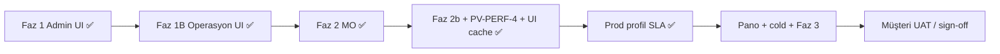

# Operasyon Merkezi — Çalışma Alanı Performans Analizi

**Tarih:** 6 Haziran 2026 (güncelleme)  
**Kapsam:** Günlük kullanım ekranları (workspace explorer, board, profil, dashboard, yeni iş)  
**Referans ölçüm:** [DIAGNOSTIC_REPORT_2026-06-06-perf.md](./DIAGNOSTIC_REPORT_2026-06-06-perf.md)  
**Admin ekranları (Faz 1):** [PERFORMANCE_ROADMAP.md](./PERFORMANCE_ROADMAP.md) — ✅ Odak deploy (2 Haz 2026)  
**Durum:** Faz 1B ✅ · Faz 2 MO ✅ · **Faz 2b + PV-PERF-4 + UI cache** ✅ (6 Haz) · prod profil warm P95 **1694 ms**

---

## 1. Yönetici özeti

Operasyon alanı, workspace tanımlama ekranından **farklı bir profil** taşıyor:

| | Workspace tanımlama (admin) | Operasyon alanı (günlük kullanım) |
|---|---------------------------|----------------------------------|
| **Ana sorun** | Eager tab + tekrarlı katalog (UI) | Workspace ağacında **tüm workspace’lerin panolarını** önceden yükleme |
| **Backend** | DG ağırlıklı | **MngOperations runtime** ağırlıklı |
| **İyi haber** | ✅ Faz 1 deploy | Board list, profil-view mimarisi **zaten iyi tasarlanmış**; ✅ Faz 1B deploy |
| **Kötü haber** | ~~20–30 sn~~ → UI fix deploy | Profil **warm prod ~1,7 sn** ✅; cold ~8–9 sn ve pano ~2 sn hâlâ iyileştirilebilir |

**Mesaj müşteriye:** Operasyon ekranlarında mimari felaket yok. **6 Haziran paketi** ile prod iş profili warm hedefin altına indi; günlük board↔profil geçişi UI cache ile anlık hissedilir.

---

## 2. Sayfa envanteri ve API profili

### 2.1 Workspace explorer (`/apps/operation-core/workspace`)

> **Not:** Aşağıdaki tablo **deploy öncesi** analizidir. Faz 1B (2 Haz 2026) ile `loadAllBoards` / `loadAllDashboards` sayfa açılışından kaldırıldı; panolar lazy yüklenir.

**Dosya:** `Mng.Ui/pages/apps/operation-core/workspace/index.vue`  
**Store:** `useOperationCoreStore`

| Açılışta tetiklenen (önce) | API | Tahmini süre (Odak) | Faz 1B sonrası |
|----------------------------|-----|---------------------|----------------|
| `loadWorkspaces()` | DG `op_workspaces` limit 200 | ~300 ms | Aynı (+ 60 sn store cache) |
| ~~**`loadAllBoards()`**~~ | DG `op_boards` × N workspace | ~300 ms × N | **Kaldırıldı** — genişlet/seç ile lazy |
| `pingOperations()` | MO health | < 20 ms | Aynı |
| ~~**`loadAllDashboards()`**~~ | DG tüm dashboard’lar | ~300–500 ms | **Kaldırıldı** — `ocGetDashboardRecord` ihtiyaç anında |
| Seçili workspace varsa | `loadBoardsForWorkspace` | ~300 ms | Yalnızca seçili/genişletilen ws |

**Örnek:** 5 workspace → açılışta **5+ board listesi** + tüm dashboard’lar ≈ **2–3 sn** yalnızca explorer, henüz board açılmadan.

```102:104:Mng.Ui/stores/apps/operationCore.ts
    async loadAllBoards() {
      await Promise.all(this.workspaces.map((w) => this.loadBoardsForWorkspace(w.__dataId, true)));
    },
```

**Sınıflandırma:** `UI-OVERFETCH` — workspace tanımlamadaki eager tab’a benzer mantık, farklı yüzey.

---

### 2.2 Board listesi (`/apps/operation-core/boards/{boardId}`)

**Dosya:** `Mng.Ui/pages/apps/operation-core/boards/[boardId]/index.vue`

| Adım | API | Odak ölçümü | Durum |
|------|-----|-------------|-------|
| `loadBoard` | MO `GET runtime/boards/{id}` | cold ~972 ms, warm ~4 ms | Metadata cache’li warm ✅ |
| `fetchList` | MO `POST runtime/boards/{id}/list` | warm **~320 ms** | ✅ Hedef altında |
| `loadPoolFields` | DG `op_fields` workspace filter | ~300 ms | Gerekli (sütunlar) |
| **`loadRelationOptions`** | DG `limit=500` × **relation dataset sayısı** | değişken | ⚠️ P1 — filtre açılmadan |

**Olumlu:**
- Kanban lazy (`defineAsyncComponent`) ✅
- `useOcBoardListLookups` board context kataloglarını kullanıyor; gereksiz DG fetch yok ✅
- Liste server-side sayfalama ✅
- Perf optimizasyonları (listRows, SLA ticker) uygulanmış ✅

**Kanban modu:** `loadAllColumns` — her kolon için ayrı MO query, **paralel**. Çok kolonlu board’da N eşzamanlı istek (P1).

---

### 2.3 İş profili (`/apps/operation-core/work-items/{id}/profile`)

**Dosya:** `Mng.Ui/pages/apps/operation-core/work-items/[id]/profile/index.vue`

| Adım | API | Odak ölçümü | Durum |
|------|-----|-------------|-------|
| **`ocGetWorkItemProfileView`** | MO `GET runtime/.../profile-view` | prod warm **~1,7 sn**; test warm ~3 sn | ✅ Prod SLA |
| **UI profil cache** | `ocGetWorkItemProfileView({ force })` — 45 sn TTL | board↔profil anında (hit) | ✅ UI-PERF-2 |
| Sekmeler (details/comments/activity/attachments) | `v-window` **eager yok** | — | ✅ Lazy |
| `loadTimeline` | Ayrı API | Yalnızca yorum CRUD sonrası | ✅ |

**Olumlu:** Tek toplu `profile-view` çağrısı — form + katalog + timeline ilk sayfa bir arada. Eski çoklu istek anti-pattern’i giderilmiş.

**PV-PERF-4 (6 Haz):** `op_links` $or, `op_tags` katalog cache, timeline dedup. Mutation sonrası `loadProfile(true)`.

**Kalan:** MO cold path ~8–9 sn (restart sonrası ilk istek); test warm hâlâ hedef üstü.

---

### 2.4 Dashboard (`OcDashboardView` — workspace inline veya `/dashboards/{id}`)

| Adım | API | Odak ölçümü | Durum |
|------|-----|-------------|-------|
| `ocGetDashboard` | MO `GET runtime/dashboards/{id}` | prod warm **~2 sn**; test ~1,4 sn | ⚠️ Faz 2b dedup uygulandı, hedef 1,2 sn |

Widget’lar sunucu tarafında tek response’ta execute ediliyor — **N+1 widget isteği yok** ✅

---

### 2.5 Yeni iş / form dialog

| Akış | API | Not |
|------|-----|-----|
| Sayfa `/work-items/new` | `ocGetFormCreateContext` + pool fields + boards | Dialog açılınca; kabul edilebilir |
| `OcWorkItemFormDialog` | create/edit context + pool | Modal — kullanıcı tetikler ✅ |

---

## 3. Workspace tanımlama vs operasyon — karşılaştırma

```
Workspace tanımlama (ÖNCE)          Operasyon alanı (ŞİMDİ)
─────────────────────────          ─────────────────────────
11 sekme eager aynı anda     →     Sekme eager YOK ✅
~35 paralel DG isteği        →     Explorer: N workspace × boards ⚠️
Tekrarlı limit=500 katalog   →     Board: katalog MO context’ten ✅
20–30 sn algı                →     Explorer 2–3 sn (çok workspace’te)
                                   Board list ~0,3–1 sn ✅
                                   Profil warm ~1,3 sn ⚠️
```

---

## 4. Uygulanan iyileştirmeler (Faz 1B — ✅ Odak deploy, 2 Haz 2026)

| # | İyileştirme | Durum |
|---|-------------|-------|
| P0 | `loadAllBoards()` kaldır — lazy `loadBoardsForWorkspace` | ✅ |
| P1 | `ocListAllDashboards` → `ocGetDashboardRecord` ihtiyaç anında | ✅ |
| P1 | `loadRelationOptions` — filtre paneli / relation hızlı filtre | ✅ |
| P1 | Kanban `loadAllColumns` — max 4 paralel batch | ✅ |
| P2 | `loadWorkspaces()` — 60 sn TTL store cache | ✅ |

**Dosyalar:** `workspace/index.vue`, `OcWorkspaceTree.vue`, `boards/[boardId]/index.vue`, `OcBoardListFilters.vue`, `stores/apps/operationCore.ts`

### Backend (Faz 2 + 2b — ✅ 6 Haz 2026)

| | |
|---|---|
| **Profil warm** | PV-PERF-4: `op_links` $or, `op_tags` katalog cache, timeline dedup |
| **Dashboard** | Faz 2b: widget query dedup (`queryResultCache`) |
| **Metadata TTL** | `TtlSeconds` 120→600, `CatalogTtlSeconds` 600 |
| **UI** | 45 sn profil client cache + mutation `force` |
| **Prod ölçüm** | profile warm P95 **1694 ms** ✅ |
| **Açık** | cold ≤ 4 sn · pano ≤ 1,2 sn · Faz 3 DG katalog cache |

---

## 5. Hedef SLA — operasyon alanı

| Senaryo | Prod (6 Haz) | Test (6 Haz) | Hedef |
|---------|--------------|--------------|-------|
| Workspace explorer açılış | ~375 ms | — | ≤ **1 sn** ✅ |
| Board listesi (warm) | ~697 ms | ~738 ms | ≤ **1,2 sn** ✅ |
| İş profili (warm) | **1694 ms** ✅ | 2963 ms ⚠️ | ≤ **1,8 sn** |
| İş profili (cold) | ~8–9 sn | ~8–9 sn | ≤ **4 sn** |
| Dashboard görüntüleme | 2047 ms ⚠️ | 1424 ms ⚠️ | ≤ **1,2 sn** |
| Kanban ilk yükleme | ~687 ms | — | ≤ **3,5 sn** ✅ |

---

## 6. Yol haritası durumu



**Konuya dönüldüğünde:** pano ≤ 1,2 sn · profil cold · Faz 3 DG cache (ayrı planlama).

---

## 7. Sayfa diagnostic script (2 Haz 2026)

`scripts/diagnostic-operation-pages.ps1` — UI route’larına karşılık gelen **API paketlerini** ölçer (paralel/sequential, Faz 1B davranışı):

| `pageId` | Simüle edilen ekran |
|----------|---------------------|
| `explorer_open` | `/workspace` — workspaces + MO live |
| `explorer_select_board` | Workspace seç + boards + dashboard kaydı |
| `board_list_open` | Board list — context + list + pool fields |
| `board_kanban_open` | Kanban — context + kolon query (batch 4) |
| `profile_open` | Profil — `profile-view` tek MO |
| `dashboard_view` | Pano — `runtime/dashboards/{id}` |
| `work_item_new` | Yeni iş — form create + boards + fields |
| `notifications_inbox` | Bildirimler |
| `admin_scheduled_jobs` | Zamanlanmış job'lar (scheduler + DG) |
| `admin_ws_defs_shell` | Workspace tanımları kabuk listesi |

Çıktı: `reports/oc_pages_YYYYMMDD_HHmmss.json` — `diagnostic-benchmark.ps1` ile birlikte çalıştırın.

---

## 8. Doğrulama checklist

- [ ] Workspace explorer: 1 workspace — ağda yalnızca `op_workspaces` + **1×** `op_boards` (tüm ws değil)
- [ ] Board list: ilk paint ≤ 1 sn (warm)
- [ ] Profil: profile-view tek istek; sekmeler arası geçiş ek istek üretmiyor
- [ ] Kanban: kolonlar kademeli doluyor; tarayıcı donmuyor
- [ ] Workspace değiştir → panolar lazy geliyor

---

## 9. Sonuç

Operasyon alanı **admin ekranı kadar kötü değil** — board list ve profil-view mimarisi sağlam. **6 Haziran paketi** ile prod profil warm hedefin altına indi; UI profil cache günlük gezinmeyi hızlandırır. Sırada: pano, cold path, Faz 3 DG.

**Deploy:** Test `192.168.20.20` + Prod `192.168.20.8` — `mngoperations` + `mngui` (`--no-cache`), 6 Haziran 2026. Rapor: [DIAGNOSTIC_REPORT_2026-06-06-perf.md](./DIAGNOSTIC_REPORT_2026-06-06-perf.md).
