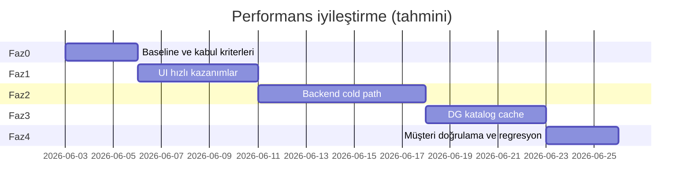

# MonitraNG Operasyon Merkezi — Performans İyileştirme Yol Haritası

**Sürüm:** 1.0  
**Tarih:** 2 Haziran 2026  
**Ortam:** Odak / müşteri on-prem  
**Durum:** Faz 1 + 1B tamam (Odak UI deploy, 2 Haziran 2026) — **Faz 2 backend** bekliyor  
**Teknik referans:** [DIAGNOSTIC_REPORT_2026-06-02.md](./DIAGNOSTIC_REPORT_2026-06-02.md)

---

## 1. Yönetici özeti

Operasyon Merkezi arayüzünde (özellikle **workspace tanımlama** ve **günlük iş akışları**) gözlemlenen yavaşlık, altyapı veya servislerin genel çöküşünden kaynaklanmıyor. Odak ortamında yapılan ölçümler:

- **Veri katmanı ve kimlik servisleri** sağlıklı ve hızlı yanıt veriyor.
- **İş listesi (board)** gibi sık kullanılan ekranlar hedef sürelerin **altında** (~0,3 sn).
- Yavaşlık hissi iki ana grupta toplanıyor:
  1. **Yönetim ekranları (workspace tanımlama):** Aynı anda çok sayıda veri isteği — mimari optimizasyon gerektirir.
  2. **Profil / detay ekranları:** İlk açılışta (cold) birleşik veri yükü — backend cache ve sorgu optimizasyonu gerektirir.

Bu yol haritası, **ölçülebilir hedefler**, **fazlı teslimat** ve **doğrulama kriterleri** ile müşteri ortamında somut iyileşme sağlamayı amaçlar.

### Hedef kullanıcı deneyimi (SLA)

| Senaryo | Bugün (Odak ölçümü) | Hedef (Faz 2 sonu) |
|---------|---------------------|---------------------|
| Board listesi (50 satır) | ~0,3 sn | ≤ 0,5 sn |
| İş profili — tekrar açılış (warm) | ~1,3 sn | ≤ 1,5 sn |
| İş profili — ilk açılış (cold) | ~4 sn | ≤ 2 sn |
| Workspace tanımlama — zamanlanmış görevler sekmesi | ~20–30 sn (UI) | ≤ 3 sn |
| Workspace tanımlama — sayfa ilk açılış | ~20–30 sn (UI) | ≤ 5 sn |

> Hedefler P95 (95. istek daha hızlı) ve Odak referans ortamı içindir; müşteri ortamında Faz 0'da baseline alınır.

---

## 2. Kök neden özeti (müşteri dili)

| Belirti | Teknik kök neden | Etki |
|---------|------------------|------|
| Workspace tanımlama ekranı uzun süre boş / spinner | Tüm sekmeler sayfa açılışında aynı anda yükleniyor; aynı katalog verileri defalarca isteniyor | Yüksek — yönetici ekranları |
| Zamanlanmış görevler listesi geç doluyor | Sekme tek başına ~2 sn backend; asıl gecikme sayfa genelindeki istek kuyruğu | Yüksek — algılanan sorun burada |
| İş profili ilk açılışta yavaş | Birleşik profil verisi birden fazla servis çağrısı; cache eksik | Orta — günlük operasyon |
| Board listesi kabul edilebilir | Önceki optimizasyonlar etkili | Düşük — ek iş gerekmez |

**Mesaj:** Sistem “bozuk” değil; **hedefli mühendislik iyileştirmeleri** ile müşteri deneyimi belirgin şekilde iyileştirilebilir.

---

## 3. Yol haritası — fazlar

*Takvim tahminidir; ekip kapasitesine göre güncellenir.*

---

### Faz 0 — Baseline ve kabul (≈ 3 iş günü)

**Amaç:** Müşteri ortamında “önce” ölçümü; iyileştirmeyi kanıtlayacak çerçeve.

| Teslimat | Açıklama |
|----------|----------|
| Ölçüm script'leri | `diagnostic-benchmark.ps1`, `diagnostic-workspace-definitions.ps1` |
| Müşteri baseline raporu | 5 kritik senaryo: board list, profil, workspace tanımlama, scheduled tab, dashboard |
| Kabul kriterleri dokümanı | Yukarıdaki SLA tablosu — imza/onay |
| İzleme | `OC_PERF` (backend) + UI waterfall şablonu (Faz 1 sonrası) |

**Çıktı:** `BASELINE_YYYY-MM-DD.md` — müşteriyle paylaşılabilir “önce” tablosu.

---

### Faz 1 — UI hızlı kazanımlar (≈ 5 iş günü) — **En yüksek müşteri etkisi**

**Durum:** Geliştirme tamamlandı (2 Haziran 2026) — **UI deploy Odak’ta canlı** (Faz 1 + 1B)

**Amaç:** Workspace tanımlama ve yönetim ekranlarında 20–30 sn → birkaç saniye.

| # | İyileştirme | Durum |
|---|-------------|-------|
| 1.1 | Ana sekmelerde **`eager` → lazy** | ✅ |
| 1.2 | Değerler alt sekmelerinde lazy yükleme | ✅ |
| 1.3 | **`useOcWorkspaceCatalog`** — paylaşımlı katalog (boards/types/priorities/states/workspace) | ✅ |
| 1.4 | Person lookup **paralel** (`ensureSelectedIds`, rules `resolvePersonTitles`) | ✅ |

**Dosyalar:**
- `Mng.Ui/composables/useOcWorkspaceCatalog.ts` (yeni)
- `Mng.Ui/pages/.../workspace-definitions/index.vue`
- `OcWorkspaceDefinitionsValuesTab.vue`
- `OcWorkspaceDefinitionsScheduledWorkItemsTab.vue`, `FormsTab`, `BoardsTab`, `DashboardsTab`
- `OcWorkspaceRulesExplorer.vue`, `OcWorkspaceFieldPolicyExplorer.vue`, `OcWorkspaceSlaPoliciesExplorer.vue`
- `Mng.Ui/composables/useOcPersonPicker.ts`

**Doğrulama:** Aynı script + tarayıcı Network — scheduled tab ≤ 3 sn, sayfa ilk açılış ≤ 5 sn.

**Operasyon alanı analizi:** [OPERATIONAL_WORKSPACE_PERF.md](./OPERATIONAL_WORKSPACE_PERF.md)

---

### Faz 1B — Operasyon çalışma alanı UI (≈ 2–3 iş günü) — **Deploy ile birlikte önerilir**

**Durum:** ✅ Kod + **Odak UI deploy** (2 Haziran 2026, Faz 1 ile birlikte)

| # | İyileştirme | Öncelik | Etki | Durum |
|---|-------------|---------|------|-------|
| 1B.1 | Workspace explorer: **`loadAllBoards` kaldır** → lazy (seçili/genişletilen ws) | P0 | Açılış ~2–3 sn → ~1 sn | ✅ |
| 1B.2 | `ocListAllDashboards` → **tek pano adı** (`ocGetDashboardRecord`) ihtiyaç anında | P1 | ~300–500 ms | ✅ |
| 1B.3 | Board `loadRelationOptions` → hızlı filtre relation / gelişmiş arama açılınca | P1 | Relation board’larda 1–3 sn | ✅ |
| 1B.4 | Kanban kolon yükleme concurrency limiti (4 paralel) | P1 | Spike azaltma | ✅ |
| 1B.5 | Store workspace list cache (60 sn TTL) | P2 | ~300 ms | ✅ |

**Dosyalar:**
- `Mng.Ui/pages/.../workspace/index.vue`
- `Mng.Ui/components/.../OcWorkspaceTree.vue`
- `Mng.Ui/pages/.../boards/[boardId]/index.vue`
- `Mng.Ui/components/.../OcBoardListFilters.vue`
- `Mng.Ui/stores/apps/operationCore.ts`

**Not:** Board list (~320 ms) ve profil-view (tek API) zaten iyi; asıl kazanç explorer + Faz 2 backend.

---

### Faz 2 — Backend runtime optimizasyonu (≈ 7 iş günü)

**Amaç:** Günlük operasyon ekranları — profil cold path, dashboard.

| # | İyileştirme | Beklenen etki |
|---|-------------|---------------|
| 2.1 | MO **metadata cache** (workspace, flow, field katalog — istek/işlem içi + kısa TTL) | Profil cold ~4 sn → ~2 sn |
| 2.2 | Profil **paralel downstream** genişletme (mevcut perf çalışmasının devamı) | Warm profil ≤ 1,2 sn korunur / iyileşir |
| 2.3 | Dashboard widget aggregation profiling + daraltma | Dashboard ~1,6 sn → ≤ 1 sn |
| 2.4 | `OC_PERF` / istek timing — regresyon kapısı (CI veya deploy checklist) | Gelecekteki yavaşlama erken yakalanır |

**Doğrulama:** `diagnostic-benchmark.ps1` — profil cold ≤ 2 sn, warm P95 ≤ 1,5 sn.

**Müşteriye söylenecek:** *“İş detay ekranında veri birleştirme sürecini optimize ettik; ilk açılış belirgin hızlandı.”*

---

### Faz 3 — Veri katmanı katalog cache (≈ 5 iş günü)

**Amaç:** Global katalog sorgularının tekrarında DG yanıt süresini düşürmek (UI + diğer ekranlar).

| # | İyileştirme | Beklenen etki |
|---|-------------|---------------|
| 3.1 | MngDataGateway **read-through cache** — `op_states`, `op_priorities`, `op_work_item_types` (TTL + invalidation) | Tek katalog sorgusu ~300 ms → < 50 ms (warm) |
| 3.2 | *(Opsiyonel)* MO **workspace catalog API** — enabled types/states/priorities tek endpoint | UI karmaşıklığı ve istek sayısı azalır |

**Doğrulama:** Workspace definitions script — eager storm simülasyonu ≤ 5 sn (Faz 1 sonrası zaten düşük olacak; Faz 3 DG tarafını güçlendirir).

**Müşteriye söylenecek:** *“Sık kullanılan referans verileri önbelleğe alındı; tüm ekranlarda yanıt süreleri kısaldı.”*

---

### Faz 4 — Müşteri doğrulama ve kapanış (≈ 3 iş günü)

| Adım | Açıklama |
|------|----------|
| 4.1 | Müşteri ortamında Faz 0 baseline ile karşılaştırma |
| 4.2 | Kabul senaryoları checklist (board, profil, workspace def., scheduled) |
| 4.3 | `PERFORMANCE_SIGNOFF_YYYY-MM-DD.md` — SLA tablosu yeşil |
| 4.4 | Operasyon runbook: perf regresyon nasıl izlenir |

---

## 4. Müşteri sunumu — önerilen anlatım

### Problem (empati)
> “Operasyon Merkezi’nde workspace ayarları ve zamanlanmış görevler ekranında bekleme süreleri operasyonel verimliliği etkiliyor.”

### Analiz (güven)
> “Odak ortamında ölçüm yaptık. Altyapı ve core servisler sağlıklı. Gecikme, yönetim ekranlarının veri yükleme mimarisi ve profil ekranının ilk açılış optimizasyonu ile ilgili — çözülebilir, planlı iyileştirmeler.”

### Plan (netlik)
> “Dört fazda ilerliyoruz: (1) yönetim ekranı hızlandırma — en hızlı etki, (2) iş profili optimizasyonu, (3) veri katmanı cache, (4) sizin ortamınızda ölçüm ve kabul.”

### Taahhüt (ölçülebilir)
> “Workspace tanımlama ekranında zamanlanmış görevler listesi **3 saniye altına**; board listesi **yarım saniye** bandında kalacak şekilde kabul kriterleri tanımladık.”

### Zaman (tahmini)
> “UI odaklı Faz 1 ile **~1 hafta** içinde yönetim ekranlarında belirgin iyileşme; tam paket **~3–4 hafta** (ekip kapasitesine bağlı).”

---

## 5. Riskler ve azaltma

| Risk | Azaltma |
|------|---------|
| Müşteri ortamı Odak’tan farklı | Faz 0 baseline müşteride zorunlu |
| Lazy tab davranış değişikliği | Smoke test + mevcut OC UI checklist |
| Cache tutarsızlığı | TTL + catalog write’da invalidation |
| Regresyon | Her faz sonu benchmark script; davranış-koruyan testler |
| “Sadece UI düzelttik” algısı | Faz 2–3 backend maddeleri + raporlu kanıt |

---

## 6. Başarı metrikleri (KPI)

Faz kapanışında raporlanacak:

1. **P95 yanıt süresi** — 5 kritik endpoint/senaryo  
2. **İstek sayısı** — workspace definitions sayfa açılışı (Network waterfall)  
3. **Kullanıcı senaryosu süresi** — “Workspace seç → Scheduled sekmesine geç → liste görünür” (E2E, Faz 4)  
4. **Hata oranı** — değişmemeli (0 yeni 5xx)

---

## 7. Sorumluluk matrisi

| Faz | Ana ekip | Müşteri |
|-----|----------|---------|
| Faz 0 | MonitraNG — ölçüm, rapor | Odak erişim, kabul kriterleri onayı |
| Faz 1 | MonitraNG — UI | ✅ Odak deploy (2 Haz 2026) — isteğe bağlı UAT |
| Faz 2 | MonitraNG — MngOperations | UAT — board / profil |
| Faz 3 | MonitraNG — MngDataGateway | — |
| Faz 4 | MonitraNG — rapor | Resmi kabul / sign-off |

---

## 8. Sonraki adım (konuya dönüldüğünde)

1. **Deploy sonrası doğrulama** — `diagnostic-workspace-definitions.ps1` + tarayıcı Network (workspace tanımları, explorer)
2. **Faz 2 kickoff** — MO metadata cache, profil cold path, dashboard aggregation
3. **Faz 0 / 4** — müşteri baseline + resmi sign-off (isteğe bağlı)

---

## Ek: Teknik detay isteyenler için

- [DIAGNOSTIC_PLAN.md](./DIAGNOSTIC_PLAN.md) — metodoloji  
- [DIAGNOSTIC_REPORT_2026-06-02.md](./DIAGNOSTIC_REPORT_2026-06-02.md) — ham ölçüm  
- [README.md](./README.md) — script kullanımı
