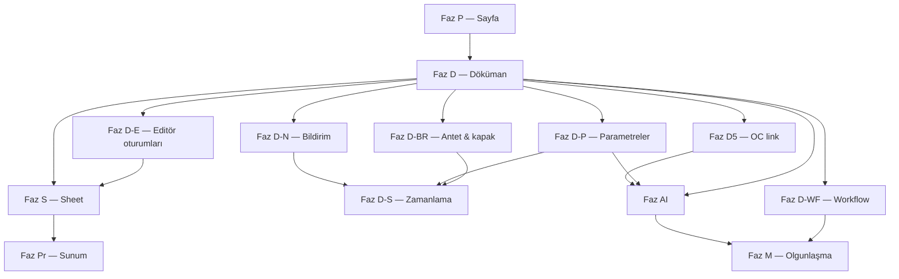

# Document Intelligence — Ürün Yol Haritası

**Durum:** Planlama (birleşik roadmap)  
**Son güncelleme:** 6 Temmuz 2026  
**Kapsam:** Sayfa · Döküman · Sheet · Sunum · Parametreler · Kurumsal kimlik (D-BR) · Zamanlama · Bildirim · Collabora oturum yönetimi · Workflow entegrasyonu (D-WF) · AI  
**İlişkili:** [MonitraNG_Document_Intelligence_Planning.md](./MonitraNG_Document_Intelligence_Planning.md) · [DEVAM.md](./DEVAM.md) · [LETTERHEAD_CATALOG_MIGRATION_PROD.md](./LETTERHEAD_CATALOG_MIGRATION_PROD.md) · [ODAK_MO_VS_WORKFLOW_SCENARIOS.md](../workflow/ODAK_MO_VS_WORKFLOW_SCENARIOS.md) · [docs/MngDocument/current_status.md](../../MngDocument/current_status.md)

---

## 1. Vizyon

**Amaç:** Kurumun ihtiyaç duyduğu tüm içeriği — bilgi sayfaları, resmi Word belgeleri, Excel tabloları, sunumlar — **tek kaynak ağacında**, **yetkili**, **sürümlü**, **üretilebilir**, **zamanlanabilir** ve ileride **yapay zeka destekli** şekilde merkezileştirmek.

**Ürün konumlandırması (özet):**

- Confluence benzeri bir **wiki rakibi değil**; MonitraNG platformunun **kurumsal bellek + kontrollü doküman omurgası**.
- Confluence “ekip bilgisini biriktirir”; DI “resmi kaydı kontrol eder, üretir ve operasyonla konuşur”.
- Savunma / kalite / operasyon müşterisinde AS9100, revizyon kontrolü, CoC/Activity üretimi ve Operasyon Merkezi entegrasyonu birincil satış hikâyesidir.
- **Kurumsal kimlik katmanı:** Antet ve kapak sayfası şablondan bağımsız yönetilir; aynı içerik farklı antetlerle, isteğe bağlı kapakla üretilir — çoğaltma ve marka tutarlılığı tek merkezden.

**Temel ilke:** Wiki ve dosya yönetimi ayrı modül değildir. Tüm içerikler tek **kaynak ağacı** altında yönetilir; yetki, sürüm ve audit ortaktır.

---

## 2. Terminoloji

Kullanıcı arayüzü ve dokümantasyonda aşağıdaki isimler kullanılır (“wiki” / “markdown” yerine):

| Tür (UI) | Teknik (`dm_resources`) | Editör | Birincil kullanım |
|----------|-------------------------|--------|-------------------|
| **Sayfa** | `type=markdown` | Markdown editör | Rehber, runbook, prosedür, IT bilgi, sürüm notu |
| **Döküman** | `type=file`, `.docx` | Collabora (WOPI) | Resmi Word: CoC, aktivite, kalite formu, antetli belge |
| **Sheet** | `type=file`, `.xlsx` | Collabora Calc | Fiyat listesi, kapasite, plan, kontrol tablosu |
| **Sunum** | `type=file`, `.pptx` | Collabora Impress | Müşteri sunumu, eğitim, yönetim brifingi |
| **Dosya** | `type=file` (pdf, zip, img…) | Önizleme / indir | Ek, arşiv, referans |
| **Klasör** | `type=folder` | — | Hiyerarşi, yetki anchor |

### Döküman kaynağı (`origin`)

Her **Döküman** üç yoldan oluşabilir:

| Origin | Açıklama |
|--------|----------|
| `upload` | Kullanıcı mevcut DOCX yükler |
| `manual` | Kullanıcı şablondan parametre doldurarak üretir |
| `system` | İş verisi tetikler (generation profile: sipariş kalemi, schedule vb.) |

---

## 3. Mevcut durum (baseline — Temmuz 2026)

### Tamamlanan / canlı

| Alan | Durum |
|------|-------|
| Kaynak ağacı (klasör / sayfa / dosya) | ✅ Faz 1 |
| Sayfa: taslak/yayın, sürüm geçmişi, iç link, arama | ✅ |
| Grup bazlı klasör yetkisi + miras | ✅ |
| Döküman: DOCX upload, Collabora edit (WOPI) | ✅ |
| Belge Tasarımcısı: şablon, parametre (skaler), antet/footer (şablona gömülü) | ✅ D1 |
| **Paylaşımlı antet kataloğu (`dm_letterheads`) + Collabora tasarım + tablo footer** | ✅ **D-BR1 Sprint A** (test) |
| Otomatik üretim: CoC + Activity generation profilleri | ✅ |
| Şablon publish/unpublish | ✅ |
| System / Öğreticiler seed içerik | ✅ |
| OC kalem belgeleri paneli + deep link | ✅ |

### Eksik / planlanan

| Alan | Durum |
|------|-------|
| Sayfa editörü olgunluğu (WYSIWYG, etiket UI, ana sayfa) | 🔲 Faz P |
| Yapısal parametreler (tablo, kart, chart) | 🔲 Faz D-P |
| Dataset / MO query ile parametre verisi | 🔲 Faz D-P |
| Döküman sürüm UI (file) | 🔲 Faz D |
| Manuel şablondan üretim UX | 🔲 Faz D |
| Sheet / Sunum Collabora | 🔲 Faz S / Pr |
| Zamanlanmış üretim | 🔲 Faz D-S |
| Döküman bildirimleri | 🔲 Faz D-N |
| OC WorkItem ↔ doküman (tam UI) | 🔲 Faz D5 |
| Collabora oturum görünürlüğü / limit (D-E) | 🔲 Faz D-E |
| Paylaşımlı antet & kapak kataloğu; üretimde seçim | 🟡 **D-BR1 kısmi** (katalog ✅ · üretim seçimi 🔲) |
| Workflow entegrasyonu (onaylı yayın, dağıtım) | 🔲 Faz D-WF |
| AI: extract, tag, özet, benzer, asistan | 🔲 Faz AI |

**Teknik referans:** `MngDocument` (`/documents/api/v1/...`), UI `/apps/document-intelligence`, kalıcılık `dm_resources`, `dm_resource_permissions`, `dm_resource_versions`, `dm_document_templates`.

---

## 4. Hedef kaynak ağacı (organizasyon)

Klasör convention zorunlu değil; tür filtresi + etiket yeterli olabilir. Önerilen yapı:

```text
(kök)
├── Sayfalar/
│   ├── IT Runbook'ları/
│   ├── Operasyon Rehberleri/
│   └── System/                    (sürüm notları, diagnostic)
├── Dökümanlar/
│   ├── Kalite/
│   │   ├── Şablonlar/             (designer — publish/unpublish)
│   │   └── Üretilen/              (CoC, Activity…)
│   ├── Kurumsal Kimlik/           (Faz D-BR — antet & kapak katalogları)
│   └── Prosedürler/
├── Sheets/
│   ├── Fiyat Listeleri/
│   └── Planlama/
└── Sunumlar/
    ├── Müşteri/
    └── Eğitim/
```

---

## 5. Faz planı — genel bakış

```text
Faz P   → Sayfa (editör + keşif + etiket)
Faz D   → Döküman (Collabora olgunlaştırma + üretim kanalları)
  D-BR  → Kurumsal kimlik (antet kataloğu + kapak sayfası)
  D-E   → Collabora editör oturumları (sayım, limit, yönetim)
  D-WF  → Workflow entegrasyonu (olaylar, onaylı yayın, dağıtım)
  D-P   → Parametre sistemi 2.0 (tablo, kart, chart, veri kaynakları)
  D-N   → Bildirimler
  D-S   → Zamanlanmış üretim
  D5    → OperationCore entegrasyonu
Faz S   → Sheet (Excel / Collabora Calc)
Faz Pr  → Sunum (PPTX / Collabora Impress)
Faz AI  → Etiketleme, özet, ilişkili içerik, asistan
Faz M   → Kurumsal olgunlaşma (onay, arşiv, dağıtım)
```

### Bağımlılık diyagramı



### Öncelik sırası (öneri)

| Sıra | Faz | Gerekçe |
|------|-----|---------|
| 1 | **P** | Düşük risk, hızlı değer, iç bilgi merkezi canlanır |
| 2 | **D** + **D-E** (E1–E2) | Collabora home_mode limiti (20 conn / 10 doc) — önce bizim gate |
| 3 | **D** + **D-BR1** | Paylaşımlı antet kataloğu; üretimde seçim — marka tutarlılığı, şablon çoğaltmayı azaltır |
| 4 | **D** + **D-P** (P1–P3) | Odak referans; Activity sevkiyat tablosu vb. |
| 5 | **D-BR2** | Kapak sayfası — rapor ve dış paylaşım belgeleri için profesyonel ilk sayfa |
| 6 | **D-N** | Üretim maili — hızlı operasyonel kazanç |
| 7 | **D-S** | Haftalık otomatik rapor senaryosu |
| 8 | **D5** | Operasyon entegrasyonu — DI farkı |
| 9 | **S** → **Pr** | Kurumsal içerik üçlüsü (Word·Excel·Sunum) |
| 10 | **D-P** (P4–P5) | Chart + MO aggregate |
| 11 | **D-WF** (0–1) | Event publish + CoC kalite onay playbook (D-N1 ile overlap netleştir) |
| 12 | **AI** | Extract + tag + özet + benzer + asistan |
| 13 | **M** + **D-WF2–4** | Kontrollü doküman lifecycle; AI düşük güven onayı |

---

## 6. Faz P — Sayfa

**Hedef:** Kurumsal bilgi içeriğini **Sayfa** olarak yönetmek; editör ve keşif deneyimini güçlendirmek.

### P1 — Terminoloji ve UX
- UI: “Markdown” → **Sayfa**; tür ikonları ve filtreler
- Oluştur menüsü: Yeni sayfa · Döküman yükle · (D fazında) Şablondan döküman

### P2 — Sayfa editörü
| Öncelik | Özellik |
|---------|---------|
| P0 | Split view, tam ekran edit |
| P0 | Başlık hiyerarşisi, tablo, kod bloğu, checklist |
| P1 | Görsel yükleme / embed |
| P1 | Sayfa şablonları (Runbook, Kurulum, Sürüm notu) |
| P2 | WYSIWYG veya blok editör (markdown storage korunur) |
| P2 | İç link picker (kaynak ağacından) — kısmen mevcut |

### P3 — Sayfa fonksiyonları
| Özellik | Durum | Hedef |
|---------|-------|-------|
| Etiketler | Backend var | UI + filtre |
| Son güncellenenler | API var | Ana sayfa / widget |
| Taslaklarım | API var | Ana sayfa |
| Sürüm notu (`changeNote`) | Yok | Versiyon kaydına |
| Backlink | Yok | “Bu sayfaya link verenler” |
| Yorum | Yok | Sayfa altı thread |
| İzle / bildirim | Yok | Notifier entegrasyonu |
| Alan giriş sayfası | Kısmen (seed) | Üst klasör index convention |

### P4 — Keşif
- Sayfa ana ekranı: arama + son + taslaklar + alan kısayolları
- Yayınlanmış varsayılan arama; taslaklar ayrı

**Çıktı:** IT/operasyon rehberleri merkezi Sayfa deneyimiyle yönetilir.

**Tahmini süre:** 4–8 hafta

---

## 7. Faz D — Döküman

**Hedef:** Resmi Word belgelerinin üç kaynaktan gelmesi, tek merkezde yaşaması, Collabora ile düzenlenmesi.

### D1 — Döküman modeli

Metadata (genişletme):

```text
origin: upload | manual | system
templateId, generationProfile, documentNo
letterheadId, coverPageId   (Faz D-BR — üretimde seçilen kimlik)
lifecycle: draft | active | superseded | archived  (Faz M)
scheduleId (zamanlı üretimde)
```

### D2 — Collabora olgunlaştırma (DOCX)
| Özellik | Öncelik |
|---------|---------|
| Döküman sürüm geçmişi UI | P0 |
| Collabora kaydet → yeni versiyon | P0 |
| Editör oturum yönetimi + limit | P0 → **Faz D-E** |
| PDF export | P1 |
| Antet / footer / sayfa yapısı (şablona gömülü) | ✅ baseline → **Faz D-BR** (paylaşımlı katalog) |

### D3 — Belge Tasarımcısı tamamlama
| Dilim | İçerik |
|-------|--------|
| D2-legacy | Incremental docNo (`@__counters`) — kısmen ✅ |
| D3 | Tablo parametreleri (CoC boyama) → **D-P3** |
| D4 | Merge + PDF indirme |
| D5 | OC work item ↔ döküman |

### D4 — Üretim kanalları

```text
                    ┌─────────────────┐
                    │  dm_resources   │
                    │  type=file docx │
                    └────────┬────────┘
           ┌─────────────────┼─────────────────┐
           ▼                 ▼                 ▼
    origin=upload    origin=manual      origin=system
```

- **Upload:** mevcut akış + Collabora
- **Manuel:** şablondan oluştur → parametre formu → merge → ağaca ekle
- **Sistem:** sipariş/OC/schedule tetikleyicisi

**Tahmini süre:** 8–14 hafta (D-P ile paralel)

---

## 8. Faz D-BR — Kurumsal kimlik (antet & kapak)

**Hedef:** Şablon **içeriği** ile **kurumsal görünümü** ayırmak. Aynı belge gövdesini farklı antetlerle üretmek; resmi ve dış paylaşım belgelerine isteğe bağlı **kapak sayfası** eklemek.

**Satış hikâyesi:** *«Her şablonu baştan kopyalamadan ODK, iştirak veya müşteri antetine geçin; haftalık rapor ve prosedür paketlerine tek tıkla profesyonel kapak ekleyin. Marka tutarlılığı tek merkezden, içerik aynı kalır.»*

### Baseline (bugün)

| Konu | Durum |
|------|--------|
| Antet | Şablona gömülü toggle’lar (logo, belge adı, docNo, tarih) |
| Üretimde antet seçimi | Yok — şablon ne tanımlıysa o uygulanır |
| Kapak sayfası | Yok |
| Altbilgi | Şablon + domain footer profili |

### 8.1 Antet kataloğu — D-BR1

- Domain genelinde **birden fazla antet tanımı** (katalog)
- Şablonda **varsayılan antet**; üretim dialogunda listeden **seçim**
- Logo, belge adı, numara, üretim tarihi — tek yerden yönetim
- Mevcut şablon gömülü antetler → katalog kaydına **migration** (geriye uyum)

**Kullanıcı değeri:** CoC ve Activity aynı kalır; antet departman veya müşteriye göre değişir — şablon çoğaltma azalır.

### 8.2 Kapak sayfası — D-BR2

- **Birden fazla kapak tasarımı** (katalog)
- Döküman üretilirken **«Kapak ekle»** + tasarım seçimi — **opsiyonel**
- Haftalık rapor, prosedür paketi, müşteri sunumu: ilk sayfa profesyonel kapak; gövde mevcut antet/altbilgi ile devam eder

**Kullanıcı değeri:** Dış paylaşım belgelerinde «Word’e elle kapak yapıştırma» biter; üretim hattına entegre kalır.

### 8.3 Üretim deneyimi (hedef)

```text
Şablon seç  →  (opsiyonel) Antet seç  →  (opsiyonel) Kapak ekle  →  Parametreler  →  Üret
```

Üretilen dökümanda hangi antet ve kapak kullanıldığı metadata’da saklanır (denetim, yeniden üretim).

### 8.4 D-BR dilimleri

| Dilim | Kapsam | Öncelik | Durum |
|-------|--------|---------|-------|
| **D-BR1a** | `dm_letterheads` + API + admin UI + Collabora tasarım + tablo footer skeleton + design merge | P0 | ✅ Sprint A (Odak test) |
| **D-BR1b** | Şablon varsayılanı + **üretimde antet seçimi** + prod migration | P0 | 🔲 |
| **D-BR2** | Kapak kataloğu + üretimde opsiyonel seçim | P1 | 🔲 |
| **D-BR3** | Paylaşımlı altbilgi kataloğu (opsiyonel; footer şablonda kalabilir) | P2 | ➖ Tablo footer modeli ile birleşti |

**Bağımlılık:** Faz D üretim kanalları (`manual` / `system`); D-BR2, D-BR1 sonrası. D-S haftalık rapor + kapak = güçlü demo senaryosu.

**Tahmini süre:** D-BR1 ~2–3 sprint · D-BR2 ~2 sprint

---

## 9. Faz D-E — Collabora editör oturumları ve limit yönetimi

**Hedef:** Collabora’ya gitmeden önce WOPI oturumlarını saymak, limit uygulamak ve operasyon ekibine görünürlük sağlamak. Kullanıcı Collabora’nın opak “limit doldu” hatası yerine anlaşılır mesaj alsın.

### 9.1 Ortam: Collabora home_mode

Prod/test compose’da Collabora `home_mode.enable=true` ile çalışır (`ApplicationResources/mng_apps/docker-compose.production.yml`). Bu mod:

- Welcome / feedback ekranlarını kapatır
- **En fazla 20 eşzamanlı bağlantı (connection)** — her iframe/sekme ≈ 1 bağlantı
- **En fazla 10 eşzamanlı açık döküman (document)** — benzersiz dosya sayısı

Limit Collabora içinde uygulanır; MngDocument bugün bunu okumaz veya yönetmez.

### 9.2 Mevcut durum (baseline)

| Konu | Durum |
|------|--------|
| WOPI oturum store | `InMemoryWopiSessionStore` — `CreateSession` / `GetSession` / `BumpVersion` |
| Oturum metadata | `UserId`, `UserName`, `ResourceId` veya `TemplateId`, `ReadOnly`, `CreatedAt`, TTL (`WOPI_SESSION_MINUTES`, varsayılan 480 dk) |
| UI istatistik | Yok |
| Admin API | Yok |
| Dialog kapanınca oturum sonlandırma | Yok — token bellekte TTL’ye kadar kalır |
| Collabora öncesi limit | Yok — `GET .../editor-session` her zaman URL üretir |
| Çoklu `mngdocument` instance | In-memory store paylaşılmaz (Redis gerekir) |

**Akış:** Kullanıcı “Düzenle” → `ResourceEditorService` / `TemplateEditorService` → `CreateSession` → Collabora iframe URL.

### 9.3 Connection vs document

| Metrik | Anlam | Collabora home_mode |
|--------|--------|---------------------|
| **Connection** | WOPI access token / iframe oturumu | max **20** |
| **Document** | Benzersiz `resourceId` veya `templateId` | max **10** |

Örnek: Aynı DOCX’i 3 kullanıcı açarsa → 3 connection, 1 document.

Bizim sayaçta iki metrik **ayrı** tutulmalıdır.

### 9.4 Hedef mimari

```text
Kullanıcı "Düzenle"
    → MngDocument editor-session     ← limit kontrolü + sayaç (D-E)
    → Collabora iframe
    → Collabora home_mode limiti     ← son duvar (20 / 10)
```

**Pre-Collabora gate** (`CreateEditorSessionAsync` öncesi):

1. `activeConnections < MaxConcurrentConnections` (varsayılan **18** — Collabora 20’nin altında tampon)
2. Benzersiz açık döküman `< MaxConcurrentDocuments` (varsayılan **9**)
3. Kullanıcı başına `activeSessionsPerUser < MaxPerUser` (opsiyonel, örn. 3)
4. Limit dolu → **429** + Türkçe mesaj: “Editör kapasitesi dolu (7/18 bağlantı, 4/9 döküman)”

### 9.5 Oturum yaşam döngüsü (doğruluk)

| Önlem | Açıklama |
|-------|----------|
| **End session** | UI dialog/sayfa kapanınca `DELETE /editor-sessions/{token}` veya `POST .../end` |
| **Last seen** | WOPI `CheckFileInfo` / `PutFile` ile `LastSeenAt` güncelle |
| **Idle timeout** | Aktif sayım için TTL’den kısa idle (örn. 15–30 dk); tam WOPI token TTL ayrı kalabilir |
| **Purge** | Süresi dolmuş / idle oturumları arka planda temizle |

### 9.6 Store ve API genişletmesi

`IWopiSessionStore` genişletmesi:

- `ListActive()` · `GetStats()` · `Revoke(token)` · `RevokeByUser(userId)` · `Touch(token)`

**Yapılandırma** (`EditorLimitsSettings` / `MngDocumentSettings`):

```json
{
  "maxConcurrentConnections": 18,
  "maxConcurrentDocuments": 9,
  "maxSessionsPerUser": 3,
  "idleTimeoutMinutes": 30,
  "enforceLimits": true
}
```

**Admin / operasyon API (taslak):**

```text
GET    /documents/api/v1/editor-sessions/stats
GET    /documents/api/v1/editor-sessions              [manager/admin]
DELETE /documents/api/v1/editor-sessions/{token}      [admin veya oturum sahibi]
POST   /documents/api/v1/editor-sessions/{token}/end    [UI kapanış]
```

Örnek `stats` yanıtı:

```json
{
  "activeConnections": 7,
  "activeDocuments": 4,
  "limits": { "maxConnections": 18, "maxDocuments": 9 },
  "collaboraHomeMode": { "maxConnections": 20, "maxDocuments": 10 },
  "byUser": [{ "userId": "...", "displayName": "...", "connectionCount": 2 }],
  "sessions": [{
    "tokenPrefix": "a1b2…",
    "resourceId": "...",
    "templateId": null,
    "userName": "...",
    "readOnly": false,
    "createdAt": "...",
    "lastSeenAt": "..."
  }]
}
```

### 9.7 UI

| Kitle | Özellik |
|-------|---------|
| **Manager / admin** | DI veya System panelinde “Editör: 7/18 bağlantı · 4/9 döküman”; oturum listesi; zorla kapat |
| **Normal kullanıcı** | Limit dolunca anlaşılır uyarı; isteğe bağlı küçük kapasite göstergesi |
| **Düzenle öncesi** | Opsiyonel `GET .../stats` ile buton disable |

UI bileşenleri: `DiResourceEditorDialog`, `DiCollaboraEditor`, designer `edit.vue` — kapanışta `end session` çağrısı.

### 9.8 D-E dilimleri

| Dilim | Kapsam |
|-------|--------|
| **D-E1** | Session `end` API + UI kapanış hook + idle timeout + `GetStats` |
| **D-E2** | Pre-Collabora limit gate + 429 + `EditorLimitsSettings` |
| **D-E3** | Manager UI: kapasite widget + oturum listesi + revoke |
| **D-E4** | (Opsiyonel) Redis-backed store — çoklu `mngdocument` replica |

**Tahmini süre:** 2–4 hafta (D-E1–E2 öncelikli)

**Not:** Collabora admin konsolu kendi connection/document sayısını gösterir; operasyonel tek kaynak **MngDocument WOPI store** olmalıdır. Collabora metrics scrape düşük öncelik.

---

## 10. Faz D-WF — Workflow entegrasyonu

**Hedef:** DI’nın **ürettiği / yayınladığı** içerik için çok adımlı, onaylı, dağıtımlı süreçleri MngWorkflow’a devretmek. Basit mail (D-N1) Notifier’da kalır; **onay + bekleme + çok modül** workflow’dadır.

**Karar matrisi (Odak senaryoları + DI ayrımı):** [ODAK_MO_VS_WORKFLOW_SCENARIOS.md](../workflow/ODAK_MO_VS_WORKFLOW_SCENARIOS.md)

### 10.1 DI’da workflow **gerekmez**

| Alan | Katman |
|------|--------|
| Sayfa editör, upload, Collabora, parametre merge | MngDocument |
| Tek mail (`document.generated`) | D-N + Notifier |
| Zamanlanmış dosya üretimi | D-S + MngScheduler |
| Editör oturum limiti | D-E |

### 10.2 DI’da workflow **gerekir / önerilir**

| Senaryo | Workflow rolü |
|---------|----------------|
| CoC / resmi belge **kalite onayı** → yayın | `approval.wait` + lifecycle |
| Haftalık rapor **dağıtım + onay** | D-S üretir → workflow dağıtır |
| Kontrollü doküman (Faz M) | İncelemede → onaylandı → arşiv |
| AI düşük güven skoru | İnsan onayı → yayın |
| WI kanıt/output + gecikmeli hatırlatma | D5 + workflow |

### 10.3 DI olayları (Event Trigger — taslak)

| eventType | Ne zaman |
|-----------|----------|
| `document.generated` | Merge + kaynak kaydı |
| `document.published` | Yayın / lifecycle active |
| `document.submittedForReview` | Faz M |
| `document.schedule.failed` | D-S hata |
| `template.published` | Şablon üretime alındı |

Payload: `resourceId`, `generationProfile`, `origin`, `documentNo`, `contextType`, `contextId`, `hasParameterWarnings`, `correlationId`.

### 10.4 D-WF dilimleri

| Dilim | Kapsam |
|-------|--------|
| D-WF0 | Event publish (RabbitMQ) + workflow filterExpression |
| D-WF1 | Referans playbook: **CoC kalite onayı** |
| D-WF2 | Workflow → DI lifecycle API (`approved` / `rejected`) |
| D-WF3 | D-S haftalık rapor + dağıtım zinciri |
| D-WF4 | AI düşük güven → onay playbook |

**Bağımlılık:** Workflow Faz 5 (Approval) + Faz 6 (MO/DI node’ları planlanacak).

---

## 11. Faz D-P — Parametre sistemi 2.0

**Hedef:** Skaler `{{key}}` modelinin ötesine geçmek; tablo, kart, chart; dataset ve MO query ile veri çekmek.

### 11.1 Mevcut model (baseline)

`valueSourceMode`: `manual` · `context` · `incremental` · `generated` · `static`  
Çıktı: `Dictionary<string, string>` — yalnızca düz metin.

### 11.2 Yeni `parameterKind`

| Kind | DOCX karşılığı | Veri |
|------|----------------|------|
| `scalar` | `{{docNo}}` | string |
| `table` | Tablo satır tekrarı | `rows[]` |
| `card` | KV blok / özet kart | `fields[]` |
| `chart` | PNG embed veya tablo fallback | `series[]` / buckets |
| `list` | Madde listesi | `items[]` |

### 11.3 Veri kaynağı registry (`valueSource`)

| Mod | Açıklama |
|-----|----------|
| `context` | Tek kök kayıt + relation join (`DocumentContextCatalog`) |
| `query` | DG dataset + named query / filter |
| `queryMo` | MO named query (`ExecuteQueryAsync`) — yetki + katalog çözümü |
| `aggregate` | groupBy / count (dashboard D-C deseni) |
| `computed` | Expression |
| `composite` | Birden fazla kaynak birleşimi |
| `manual` · `static` · `incremental` · `generated` | Mevcut skaler modlar |

**Orchestrator:** MngDocument üretim sırasında context tree yükler; parametreler moda göre DG veya MO çağrısı yapar.

### 11.4 Örnek tablo parametresi

```json
{
  "key": "shipmentLines",
  "kind": "table",
  "valueSource": {
    "mode": "query",
    "queryRef": {
      "dataset": "odak_sevkiyat_kalemleri",
      "namedQuery": "byLineId",
      "parameters": { "lineId": "{{context.__dataId}}" }
    },
    "columns": [
      { "field": "shipmentNo", "header": "Sevkiyat No" },
      { "field": "quantity", "header": "Miktar", "format": "N0" }
    ]
  },
  "docBinding": {
    "regionKind": "table",
    "tableIndex": 2,
    "headerRowIndex": 0,
    "templateRowIndex": 1
  }
}
```

### 11.5 Render pipeline (hedef mimari)

```text
IParameterValueResolver (kind-aware)
  ├── ScalarParameterResolver
  ├── TableParameterResolver
  ├── ChartParameterResolver
  └── CardParameterResolver

IDocumentRenderPipeline
  ├── MergeScalars (DocxPlaceholderMerger)
  ├── ExpandTables (TableRowCloner)
  └── EmbedCharts (ImageInserter)
```

**Dry-run API:** `POST /templates/{id}/preview-parameters`

### 11.6 Designer UX

Parametre paneli sekmeleri: **Genel** · **Veri** · **DOCX bağlama**  
Query picker: MO dashboard widget parametre desenine benzer.

### 11.7 D-P dilimleri

| Dilim | Kapsam |
|-------|--------|
| D-P1 | Şema 2.0 (`kind`, `valueSource`) |
| D-P2 | DG query resolver + designer veri sekmesi |
| D-P3 | Tablo merge |
| D-P4 | MO query + aggregate |
| D-P5 | Chart görsel embed |
| D-P6 | Card/composite + dry-run |

---

## 12. Faz D-S — Zamanlanmış döküman üretimi

**Hedef:** Örn. haftalık raporun cron ile otomatik üretilmesi.

### 12.1 Bileşenler

| Bileşen | Rol |
|---------|-----|
| `dm_document_schedules` | Schedule tanımı (yeni dataset) |
| **MngScheduler** | Cron tetikleyici |
| **MngDocument job handler** | Üretim + kaydet + bildirim |
| Idempotency | `scheduleId + periodKey` — aynı dönemde tek dosya |

### 12.2 Schedule kaydı (taslak)

```json
{
  "name": "Haftalık operasyon durumu",
  "templateId": "...",
  "generationProfile": "odak.weekly.status",
  "cronExpression": "0 8 * * 1",
  "timezone": "Europe/Istanbul",
  "targetFolderId": "...",
  "contextSource": {
    "mode": "fixed",
    "contextType": "odak.workspace",
    "contextId": "..."
  },
  "produce": "single",
  "notifications": {
    "onSuccess": ["quality@..."],
    "onFailure": ["admin@..."]
  },
  "isActive": true
}
```

**`produce` modları:** `single` · `perRow` (dikkatli, rate limit) · `batch`

### 12.3 Entegrasyon

OC work item schedule deseni: MO → `MngSchedulerClient` User Job.  
Job type: `document-generation`.  
Handler: service token → generation execute.

### 12.4 UI

Zamanlamalar sekmesi: şablon · cron · hedef klasör · context · alıcılar · “Şimdi çalıştır”.

### 12.5 D-S dilimleri

| Dilim | Kapsam |
|-------|--------|
| D-S1 | Dataset + cron CRUD UI |
| D-S2 | Handler + idempotency + D-N1 |
| D-S3 | `perRow` / batch modları |

---

## 13. Faz D-N — Döküman bildirimleri

**Hedef:** Üretim, yayın, hata olaylarında e-posta (ve isteğe bağlı in-app).

### 13.1 Olay türleri

| Olay | Ne zaman |
|------|----------|
| `document.generated` | Sistem / manuel / schedule üretim |
| `document.published` | Sayfa veya döküman yayın |
| `document.template.published` | Şablon üretime alındı |
| `document.schedule.failed` | Zamanlı job hata |
| `document.version.created` | Önemli revizyon (opsiyonel) |

### 13.2 Mimari

```text
DocumentGenerationService / ResourceService
        │
        ▼
DocumentNotificationOrchestrator
        │
        ├── Kural (schedule / template / folder subscription)
        ├── Alıcı çözümü (Keeper grup → e-posta)
        └── MngNotifier POST /notifications/mail
```

Mail placeholder: `{{documentName}}`, `{{docNo}}`, `{{deepLink}}`, `{{scheduleName}}`  
Deep link: `/apps/document-intelligence/r/{id}`

### 13.3 Abonelik (evrim)

1. Schedule tanımında `notifications.to[]`
2. Klasör bazlı izleme (`dm_resource_subscriptions` — ileri)
3. In-app: MO notification feed (2. dalga)

### 13.4 D-N dilimleri

| Dilim | Kapsam |
|-------|--------|
| D-N1 | `document.generated` mail (manuel + sistem) |
| D-N2 | Schedule + klasör abonelikleri |

---

## 14. Faz D5 — OperationCore entegrasyonu

**Hedef:** İş öğesi ↔ döküman çift yönlü, yetkili ilişki.

| Özellik | İlişki tipi |
|---------|-------------|
| WorkItem’a döküman ekle | `reference` · `attachment` · `evidence` · `output` |
| Döküman detayında ilişkili işler | Çift yönlü navigasyon |

Backend: `ResourceLinkService`, `dm_resource_links` — kısmen hazır.  
Yetki: doküman view + WorkItem view birlikte kontrol.

---

## 15. Faz S — Sheet

**Hedef:** Excel merkezileştirme; Döküman ile aynı yetki/sürüm mantığı.

| Dilim | Kapsam |
|-------|--------|
| S1 | `ResourceEditorService` xlsx + Collabora Calc |
| S2 | Sürüm UI, upload, indirme |
| S3 | Kurumsal senaryolar (fiyat, kapasite, plan) — şablondan sheet üretimi opsiyonel |

**Tahmini süre:** 3–5 hafta (D WOPI olgunlaştıktan sonra)

---

## 16. Faz Pr — Sunum

**Hedef:** PPTX merkezileştirme.

| Dilim | Kapsam |
|-------|--------|
| Pr1 | pptx Collabora Impress |
| Pr2 | Upload, versiyon, yetki |
| Pr3 | Kurumsal arşiv senaryoları |

**Tahmini süre:** 2–4 hafta (Sheet sonrası)

**Ürün mesajı:** Word · Excel · Sunum — tek platform, aynı kurallar ([KURUMSAL_ICERIK_SUNUM.md](./KURUMSAL_ICERIK_SUNUM.md)).

---

## 17. Faz AI — Yapay zeka

**Hedef:** Alınan ve üretilen her içerik için otomatik zenginleştirme ve keşif.

### 17.1 Pipeline

```text
Kaynak oluştur / güncelle / upload / üret
        │
        ▼
Async job (MngScheduler / queue)
  1. Text extract (MD, DOCX, PDF, XLSX, PPTX…)
  2. Normalize
  3. Auto tag (kural + LLM)
  4. Summary
  5. Keywords
  6. Embedding
        │
        ▼
dm_resource_ai (+ vektör store)
```

### 17.2 Özellikler

| AI dilimi | Özellik |
|-----------|---------|
| AI1 | Altyapı: `dm_resource_ai`, extract, async status |
| AI2 | Otomatik etiketleme (`aiTags` + manuel onay) |
| AI3 | Özet (liste/arama snippet) |
| AI4 | İlişkili içerik: etiket kesişimi + semantik benzerlik |
| AI5 | Semantik arama API |
| AI6 | RAG kurumsal asistan (yetki-aware) |

**Yetki:** Tüm AI sonuçları `PermissionService` ile filtrelenir; ham DG sorgusu kullanılmaz.

**Tetikleyiciler:** Sayfa yayın · döküman üret/upload · Collabora yeni versiyon · manuel “yeniden analiz”.

Kalıcı model: [MonitraNG_Document_Intelligence_Planning.md](./MonitraNG_Document_Intelligence_Planning.md) §6.5 `dm_resource_ai`.

---

## 18. Faz M — Kurumsal olgunlaşma

Regüle müşteri / denetim ihtiyacında:

- Onay akışı: Taslak → İncelemede → Onaylandı → Yayında → Arşiv
- Revizyon notu zorunluluğu
- Dağıtım listesi, okundu bilgisi
- ISO 9001 / AS9100 raporları

AI fazından sonra veya paralel (müşteri talebi).

---

## 19. Platform entegrasyonları

| Modül | İlişki |
|-------|--------|
| **MngKeeper** | Kimlik, grup, e-posta çözümü |
| **MngDataGateway** | Dataset, query, dosya (MinIO), counter |
| **MngOperations** | Named query, WorkItem, dashboard aggregate |
| **MngScheduler** | Cron, document-generation job |
| **MngNotifier** | E-posta şablonları |
| **MngLLM / Moni** | Özet, tag, embedding, RAG |
| **MngWorkflow** | Onaylı yayın, dağıtım, DI event playbook (D-WF) |

---

## 20. Başarı metrikleri (KPI)

| Metrik | Hedef |
|--------|-------|
| Merkezi sayfa sayısı | Departman rehberleri System dışına taşınır |
| Döküman üretim oranı | upload vs system/manual dengesi |
| Schedule güvenilirliği | Başarılı job / toplam job |
| Bildirim teslimi | generated event → mail |
| Editör kapasitesi | Limit aşımı oranı düşük; stale oturum < %5 |
| Kurumsal kimlik | Antet katalog kullanımı; kapaklı üretim oranı (D-BR) |
| AI kapsamı | İçeriklerin ≥%90’ında özet + etiket |
| Denetim | Versiyon + audit tamamlığı |

---

## 21. Açık kararlar

| # | Konu | Seçenekler |
|---|------|------------|
| 1 | Schedule query yetkisi | System token vs schedule owner vekili |
| 2 | Chart MVP | Tablo fallback vs PNG zorunlu |
| 3 | `perRow` schedule limit | Max satır / rate limit |
| 4 | Bildirim kanalları | E-posta only vs in-app Faz 1 |
| 5 | Mail şablonları | Notifier HTML vs DG `mail_templates` |
| 6 | Sayfa yorum | Faz P vs erteleme |
| 7 | Editör idle timeout | 15 dk vs 30 dk vs WOPI TTL ile aynı |
| 8 | WOPI store | In-memory (tek pod) vs Redis (replica) |
| 9 | Limit tamponu | 18/9 (Collabora 20/10 altında) vs yapılandırılabilir |
| 10 | CoC sonrası akış | D-N1 tek mail vs D-WF1 onay hattı (ikisi birlikte mi?) |
| 11 | Workflow DI node’ları | Lifecycle API önce mi, playbook önce mi (D-WF1 vs D-WF2) |
| 12 | Kapak zorunluluğu | Belge tipine göre opsiyonel mi, zorunlu mu (D-BR2) |
| 13 | Antet tasarım derinliği | Toggle’lı standart layout (MVP) vs özel DOCX antet (ileri) |

---

## 22. Eski plan ile eşleme

| Eski ([MonitraNG_Document_Intelligence_Planning.md](./MonitraNG_Document_Intelligence_Planning.md)) | Yeni roadmap |
|-----------------------------------------------------------------------------------------------------|--------------|
| Faz 1 Resources | ✅ Baseline + Faz P |
| Faz 2 OC entegrasyonu | Faz D5 |
| Faz 3 Text extract + AI özet | Faz AI1–AI3 |
| Faz 4 Semantic search | Faz AI4–AI5 |
| Faz 5 RAG asistan | Faz AI6 |
| Faz 6 Olgunlaşma | Faz M |
| — | Faz D, **D-BR**, D-E, **D-WF**, D-P, D-N, D-S, S, Pr (yeni ayrım) |

Bu doküman **ürün ve yol haritası** için birincil referanstır; teknik API/veri modeli ayrıntıları için mevcut planlama dokümanı ve `DEVAM.md` checkpoint’leri kullanılır.

---

## 23. Sonraki adımlar

1. Açık kararlar tablosunu ürün sahibi ile netleştir (özellikle #10–11: CoC mail vs onay, D-WF sırası).
2. [ODAK_MO_VS_WORKFLOW_SCENARIOS.md](../workflow/ODAK_MO_VS_WORKFLOW_SCENARIOS.md) — 15 senaryo matrisini Odak paydaşları ile doğrula.
3. **D-E1–E2** — oturum sonlandırma + pre-Collabora limit (home_mode 20/10 tamponu).
4. Faz P + **D-BR1** + D-P1 için sprint backlog çıkar.
5. Activity şablonu sevkiyat tablosu → D-P3 pilot use case.
6. **D-BR1** — «ODK Standart Antet» katalog kaydı + CoC/Activity üretim dialog’unda antet seçimi.
7. **D-WF0** — `document.generated` event sözleşmesi + RabbitMQ publish (Workflow filterExpression hazırlığı).
8. D-N1 (`document.generated` mail) → hızlı müşteri değeri; D-WF1 ile çakışmayı netleştir.
9. Haftalık rapor senaryosu → **D-BR2** kapak + D-S2 üretim + **D-WF3** dağıtım zinciri acceptance criteria.
