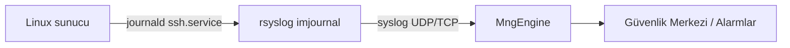

# Güvenlik Merkezi — Linux sunucularda rsyslog ile log toplama

Bu rehber, kurumunuzdaki **Linux sunucularından** MonitraNG **Güvenlik Merkezi**'ne (SIEM) oturum açma olaylarını iletmek için **rsyslog** yapılandırmasını anlatır.

Hedef kitle: **IT / sistem yöneticileri**. Son kullanıcı rehberi değildir.

> **Kapsam (pilot):** SSH üzerinden **başarısız** ve **başarılı parola** ile oturum açma satırları (`login_failed`, `login_success`).  
> **Kapsam dışı (bilinçli):** `Invalid user`, PAM ayrıntıları, oturum kapanışı, `sudo` — SIEM gürültüsünü artırır; ileride ayrı kural ile eklenebilir.

**Diğer platformlar (yakında):** Windows için NxLog / WEC, firewall için syslog — aynı wiki ağacında ayrı sayfalar olarak eklenecektir.

---

## 1. Mimari (tek cümle)

Linux sunucudaki **OpenSSH (sshd)** olayları → **rsyslog (imjournal)** → **MonitraNG MngEngine (syslog UDP/TCP)** → parse → **Güvenlik Merkezi → Olaylar** ve **Alarm Merkezi**.



| Bileşen | Kim kurar? |
|---------|------------|
| sshd log üretimi | Linux (varsayılan) |
| rsyslog forwarder | **Sizin IT ekibiniz** |
| Engine syslog dinleyicisi | MonitraNG (hosting) |
| Parser / alarm kuralları | MonitraNG (operasyonel paket) |

MonitraNG tarafında **ayrı Linux agent binary’si yoktur**. Birincil yol **rsyslog** (veya eşdeğeri syslog-ng) forwarder’dır.

---

## 2. Ön koşullar

| # | Kontrol |
|---|---------|
| 1 | Sunucuda **rsyslog** kurulu (`rsyslogd -N1` hatasız) |
| 2 | SSH ile sunucuya erişim (kurulum için sudo) |
| 3 | Linux → MonitraNG Engine arasında **syslog portu** açık (aşağıdaki tablo) |
| 4 | MonitraNG tarafında Engine syslog dinleyicisi etkin (hosting sağlayıcınız teyit eder) |

### Engine adresi ve port (örnek)

| Ortam | Engine syslog hedefi | Port | Protokol |
|-------|----------------------|------|----------|
| Pilot / lab | `MONITRA_ENGINE_HOST` (ör. `10.0.0.50`) | **5514** | UDP (pilot) |
| Üretim | `MONITRA_ENGINE_HOST` | **514** | UDP veya **TCP** (önerilir) |

`MONITRA_ENGINE_HOST` ve port değerlerini **MonitraNG proje ekibinizden** alın; her müşteri ortamında farklıdır.

---

## 3. Kurulum adımları

### 3.1 rsyslog paketini kurun

Debian / Ubuntu:

```bash
sudo apt-get update
sudo apt-get install -y rsyslog
sudo systemctl enable rsyslog
```

RHEL / AlmaLinux:

```bash
sudo dnf install -y rsyslog
sudo systemctl enable --now rsyslog
```

### 3.2 Yapılandırma dosyaları

**Debian 13+** ve systemd journal kullanan dağıtımlarda gerçek SSH satırları çoğu zaman **`auth.log` yerine journald** üzerinden gelir. Bu nedenle **iki dosya** kullanılır:

#### Dosya A — `/etc/rsyslog.d/50-monitrang-siem.conf`

Geniş `auth,authpriv.*` forward **kullanılmaz** (journal gürültüsü SIEM’i şişirir). Dosya yalnızca açıklama taşıyabilir:

```bash
sudo tee /etc/rsyslog.d/50-monitrang-siem.conf <<'EOF'
# MonitraNG Güvenlik Merkezi — genis auth forward yok.
# SSH oturum olaylari: 51-monitrang-siem-journal-sshd.conf
EOF
```

#### Dosya B — `/etc/rsyslog.d/51-monitrang-siem-journal-sshd.conf`

`MONITRA_ENGINE_HOST` ve portu kendi değerlerinizle değiştirin:

```bash
sudo tee /etc/rsyslog.d/51-monitrang-siem-journal-sshd.conf <<'EOF'
module(load="imjournal" StateFile="/var/spool/rsyslog/imjournal.state")

# Yalnizca SIEM icin anlamli sshd satirlari
if ($!_SYSTEMD_UNIT == "ssh.service" and ($!MESSAGE contains "Failed password" or $!MESSAGE contains "Accepted password")) then {
  action(type="omfwd" target="MONITRA_ENGINE_HOST" port="5514" protocol="udp")
  stop
}
EOF
```

**Üretimde TCP örneği** (UDP yerine — kayıp riski düşük):

```rsyslog
  action(type="omfwd" target="MONITRA_ENGINE_HOST" port="514" protocol="tcp"
         queue.type="LinkedList" queue.size="100000" action.resumeRetryCount="-1")
```

### 3.3 journald (öneri)

Journal’ın tüm içeriğini klasik syslog’a basmasını **kapatın**; aksi halde gereksiz satırlar oluşur:

```bash
sudo sed -i 's/^#\?ForwardToSyslog=.*/ForwardToSyslog=no/' /etc/systemd/journald.conf
sudo systemctl restart systemd-journald
```

### 3.4 Sözdizimi kontrolü ve yeniden başlatma

```bash
sudo rsyslogd -N1
sudo systemctl restart rsyslog
sudo systemctl is-active rsyslog
```

> **Önemli:** `imjournal` state dosyasını (`/var/spool/rsyslog/imjournal.state`) **silerek** rsyslog’u yeniden başlatmayın; eski journal kayıtları toplu SIEM’e aktarılabilir.

---

## 4. Ne iletilir, ne iletilmez?

| SSH journal satırı | SIEM’e gider mi? | Olay tipi |
|--------------------|------------------|-----------|
| `Failed password for …` | **Evet** | `login_failed` |
| `Accepted password for …` | **Evet** | `login_success` |
| `Invalid user …` | Hayır | — |
| `pam_unix … authentication failure` | Hayır | — |
| `Connection reset / closed …` | Hayır | — |
| `session opened / closed for user` | Hayır | — |

**Pratik kural:** 1 hatalı SSH parolası ≈ **1 güvenlik olayı** (`login_failed`). Onlarca bin `unknown` kayıt **normal değildir** — filtre veya geniş auth forward hatasına işaret eder.

---

## 5. Doğrulama

### 5.1 Sunucu tarafı (IT)

Kontrollü test — bilerek **yanlış parola** (gerçek sshd logu):

```bash
ssh -o PreferredAuthentications=password -o PubkeyAuthentication=no \
    -o NumberOfPasswordPrompts=1 -o StrictHostKeyChecking=accept-new \
    siem_test@SUNUCU_IP
```

Journal’da satır:

```bash
sudo journalctl -u ssh --since "5 min ago" | grep -i "Failed password"
```

### 5.2 MonitraNG UI

1. **Güvenlik Merkezi → Olaylar**
2. Filtre: `eventAction = login_failed`, `sourceProduct = linux-syslog`
3. Beklenen alanlar: `sourceHost` (sunucu adı), `actorUser`, `networkSrcIp` (istemci IP)

Alarm (U1 brute force) yalnızca **5 dakikada 10+ aynı kullanıcı/IP fail** ile tetiklenir; tek deneme alarm üretmez.

---

## 6. Çok sunucu / relay

| Senaryo | Öneri |
|---------|--------|
| 1–20 sunucu | Her sunucuda `51-monitrang-siem-journal-sshd.conf`, hedef aynı Engine |
| 50+ sunucu | Merkezi **rsyslog relay** → tek TCP bağlantısı Engine’e |
| Farklı site / VLAN | Relay veya site başına Engine (MonitraNG mimarisine göre) |

Relay sunucusunda hostname (`source.host`) syslog satırında korunmalıdır.

---

## 7. Sorun giderme

| Belirti | Olası neden | Çözüm |
|---------|-------------|--------|
| Olay hiç gelmiyor | Firewall / yanlış Engine IP-port | `nc -u -vz MONITRA_ENGINE_HOST 5514` veya IT firewall kuralı |
| Binlerce `unknown` olay | Geniş `auth,authpriv.*` forward veya `ForwardToSyslog=yes` | Bölüm 3.2–3.3’e dönün |
| Olay geliyor ama `unknown` | Eski Engine sürümü | MonitraNG’ten `sshd-session` destekli sürüm teyidi |
| Tek fail, çok kayıt | Eski filtre (`Invalid user` dahil) | Yalnızca Failed/Accepted password filtresi |
| U1 alarm yok | Eşik (10 fail / 5 dk) | Beklenen; test için kontrollü 10 deneme |

---

## 8. MonitraNG operasyon scriptleri (referans)

Kurulum otomasyonu (MonitraNG proje ekibi / yetkili ortam):

```powershell
# Dry-run
.\scripts\odak\install-rsyslog-siem-odak.ps1

# Uygula (test + prod host listesi script icinde)
.\scripts\odak\install-rsyslog-siem-odak.ps1 -Apply
```

Lab verisi temizliği (yalnızca test ortamı):

```powershell
.\scripts\odak\reset-siem-lab-data.ps1 -Apply
```

---

## 9. Sırada ne var?

| Konu | Durum |
|------|--------|
| Linux rsyslog (bu sayfa) | ✅ Pilot |
| Windows NxLog / WEC | Wiki sayfası planlanıyor |
| FortiGate / firewall syslog | Wiki sayfası planlanıyor |
| `sec_events` saklama süresi (retention) | Ürün / sözleşme kararı |

---

## 10. İlgili MonitraNG kavramları

| UI | Açıklama |
|----|----------|
| Güvenlik Merkezi → Olaylar | Parse edilmiş `sec_events` |
| Alarm Merkezi | U1–U7 operasyonel kurallar (`siem-mvp-v1`) |
| Log kapsamı rehberi (panel içi) | Hangi kaynakların desteklendiği — salt okunur |

Sorularınız için MonitraNG destek / proje ekibinize `MONITRA_ENGINE_HOST`, domain adı ve örnek sunucu hostname listesi ile başvurun.
