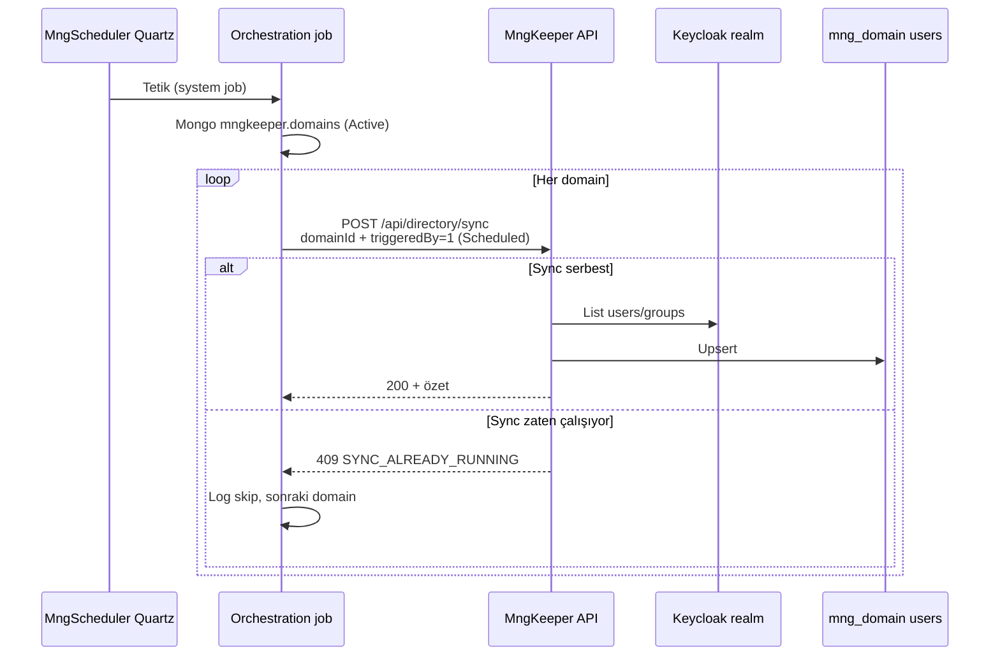

# Periyodik directory sync — MngScheduler + MngKeeper (karar)

**Son güncelleme:** 23 Mayıs 2026  
**Durum:** ✅ Uygulandı ve Odak sunucuda doğrulandı (`192.168.20.20`)  
**İlişki:** [IMPLEMENTATION_PLAN.md](./IMPLEMENTATION_PLAN.md) (K2, §5.4), [DEVAM.md](./DEVAM.md), [HANDOFF_MNGSCHEDULER.md](./HANDOFF_MNGSCHEDULER.md)

---

## 1. Problem

| Konu | Açıklama |
|------|----------|
| Çok kiracı | Sistemde birden fazla **domain** (Keycloak realm + `mng_{domain}`) olabilir |
| Keeper statik job tutamaz | MngKeeper içine `appsettings` veya tek Quartz job ile “hangi domain’ler var?” tanımlanamaz — liste **zamanla değişir** |
| Sync kodu Keeper’da kalmalı | KC → Mongo pipeline, coordinator, domain `directoryPrivileges` → **MngKeeper** sorumluluğu |
| Zamanlama platformda | Periyodik tetikleme, tıpkı **MngAdmin backup** gibi → **MngScheduler** |

**Sonuç:** Periyodik directory sync için **Quartz MngKeeper’da değil**, **MngScheduler’da** (system job).

---

## 2. Onaylanan mimari

### 2.1 Rol ayrımı (MngAdmin backup ile aynı desen)

| Katman | Servis | Sorumluluk |
|--------|--------|------------|
| **Zamanlama** | **MngScheduler** | Cron; domain listesini **çalışma anında** alır; her domain için Keeper sync **tetikler** |
| **İş + kilitleme** | **MngKeeper** | K2 pipeline, `IDirectorySyncCoordinator`, 409/ skip kuralları (**§5.4**) |
| **Kimlik kaynağı** | Keycloak + AD | K1 federation (realm = domain) |



### 2.2 Neden tek URL’li HttpJob yetmez?

Mevcut **HttpJob** yalnızca **tek** `endpointUrl` çağırır (backup örneği: bir POST → `MngAdmin`).

Directory sync için **N domain** → **N Keeper çağrısı** gerekir. Bu yüzden K3’te:

| Seçenek | Açıklama | Öneri |
|---------|----------|--------|
| **A** | MngScheduler’da **özel orchestration** (hosted handler veya özel Quartz job): Keeper’dan domain listesi + döngüde POST | ✅ **Önerilen** |
| **B** | Tek HttpJob → MngKeeper `POST /api/directory/sync/run-all` (liste Keeper içinde) | Mümkün; fakat domain keşfi Keeper’da kalır — zamanlama yine Scheduler’da, keşif Keeper’da |
| **C** | Domain başına ayrı system job (Mongo `@scheduled_jobs`) | Ölçeklenmez; yeni domain’de manuel job eklemek gerekir ❌ |

**Karar:** **A** — keşif ve döngü **MngScheduler orchestration** kodunda; Keeper yalnızca domain başına sync **yürütür**.

*(B isteğe bağlı kısayol endpoint olarak eklenebilir; asıl desen A.)*

---

## 3. MngKeeper (K2 — değişmeyen çekirdek)

### 3.1 Endpoint (öneri)

| Method | Path | Açıklama |
|--------|------|----------|
| `POST` | `/api/directory/sync` veya `/api/sync/keycloak` | Tek domain tam sync (JWT veya **system** kimliği) |
| Query/body | `domainId` veya `realmName` | Hangi tenant |
| Body alanı | `triggeredBy` | `Manual` \| `Scheduled` |

**Yetki:**

- **Manuel (UI/admin):** Domain admin JWT.
- **Scheduler:** Service account / system token veya dahili network + `X-Triggered-By: Scheduled` (netleştirilecek — gateway veya Keeper system client).

### 3.2 Coordinator (§5.4 — aynı)

| Durum | Davranış |
|--------|----------|
| Aynı domain’de sync **çalışıyorken** yeni istek (`Manual` veya `Scheduled`) | **409** `SYNC_ALREADY_RUNNING` |
| **Scheduled** tetik, domain meşgul | Scheduler: **409’u hata sayma**; log `skipped`; **sonraki domain** |
| **Manuel** tetik, domain meşgul | UI/API: 409 + Türkçe mesaj |
| Domain’ler arası | **Bağımsız kilit** — `domainA` sync sürerken `domainB` başlayabilir |

### 3.3 MngKeeper’da yapılmayanlar

- ❌ Quartz / `IHostedService` ile periyodik directory sync
- ❌ `appsettings` içinde sabit domain listesi (yalnızca opsiyonel **hariç tutma** listesi olabilir)

---

## 4. MngScheduler (K3)

### 4.1 System job tanımı

| Alan | Örnek |
|------|--------|
| Saklama | `mngkeeper` → `@scheduled_jobs` |
| `jobId` | `system-directory-sync-all-domains` |
| `jobType` | System |
| `cronExpression` | `0 0/30 * * * ?` (30 dk — yapılandırılabilir) |
| `isActive` | true |

**Uygulama:** `endpointUrl` = `orchestration://directory-sync` → `JobSyncService` `DirectorySyncOrchestrationJob` seçer (HttpJob değil).

### 4.2 Orchestration akışı (uygulanan)

```
1. DomainLookupService → mngkeeper.domains, status Active (string veya int 1)
2. foreach domain:
     POST {MngKeeper}/api/directory/sync
       body: { "domainId": "<realm>", "triggeredBy": 1 }
     if 409 → log skip, continue
     if 2xx → log summary (usersUpdated, …)
     if 5xx → log Error, continue (ContinueOnDomainError)
3. JobExecution + RabbitMQ (mevcut pattern)
```

**Cron (üretim):** `0 0/30 * * * ?` — `@scheduled_jobs.cronExpression`.  
**Dikkat:** `0/30 * * * * ?` Quartz’ta 30 **saniye**dir; 30 **dakika** için dakika alanı kullanılır.

**Yapılandırma:** `MngSchedulerSettings:DirectorySyncOrchestration` + `Actors:MngKeeper` (container: `http://mngkeeper:5001`).  
**JobSync:** `SyncUserJobs=false` — user job DataGateway okuması service JWT olmadan yapılmaz (401 gürültüsü önlendi).

### 4.3 Domain filtreleme

| Filtre | Kaynak |
|--------|--------|
| `status == Active` | `mng_keeper.domains` |
| `directorySync.enabled` (ileride) | `domain.settings` |
| Realm’de LDAP federation yok | Sync boş döner veya skip — opsiyonel ön kontrol |

İlk sürüm: **tüm Active domain’ler** veya yalnızca `settings.directorySync.enabled == true` olanlar (deploy sonrası tek alan eklenir).

### 4.4 Geliştirme paketi (K3) — durum

| Kod | Bileşen | Durum |
|-----|---------|--------|
| K3a | `IDirectorySyncOrchestrationService` | ✅ |
| K3b | `MngKeeperDirectorySyncClient` | ✅ |
| K3c | `DirectorySyncOrchestrationJob` + `JobSyncService` job tipi seçimi | ✅ |
| K3d | Seed: `scripts/tests/MngScheduler/system-directory-sync-all-domains.job.json` | ✅ |
| K3e | Sunucu: odak domain sync; 409 skip (manuel test) | ✅ / opsiyonel çok domain |

---

## 5. appsettings (taslak)

**MngKeeper** — yalnızca sync davranışı (cron **yok**):

```json
{
  "DirectorySync": {
    "TriggerKeycloakLdapSync": false,
    "StaleUserPolicy": "DisableInMongo"
  }
}
```

**MngScheduler** — orchestration:

```json
{
  "DirectorySyncOrchestration": {
    "Enabled": true,
    "MngKeeperBaseUrl": "http://mngkeeper:5001",
    "CronExpression": "0 0/30 * * * ?",
    "OnlyLdapEnabledDomains": true,
    "ContinueOnDomainError": true
  }
}
```

Cron asıl kaynağı: `@scheduled_jobs` dokümanı **veya** yukarıdaki config (tek doğruluk kaynağı netleştirilecek — öneri: **Mongo job cron** + orchestration handler).

---

## 6. Test senaryoları (ek)

| # | Senaryo |
|---|---------|
| T21 | Scheduler job → 2 Active domain → her ikisi için Keeper POST |
| T22 | Domain A sync sürerken Scheduler A’ya 409, B başarılı |
| T23 | Yeni domain eklendi → sonraki cron’da otomatik sync listesinde |
| T24 | Manuel + Scheduled aynı domain → §5.4 |

---

## 7. Onaylanan kararlar özeti

| # | Karar |
|---|--------|
| 1 | Periyodik tam directory sync **MngScheduler**’da |
| 2 | Sync **implementasyonu** ve **domain kilidi** **MngKeeper**’da (K2) |
| 3 | Scheduler **runtime** domain listesi alır (`GET /api/domain`) |
| 4 | Domain başına bir POST; 409 → skip, diğer domain’lere devam |
| 5 | MngKeeper içinde Quartz directory sync **yok** |
| 6 | Desen = MngAdmin backup (Scheduler tetikler, uzman servis işler) |

---

## 8. İlgili kod / doküman (referans)

| Kaynak | Not |
|--------|-----|
| `MngScheduler` — `DirectorySyncOrchestrationJob`, `DomainLookupService` | K3 uygulama |
| `MngScheduler` — `JobSyncService`, `HttpJob` | Backup benzeri altyapı |
| `MngScheduler` — `SystemJobRepository` | `@scheduled_jobs` |
| `MngKeeper` — `LicenseValidationBackgroundService` | Günlük job örneği (directory sync için **kullanılmayacak**) |
| [MngScheduler ROADMAP_LEGACY § system-backup-job](../content/MngScheduler/support/guides/ROADMAP_LEGACY.md) | Backup job örneği |
