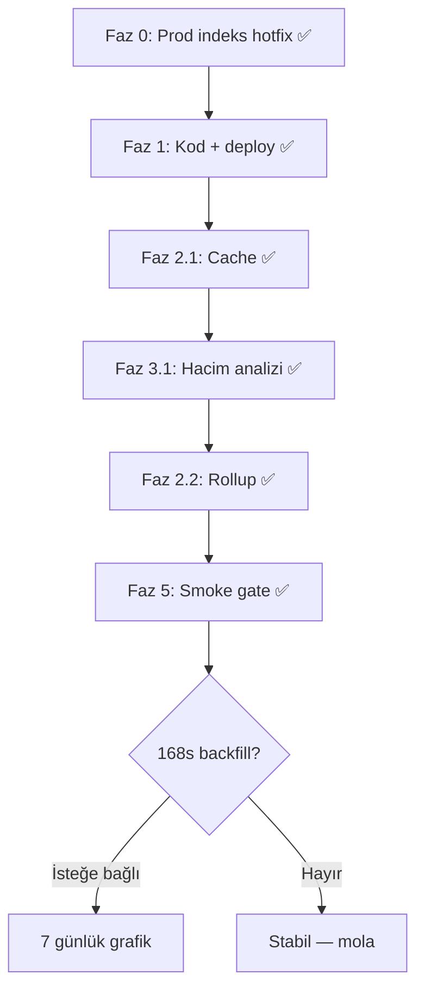

# SIEM Güvenlik Paneli — Performans Planı

**Durum:** ✅ Faz 0–2 + Faz 3.1 analiz + Faz 5 smoke · Prod stabil (~0,18 sn)  
**Son güncelleme:** 7 Temmuz 2026  
**İlişki:**
- [SIEM_DASHBOARD.md](./SIEM_DASHBOARD.md) — panel MVP, API, production nginx
- [SIEM_PERFORMANCE_PLAN.md](./SIEM_PERFORMANCE_PLAN.md) — genel SIEM throughput/SLO çerçevesi
- [SIEM_THROUGHPUT_AND_QUEUES.md](./SIEM_THROUGHPUT_AND_QUEUES.md) — edge kuyruk, hacim düşürme

---

## 1. Özet

Production (`192.168.20.8`, `mng.odaksavunma.com`) ortamında **SIEM Güvenlik Paneli** (`/apps/siem-center`) açılıyor ancak veri yüklenmiyordu. Kök neden: `GET /api/reactor/v1/sec-events/dashboard-summary` isteğinin **~50+ saniye** sürmesi ve **nginx upstream timeout → 504**.

**Acil hotfix (6 Tem 2026):** MongoDB `mng_odak.sec_events` üzerinde `ingestedAt` indeksleri → **~52 sn → ~5 sn**.

**Kalıcı çözüm (7 Tem 2026):** Faz 1–2 prod deploy + saatlik rollup → **~0,18 sn** (1. istek), cache ile **~0,07 sn**.

| Aşama | Gateway `dashboard-summary` (24s) |
|-------|-----------------------------------|
| Hotfix öncesi | ~52 sn → 504 |
| Faz 0 indeks | ~5 sn |
| Faz 2.1 cache (2. istek) | ~0,04 sn |
| Faz 2.2 rollup (1. istek) | **~0,18 sn** |
| Smoke cold / warm | **0,09 sn / 0,01 sn** |

---

## 2. Production olay teşhisi (6 Tem 2026)

### 2.1 Belirtiler

| Belirti | Kanıt |
|---------|--------|
| Panel spinner / yükleme hatası | Tarayıcı: `mng.odaksavunma.com/apps/siem-center` |
| nginx 504 | `docker logs mngui`: `upstream timed out while reading response header` |
| Endpoint yavaş | Gateway: `dashboard-summary` ~52 sn (30 sn client timeout) |

### 2.2 Ortam metrikleri (prod)

| Metrik | Değer (6 Tem) | Değer (7 Tem — güncel) |
|--------|---------------|------------------------|
| Host | `192.168.20.8` | aynı |
| Koleksiyon | `mng_odak.sec_events` | aynı |
| Toplam kayıt | ~3,45 milyon | ~3,45M+ |
| Son 24 saat olay | ~935 bin | **~955 bin** |
| 24s dağılım (özet) | denied ~643K · allowed ~252K | **denied ~660K · allowed ~254K** |

### 2.3 Kök neden zinciri

```text
Yüksek SIEM hacmi (FortiGate allow+d deny log)
    → Mongo aggregation dashboard-summary
    → Pipeline ingestedAt üzerinde filtre
    → İndeksler yalnızca @timestamp üzerinde
    → COLLSCAN (~3,4M doküman)
    → İstek 50+ sn
    → nginx 504
    → Panel yüklenmiyor
```

**Mongo explain (hotfix öncesi):** `totalDocsExamined: 3.453.934`, `$match` aşaması ~16,7 sn (sadeleştirilmiş pipeline).

### 2.4 Sağlam olan bileşenler

| Kontrol | Sonuç |
|---------|--------|
| `mngui`, `mngreactor`, `mngalarm` | healthy |
| nginx `/api/reactor/` proxy | yapılandırılmış |
| `/apps/siem-center` SPA | 200 |
| `@dashboards` slug=`siem-center` | OK |
| `siem.*` widget şablonları (6) | OK |
| Side menu SIEM girişleri | OK |
| `alarm/dashboard-snapshot` | ~200, hızlı |
| `sec-events?limit=3` | ~200, hızlı |

---

## 3. Faz 0 — Acil hotfix ✅

| # | Tedbir | Konum | Durum |
|---|--------|-------|--------|
| 0.1 | `idx_ingestedAt_desc` `{ ingestedAt: -1 }` | Prod Mongo | ✅ |
| 0.2 | `idx_ingestedAt_eventAction` `{ ingestedAt: -1, event.action: 1 }` | Prod Mongo | ✅ |
| 0.3 | Hotfix script | `scripts/odak/hotfix-prod-sec-events-ingestedat-index.ps1` | ✅ |

**Doğrulama (hotfix sonrası):**

| Endpoint | Önce | Sonra |
|----------|------|-------|
| Gateway `dashboard-summary` | ~52 sn → timeout/504 | **~4,95 sn → 200** |
| UI proxy `dashboard-summary` | 504 | **~4,39 sn → 200** |

```powershell
pwsh -File .\scripts\odak\hotfix-prod-sec-events-ingestedat-index.ps1
```

---

## 4. Faz 1 — Hızlı kazanç ✅

**Ana servis:** MngReactor · **Yan:** Mng.Ui  
**Durum (7 Tem 2026):** ✅ kod + prod deploy (`mngreactor` + `mngui`)

| # | Tedbir | Servis | Öncelik | Durum |
|---|--------|--------|---------|--------|
| 1.1 | `EnsureIndexesOnceAsync` → `ingestedAt` indeksleri (kod) | **MngReactor** | P0 | ✅ prod |
| 1.2 | UI: tek `dashboard-summary` — service-level dedup + inflight | **Mng.Ui** | P0 | ✅ prod |
| 1.3 | nginx `proxy_read_timeout 120s` → `/api/reactor/` | **Mng.Ui** | P1 | ✅ prod |
| 1.4 | Aggregation `$project` slim + facet optimize | **MngReactor** | P1 | ✅ prod |

### 4.1 Kod konumları (Faz 1.1)

| Dosya | Değişiklik |
|-------|------------|
| `MngReactor/.../SecEventsRepository.cs` | `EnsureIndexesOnceAsync` — `ingestedAt` indeksleri |
| `MngReactor/.../SecEventDashboardAggregator.cs` | `DashboardTimeField = "ingestedAt"` (referans sabit) |

### 4.2 UI tekrarlayan çağrı (Faz 1.2)

Production statik deploy’da tek sayfa yüklemesinde **4×** `dashboard-summary`:

```text
fetchSiemDashboardPayload()           → dashboard-summary (1×)
useSiemCenterTemplateBatch():
  siem.events-total-stat              → dashboard-summary (2×)
  siem.login-failed-stat              → dashboard-summary (3×)
  siem.events-hourly-trend            → dashboard-summary (4×)
```

**Uygulandı:** `secEventService.ts` ve `alarmService.ts` içinde **TTL + inflight dedup** (60 sn); widget batch ile `fetchSiemDashboardPayload` aynı HTTP isteğini paylaşır.

| Dosya | Rol |
|-------|-----|
| `Mng.Ui/services/secEventService.ts` | `secEventDashboardSummary` dedup + `invalidateSecEventDashboardSummaryCache` |
| `Mng.Ui/services/alarmService.ts` | `alarmDashboardSnapshot` dedup |
| `Mng.Ui/composables/useSiemDashboardData.ts` | Üst seviye payload cache + invalidation |

---

## 5. Faz 2 — Orta vadeli backend ✅

**Ana servis:** MngReactor · **Durum:** ✅ prod deploy (7 Tem 2026)

| # | Tedbir | Öncelik | Durum | Prod sonuç |
|---|--------|---------|--------|------------|
| 2.1 | Sunucu cache (`IMemoryCache`, TTL 60 sn) | P1 | ✅ prod | 2. istek ~0,07 sn |
| 2.2 | Saatlik rollup (`sec_events_hourly_rollup`) | P2 | ✅ prod (24s backfill) | 1. istek **~0,18 sn** |
| 2.3 | `@timestamp` vs `ingestedAt` — query filtresi | P1 | ✅ kod + prod | Panel ↔ arama uyumlu |
| 2.4 | `QueryAsync` → tek `$facet` aggregation | P2 | ✅ kod + prod | Tek round-trip |

### 5.1 Rollup koleksiyonu (Faz 2.2)

**Koleksiyon:** `sec_events_hourly_rollup`  
**Zaman alanı:** `ingestedAt` (dashboard ile aynı — `DashboardTimeField`)

| Alan | Açıklama |
|------|----------|
| `_id` | `{domain}|{hourStart:O}` |
| `domain` | Normalize domain |
| `hourStart` | Saat UTC (truncated) |
| `byAction` | `{ denied_flow: N, ... }` |
| `eventsTotal` | Saatlik toplam |
| `newFlowCount` | U7 baseline |
| `updatedAt` | Son güncelleme |

**Yazım:** `InsertManyAsync` sonrası `$inc` upsert (`SecEventHourlyRollupStore.IncrementFromDocumentsAsync`).  
**Okuma:** `GetDashboardSummaryAsync` önce rollup dener; veri yoksa aggregation fallback.  
**Ayar:** `SecEventsSettings.UseDashboardHourlyRollup` (default `true`).

```powershell
# 24s backfill (prod — yapıldı)
pwsh -File .\scripts\odak\backfill-sec-events-hourly-rollup.ps1 -RangeHours 24

# 7 günlük grafik için (isteğe bağlı)
pwsh -File .\scripts\odak\backfill-sec-events-hourly-rollup.ps1 -RangeHours 168
```

### 5.2 Kod konumları (Faz 2)

| Dosya | Rol |
|-------|-----|
| `SecEventHourlyRollupStore.cs` | Rollup yazım + okuma |
| `SecEventsRepository.cs` | Cache, rollup entegrasyonu, facet query |
| `SecEventQueryFilterBuilder.cs` | Zaman filtresi → `ingestedAt` |
| `SecEventsSettings.cs` | `DashboardSummaryCacheSeconds`, `UseDashboardHourlyRollup` |
| `AppBootstrapper.cs` | `AddMemoryCache()` |

---

## 6. Faz 3 — Hacim düşürme (operasyon + MngEngine)

| # | Tedbir | Sahip | Durum | Not |
|---|--------|-------|--------|-----|
| 3.1 | FortiGate **deny-only** analiz + IT checklist | Müşteri IT | ✅ analiz | Acil değil (7 Tem) |
| 3.2 | MngEngine edge filtresi (deny + config change) | MngEngine | ⏳ | — |
| 3.3 | `HotTtlDays` gözden geçir (60 → 30?) | MngReactor config | ⏳ | — |
| 3.4 | `PersistFullRaw=false`, `rawPreview` limit | MngReactor | ✅ default | Zaten kapalı |

**Prod analiz (7 Tem 2026, 24s):** ~955K olay · `denied_flow` 660K > `allowed_flow` 254K → deny-only **acil değil**; IT checklist paylaşılabilir.

```powershell
pwsh -File .\scripts\odak\analyze-prod-sec-events-volume.ps1 -RangeHours 24
pwsh -File .\scripts\odak\fortigate-deny-only-it-checklist.ps1
```

---

## 7. Faz 4 — UI / gateway (2–3 gün)

| # | Tedbir | Servis | Durum |
|---|--------|--------|--------|
| 4.1 | Prod widget batch: serviceRef dedup veya nginx BFF proxy | Mng.Ui | ⏳ (Faz 1.2 kısmen karşıladı) |
| 4.2 | Client cache TTL (60 → 90 sn, silent refresh korunur) | Mng.Ui | ⏳ |
| 4.3 | Partial render (alarm snapshot gelince alarm kartları) | Mng.Ui | ⏳ |
| 4.4 | Dış reverse proxy timeout (`mng.odaksavunma.com`) | Ops / IT | ⏳ |

---

## 8. Faz 5 — Gözlem ve quality gates

| # | Tedbir | Konum | Durum |
|---|--------|-------|--------|
| 5.1 | `dashboard-summary` P95 metriği | MngReactor | ⏳ |
| 5.2 | Mongo slow query log | Ops | ⏳ |
| 5.3 | Smoke: `dashboard-summary < 3s` | `scripts/tests/MngReactor/siem/dashboard-summary-smoke.ps1` | ✅ PASS |
| 5.4 | Benchmark JSON | `docs/odak/monitoring/benchmarks/` | ⏳ |

**Doğrulama scriptleri:**

```powershell
pwsh -File .\scripts\odak\verify-prod-siem-dashboard.ps1
pwsh -File .\scripts\tests\MngReactor\siem\dashboard-summary-smoke.ps1
```

**Hedef SLO (panel):**

| SLI | Hedef | Prod (7 Tem) |
|-----|-------|--------------|
| `dashboard-summary` P95 | < 3 sn @ 24s | ✅ ~0,18 sn |
| UI panel tam yüklenme | < 5 sn | ✅ |
| 504 oranı | 0 | ✅ |

---

## 9. Faz 6 — Ölçek (P2+ hacim)

| # | Tedbir | Ne zaman |
|---|--------|----------|
| 6.1 | MngReactor horizontal scale-out | Ingest CPU sınırı |
| 6.2 | rsyslog relay + rate limit | Edge burst |
| 6.3 | OpenSearch arama tier | UI sorgu P95 > 3s + P2 envanter |
| 6.4 | Ingest → RabbitMQ → worker | [SIEM_THROUGHPUT §4.1](./SIEM_THROUGHPUT_AND_QUEUES.md) |

---

## 10. Uygulama sırası



| Sprint | İş paketi | Sonuç |
|--------|-----------|--------|
| **6 Tem** | Faz 0 hotfix | ~52 sn → ~5 sn |
| **7 Tem** | Faz 1 + 2.1 deploy | ~4 sn → cache ~40 ms |
| **7 Tem** | Faz 2.2 rollup + 2.3/2.4 | **~0,18 sn** |
| **Sonraki oturum** | 168s backfill · Faz 4 UI · metrik | — |

---

## 11. Servis bazında özet

| Servis | Durum |
|--------|--------|
| **MngReactor** | ✅ Indeks, cache, rollup, query fix — prod |
| **Mng.Ui** | ✅ Dedup cache, nginx timeout — prod |
| **MngEngine** | ⏳ Edge filtre (Faz 3.2) |
| **MngAlarm** | ✅ Değişiklik gerekmedi |
| **Ops / IT** | ⏳ FortiGate policy (acil değil) · dış proxy timeout |

---

## 12. Açık kararlar

| # | Konu | Durum |
|---|------|--------|
| K1 | Faz 1.2 UI payload paylaşımı | ✅ Kapandı |
| K2 | Faz 2.2 rollup koleksiyonu | ✅ Uygulandı |
| K3 | FortiGate allow log | IT bilgilendirme — acil değil (deny ağırlıklı) |
| K4 | TTL alanı | Query `ingestedAt` ✅ · TTL hâlâ `@timestamp` (bilinçli) |
| K5 | 168s rollup backfill | İsteğe bağlı — 7 günlük trend için |

---

## 13. Referanslar (kod + script)

| Katman | Dosya |
|--------|--------|
| Aggregation | `MngReactor/.../SecEventDashboardAggregator.cs` |
| Rollup | `MngReactor/.../SecEventHourlyRollupStore.cs` |
| Repository + indeks | `MngReactor/.../SecEventsRepository.cs` |
| Query filter | `MngReactor/.../SecEventQueryFilterBuilder.cs` |
| Settings | `MngReactor/.../SecEventsSettings.cs` |
| API | `MngReactor/.../SecEventsController.cs` |
| UI dashboard | `Mng.Ui/components/apps/siem-center/AcSiemCenterDashboard.vue` |
| UI data fetch | `Mng.Ui/composables/useSiemDashboardData.ts` |
| nginx | `Mng.Ui/nginx.conf` → `location /api/reactor/` |
| Hotfix script | `scripts/odak/hotfix-prod-sec-events-ingestedat-index.ps1` |
| Rollup backfill | `scripts/odak/backfill-sec-events-hourly-rollup.ps1` |
| Prod verify | `scripts/odak/verify-prod-siem-dashboard.ps1` |
| Hacim analizi | `scripts/odak/analyze-prod-sec-events-volume.ps1` |
| Smoke gate | `scripts/tests/MngReactor/siem/dashboard-summary-smoke.ps1` |

---

## 14. Yeni chat devam promptu

Aşağıdaki blok yeni bir chat oturumunda kopyalanabilir.

```markdown
# MonitraNG — SIEM Güvenlik Paneli performans (devam)

Yanıtlar **Türkçe**. Commit/push yalnızca açıkça istediğimde.

## Bağlam
- **Ana plan:** docs/odak/monitoring/SIEM_DASHBOARD_PERFORMANCE_PLAN.md
- **Panel MVP:** docs/odak/monitoring/SIEM_DASHBOARD.md
- **Prod erişim:** docs/odak/proddeploy/SERVER_ACCESS.md

## Durum (7 Tem 2026 — mola)
- ✅ Faz 0–2 prod: panel ~52sn → **~0,18sn** (rollup + cache)
- ✅ Faz 3.1 hacim analizi: deny > allow, FortiGate deny-only acil değil
- ✅ Faz 5 smoke gate PASS
- **24s rollup backfill** yapıldı · **168s backfill** isteğe bağlı

## Prod metrikleri
- Host: 192.168.20.8 · mng.odaksavunma.com
- sec_events: ~3.45M · 24s ~955K olay
- dashboard-summary: cold ~0,18s · warm cache ~0,07s

## Sıradaki (isteğe bağlı)
1. 168s rollup backfill (7 günlük grafik)
2. Faz 4 UI iyileştirmeleri (partial render, cache TTL)
3. Faz 5.1 P95 metriği (MngReactor)
4. Faz 3.2 MngEngine edge filtresi

## Bu oturumda ne yapmak istiyorum?
[Buraya yaz]
```
