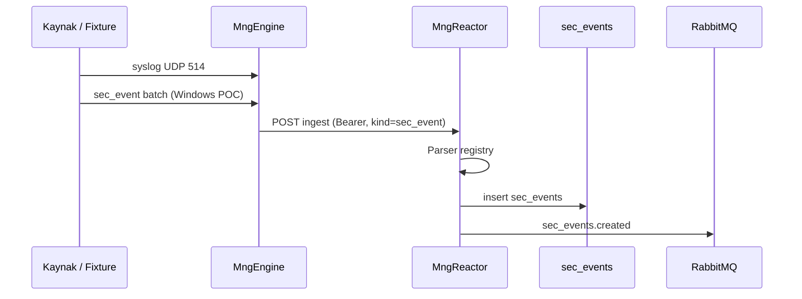

# SIEM — Faz 1 Teknik Spike Planı

**Durum:** MonitraNG fixture hazır — implementasyon MngEngine/MngReactor repolarında  
**Handoff:** [SIEM_FAZ1_HANDOFF.md](./SIEM_FAZ1_HANDOFF.md)
**Son güncelleme:** 3 Haziran 2026
**Bağımlılık:** [SIEM_PLANNING.md](./SIEM_PLANNING.md) Faz 1, [SIEM_PARSER_PLAN.md](./SIEM_PARSER_PLAN.md)

**Hedef:** Uçtan uca **tek domain** ortamında: ham log → Engine → Reactor → `sec_events` → (opsiyonel) RabbitMQ publish. **Alarm engine ve Workflow Faz 1 spike dışında** (Faz 2 / workflow chat sonrası).

---

## 1. Spike kapsamı (in / out)

| In (Faz 1 spike) | Out (sonraki faz) |
|------------------|-------------------|
| Engine syslog UDP/TCP listener (:514) | WEC production GPO |
| Engine → Reactor `sec_event` batch ingest | Alarm correlation (U1) |
| Reactor P0 parser: `firewall.generic_syslog.v1` | Workflow onaylı blok |
| Reactor P0 parser: `windows.security.v1` (fixture veya agent POC) | Güvenlik UI paneli |
| `sec_events` Mongo yazımı + indeksler | MITRE metadata |
| RabbitMQ `sec_events.created` (minimal) | Firewall vendor-specific parser |
| Parser unit test + 2–3 fixture | Linux auth parser (P1) |
| Manuel/query ile olay doğrulama | OpenSearch |

---

## 2. Mimari (spike)



---

## 3. Bileşen görevleri

### 3.1 MngEngine

| Görev | Kabul kriteri |
|-------|----------------|
| Syslog listener (UDP; TCP opsiyonel) | 514 dinler; mesajı internal queue'ya alır |
| Syslog → batch öğesi | `source.type`, `source.product`, `source.host`, `raw.message`, `receivedAt` |
| Periyodik veya eşik bazlı batch gönderim | Mevcut ingest schedule ile uyumlu |
| Windows POC yolu | **Spike A:** WEC'den okuma **veya** **Spike B:** statik JSON fixture dosyası ingest (WEC olmadan parser testi) |

**Spike kararı (§8):** Lab'de WEC yoksa önce **B** (fixture push); Odak'ta WEC varsa **A** eklenir.

### 3.2 MngReactor

| Görev | Kabul kriteri |
|-------|----------------|
| Ingest: `kind=sec_event` ayırımı | Metrik batch ile aynı auth/şifreleme; ayrı işlem yolu |
| `ISecEventParser` registry | SIEM_PARSER_PLAN §4 |
| P0 parser implementasyonu | `windows.security.v1`, `firewall.generic_syslog.v1` |
| Parse fail fallback | `event.action=unknown`, `raw` dolu, ingest başarılı |
| Mongo `sec_events` insert | SIEM §4 alanları + `parser.id`, `ingestedAt` |
| İndeksler | `@timestamp`, `source.type`, `event.action`, `network.srcIp` |
| MQ publish | Alarm engine tüketimi için minimal event body |

### 3.3 MngDataGateway (opsiyonel spike sonu)

| Görev | Kabul kriteri |
|-------|----------------|
| `sec_events` dataset tanımı | Sadece okuma / admin sorgu (Faz 1 sonu veya Faz 2 başı) |

---

## 4. Ingest sözleşmesi (taslak)

**Öneri (spike için karar):** Mevcut Engine ingest endpoint'ine batch item discriminator:

```json
{
  "engineId": "...",
  "domain": "odak",
  "items": [
    {
      "kind": "sec_event",
      "receivedAt": "2026-06-03T14:00:00Z",
      "source": {
        "type": "firewall",
        "product": "generic-syslog",
        "host": "fw-dmz-01"
      },
      "raw": "2026-06-03T14:00:01 fw01 kernel: DENY IN=eth0 SRC=203.0.113.5 DST=10.0.0.10 PROTO=TCP DPT=445"
    },
    {
      "kind": "sec_event",
      "receivedAt": "2026-06-03T14:00:02Z",
      "source": {
        "type": "ad",
        "product": "windows",
        "host": "DC01.odak.local"
      },
      "raw": {
        "EventID": 4625,
        "TimeCreated": "2026-06-03T14:00:02Z",
        "TargetUserName": "admin",
        "IpAddress": "192.168.1.50",
        "Status": "0xC000006D"
      }
    }
  ]
}
```

Spike sonunda §21.11 **kapatılır** (ayrı endpoint gerekmezse).

---

## 5. Test fixture’ları

Konum: `tests/fixtures/siem/` (MonitraNG repo) — MngReactor unit testlerine kopyalanır.

| Dosya | Parser | Senaryo |
|-------|--------|---------|
| `firewall_deny.syslog.txt` | `firewall.generic_syslog.v1` | U4 — deny flow |
| `windows_4625_failed_logon.json` | `windows.security.v1` | U1 — failed logon |

| `windows_4624_success_logon.json` | `windows.security.v1` | U2 success logon |
| `unparseable_01.txt` | fallback | S4 unknown action |

**Alarm kural taslağı:** `tests/fixtures/siem/alarm_rules/` (U1/U2/U4)

**İleride eklenecek (backlog):**

| Dosya | Parser | Senaryo |
|-------|--------|---------|
| `firewall-deny-02.txt` | generic | Farklı syslog formatı |

**Odak/müşteri logları** geldikçe anonim kopyalar fixture'a eklenir.

**Beklenen parse alanları:** [SIEM_FAZ1_HANDOFF.md §Fixture](./SIEM_FAZ1_HANDOFF.md)

---

## 6. Spike doğrulama senaryoları

| # | Adım | Beklenen |
|---|------|----------|
| S1 | `logger` veya netcat ile Engine'e syslog gönder | Batch Reactor'a gider |
| S2 | Reactor ingest | `sec_events` belgesi; `event.action=denied_flow`, src/dst IP dolu |
| S3 | Windows 4625 fixture ingest | `login_failed`, `actor.user`, `network.srcIp` |
| S4 | Bilinmeyen format | Kayıt var, `event.action=unknown`, `raw` korunmuş |
| S5 | Mongo sorgu | Son 1 saat `source.type=ad` filtre |
| S6 | MQ mesajı | `sec_events.created` en az 1 alıcı (log/subscriber) |

---

## 7. Süre ve sıra (öneri)

| Hafta | Odak |
|-------|------|
| 1 | Reactor: ingest ayırımı + `sec_events` repo + indeksler |
| 1 | Parser interface + `firewall.generic_syslog.v1` + unit test |
| 2 | Parser `windows.security.v1` + unit test |
| 2 | Engine syslog listener + batch builder |
| 3 | E2E S1–S6, fixture set, DEVAM güncelleme |
| 3 | §21.5, §21.7, §21.11 spike kararları dokümante |

---

## 8. Spike kararları (spike başında onay)

| # | Karar | Spike önerisi |
|---|-------|---------------|
| D1 | Ingest: `kind` discriminator | ✅ Evet |
| D2 | Windows spike yolu | Fixture first (B); WEC (A) paralel Odak |
| D3 | Syslog UDP only vs TCP | UDP MVP; TCP hemen ardından |
| D4 | `sec_events` DB | Mongo `mng_{domain}` — spike için yeterli |
| D5 | Retention spike | TTL yok veya 30 gün test |

---

## 9. Faz 2'ye bırakılanlar (bilinçli)

- `mon_alarm_rules` U1/U4 canlı korelasyon
- MngAlarm consumer
- Mng.Ui güvenlik listesi
- WEC production rollout şablonu
- Workflow Event Trigger

---

## 10. Referanslar

- [SIEM_PLANNING.md](./SIEM_PLANNING.md) §11 Faz 1
- [SIEM_PARSER_PLAN.md](./SIEM_PARSER_PLAN.md)
- [MONITORING_REACTOR_ARCHITECTURE.md](../../content/monitoring_plans/MONITORING_REACTOR_ARCHITECTURE.md)
- [MONITORING_ENGINE_ARCHITECTURE.md](../../content/monitoring_plans/MONITORING_ENGINE_ARCHITECTURE.md)
