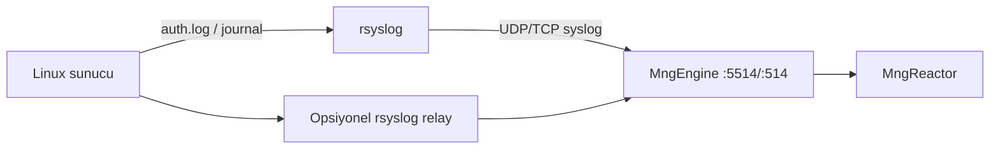

# Linux rsyslog / auth forwarder — müşteri ops şablonu

**Durum:** ✅ Lab şablonu + smoke (4 Haz 2026)  
**İlişkili:** [SIEM_PLANNING.md §5.2](./SIEM_PLANNING.md#52-kaynak--toplama-karar-matrisi) · [SIEM_PARSER_PLAN.md §7](./SIEM_PARSER_PLAN.md#7-linux-auth-parser-linuxauthv1)

Linux sunucular **sshd** ve **sudo** olaylarını yerel `auth`/`authpriv` kanallarına yazar. MonitraNG **MngEngine** bu satırları **syslog UDP/TCP** ile alır, `linux.auth.v1` parser ile normalize eder.

Windows WEF/NxLog akışının Linux karşılığıdır (Faz 2.5).

---

## 1. Mimari özeti



| Rol | Sorumlu | Not |
|-----|---------|-----|
| sshd / sudo log üretimi | Linux OS | `/var/log/auth.log` veya journal |
| rsyslog forwarder | Müşteri IT | Şablon: [templates/rsyslog-linux-auth-to-engine.conf](./templates/rsyslog-linux-auth-to-engine.conf) |
| Engine syslog listener | MonitraNG | ✅ UDP (Odak `:5514`) |
| Parser `linux.auth.v1` | MonitraNG | ✅ sshd/sudo |
| U1 korelasyon | MonitraNG | ✅ lab E2E |

**“Agent” notu:** Ayrı MonitraNG Linux agent binary’si yok. Birincil yol **rsyslog/syslog-ng forward**; alternatif NXLog/Filebeat push (müşteri tercihi).

---

## 2. Ön koşullar

| # | Kontrol |
|---|---------|
| 1 | Linux sunucuda `rsyslog` veya `syslog-ng` çalışıyor |
| 2 | `sshd` başarısız/başarılı oturum logları auth kanalında görünüyor |
| 3 | Engine ↔ Linux arası UDP/TCP **5514** (lab) veya **514** (prod) firewall açık |
| 4 | Engine `MngEngine:SecEventQueue:Enabled=true` |
| 5 | Reactor token — Engine `config.txt` |

**Odak lab:** Engine `http://192.168.20.20:5037`, syslog UDP `:5514`.

---

## 3. rsyslog kurulumu (pilot)

### 3.1 Şablonu kopyala

```bash
sudo cp rsyslog-linux-auth-to-engine.conf /etc/rsyslog.d/50-monitrang-siem.conf
# ENGINE_HOST / port değerlerini düzenle
sudo rsyslogd -N1   # config syntax kontrol
sudo systemctl restart rsyslog
```

Şablon yalnızca `auth,authpriv.*` iletir — sistem/mail gürültüsünü keser.

### 3.2 Doğrulama (sunucu tarafı)

```bash
logger -p auth.info "MonitraNG SIEM probe"
sudo tail -f /var/log/auth.log
```

---

## 4. Prod hardening checklist

| # | Konu | Öneri |
|---|------|--------|
| 1 | **Transport** | UDP yerine **TCP** `omfwd` (kayıp riski) |
| 2 | **Queue** | `queue.type=LinkedList`, `action.resumeRetryCount=-1` |
| 3 | **Filtre** | Yalnızca auth/authpriv; uygulama loglarını ayır |
| 4 | **Relay** | 50+ sunucu → merkezi rsyslog relay → Engine ([SIEM_THROUGHPUT_AND_QUEUES.md](./SIEM_THROUGHPUT_AND_QUEUES.md)) |
| 5 | **TLS** | İnternet üzerinden iletimde stunnel/TLS syslog-ng |
| 6 | **Hostname** | Syslog satırında hostname doğru (Reactor `source.host`) |
| 7 | **Metadata** | Engine sshd/sudo satırlarında otomatik `endpoint` / `linux-syslog` atar |

---

## 5. Opsiyonel relay (yüksek hacim)

```text
[app01..N] --rsyslog--> [relay01] --TCP--> [MngEngine]
```

Relay sunucusunda aynı şablon; kaynak IP `__FROMHOST__` ile hostname korunur. Rate limit ve yerel disk arşivi relay’de tutulabilir — Engine tam arşiv sunucusu değildir ([SIEM_PLANNING.md §5.1](./SIEM_PLANNING.md)).

---

## 6. Lab smoke (Odak)

Repo kökünden:

```powershell
pwsh scripts/odak/test-linux-rsyslog-auth-e2e.ps1
```

Akış: UDP fixture → Engine flush → Reactor sorgu (`linux.auth.v1`, `sourceHost=app01`).

Tam paket: `run-siem-quick-regression.ps1` (E2E suite içinde).

**Engine deploy:** `SecEventSyslogItemBuilder` güncellemesi sonrası `mngengine` recreate gerekebilir.

---

## 7. Sorun giderme

| Belirti | Olası neden | Çözüm |
|---------|-------------|--------|
| Engine kuyruk dolu | Yoğun ingest | `POST /api/SecEvents/flush`, relay queue |
| `linux.auth.v1` yok | Yanlış kanal / parser | auth satırında `sshd[` veya `sudo:` var mı? |
| `source.host=unknown` | Hostname syslog formatı | BSD `MMM dd HH:MM:SS host` formatı kullanın |
| Firewall parser | Eski Engine | Engine deploy — sshd otomatik `linux-syslog` sınıflandırması |
| U1 alarm yok | Korelasyon eşiği | `test-siem-linux-auth-u1-alarm-e2e.ps1` |

---

## 8. İlgili dokümanlar

- [SIEM_WEF_WEC_FORWARDER.md](./SIEM_WEF_WEC_FORWARDER.md) — Windows toplama
- [templates/nxlog-wec-to-engine.conf](./templates/nxlog-wec-to-engine.conf)
- [SEC_EVENT_OBSERVATION_MAP.md](./SEC_EVENT_OBSERVATION_MAP.md)
