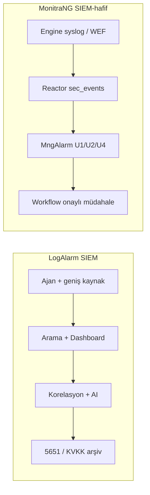

# MonitraNG SIEM vs LogAlarm SIEM — Karşılaştırma

**Durum:** Referans doküman (müşteri beklentisi / konumlandırma)  
**Son güncelleme:** 4 Haziran 2026  
**Kaynak:** Müşteri ilk SIEM talebinde LogAlarm SIEM referans göstermişti.

**İlişkili:**
- [SIEM_PLANNING.md](./SIEM_PLANNING.md) — SIEM-hafif MVP planı (mevcut hedef)
- [DEVAM.md](./DEVAM.md) — güncel implementasyon durumu

---

## 1. İki ayrı hedef

Bu doküman **iki farklı hedefi** ayırır:

| Hedef | Kapsam | Durum |
|-------|--------|--------|
| **SIEM-hafif MVP** | Hedefli senaryolar (U1/U2/U4), onaylı müdahale, Odak E2E | ✅ Tamamlandı (4 Haz 2026) |
| **LogAlarm seviyesi (parite)** | Tam SIEM ürünü: geniş toplama, arama/UI, 5651/KVKK, ölçek, sertifikasyon | ⬜ **Ayrı, uzun vadeli hedef** |

> **Karar:** LogAlarm ile feature-parite **mevcut MVP sprint'inin parçası değildir.** Kendi yol haritası ve öncelikleri olan bağımsız bir ürün hedefidir. Bu doküman o hedefe giderken referans ve gap analizi sağlar.

---

## 2. Kabaca konumlandırma

| | **LogAlarm SIEM** | **MonitraNG SIEM (bizim)** |
|---|---|---|
| **Ne?** | Olgun, yerli, SIEM odaklı ticari ürün | Mevcut izleme platformuna eklenen **SIEM-hafif** katman |
| **Hedef** | Geniş BT ortamında log + tehdit + uyum | Hedefli senaryolar (U1/U2/U4) + onaylı müdahale |
| **Olgunluk** | ~15 yıl, [TRTest A seviye](https://www.logalarm.com.tr/) uygunluk belgesi | MVP tamam, lab E2E ✅; ürünleşme devam ediyor |
| **Referans** | [logalarm.com.tr](https://www.logalarm.com.tr/) | [SIEM_PLANNING.md](./SIEM_PLANNING.md), [DEVAM.md](./DEVAM.md) |

LogAlarm “her şeyi yapan SIEM kutusu” modelidir. MonitraNG bilinçli olarak **Splunk / QRadar / LogAlarm seviyesinde tam SIEM değil** — plan dokümanında **SIEM-hafif** olarak konumlanır; zamanla derinleştirilir.

---

## 3. Özellik karşılaştırması

### 3.1 Log toplama

| LogAlarm | MonitraNG |
|----------|-----------|
| Güçlü **ajan** (Windows / Linux / Mac) | **MngEngine**: syslog UDP, WEF→WEC forwarder ✅, agent batch (planlı) |
| Firewall, AD, DB, web, e-posta, bulut vb. geniş kaynak | Şu an Odak: firewall syslog + HTTP ingest + Windows fixture parser |
| Web konsoldan dakikalar içinde kaynak ekleme | Hibrit model tasarlandı; entegrasyon sayısı ve “tak-çalıştır” deneyimi henüz sınırlı |

**Özet:** LogAlarm toplama tarafında çok daha geniş ve olgun. Bizde altyapı var; kapsam dar.

---

### 3.2 Saklama, arama, dashboard

| LogAlarm | MonitraNG |
|----------|-----------|
| Milyonlarca logda esnek arama | MongoDB `sec_events` + ham `raw` saklama |
| Özelleştirilebilir dashboard’lar | Metrik tarafında Mng.Ui panelleri var |
| Gerçek zamanlı paneller | **Güvenlik olay arama / timeline UI** henüz tam ürün değil |

**Özet:** LogAlarm’ın en güçlü tarafı operatör deneyimi (arama + dashboard). Bizde veri modeli ve ingest var; UX eksik.

---

### 3.3 Tespit ve korelasyon

| LogAlarm | MonitraNG |
|----------|-----------|
| Gerçek zamanlı korelasyon motoru | **MngAlarm** hedefli kurallar |
| Kullanıcı / cihaz / sistem geneli kural atama | **U1** brute-force · **U2** fail→success · **U4** deny spike |
| Enterprise: yapay zeka destekli anomali raporu | MITRE eşlemesi planlandı; threat intel / AI anomali 🔴 yok |

**Özet:** LogAlarm geniş kural kütüphanesi ve AI vaadi sunuyor. Bizde motor çalışıyor; senaryo sayısı az, derinlik yerine doğru senaryoya odak var.

---

### 3.4 Alarm sonrası müdahale

| LogAlarm | MonitraNG |
|----------|-----------|
| Otomatik aksiyonlar | **MngWorkflow** ile **onaylı müdahale** |
| Alarm & olay yönetimi | `alarm.raised` → workflow → operatör onayı → `block.ip` (MQTT) |

**Özet:** LogAlarm klasik “SIEM + otomasyon” modeli. MonitraNG’de **onay kapılı müdahale** bilinçli tasarım kararı — OT / kritik ortamlarda otomatik blok yerine operatör onayı. Monitoring + operations mirasıyla uyumlu fark.

---

### 3.5 Uyum (5651, KVKK, ISO 27001)

| LogAlarm | MonitraNG |
|----------|-----------|
| 5651 imzalama ve arşivleme | WORM / retention / 5651 🔴 henüz yok |
| KVKK / GDPR uyum vurgusu | Multi-tenant, RBAC, domain izolasyonu ✅ |
| Değiştirilemez / doğrulanabilir log | ISO 27001 eşlemesi planlandı; raporlama yok |
| TRTest sertifikası | — |

**Özet:** “5651 / KVKK için SIEM alıyorum” diyen müşteri için LogAlarm bugün çok daha ikna edici. En büyük ürün boşluğumuz.

---

### 3.6 Dağıtım ve ölçek

| LogAlarm | MonitraNG |
|----------|-----------|
| Cloud (KOBİ) + Enterprise (on-prem küme) | On-prem; veri müşteri sınırında ✅ |
| Yatay / dikey ölçeklenebilir mimari | Lab: ~41 evt/s soak, ~78 evt/s P1 |
| 100 GB+ canlı analiz, 2 yıl yedekleme (Cloud) | Tek tenant Odak doğrulandı; kümeleme SIEM için kanıtlanmadı |

**Özet:** LogAlarm kurumsal ölçek ve uyum paketi sunuyor. Biz lab kapılarını geçtik; “binlerce EPS, yıllık arşiv” iddiası henüz yok.

---

### 3.7 Platform bütünleşmesi

| LogAlarm | MonitraNG |
|----------|-----------|
| Bağımsız SIEM ürünü | SIEM + monitoring + workflow + Operation Core **tek platform** |
| Monitoring / ITSM entegrasyonu ayrı proje | Müşteri zaten MonitraNG kullanıyorsa ek kutu değil, mevcut konsola katman |

**Özet:** LogAlarm “SIEM satın al”. MonitraNG “izlediğim altyapıya güvenlik zekâsı ekle” — doğru profilde güçlü hikâye.

---

## 4. Mimari özet



---

## 5. Müşteriye nasıl anlatılır?

### LogAlarm’a benzer olduğumuz yerler

- Merkezi log / olay toplama (sınırlı kaynaklarla)
- Korelasyon ve alarm
- On-prem; veri müşteride kalır
- Firewall + AD odaklı tehdit senaryoları

### LogAlarm’ın önde olduğu yerler

- Kaynak çeşitliliği ve ajan ekosistemi
- Log arama, dashboard, raporlama
- 5651 imzalama, WORM, uyum sertifikası
- Ölçek, olgunluk, yerel destek / marka bilinirliği

### MonitraNG’nin farklılaştığı yerler

- Monitoring + SIEM + onaylı müdahale **tek platform**
- OT / kritik ortam için operatör onaylı `block.ip` akışı
- Multi-tenant mimari (MSP / çok site)
- Müşteriye özel senaryo ve entegrasyon esnekliği

### Dürüst cevap

| Soru | Cevap |
|------|--------|
| LogAlarm yerine geçer miyiz? | **Henüz hayır** — uyum, arama/UI, kaynak kapsamı açısından |
| LogAlarm’ın işinin bir kısmını yapabilir miyiz? | **Evet, MVP seviyesinde kanıtlandı** — U1/U2/U4 + workflow müdahale Odak’ta ✅ |

Müşteri LogAlarm referans gösterdiyse muhtemelen şunları istiyordu:

| Beklenti | MonitraNG durumu |
|----------|------------------|
| Logları topla | 🟡 Kısmen |
| Tehdit bul | ✅ U1/U2/U4 |
| Alarm ver | ✅ |
| Aksiyon al | ✅ Onaylı model |
| Denetimde kanıt (5651/KVKK) | 🔴 Henüz yok |
| Kolay arama / dashboard | 🔴 Zayıf |

---

## 6. LogAlarm parite hedefi — gap matrisi

Aşağıdaki tablo **LogAlarm seviyesine gelmek** için bağımsız yol haritası girdileridir. MVP sprint’ine dahil değildir.

| Alan | LogAlarm referans | MonitraNG gap | Öncelik (öneri) |
|------|-------------------|---------------|-----------------|
| **5651 / imza / arşiv** | Otomatik imzalama, yasal saklama | WORM, append-only, imza | P0 (Türkiye pazarı) |
| **Arama & timeline UI** | Milyonlarca kayıt, esnek sorgu | Sec events arama ekranı | P0 |
| **Dashboard** | Özelleştirilebilir güvenlik panelleri | SIEM dashboard modülü | P1 |
| **Ajan ekosistemi** | Win/Linux/Mac, geniş uygulama desteği | Engine agent + WEF tam entegrasyon | P1 |
| **Parser kütüphanesi** | Çok marka/model firewall, DB, web | [SIEM_PARSER_PLAN.md](./SIEM_PARSER_PLAN.md) genişletme | P1 |
| **Kural kütüphanesi** | Hazır + özelleştirilebilir kurallar | U3–U7 + MITRE paketi | P2 |
| **Threat intel / IoC** | Entegrasyonlar | Enrichment katmanı | P2 |
| **AI anomali** | Enterprise raporu | [AI_PLANNING_DECISION.md](../AI_PLANNING_DECISION.md) — implementasyon ⏸️ | P3 |
| **Ölçek / kümeleme** | Yatay/dikey cluster | Reactor/Engine HA, EPS hedefleri | P2 |
| **Sertifikasyon** | TRTest A seviye | Ürün olgunlaşınca değerlendirme | P3 |
| **Cloud SaaS** | LogAlarm Cloud | MonitraNG multi-tenant SaaS (ayrı karar) | — |

> Parite hedefi için ayrı bir `SIEM_LOGALARM_PARITY_ROADMAP.md` ileride yazılabilir; bu doküman referans ve gap analizi olarak kalır.

---

## 7. MonitraNG’de kanıtlanmış zincirler (4 Haz 2026)

MVP kapsamında Odak’ta doğrulanmış akışlar ([DEVAM.md](./DEVAM.md)):

```
U1: sec_events → observation → correlation → alarm.raised → Workflow → (approval) → block.ip
U4: firewall syslog → sec_events → observation → correlation → alarm.raised → Workflow
U2: login_failed×N → login_success → sequence alarm
P0: Reactor HTTP ingest ~41 evt/s (5 dk soak), ingest P95 < 10 ms
P1: ~78 evt/s (2 dk), drop 0%
```

---

## 8. Dış referanslar

- LogAlarm resmi site: https://www.logalarm.com.tr/
- Bayi / paket özeti (5651, Cloud vs Enterprise): https://www.pusulaofis.com.tr/logalarm-siem-yazilimi/

*Bu doküman LogAlarm’ın ticari iddialarını özetler; resmi ürün özellikleri değişebilir. Güncel bilgi için LogAlarm dokümantasyonu esas alınmalıdır.*
