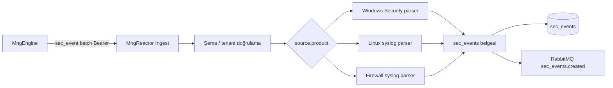

# SIEM — Parser / Normalizer Planı (Odak)

**Durum:** P0/P1 parser'lar Odak'ta — `linux.auth.v1` ✅ · `firewall.vendor.v1` (FortiGate + PAN-OS + **Cisco ASA**) ✅ · `windows.security.extended.v1` ✅
**Son güncelleme:** 4 Haziran 2026
**Ana plan:** [SIEM_PLANNING.md](./SIEM_PLANNING.md) §13 (parser özeti), §4 (`sec_events`)

---

## 1. Amaç

Ham logları (syslog satırı, Windows Event XML/JSON) **`sec_events`** ortak şemasına dönüştürmek. Tespit (Alarm engine) ve workflow **parse edilmiş alanlara** bağlıdır; parse olmadan U1/U4 çalışmaz.

**Konum:** `MngReactor` — mevcut metrik ingest pipeline'ına **paralel** `sec_event` ingest + normalizer katmanı.

---

## 2. Pipeline



**İlkeler:**
- Parse başarısız olsa bile **`raw` + `message`** ile belge yazılır (`event.action = unknown`); forensic korunur.
- Parser sürümü metadata: `parser.id`, `parser.version` (regression test için).
- Aynı ham olay tekrar gelirse **`event.id` / hash** ile dedup (opsiyonel Faz 1.1).

---

## 3. MVP parser önceliği (Faz 1)

| Öncelik | Parser ID | Girdi | MVP senaryo |
|---------|-----------|-------|-------------|
| **P0** | `windows.security.v1` | WEC/Engine — Event ID 4624, 4625, 4740 | U1, U2 |
| **P0** | `firewall.generic_syslog.v1` | Syslog — CEF / key=value / regex tabanlı deny | U4 |
| **P1** | `linux.auth.v1` | rsyslog — sshd, sudo | U1 (Linux) | ✅ |
| **P1** | `firewall.vendor.v1` | FortiGate key=value + Palo Alto PAN-OS CEF/CSV | U4, U6 doğruluğu | ✅ |
| **P2** | `windows.security.extended.v1` | 4720, 4728, 5136… | Yetki / dizin değişikliği | ✅ pilot |
| **P2** | `bastion.generic.v1` | Jump host syslog formatı | U2, U3 | ✅ |

**Pilot firewall markası** netleşince `firewall.vendor.v1` P0'a yükseltilebilir (SIEM_PLANNING §12.6).

---

## 4. Parser arayüzü (Reactor içi — öneri)

```
ISecEventParser
├── string ParserId { get; }
├── bool CanParse(SecEventRawContext ctx)   // source.product, raw format
└── Task<SecEventDocument?> ParseAsync(ctx, CancellationToken ct)
```

| `SecEventRawContext` alanı | Açıklama |
|----------------------------|----------|
| `domain` | Tenant |
| `source.type` | firewall \| ad \| endpoint \| bastion |
| `source.product` | windows, fortigate, linux-syslog, … |
| `source.host` | Gönderen hostname |
| `receivedAt` | Engine alım zamanı |
| `raw` | Ham payload (string veya object) |

**Registry:** `source.product` + opsiyonel `raw` sniff → parser seçimi. Bilinmeyen → `generic.syslog.v1` fallback (minimal alan çıkarımı).

---

## 5. Windows Security parser (`windows.security.v1`)

**Girdi:** Engine'den gelen yapılandırılmış Windows Event (EventID, TimeCreated, SubjectUserName, IpAddress, …).

| Event ID | `event.action` | Ek alanlar |
|----------|----------------|------------|
| 4624 | `login_success` | `actor.user`, `network.srcIp`, `tags: [privileged]` (4672 ile birleşik zenginleştirme Faz 2) |
| 4625 | `login_failed` | `actor.user`, `network.srcIp`, `event.outcome=failure` |
| 4740 | `account_locked` | `actor.user` |
| 4771 | `kerberos_preauth_failed` | `actor.user`, `network.srcIp` |

**Audit önkoşulu:** DC'de Audit Logon Events (Failure) açık olmalı — müşteri GPO (SIEM §5.6 RACI).

---

## 6. Firewall parser (`firewall.generic_syslog.v1`)

**Girdi:** Syslog satırı (RFC 5424 veya klasik BSD).

**Çıkarılacak minimum alanlar:**

| Alan | Kaynak |
|------|--------|
| `event.action` | `deny` → `denied_flow`, `accept` → `allowed_flow`, `config` → `rule_change` |
| `network.srcIp`, `network.dstIp`, `network.dstPort`, `network.protocol` | Regex / CEF |
| `event.outcome` | deny → failure, allow → success |
| `actor.user` | Admin / policy change loglarında (varsa) |

**Üretici-spesifik:** **FortiGate** (`source.product=fortigate`) — traffic `action=deny|accept`, event `cfgpath=firewall.policy` → `rule_change`. **Palo Alto PAN-OS** (`pan-os`, `paloalto`) — CEF `|TRAFFIC|` / `|CONFIG|` + CSV `,TRAFFIC,` fallback.

---

## 7. Linux auth parser (`linux.auth.v1`)

**Girdi:** sshd / sudo syslog.

| Pattern (örnek) | `event.action` |
|-----------------|----------------|
| `Failed password for * from *` | `login_failed` |
| `Accepted password for * from *` | `login_success` |
| `sudo: * : command not allowed` | `privilege_denied` |

---

## 8. `sec_events` zenginleştirme (parse sonrası)

| Adım | Ne yapar | Faz |
|------|----------|-----|
| **MITRE etiket** | Kural veya statik map: `login_failed` → T1110.001 | Faz 2 |
| **GeoIP** | `network.srcIp` → ülke (opsiyonel) | Faz 2 |
| **Threat intel** | Bilinen kötü IP listesi → `tags: [ioc-match]` | Faz 2 |
| **Asset eşleme** | `source.host` → `mon_assets` (varsa) | Faz 2 |

---

## 9. Engine → Reactor batch (sec_event)

Metrik ingest'ten **ayrı** tip veya aynı batch içinde `kind: "sec_event"` discriminator (spike'ta kesinleşir).

**Önerilen batch öğesi (mantıksal):**

```json
{
  "kind": "sec_event",
  "source": {
    "type": "ad",
    "product": "windows",
    "host": "DC01.odak.local"
  },
  "receivedAt": "2026-06-03T12:00:00Z",
  "raw": { "EventID": 4625, "TargetUserName": "admin", "IpAddress": "192.168.1.50" }
}
```

Reactor normalizer `raw` → tam `sec_events` belgesine genişletir. Şifreleme/sıkıştırma mevcut metrik ingest ile **aynı** mekanizma (Engine ROADMAP).

---

## 10. Test stratejisi

| Yöntem | Açıklama |
|--------|----------|
| **Fixture dosyaları** | `tests/fixtures/siem/` — örnek syslog + Windows Event JSON |
| **Parser unit test** | Her parser ID için giriş → beklenen `sec_events` |
| **MngSim / sentetik syslog** | Engine listener'a UDP syslog enjekte (MONITORING_SIMULATOR genişlemesi) |
| **Regression** | Müşteriden alınan anonim örnek log (§13.2) fixture'a eklenir |

---

## 11. Açık kararlar

1. **Ingest endpoint:** Ayrı `POST .../ingest/sec-events` mi, mevcut ingest'e `kind` mi?
2. **Dedup:** `@timestamp` + hash ile 24 saat penceresi?
3. **Pilot firewall formatı:** FortiGate (key=value traffic/event syslog) — `test-siem-firewall-vendor-ingest.ps1`
4. **Generic fallback kalitesi:** Parse edilemeyen satır oranı kabul eşiği

---

## 12. Referanslar

- [SIEM_PLANNING.md](./SIEM_PLANNING.md)
- [MONITORING_REACTOR_ARCHITECTURE.md](../../content/monitoring_plans/MONITORING_REACTOR_ARCHITECTURE.md)
- [ALARM_RULE_ENGINE_PLAN.md](../alarm/ALARM_RULE_ENGINE_PLAN.md)
