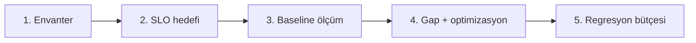

# SIEM / Monitoring — Performans Planlama

**Durum:** Taslak — planlama (implementasyon workflow sonrası)
**Son güncelleme:** 3 Haziran 2026
**Özet:** §1 çerçeve · **§2 önerilen ilkeler (okunacak bölüm)** · §3+ SLO/ölçüm/kapılar
**İlişki:**
- [SIEM_DASHBOARD_PERFORMANCE_PLAN.md](./SIEM_DASHBOARD_PERFORMANCE_PLAN.md) — **Güvenlik paneli** prod olay teşhisi + Faz 0–6 uygulama planı (6 Tem 2026)
- [SIEM_THROUGHPUT_AND_QUEUES.md](./SIEM_THROUGHPUT_AND_QUEUES.md) — kuyruk, backpressure
- [MONITORING_OBSERVABILITY.md](../../content/monitoring_plans/MONITORING_OBSERVABILITY.md) — OpenTelemetry (servis içi)
- [SIEM_FAZ1_SPIKE.md](./SIEM_FAZ1_SPIKE.md) — ilk ölçüm spike'ı

---

## 1. Performansı nasıl düşünelim?

Performans tek sayı değil; **dört eksen** + **hangi katman** birlikte tanımlanır:

| Eksen | Soru | SIEM örneği |
|-------|------|-------------|
| **Throughput** | Saniyede kaç olay işlenir? | 500 syslog evt/s sürdürülebilir mi? |
| **Latency** | Olay → kayıt / alarm gecikmesi? | Ingest P95 < 2s, correlation P95 < 30s |
| **Availability** | Yük altında düşmeden çalışır mı? | Burst sırasında veri kaybı oranı < X% |
| **Resource** | CPU/RAM/disk/network yeterli mi? | Reactor Mongo bulk CPU, Engine queue RAM |

**Planlama ilkesi:** Önce **iş yükü profili** (müşteri/envanter), sonra **SLO**, sonra **ölçüm**, en son **optimizasyon**.

---

## 2. Önerilen performans ilkeleri (MonitraNG)

Bu bölüm, SIEM-hafif katman için **tercih edilen mimari ve operasyon kararlarıdır**. SLO tabloları (§3) ve optimizasyon sırası (§7) bunlarla hizalıdır; implementasyon spike'ında sapma varsa gerekçe dokümante edilir.

### 2.1 Altın kural: önce hacmi düşür, sonra hızlandır

En büyük performans kazancı kod optimizasyonundan değil, **gelen olay sayısını azaltmaktan** gelir.

| Öncelik | Ne yap | Neden |
|---------|--------|-------|
| 1 | Firewall’da **deny-only** (allow log kapalı veya sample) | Tek allow-log açık firewall EPS’i 10–100× artırabilir |
| 2 | AD tarafında **dar Event ID filtresi** (4625, 4740, 4624…) | DC log hacmi gereksiz şişmez |
| 3 | Edge’de **yapılandırılabilir drop/sample** (THROUGHPUT §3) | Burst’te metrik hattını korur |
| 4 | Ancak sonra batch tuning, indeks, scale-out | Erken scale maliyetli ve maskeleme yapar |

**Öneri:** Müşteri envanterinde (§9) “filtre öncesi / filtre sonrası EPS” ayrı yazılsın; kapasite hesabı **filtre sonrası** üzerinden yapılsın.

### 2.2 Kuyruk ve izolasyon

| Öneri | Açıklama |
|-------|----------|
| **SecEventQueue metrik kuyruğundan ayrı** | Metrik burst’ü güvenlik ingest’ini, syslog burst’ü metrik gönderimini bozmamalı ([THROUGHPUT §3](./SIEM_THROUGHPUT_AND_QUEUES.md)). |
| **Workflow ingest’i asla bloklamasın** | Reactor: parse → Mongo → MQ publish; workflow tüketici ayrı kanal. Ingest HTTP 5xx workflow gecikmesinden gelmemeli. |
| **Overflow politikası müşteri profiline göre** | P0/P1: drop-oldest + sayaç; P2+: sample (1/N) veya opsiyonel disk spool (Faz 2). Sessiz drop yok — metrik zorunlu. |

### 2.3 Her katmanda batch

Tekil olay publish/write **anti-pattern**; mevcut Engine→Reactor metrik batch modeli SIEM için de temel alınmalı.

| Katman | Öneri | Varsayılan (spike’ta doğrulanacak) |
|--------|-------|-------------------------------------|
| Engine → Reactor | HTTP **batch** (olay listesi) | Eşik: 100 olay **veya** 30s (hangisi önce) |
| Reactor → Mongo | `bulkWrite` chunk | 100–500 doküman/chunk |
| Reactor → MQ | **Özet/batch mesaj** (ham olay başına değil) | Alarm worker kendi penceresini doldurur |
| Alarm engine | Partitioned consumer + checkpoint | Partition: `domainId` + kural ailesi |

### 2.4 Saklama ve şema bütçesi

| Öneri | Açıklama |
|-------|----------|
| **MVP: normalize edilmiş `sec_events` birincil** | Tam raw syslog her olayda saklanmasın; `rawPreview` (ör. ilk 512 byte) + hash yeterli. Tam raw arşiv Faz 2+ / müşteri relay. |
| **Doküman boyut hedefi ≤ ~2 KB** | Parser çıktısı flat alanlar; derin nested JSON veya tam mesaj gövdesi yok. |
| **Mongo yazma yolu önce** | OpenSearch/arama tier, UI sorguları P95 > 3s **ve** envanter P2+ olunca (SIEM §21.7). Erken çift yazma yapma. |
| **Retention katmanlı** | Hot: Mongo TTL (ör. 30–90 gün operasyonel); uzun uyum arşivi ayrı karar (WORM Faz 3+). Disk projeksiyonu envanterde zorunlu. |

### 2.5 Transport ve edge

| Ortam | Öneri |
|-------|-------|
| Lab / spike | UDP syslog kabul edilebilir |
| Pilot / prod | **TCP syslog** (veya TLS) — burst’te UDP kernel buffer kaybı kaçınılmaz |
| Çok yüksek hacim | Müşteri **rsyslog relay** (buffer) → Engine; Engine tam syslog sunucusu değil |

### 2.6 Alarm ve korelasyon

| Öneri | Açıklama |
|-------|----------|
| **Parser stateless, state alarm engine’de** | Reactor yatay ölçeklenir; pencere durumu partition worker’da. |
| **In-memory window üst sınırı** | Partition başına max olay / max RAM — aşımda checkpoint + trim veya lag alarmı. |
| **Detection lag > throughput** | U1/U2 için 60s P95 lag, 500 evt/s sürdürülebilirlikten **daha kritik** operasyon metriği; spike’ta ikisi de ölçülsün. |
| **MQ’da olay başına mesaj yok** | THROUGHPUT §4.3 ile uyumlu; aksi halde Rabbit CPU ve lag birincil darboğaz olur. |

### 2.7 Ölçüm: spike’tan itibaren minimum set

Full OpenTelemetry Faz 2’de genişler; **Faz 1 spike’ta bile** aşağıdakiler olmadan “performanslı” sayma:

| Metrik | Amaç |
|--------|------|
| `sec_event.queue_depth` / `dropped_total` | Edge sağlığı |
| `ingest.sec_events.saved_total` | Gerçekleşen EPS |
| `ingest.sec_events.parse_duration_ms` (P95) | Reactor CPU |
| `mongo.bulk.duration_ms` (P95) | Yazma darboğazı |
| Benchmark JSON (§6.3) | Regresyon tarihçesi — `docs/odak/monitoring/benchmarks/` |

Trace (Engine → Reactor → Mongo → MQ) Faz 2’de tam; spike’ta en az **uçtan uca süre** manuel veya tek span yeterli.

### 2.8 Kapasite ve taahhüt

| Öneri | Açıklama |
|-------|----------|
| **Peak EPS ≈ 3–5× sustained** | Queue `MaxItems` ve burst testi (P3) buna göre |
| **P1’de tek Engine + tek Reactor yeterli olmalı** | Scale-out, P1 baseline geçtikten sonra; önce filtre + batch + indeks |
| **Müşteriye resmi EPS/SLO taahhüdü yok (ilk faz)** | İç hedef (PF1); §9 kapasite sayfası + P1 benchmark dolu olmadan sözleşme maddesi yazma |
| **Quality gate: spike geçmeden Faz 2 alarm genişlemesi yok** | §8 tablosu — ölçümsüz özellik eklenmesin |

### 2.9 Bilinçli yapmayacaklarımız (MVP)

- Ham syslog’u Mongo’da sınırsız saklamak  
- Ingest içinde senkron workflow / firewall API çağrısı  
- Metrik ve SIEM için ortak overflow kuyruğu  
- OpenSearch’ü “ileride lazım olur” diye Faz 1’de çift yazmak  
- Tek global alarm worker (partition yok)  
- Müşteri allow-log açıkken “5000 EPS destekliyoruz” demek  

---

## 3. Pipeline bazında SLO taslağı (hedefler)

Değerler **Faz 1 spike + müşteri envanteri** sonrası kesinleşir; başlangıç hedefleri:

### 3.1 MngEngine (edge)

| SLI | SLO (taslak) | Ölçüm |
|-----|--------------|-------|
| Syslog kaybı (UDP overflow) | < %1 normal; burst'te sample politikası açık | `engine.syslog.dropped_total` |
| Queue depth | < %80 `MaxItems` sürekli | `engine.sec_event.queue_depth` |
| Batch → Reactor başarı | > %99.5 / 5 dk | `engine.ingest.send_success_rate` |
| Send latency | P95 < 5s (batch oluşumu dahil) | `engine.ingest.send_duration_ms` |

### 3.2 MngReactor (ingest + parse)

| SLI | SLO (taslak) | Ölçüm |
|-----|--------------|-------|
| Ingest HTTP P95 | < 500ms (batch 100 olay, spike'te revize) | `ingest.duration_ms` |
| Parse hata oranı | < %0.1 (unknown action kabul, crash yok) | `ingest.parse_errors_total` |
| Mongo bulk P95 | < 300ms / chunk | OTel Mongo span |
| Ingest availability | > %99.9 | HTTP 5xx oranı |

### 3.3 `sec_events` saklama

| SLI | SLO (taslak) | Ölçüm |
|-----|--------------|-------|
| Yazma throughput | ≥ hedef EPS (envanterden) | ingest.saved_count / s |
| Sorgu P95 (UI) | < 3s / 24s pencere, 10k satır | API benchmark |
| Disk / retention | Politika içinde otomatik TTL | Mongo stats |

### 3.4 Alarm & Rule Engine

| SLI | SLO (taslak) | Ölçüm |
|-----|--------------|-------|
| Detection latency | P95 < 60s (5 dk pencere kuralı + işleme) | `alarm.detection_lag_ms` |
| Consumer lag | < 10k olay normal | MQ lag / offset |
| False positive budget | Kural başına müşteriyle tanımlı | operasyonel |

### 3.5 MngWorkflow (sonra)

| SLI | SLO (taslak) | Ölçüm |
|-----|--------------|-------|
| Alert → UI görünürlük | P95 < 10s | E2E test |
| Approval node bekleme | İş kuralı (insan); sistem timeout tanımlı | workflow metrics |

---

## 4. İş yükü profilleri (test senaryoları)

Her performans testi **profil** seçer; tek "max load" yetmez.

| Profil | EPS (taslak) | Kaynak | Amaç |
|--------|--------------|--------|------|
| **P0 — Lab** | 10–50 | Fixture + netcat syslog | Fonksiyonel doğrulama (Faz 1 spike) |
| **P1 — KOBİ** | 100–500 | 1 firewall (deny-only) + DC | Odak pilot |
| **P2 — Kurumsal** | 1k–5k | Çok firewall + allow sample | Throughput test |
| **P3 — Burst** | 10k+ (60s) | Sentetik flood | Queue overflow, recovery |
| **P4 — Sustained** | P1/P2 × 24s | Soak test | Memory leak, Mongo growth |

**Envanter girdisi:** SIEM §20 — günlük GB/gün → EPS tahmini:

```text
EPS ≈ (GB/gün × 10^9) / (ortalama_olay_boyutu_byte × 86400)
```

---

## 5. Performans planlama süreci (5 adım)



| Adım | Çıktı | Sahip |
|------|-------|-------|
| **1. Envanter** | Kaynak sayısı, EPS tahmini, retention | Müşteri IT + MonitraNG |
| **2. SLO** | Bu doküman §3 güncel hedefler | Ürün / mimari |
| **3. Baseline** | Spike + benchmark JSON raporları | Dev |
| **4. Gap** | Bottleneck (Engine/Reactor/Mongo/MQ) | Dev |
| **5. Regresyon** | CI veya per-release benchmark eşiği | Dev |

**Referans:** Operation Core tarafında benzer yaklaşım — `docs/odak/diagnostic/` benchmark scriptleri ve P95 raporları.

---

## 6. Ölçüm altyapısı

### 6.1 Servis içi (OpenTelemetry)

[MONITORING_OBSERVABILITY.md](../../content/monitoring_plans/MONITORING_OBSERVABILITY.md) ile hizalı; SIEM için **ek metrikler**:

| Metrik | Bileşen |
|--------|---------|
| `sec_event.received_total` | Engine |
| `sec_event.queue_depth` | Engine |
| `sec_event.batch_size` | Engine |
| `ingest.sec_events.saved_total` | Reactor |
| `ingest.sec_events.parse_duration_ms` | Reactor |
| `alarm.correlation.lag_ms` | MngAlarm |

**Trace:** `Engine.send → Reactor.ingest → parse → mongo.bulk → mq.publish`

### 6.2 Yük testi araçları

| Araç | Kullanım |
|------|----------|
| **Syslog generator** | UDP/TCP flood (lab) |
| **Fixture replay** | Deterministik parser/ingest |
| **k6 / NBomber** | Reactor HTTP ingest (opsiyonel) |
| **Mongo profiler** | Yavaş sorgu |
| **Diagnostic script** (iç kalıp) | `docs/odak/diagnostic/scripts/` benzeri SIEM benchmark |

### 6.3 Rapor formatı (öneri)

Her benchmark koşusu JSON özet:

```json
{
  "profile": "P1",
  "durationSec": 300,
  "targetEps": 200,
  "achievedEps": 185,
  "engine": { "queueMaxDepth": 1200, "droppedTotal": 45 },
  "reactor": { "ingestP95Ms": 420, "errorRate": 0.001 },
  "mongo": { "bulkP95Ms": 180 },
  "pass": false,
  "notes": "P95 ingest hedef üstü"
}
```

Konum önerisi: `docs/odak/monitoring/benchmarks/` (gitignore değil — küçük JSON commit).

---

## 7. Optimizasyon öncelik sırası (genel)

Performans sorunu çıktığında **ölç → darboğaz → en ucuz kazanç**:

| Sıra | Müdahale | Etki |
|------|----------|------|
| 1 | **Kaynak filtre** (deny-only, drop allow syslog) | EPS ↓↓↓ |
| 2 | **Edge queue + batch tuning** | Burst absorbe |
| 3 | **Mongo indeks + bulk chunk** | Yazma ↑ |
| 4 | **MQ batch (olay başına değil)** | CPU/network ↓ |
| 5 | **Reactor scale-out** | Ingest ↑ |
| 6 | **Engine scale-out / rsyslog relay** | Edge ↑ |
| 7 | **OpenSearch / arama tier** | Sorgu ↑ (§21.7) |
| 8 | **Alarm partition worker** | Detection lag ↓ |

Kural: **Erken optimizasyon yapma** — önce envanter + P0/P1 baseline.

---

## 8. Fazlarla performans kapıları (quality gates)

Implementasyon workflow sonrası her faz **performans kapısı** ile kapanır:

| Faz | Kapı (minimum) |
|-----|----------------|
| **Faz 1 spike** | P0: 50 evt/s, 5 dk, queue drop < %5, ingest P95 < 1s |
| **Faz 1 prod-hazır** | P1 profil müşteri EPS'inin %80'i, 1 saat soak |
| **Faz 2 (alarm)** | U1 detection lag P95 < 60s @ P1 |
| **Faz 3 (workflow)** | Alert→UI P95 < 10s @ P1 |
| **Faz 4** | P2 profil veya müşteri kabul testi |

Spike geçmeden sonraki faza **geçiş yok** (iç kalite kuralı — müşteri SLA ayrı).

---

## 9. Kapasite planlama çalışma sayfası

Spike / müşteri görüşmesi öncesi doldurulur (SIEM §20 ile birleşik):

| Alan | Değer | Not |
|------|-------|-----|
| Toplam firewall | | |
| Deny-only log mu? | | |
| Tahmini EPS (filtre sonrası) | | |
| Peak/burst EPS | | |
| Retention (gün) | | |
| `sec_events` günlük büyüme (GB) | | |
| Engine instance sayısı | | |
| Reactor instance / CPU | | |
| Mongo RAM / disk IOPS | | |
| Hedef SLO tier | P0 / P1 / P2 | |

---

## 10. Riskler ve erken uyarılar

| Belirti | Olası neden | Planlı tepki |
|---------|-------------|--------------|
| Queue sürekli %100 | EPS > ingest kapasitesi | Filtre, scale, sample |
| Ingest P95 artışı | Mongo yavaş / indeks | Profiler, chunk, HW |
| Mongo disk hızlı doluyor | Retention yok / raw çok büyük | TTL, raw truncate policy |
| Alarm lag artışı | MQ olay başına / partition az | THROUGHPUT §4.3; §2.6 |
| UDP syslog kaybı | Burst > kernel buffer | TCP syslog veya relay |

---

## 11. Açık kararlar

| # | Konu | Öneri |
|---|------|-------|
| PF1 | Resmi SLO müşteriye taahhüt mü, iç hedef mi? | İlk faz **iç hedef**; sözleşme sonra |
| PF2 | Benchmark CI'da mı, manuel mi? | Faz 1 manuel JSON; Faz 2+ smoke benchmark CI |
| PF3 | OpenTelemetry Faz 1'de zorunlu mu? | Minimum metrik (Prometheus/Seq); full OTel Faz 2 |
| PF4 | P2/P3 test ortamı | Odak lab veya docker compose cluster |

---

## 12. Referanslar

- [SIEM_THROUGHPUT_AND_QUEUES.md](./SIEM_THROUGHPUT_AND_QUEUES.md)
- [SIEM_PLANNING.md](./SIEM_PLANNING.md) §20 envanter
- [MONITORING_OBSERVABILITY.md](../../content/monitoring_plans/MONITORING_OBSERVABILITY.md)
- `docs/odak/diagnostic/` — UI/MO benchmark metodolojisi örneği
