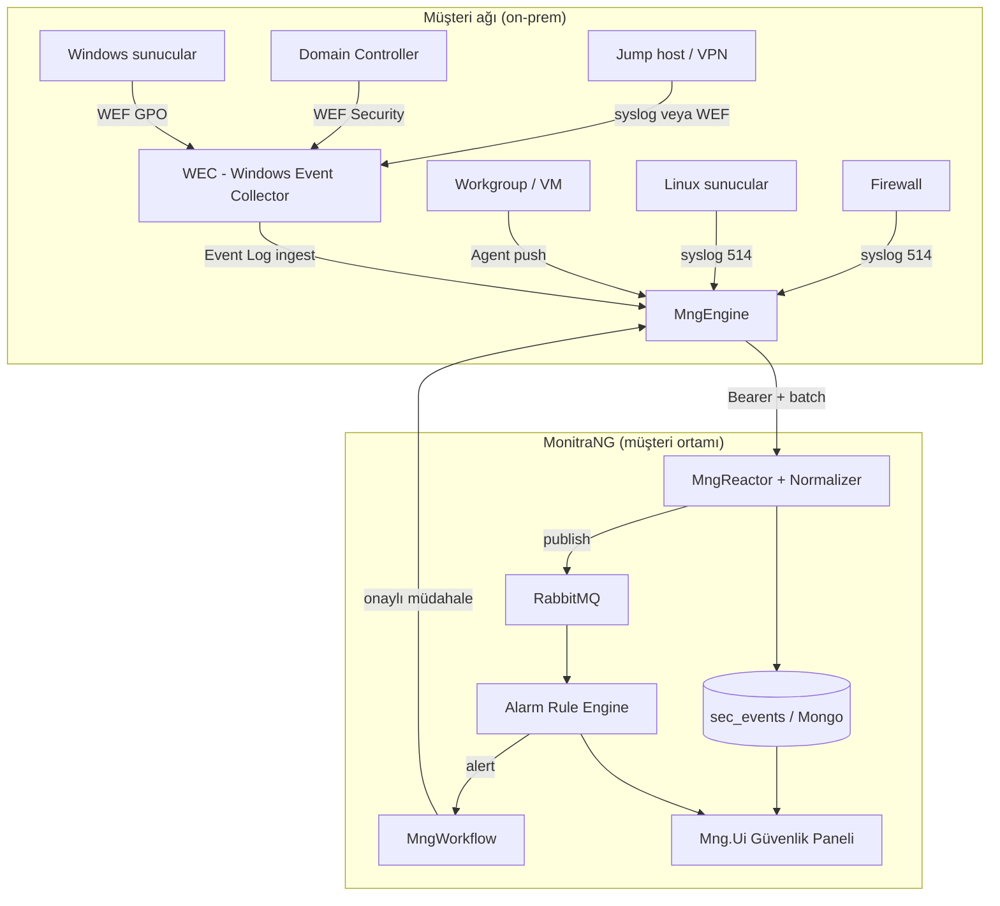
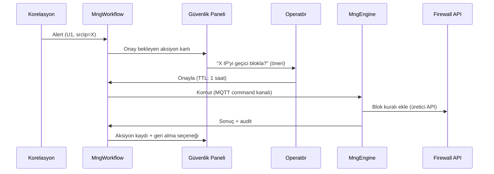

# SIEM-Hafif Çözümü — Planlama (Odak)

**Durum:** Taslak — Faz 0 (çerçeve), görüş/karar için
**Son güncelleme:** 3 Haziran 2026 (§12–20 plan tamamlama)
**Kapsam:** Müşterinin **kendi IT ortamındaki** güvenlik olaylarının toplanması, normalleştirilmesi, korelasyonu, uyarılması ve **onaylı müdahalesi**. On-prem.

> Bu doküman, mevcut MonitraNG Monitoring altyapısı (MngEngine, MngReactor, MngWorkflow, MngDataGateway, MngKeeper) üzerine **SIEM-hafif** bir katman tasarlar. Ürün geneli vizyon için bkz. `docs/content/security/CYBERSECURITY_SOLUTION_PLANNING.md`.

---

## 1. Amaç ve konumlandırma

**Hedef:** Tam ticari SIEM (Splunk/QRadar/Sentinel/LogAlarm) yerine, **hedefli kullanım senaryoları** ile başlayan, müşteriye hızlı değer veren güvenlik odaklı izleme katmanı. Zamanla derinleştirilir.

> LogAlarm ile karşılaştırma ve **parite hedefi** (ayrı yol haritası): [SIEM_LOGALARM_COMPARISON.md](./SIEM_LOGALARM_COMPARISON.md)

**İlk faz veri kaynakları (karar):**

1. **Firewall** — syslog (deny/allow, trafik/olay logları)
2. **Active Directory** — login/kimlik olayları (başarısız/başarılı oturum, hesap kilitleme)
3. **Sunucu / endpoint** — Linux syslog, Windows Event Log
4. **Jump host / bastion / VPN** — erişim ve oturum logları

**Dağıtım:** On-prem — toplama ve işleme müşteri ağında. Veri müşteri sınırından çıkmaz.

**Tespit sonrası:** Onaylı müdahale — otomatik aksiyon yok; operatör onayıyla aksiyon (ör. firewall'da kaynak IP blok).

**Toplama stratejisi (karar — §5.1):** Hibrit model — syslog destekleyen kaynaklar doğrudan **MngEngine**; domain Windows ve AD kimlik olayları **WEF → WEC → Engine**; workgroup / WEF dışı Windows **agent → Engine**. Brute-force (U1) için birincil veri kaynağı DC **Security Event Log** (4625, 4740 vb.); LDAP polling kullanılmaz.

---

## 2. Mevcut altyapı → SIEM yetenek eşlemesi

| SIEM yeteneği | MonitraNG karşılığı | Durum | Boşluk |
|---|---|------|--------|
| **Collection (edge)** | MngEngine — poll (SSH/WMI/SNMP/HTTP) + push (syslog/trap/webhook/MQTT) + WEC Event Log ingest (§5) | 🟡 | **Syslog listener**, **WEC ingest**, agent batch endpoint |
| **Transport / ingest** | MngReactor — batch ingest, decrypt/decompress, çoklu tenant, Bearer auth | 🟡 | Log/event için **ayrı ingest yolu + normalizasyon** |
| **Normalization / parsing** | — | 🔴 | Reactor'a **parser/normalizer** katmanı (kaynak → ortak şema) |
| **Storage** | MongoDB Time Series `mon_metrics` + TTL | 🟡 | Olaylar için **`sec_events`** koleksiyonu + uzun retention |
| **Correlation / detection** | **Alarm & Rule Engine** (`MngAlarm`) — correlation/stateful kurallar; `sec_events` stream | 🟡 | Motor implementasyonu + SIEM kural seti (U1/U2/U4) |
| **Enrichment (threat intel)** | — | 🔴 | Bilinen kötü IP/hash listesi eşleştirme (Faz 2) |
| **Alerting / response** | MngWorkflow aksiyonları (notification/http/email/ui) | ✅ | Onaylı müdahale akışı (operatör onayı) |
| **Case management** | MngOperations WorkItem (Operation Core) | 🟡 | Alert → WorkItem (incident) bağı |
| **Dashboard / UI** | Mng.Ui monitoring panelleri | 🟡 | Güvenlik paneli + alert akışı |
| **Multi-tenant / IAM / audit** | MngKeeper, domain izolasyonu, RBAC | ✅ | — |
| **Retention / WORM** | TTL (metrik) | 🔴 | Uyum için uzun/değiştirilemez saklama politikası |

> Durum kodları: ✅ var · 🟡 kısmi · 🔴 yok

---

## 3. Monitoring ↔ SIEM gap analizi

Mevcut yapı **metrik izleme** (sayısal zaman serisi) için tasarlandı. SIEM **log/event** odaklıdır. Temel farklar ve aksiyonlar:

| Boyut | Monitoring (mevcut) | SIEM gereksinimi | Aksiyon |
|-------|---------------------|------------------|---------|
| **Veri tipi** | Sayısal metrik (`value`, `unit`) | Yapılandırılmış olay (actor, action, src/dst, outcome) | Yeni event şeması (§4) |
| **Şema** | Sabit, sayısal | Heterojen kaynaklar → ortak alanlar | Normalizasyon katmanı (§5) |
| **Tetikleme** | Tek metrik eşiği | Çok-olay, zaman pencereli korelasyon | Korelasyon motoru (§7) |
| **Saklama** | Kısa TTL (gün) | Uzun, değiştirilemez (ay/yıl) | Retention politikası (§9) |
| **Sorgu** | Zaman serisi agregasyon | Olay arama, drill-down, timeline | Event index + arama API |
| **İstihbarat** | Yok | IoC / threat intel eşleştirme | Enrichment (Faz 2) |

---

## 4. Güvenlik olayı veri modeli (`sec_events`)

SIEM'in çekirdeği: kaynak ne olursa olsun olayları **ortak, normalleştirilmiş** bir şemaya indirgemek. ECS (Elastic Common Schema) / CEF mantığıyla hizalı, sade bir model öneriyoruz.

**Koleksiyon:** `sec_events` — MongoDB, `mng_{domain_name}` veritabanı. (Time Series değil; sorgulanabilir, indeksli belge koleksiyonu.)

| Alan | Tip | Açıklama |
|------|-----|----------|
| `@timestamp` | datetime | Olayın gerçekleştiği an (kaynaktan) |
| `ingestedAt` | datetime | Reactor'a ulaşma anı |
| `domain` | text | Tenant |
| `source.type` | text | `firewall` \| `ad` \| `endpoint` \| `bastion` |
| `source.product` | text | Cihaz/ürün (ör. `fortigate`, `windows`, `linux-syslog`) |
| `source.host` | text | Kaynak cihaz/agent |
| `event.category` | text | `authentication` \| `network` \| `process` \| `config_change` |
| `event.action` | text | Ör. `login_failed`, `denied_flow`, `rule_change` |
| `event.outcome` | text | `success` \| `failure` \| `unknown` |
| `event.severity` | number | 0–10 normalize |
| `actor.user` | text | İlgili kullanıcı/hesap |
| `network.srcIp` | text | Kaynak IP |
| `network.dstIp` | text | Hedef IP |
| `network.dstPort` | number | Hedef port |
| `network.protocol` | text | tcp/udp/proto |
| `message` | text | Ham/özet mesaj |
| `raw` | object | Orijinal log (denetim/forensic için) |
| `tags` | array | Etiketler (ör. `ot-boundary`, `privileged`, `ioc-match`) |
| `threat.tactic.id` | text | MITRE tactic (ör. `credential_access`) — Faz 2 |
| `threat.technique.id` | text | MITRE technique (ör. `T1110.001`) — Faz 2 |
| `threat.technique.name` | text | İnsan okunur ad — Faz 2 |
| `parser.id` | text | Kullanılan parser (ör. `windows.security.v1`) |
| `event.id` | text | Kaynak olay kimliği / dedup hash (opsiyonel) |

**İlkeler:**
- `raw` her zaman saklanır (forensic + parser hatası kurtarma).
- Hassas alanlar (kullanıcı adı vb.) KVKK/ISO için minimize edilebilir; politika §9.
- İndeksler: `@timestamp`, `source.type`, `event.action`, `network.srcIp`, `actor.user`.

---

## 5. Mimari akış



**Akış adımları:**
1. **Toplama (Engine):** Syslog (UDP/TCP 514) — firewall, Linux, syslog destekleyen ağ cihazları. Windows — WEF ile müşteri **WEC** sunucusunda toplanır, Engine WEC'den ingest eder; WEF kapsamı dışı makineler **agent** ile Engine'e push eder. Müşterinin ayrı syslog sunucusu **zorunlu değildir**; yüksek hacim veya yerel arşiv için opsiyonel rsyslog relay kullanılabilir (§5.1).
2. **Normalizasyon (Reactor):** Kaynak tipine göre parser → `sec_events` ortak şema. `raw` saklanır. Windows Event ID (4625, 4740…) ve syslog satırları ortak `event.action` / `event.outcome` alanlarına map edilir.
3. **Kalıcılık:** `sec_events` koleksiyonuna yazılır; paralel RabbitMQ publish.
4. **Korelasyon:** Olay akışından stateful kurallar (§7) çalışır; eşleşmede alert üretilir.
5. **Uyarı + onaylı müdahale (Workflow):** Alert → bildirim/UI; operatör onaylarsa Engine üzerinden firewall API'sine aksiyon (§8).
6. **Görselleştirme:** UI'da olay arama, timeline, alert akışı.

### 5.1 Toplama stratejisi (KARAR — hibrit)

Tek yöntem yeterli değildir. Varsayılan dağılım:

| Katman | Yöntem | Not |
|--------|--------|-----|
| Firewall, Linux, syslog destekleyen cihazlar | **Syslog → Engine listener** | Müşteri kaynakta hedef IP:514 tanımlar |
| Domain'e join Windows + DC | **WEF → WEC → Engine** | GPO ile ölçeklenebilir; ek agent lisansı yok |
| Workgroup / cloud VM / WEF dışı Windows | **Agent → Engine** | NXLog, Winlogbeat vb. |
| AD kimlik olayları (U1/U2) | **DC Security Event Log** | 4624, 4625, 4740… — LDAP polling **kullanılmaz** |
| Brute-force tespiti | **Alarm engine korelasyonu** | AD hazır "brute force" event'i üretmez; tekil 4625'lerden U1 kuralı üretilir |

**Syslog ve müşteri sorumluluğu:** Log üreten cihazların syslog **hedef IP:port** tanımı ve ağ erişimi müşteri IT'de. Ayrı syslog sunucusu kurulumu zorunlu değil; isteğe bağlı relay (buffer, filtre, yerel arşiv) için müşteri ortamında rsyslog/syslog-ng kullanılabilir.

**MonitraNG syslog rolü:** Engine **syslog collector/listener**'dır (UDP/TCP 514); rsyslog/syslog-ng gibi tam arşiv/relay sunucusu değildir. Ham syslog arşivi ihtiyacı müşteri relay veya `sec_events.raw` retention ile karşılanır.

**Windows ve müşteri sorumluluğu:** DC ve sunucularda **Audit Policy** (4625 vb.), WEF GPO aboneliği, 1–2 **WEC** sunucusu (yüksek hacimde shard). Engine tarafında syslog listener + WEC Event Log ingest + (opsiyonel) agent batch endpoint.

### 5.2 Kaynak → toplama karar matrisi

| Kaynak | Veri türü | Birincil yöntem | Alternatif | Engine ingest |
|--------|-----------|-----------------|------------|---------------|
| **Firewall** | Ağ / deny / config | Syslog push (514) | Müşteri rsyslog relay | Syslog listener |
| **Linux sunucu** | auth, sshd, sudo | rsyslog → hedef | Agent | Syslog listener |
| **Domain Windows (genel)** | Security, System | **WEF → WEC** | Agent | WEC Event Log okuma |
| **Domain Controller** | AD auth (4624/4625/4740) | **WEF → WEC** (dar filtre) | Agent on DC | WEC ingest |
| **Jump host / bastion** | Oturum, RDP | Syslog (varsa) + WEF | Agent | Syslog veya WEC |
| **VPN concentrator** | Oturum log | Syslog | API poll (nadir) | Syslog listener |
| **Workgroup Windows** | Security, System | **Agent** | WEF + sertifika (zor) | Agent push |
| **Endpoint (100+ PC)** | Security (opsiyonel) | WEF (dar) veya agent alt küme | EDR entegrasyonu | Faz 2+ |
| **Uygulama (IIS, SQL…)** | Application channel | Agent veya WEF subscription | Dosya tail | Faz 2 |

### 5.3 WEF vs Agent — seçim matrisi

Her kriter için hangi tarafa ağırlık verildiğine bakın; çoğunluk WEF ise WEF, Agent ise agent; ikisi de yüksekse **hibrit**.

| # | Kriter | WEF | Agent |
|---|--------|:---:|:-----:|
| 1 | Makine domain'e join | ✅ | |
| 2 | GPO ile merkezi dağıtım mümkün | ✅ | |
| 3 | Makine sayısı 50+ | ✅ | |
| 4 | Offline buffer / çok yüksek hacim | | ✅ |
| 5 | Sysmon / custom kanal gerekli | | ✅ |
| 6 | Ek üçüncü parti yazılım istenmiyor | ✅ | |
| 7 | Karışık ortam (AD + standalone VM) | | ✅ (hibrit) |
| 8 | Müşteri zaten NXLog/Elastic agent kullanıyor | | ✅ |
| 9 | Yalnızca Security + seçili Event ID | ✅ | |
| 10 | Workgroup / imzalı TLS zorunlu | | ✅ |
| 11 | DC / Tier-0 sunucular | ✅ | |
| 12 | Hızlı POC (2–3 sunucu) | ✅ | ✅ |

### 5.4 Engine ingest yolu — WEC vs Agent push

| Kriter | A) WEC → Engine (Event Log ingest) | B) Agent → Engine (push) | C) WEC → syslog → Engine |
|--------|:----------------------------------:|:------------------------:|:------------------------:|
| Windows yapısı korunur | ✅ | ✅ | 🟡 parse kaybı riski |
| Tek ingest protokolü hedefi | 🟡 iki kanal | 🟡 iki kanal | ✅ syslog birleşik |
| Ölçek (500+ sunucu) | ✅ WEC shard | 🟡 N agent | ✅ merkezi forward |
| Faz 1 MVP | **Önerilen (domain)** | POC alternatifi | Opsiyonel birleştirme |

**Faz kararı:**

| Faz | Windows ingest | Gerekçe |
|-----|----------------|---------|
| **Faz 1 MVP** | **A** — WEF→WEC, Engine Event Log API | Yapı korunur; müşteri domain standardı |
| **Faz 1 POC alternatif** | **B** — agent→syslog/HTTP | Hızlı demo, az WEC kurulumu |
| **Faz 2 prod** | **Hibrit A + B** | Domain: WEF; istisna: agent |

### 5.5 Tier ve filtre (ne toplanır)

| Tier | Makineler | Yöntem | Kanal / filtre (özet) | MVP |
|------|-----------|--------|------------------------|-----|
| **T0** | Domain Controller | WEF → WEC | Security: 4624, 4625, 4740, 4720, 4728, 4732, 4771 | ✅ |
| **T1** | Jump host, VPN, bastion | Syslog + WEF | auth, session, 4624/4625 | ✅ |
| **T1** | Firewall (DMZ / OT sınır) | Syslog | deny, rule_change | ✅ U4/U6 |
| **T2** | Kritik uygulama sunucuları | WEF | Security + System | Faz 2 |
| **T3** | Genel Windows filo | WEF (dar) veya agent alt küme | Security failure + privileged logon | Faz 2+ |
| **T4** | Endpoint PC | Agent veya çok dar WEF | Genelde ertelenir | Faz 3+ |

**İlke:** MVP = T0 + T1; "tüm Application log" hedeflenmez.

**AD → `sec_events` eşleme (parser referansı):**

| Windows Event ID | `event.category` | `event.action` (öneri) | `event.outcome` |
|------------------|------------------|------------------------|-----------------|
| 4624 | authentication | `login_success` | success |
| 4625 | authentication | `login_failed` | failure |
| 4740 | authentication | `account_locked` | failure |
| 4728 / 4732 | authorization | `group_member_added` | unknown |
| 5136+ | config_change | `directory_object_modified` | unknown |

### 5.6 Müşteri / MonitraNG sorumlulukları (RACI özeti)

| Aktivite | Müşteri IT | MonitraNG |
|----------|:----------:|:---------:|
| Firewall / Linux syslog hedefi | R | C |
| GPO audit policy (4625 vb.) | R | A |
| WEC kurulumu + WEF subscription | R | C (şablon) |
| Agent dağıtım (workgroup) | R | C (config şablonu) |
| Engine listener + WEC ingest | I | R |
| Parser / normalizer → `sec_events` | I | R |
| Korelasyon kuralları (U1/U2/U4) | C | R |
| Onaylı müdahale (Workflow) | A | R |

R = Responsible · A = Accountable · C = Consulted · I = Informed

### 5.7 Hızlı karar akışı

```
Kaynak syslog gönderiyor mu? (firewall, Linux)
  └─ EVET → Engine syslog listener (:514)
  └─ HAYIR → Windows mu?
        └─ EVET → Domain join mi?
              └─ EVET → WEF → WEC → Engine
              └─ HAYIR → Agent → Engine
        └─ HAYIR → API poll / webhook (cihaza özel, Faz 2)
```

> **Korelasyon motoru nerede? (KARAR VERİLDİ)** Ayrı bir tespit katmanı: platform geneli **Alarm & Rule Engine** (major §4.2). SIEM korelasyonu bu motorun **bir kural ailesidir** — ayrı bir SIEM-özel servis değil. `sec_events` akışını tüketip alarm üretir, MngWorkflow bu alarmı Event Trigger ile tüketir. Detay: `docs/odak/alarm/ALARM_RULE_ENGINE_PLAN.md` ve `docs/odak/workflow/Workflow Backend Implementation Plan v1.md` §12.

---

## 6. İlk faz kullanım senaryoları (MVP)

| ID | Senaryo | Kaynak | Toplama (§5) | Tespit mantığı |
|----|---------|--------|--------------|----------------|
| **U1** | Brute-force / şifre denemesi | AD, bastion, endpoint | DC/bastion: WEF→WEC veya syslog; Linux: syslog | X dakikada N başarısız login (4625 / `login_failed`; AD brute-force event'i üretmez) |
| **U2** | Başarısız sonrası başarılı login | AD, bastion | Aynı | Eşik üstü failure → ardından success (4625* → 4624) |
| **U3** | Bakım penceresi dışı erişim | bastion, AD | WEF / syslog | İzinli pencere dışında ayrıcalıklı oturum |
| **U4** | Firewall'da yasak akış / politika ihlali | firewall | Syslog → Engine | Beklenmeyen port/protokol; deny artışı |
| **U5** | Sınırda trafik sıçraması (DDoS belirtisi) | firewall | Syslog → Engine | Hedef IP/port'a eşik üstü hacim/oturum |
| **U6** | Firewall kural/config değişikliği | firewall | Syslog → Engine | `event.action = rule_change` + kullanıcı |
| **U7** | Yeni/bilinmeyen kaynak | firewall, AD | Syslog + WEF | Baseline sonrası ilk kez görülen src→dst (Faz 2) |

**MVP önceliği:** U1, U2, U4 (en yüksek anlatılabilir değer, düşük yanlış-pozitif) → ardından U3, U5, U6 → U7 (baseline gerektirir, pilot).

---

## 7. Korelasyon kuralları (MVP)

Mevcut MngWorkflow tek-metrik/eşik bazlı; SIEM **çok-olaylı, zaman pencereli, stateful** kural ister.

**Kural modeli:** Platform geneli **`mon_alarm_rules`** (`docs/odak/alarm/ALARM_RULE_ENGINE_PLAN.md` §5). SIEM senaryoları `type: correlation` veya `stateful` kullanır. Eski `sec_rules` adı bu dataset ile birleştirildi.

| Alan | SIEM kullanımı |
|------|----------------|
| `type` | `correlation` (U1), `correlation` + `sequence` (U2), `threshold`/`composite` (U4 deny sayımı) |
| `match` | `kind: event`, `event.action`, `source.type`, `event.outcome` |
| `groupBy` | `actor.user`, `network.srcIp`, `network.dstIp` |
| `window` / `threshold` / `sequence` / `cooldownMinutes` | §6 senaryolarına göre |
| `threat.technique.id` | (opsiyonel metadata) MITRE eşlemesi — Faz 2 |
| `workflowRef` | (opsiyonel) tetiklenen onaylı müdahale workflow tanımı — Faz 3 |

**Aksiyon sınırı:** Alarm engine **aksiyon almaz**; workflow Event Trigger ile tüketir (§8).

**Örnek (U1 — brute force):**
```json
{
  "name": "Brute force - başarısız login",
  "match": { "event.category": "authentication", "event.outcome": "failure" },
  "groupBy": ["actor.user", "network.srcIp"],
  "window": "5m",
  "threshold": 10,
  "severity": 7,
  "cooldownMinutes": 15
}
```

---

## 8. Tespit sonrası: onaylı müdahale akışı

**Karar:** Otomatik kalıcı blok yok. Akış **operatör onayı** gerektirir.

> **Workflow desteği (KARAR VERİLDİ):** Bu akışın tamamı MngWorkflow engine ile karşılanır — Event Trigger (alert) → Approval node (operatör onayı, long-running) → Block IP action node (Engine komut kanalı) → TTL için Block→Delay→Unblock (MngScheduler) → audit (`@workflow_node_executions`) → Create WorkItem (incident). Eşleme tablosu: `docs/odak/workflow/Workflow Backend Implementation Plan v1.md` §12.2.



**Tasarım notları:**
- Müşteri firewall API'sine erişim **müşteri ağı içinden** (Engine) yapılır — on-prem ile uyumlu.
- Her aksiyon: **audit log** (kim onayladı, ne zaman, hangi kural), **TTL** ve **geri alma (rollback)**.
- Firewall entegrasyonu üreticiye bağlı → **entegrasyon kataloğu** (hangi marka, hangi API, kimlik bilgisi) ve güvenli sır yönetimi gerekir.
- MQTT `command` kanalı bu amaçla altyapıda zaten hazır (bkz. Reactor mimarisi §7.1).

---

## 9. Saklama, gizlilik ve uyum

| Konu | Yaklaşım |
|------|----------|
| **Retention** | İki kademe: sıcak (sorgulanabilir, ör. 90 gün) + arşiv (uzun süre, sıkıştırılmış). ISO/forensic için süre müşteriyle netleşir. |
| **Değiştirilemezlik (WORM)** | `raw` olaylar için yazma-sonrası değişmezlik; en azından append-only + audit. |
| **Gizlilik (KVKK)** | Hassas alan minimizasyonu / maskeleme politikası; OC field-level masking pattern'i referans. |
| **Erişim** | Güvenlik olaylarına erişim ayrı RBAC rolü (least privilege). |
| **Audit** | Tüm sorgu/erişim ve müdahale aksiyonları denetim izine yazılır. |

---

## 10. ISO/IEC 27001 katkısı

Bu çözüm `docs/odak/compliance/ISO27001_PLAN.md` içindeki şu kontrollere doğrudan katkı sağlar:

| Kontrol | Başlık | Katkı |
|---------|--------|-------|
| **A.8.15** | Loglama | Merkezi güvenlik log toplama (§4–5) |
| **A.8.16** | İzleme faaliyetleri | Korelasyon + alert (§7) |
| **A.5.7** | Threat intelligence | Enrichment (Faz 2) ile 🔴→🟡 |
| **A.5.24–28** | Olay yönetimi | Alert → WorkItem (incident) bağı |
| **A.8.20–22** | Ağ güvenliği | Firewall/sınır görünürlüğü (U4–U7) |
| **A.5.30** | İş sürekliliği için ICT hazırlığı | Erken tespit + müdahale |

> Bu doküman onaylandıktan sonra ilgili kalemler `docs/odak/compliance/COMPLIANCE_ROADMAP.md`'a epik olarak işlenmeli.

---

## 11. Fazlar (yol haritası)

| Faz | Odak | Çıktılar |
|-----|------|----------|
| **0 — Çerçeve** | Bu doküman; kaynak envanteri, MVP senaryo seçimi, RACI | Plan, karar listesi |
| **1 — Toplama & normalizasyon** | Syslog listener + WEC ingest (Engine) + Reactor normalizer + `sec_events` | Çalışan ingest (hibrit §5), ortak şema, ham saklama; müşteri WEC/GPO şablonu |
| **2 — Tespit & uyarı** | Korelasyon motoru (U1/U2/U4) + alert + güvenlik paneli | Kural seti MVP, alert akışı, dashboard |
| **3 — Onaylı müdahale** | Workflow onay akışı + 1 firewall entegrasyonu (pilot marka) | Onaylı blok + audit + rollback |
| **4 — Derinleştirme** | Enrichment (threat intel), U3/U5/U6/U7, retention/WORM, incident (WorkItem) bağı, ISO raporları | Genişletilmiş kapsam + uyum kanıtı |

**Faz 1 implementasyon detayı:** [SIEM_FAZ1_SPIKE.md](./SIEM_FAZ1_SPIKE.md)

---

## 12. Platform konumu ve doküman haritası

Siber güvenlik **ayrı bir ürün değil**; monitoring omurgasına `sec_events` hattı eklenmiş halidir.

```text
CYBERSECURITY_SOLUTION_PLANNING.md     ← Ürün geneli vizyon (OT–IT, müdahale modları)
         ↓
SIEM_PLANNING.md (bu belge)            ← Odak teslim: toplama, şema, senaryolar, fazlar
         ↓
SIEM_PARSER_PLAN.md                    ← Parse/normalizer detayı (Faz 1)
SIEM_FAZ1_SPIKE.md                     ← Faz 1 teknik spike (implementasyon)
SIEM_VERTICAL_FINANCE.md               ← Finans/dijital banka dikey kapsam notu
ALARM_RULE_ENGINE_PLAN.md              ← Tespit (correlation = SIEM kural ailesi)
Workflow Plan §12                      ← Müdahale (onaylı blok) — ayrı chat'te geliştiriliyor
MONITORING_* (Engine/Reactor)          ← Metrik pipeline (paralel; ingest mekanizması ortak)
```

| Katman | Soru | Bileşen |
|--------|------|---------|
| Toplama | Ham log nereden? | MngEngine |
| Parse | Alanlar çıkarıldı mı? | MngReactor normalizer |
| Saklama | Nerede duruyor? | `sec_events` (Mongo) |
| Tespit | Şüpheli mi? | Alarm & Rule Engine |
| Müdahale | Ne yapılacak? | MngWorkflow (+ Engine firewall komutu) |
| Görünürlük | Kim görüyor? | Mng.Ui güvenlik paneli (Faz 2) |

**Platform güvenliği** (MngKeeper IAM, TLS, API) bu belgenin kapsamı **dışındadır** — `CYBERSECURITY_SOLUTION_PLANNING.md` §4.

---

## 13. Parser / normalizer (özet)

Detay: **[SIEM_PARSER_PLAN.md](./SIEM_PARSER_PLAN.md)**

| Faz 1 MVP parser | Kaynak | Senaryo |
|------------------|--------|---------|
| `windows.security.v1` | WEC / Event Log | U1, U2 |
| `firewall.generic_syslog.v1` | Syslog | U4 |
| `linux.auth.v1` | rsyslog sshd | U1 (Linux) |

Parse başarısız → yine de `raw` saklanır; alarm üretilmez veya `unknown` ile sınırlı kalır.

---

## 14. Sigma ve MITRE ATT&CK konumlandırması

Ticari SIEM'lerde görülen **Sigma** ve **MITRE** etiketleri MonitraNG'de şu şekilde karşılanır:

| Kavram | Ticari SIEM | MonitraNG (plan) | Faz |
|--------|-------------|------------------|-----|
| **Log parse** | Vendor parser | Reactor `ISecEventParser` registry | **1** |
| **Detection rule** | Sigma YAML | `mon_alarm_rules` (`type: correlation`, …) | **2** |
| **Sigma import** | Hazır kural kütüphanesi | Dönüştürücü değerlendirmesi — **kapsam dışı MVP** | 3+ |
| **MITRE etiket** | Alert kartında T1110 vb. | `threat.technique.*` + kural metadata | **2** |

**U1 → MITRE örnek eşlemesi:**

| Senaryo | Technique | Tactic |
|---------|-----------|--------|
| U1 Brute-force | T1110.001 Password Guessing | TA0006 Credential Access |
| U2 Fail→success | T1078 Valid Accounts | TA0001 Initial Access |
| U4 Firewall deny | T1046 Network Service Discovery (bağlama) | TA0007 Discovery |

Sigma syntax **zorunlu değil**; mantık aynı (`match` + `window` + `threshold`). İleride Sigma→`mon_alarm_rules` import ayrı epik.

---

## 15. Ingest pipeline (Engine → Reactor)

Metrik ingest ile **aynı auth/transport**, farklı payload türü:

| Adım | Açıklama |
|------|----------|
| 1 | Engine syslog/WEC/agent ham olayı toplar |
| 2 | Batch: `kind: sec_event` + `source` + `raw` (+ `receivedAt`) |
| 3 | Bearer token ile Reactor ingest (şifreleme/sıkıştırma metrik ile uyumlu) |
| 4 | Reactor parser → `sec_events` yazımı |
| 5 | RabbitMQ: `sec_events.created` (Alarm engine tüketir) |

**Açık karar:** Ayrı endpoint vs mevcut ingest discriminator — Faz 1 spike (SIEM_PARSER_PLAN §11).

---

## 16. Firewall müdahale kataloğu (plan)

Müdahale **Faz 3**; planlanan yetenekler:

| Mod | Açıklama | Varsayılan |
|-----|----------|------------|
| Alert only | Bildirim + kayıt | MVP |
| Onaylı geçici blok | Operatör onayı + TTL + unblock | **Kilitli karar** |
| Otomatik geçici blok | Workflow'ta onay node'u yok | Faz 3+, bilinçli |
| Otomatik kalıcı blok | — | **Önerilmez** (CYBERSECURITY §10) |

**Engine `IFirewallAdapter` (öneri — pilot marka):**

| Operasyon | Açıklama |
|-----------|----------|
| `BlockSourceIp(ip, ttl, reason, correlationId)` | Deny kuralı / address object |
| `UnblockSourceIp(ip, correlationId)` | Rollback |
| `GetRuleAudit()` | (opsiyonel) Son değişiklikler |

**DDoS notu:** Tek IP blok volumetric DDoS'ta yetersiz olabilir; U5 alarmı ≠ otomatik tam koruma (CYBERSECURITY §10.2).

---

## 17. UI ve arama API (plan)

| Özellik | Faz | Not |
|---------|-----|-----|
| Olay listesi / filtre (`source.type`, `event.action`, IP, user) | 2 | DataGateway dataset veya Reactor query API |
| Zaman çizelgesi (timeline) | 2 | `@timestamp` sıralı |
| Alarm listesi + MITRE etiket | 2 | Alarm engine çıktısı |
| Onay bekleyen müdahale kartı | 3 | Workflow UI |
| Ham `raw` drill-down | 2 | Forensic |
| Export (CSV/JSON) | 2+ | Denetim |

**RBAC:** Güvenlik olayları ayrı rol — Keeper domain izolasyonu + least privilege (§9).

---

## 18. Test ve simulator stratejisi

| Yöntem | Ne test eder |
|--------|--------------|
| Parser fixture unit test | Parse doğruluğu |
| Engine syslog UDP inject | Listener + batch |
| MngSim sentetik syslog | U4 deny satırları (MONITORING_SIMULATOR genişlemesi) |
| Sentetik Windows Event batch | U1 correlation |
| End-to-end pilot | Müşteri ortamı T0+T1 |

Workflow entegrasyon testi **workflow geliştirmesi bittikten sonra** birlikte değerlendirilecek.

---

## 19. Kapsam dışı (MVP ve yakın faz)

Açıkça **bu SIEM-hafif planın dışında** bırakılanlar:

- Tam ticari SIEM (Splunk/QRadar/Sentinel) feature parity
- 7/24 SOC hizmeti
- EDR / endpoint agent (CrowdStrike vb.) — kendi entegrasyonu ayrı epik
- Hazır Sigma kural kütüphanesi import (Faz 3+ değerlendirme)
- NetFlow/IPFIX tam analiz (U5 için ileride)
- Otomatik kalıcı firewall blok (varsayılan kapalı)
- LDAP polling ile AD güvenlik olayları
- Platform sertleştirme (MFA, pentest) — ayrı güvenlik gündemi

---

## 20. Müşteri kaynak envanteri şablonu

Faz 0/1 öncesi doldurulacak checklist (müşteri IT + MonitraNG):

| # | Soru | Cevap |
|---|------|-------|
| 1 | Firewall marka/model (sınır + DMZ) | |
| 2 | Syslog destekliyor mu? Hedef IP:514 açılabilir mi? | |
| 3 | AD domain adı, DC sayısı, OS sürümü | |
| 4 | WEF/GPO uygulanabilir mi? | |
| 5 | WEC sunucusu (VM) tahsis edilebilir mi? | |
| 6 | Jump host / bastion ürünü ve log formatı | |
| 7 | VPN concentrator syslog | |
| 8 | Linux sunucu sayısı (syslog) | |
| 9 | Workgroup / WEF dışı Windows (agent gerekir) | |
| 10 | Firewall API erişimi (müdahale Faz 3) | |
| 11 | Günlük log hacmi tahmini (GB/gün) | |
| 12 | Retention beklentisi (gün/ay) | |
| 13 | Örnek log dosyaları (4625, deny syslog) | |

---

## 21. Açık kararlar

1. ~~**Korelasyon motoru:** MngWorkflow genişletme mi, ayrı `MngCorrelator` servisi mi?~~ **KARAR VERİLDİ → platform geneli Alarm & Rule Engine** (major §4.2); SIEM korelasyonu onun bir kural ailesi. Workflow alarmı Event Trigger ile tüketir. (bkz. §5 notu, §8, `docs/odak/alarm/ALARM_RULE_ENGINE_PLAN.md`, Workflow Plan §12)
2. ~~**Toplama stratejisi (Windows / AD / syslog):** Tek kanal mı, hibrit mi?~~ **KARAR VERİLDİ → hibrit** (§5.1): syslog→Engine; domain Windows→WEF→WEC→Engine; istisna→agent.
3. ~~**Windows birincil yöntem:** WEF mi agent mı?~~ **KARAR VERİLDİ → WEF + WEC** (domain); **agent** (workgroup / WEF dışı). §5.3–5.4.
4. ~~**AD brute-force veri kaynağı:** LDAP polling mi Event Log mu?~~ **KARAR VERİLDİ → DC Security Event Log** (4625, 4740); korelasyon Alarm engine'de (U1). LDAP polling **kullanılmaz**.
5. **Syslog toplama yeri:** Engine içinde mi, ayrı hafif collector mı? **Öneri:** Engine içi listener (Faz 1); yüksek hacimde müşteri rsyslog relay opsiyonel (§5.1). Kesin kapasite spike sonrası.
6. **Firewall pilot marka:** İlk entegrasyon hangi üretici (API + kimlik bilgisi)? Müşteri envanteri gerekli.
7. **`sec_events` saklama:** MongoDB yeterli mi, yoksa olay hacmi için arama-optimize bir store (ör. OpenSearch) değerlendirilecek mi?
8. **Retention süreleri:** Sıcak/arşiv süreleri ve WORM gereksinimi müşteri/ISO ile netleşmeli.
9. **Baseline (U7):** Yeni-kaynak tespiti için baseline süresi ve yanlış-pozitif tolere politikası.
10. **Engine Windows ingest implementasyonu:** WEC Event Log API (MVP) vs agent-only POC — Faz 1 spike ile doğrulanacak (§5.4).
11. **Sec event ingest endpoint:** Ayrı route vs `kind` discriminator — Faz 1 spike (§15, SIEM_PARSER_PLAN §11).
12. **Sigma import:** Faz 3+ epik olarak mı kalır, yoksa erken POC? **Öneri:** Faz 3+.
13. **MITRE etiketleri:** Kural metadata mı, parse sonrası statik map mi? **Öneri:** kural metadata (Faz 2).

---

## 22. Sonraki adımlar

1. Müşteri **kaynak envanteri**: firewall marka/model, AD/DC sayısı, WEF uygunluğu, workgroup makine listesi, bastion ürünü, endpoint OS dağılımı.
2. **MVP senaryo onayı** (U1/U2/U4) ve **örnek log toplama** — firewall syslog satırları, DC Security (4625/4624), bastion auth (parser tasarımı için).
3. **Müşteri tarafı pilot hazırlık:** GPO audit policy, 1 WEC sunucusu, 2–3 kaynak makinede WEF test; firewall syslog hedefi Engine IP.
4. **Faz 1 teknik spike:** [SIEM_FAZ1_SPIKE.md](./SIEM_FAZ1_SPIKE.md) — Engine syslog + Reactor parser + `sec_events`.
5. §21 açık kararların kapatılması (syslog kapasitesi, firewall pilot marka, WEC vs agent POC).
6. Onay sonrası ISO kalemlerinin `COMPLIANCE_ROADMAP.md`'a taşınması.
7. **Parser fixture seti:** SIEM_PARSER_PLAN §10 — örnek loglardan test dosyaları.
8. Workflow SIEM entegrasyonu — workflow geliştirmesi tamamlandıktan sonra birlikte değerlendirme.

---

## 23. Referanslar

- Ürün geneli vizyon: `docs/content/security/CYBERSECURITY_SOLUTION_PLANNING.md`
- Parser/normalizer: [SIEM_PARSER_PLAN.md](./SIEM_PARSER_PLAN.md)
- Throughput/kuyruk: [SIEM_THROUGHPUT_AND_QUEUES.md](./SIEM_THROUGHPUT_AND_QUEUES.md)
- Performans/SLO: [SIEM_PERFORMANCE_PLAN.md](./SIEM_PERFORMANCE_PLAN.md) — **§2 mimari öneriler** (tercih edilen kararlar)
- AI zamanlama: [AI_PLANNING_DECISION.md](../AI_PLANNING_DECISION.md) — çerçeve şimdi, implementasyon çekirdek hat sonrası
- Faz 1 spike: [SIEM_FAZ1_SPIKE.md](./SIEM_FAZ1_SPIKE.md)
- Finans dikeyi: [SIEM_VERTICAL_FINANCE.md](./SIEM_VERTICAL_FINANCE.md)
- Alarm engine: `docs/odak/alarm/ALARM_RULE_ENGINE_PLAN.md`
- Workflow (müdahale): `docs/odak/workflow/Workflow Backend Implementation Plan v1.md` §12
- Reactor mimarisi: `docs/content/monitoring_plans/MONITORING_REACTOR_ARCHITECTURE.md`
- Engine mimarisi: `docs/content/monitoring_plans/MONITORING_ENGINE_ARCHITECTURE.md`
- Simulator: `docs/content/monitoring_plans/MONITORING_SIMULATOR.md`
- ISO 27001 eşlemesi: `docs/odak/compliance/ISO27001_PLAN.md`
- Odak indeksi: [README.md](./README.md)
