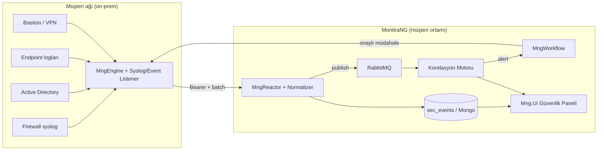
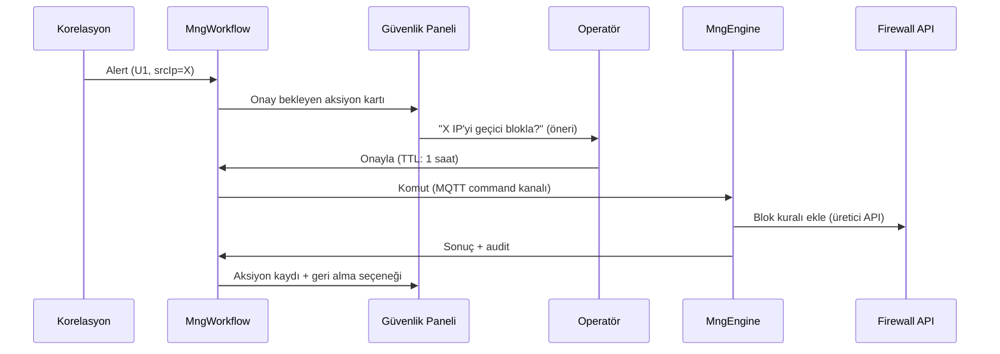

# SIEM-Hafif Çözümü — Planlama (Odak)

**Durum:** Taslak — Faz 0 (çerçeve), görüş/karar için
**Son güncelleme:** 1 Haziran 2026
**Kapsam:** Müşterinin **kendi IT ortamındaki** güvenlik olaylarının toplanması, normalleştirilmesi, korelasyonu, uyarılması ve **onaylı müdahalesi**. On-prem.

> Bu doküman, mevcut MonitraNG Monitoring altyapısı (MngEngine, MngReactor, MngWorkflow, MngDataGateway, MngKeeper) üzerine **SIEM-hafif** bir katman tasarlar. Ürün geneli vizyon için bkz. `docs/content/security/CYBERSECURITY_SOLUTION_PLANNING.md`.

---

## 1. Amaç ve konumlandırma

**Hedef:** Tam ticari SIEM (Splunk/QRadar/Sentinel) yerine, **hedefli kullanım senaryoları** ile başlayan, müşteriye hızlı değer veren güvenlik odaklı izleme katmanı. Zamanla derinleştirilir.

**İlk faz veri kaynakları (karar):**

1. **Firewall** — syslog (deny/allow, trafik/olay logları)
2. **Active Directory** — login/kimlik olayları (başarısız/başarılı oturum, hesap kilitleme)
3. **Sunucu / endpoint** — Linux syslog, Windows Event Log
4. **Jump host / bastion / VPN** — erişim ve oturum logları

**Dağıtım:** On-prem — toplama ve işleme müşteri ağında. Veri müşteri sınırından çıkmaz.

**Tespit sonrası:** Onaylı müdahale — otomatik aksiyon yok; operatör onayıyla aksiyon (ör. firewall'da kaynak IP blok).

---

## 2. Mevcut altyapı → SIEM yetenek eşlemesi

| SIEM yeteneği | MonitraNG karşılığı | Durum | Boşluk |
|---|---|------|--------|
| **Collection (edge)** | MngEngine — poll (SSH/WMI/SNMP/HTTP) + push (syslog/trap/webhook/MQTT) | 🟡 | **Syslog listener** ve **Windows Event** kaynağı eklenmeli |
| **Transport / ingest** | MngReactor — batch ingest, decrypt/decompress, çoklu tenant, Bearer auth | 🟡 | Log/event için **ayrı ingest yolu + normalizasyon** |
| **Normalization / parsing** | — | 🔴 | Reactor'a **parser/normalizer** katmanı (kaynak → ortak şema) |
| **Storage** | MongoDB Time Series `mon_metrics` + TTL | 🟡 | Olaylar için **`sec_events`** koleksiyonu + uzun retention |
| **Correlation / detection** | MngWorkflow — IFTTT, tek-metrik eşik, RabbitMQ consumer | 🟡 | **Stateful, çok-olaylı korelasyon** motoru |
| **Enrichment (threat intel)** | — | 🔴 | Bilinen kötü IP/hash listesi eşleştirme (Faz 2) |
| **Alerting / response** | MngWorkflow aksiyonları (notification/http/email/ui) | ✅ | Onaylı müdahale akışı (operatör onayı) |
| **Case management** | MngOperations WorkItem (Operation Core) | 🟡 | Alert → WorkItem (incident) bağı |
| **Dashboard / UI** | Mng.Ui monitoring panelleri | 🟡 | Güvenlik paneli + alert akışı |
| **Multi-tenant / IAM / audit** | MngKeeper, domain izolasyonu, RBAC | ✅ | — |
| **Retention / WORM** | TTL (metrik) | 🔴 | Uyum için uzun/değiştirilemez saklama politikası |

> Durum kodları: ✅ var · 🟡 kısmi · 🔴 yok

---

## 3. Monitoring ↔ SIEM gap analizi

Mevcut yapı **metrik izleme** (sayısal zaman serisi) için tasarlandı. SIEM **log/event** odaklıdır. Temel farklar ve aksiyonlar:

| Boyut | Monitoring (mevcut) | SIEM gereksinimi | Aksiyon |
|-------|---------------------|------------------|---------|
| **Veri tipi** | Sayısal metrik (`value`, `unit`) | Yapılandırılmış olay (actor, action, src/dst, outcome) | Yeni event şeması (§4) |
| **Şema** | Sabit, sayısal | Heterojen kaynaklar → ortak alanlar | Normalizasyon katmanı (§5) |
| **Tetikleme** | Tek metrik eşiği | Çok-olay, zaman pencereli korelasyon | Korelasyon motoru (§7) |
| **Saklama** | Kısa TTL (gün) | Uzun, değiştirilemez (ay/yıl) | Retention politikası (§9) |
| **Sorgu** | Zaman serisi agregasyon | Olay arama, drill-down, timeline | Event index + arama API |
| **İstihbarat** | Yok | IoC / threat intel eşleştirme | Enrichment (Faz 2) |

---

## 4. Güvenlik olayı veri modeli (`sec_events`)

SIEM'in çekirdeği: kaynak ne olursa olsun olayları **ortak, normalleştirilmiş** bir şemaya indirgemek. ECS (Elastic Common Schema) / CEF mantığıyla hizalı, sade bir model öneriyoruz.

**Koleksiyon:** `sec_events` — MongoDB, `mng_{domain_name}` veritabanı. (Time Series değil; sorgulanabilir, indeksli belge koleksiyonu.)

| Alan | Tip | Açıklama |
|------|-----|----------|
| `@timestamp` | datetime | Olayın gerçekleştiği an (kaynaktan) |
| `ingestedAt` | datetime | Reactor'a ulaşma anı |
| `domain` | text | Tenant |
| `source.type` | text | `firewall` \| `ad` \| `endpoint` \| `bastion` |
| `source.product` | text | Cihaz/ürün (ör. `fortigate`, `windows`, `linux-syslog`) |
| `source.host` | text | Kaynak cihaz/agent |
| `event.category` | text | `authentication` \| `network` \| `process` \| `config_change` |
| `event.action` | text | Ör. `login_failed`, `denied_flow`, `rule_change` |
| `event.outcome` | text | `success` \| `failure` \| `unknown` |
| `event.severity` | number | 0–10 normalize |
| `actor.user` | text | İlgili kullanıcı/hesap |
| `network.srcIp` | text | Kaynak IP |
| `network.dstIp` | text | Hedef IP |
| `network.dstPort` | number | Hedef port |
| `network.protocol` | text | tcp/udp/proto |
| `message` | text | Ham/özet mesaj |
| `raw` | object | Orijinal log (denetim/forensic için) |
| `tags` | array | Etiketler (ör. `ot-boundary`, `privileged`) |

**İlkeler:**
- `raw` her zaman saklanır (forensic + parser hatası kurtarma).
- Hassas alanlar (kullanıcı adı vb.) KVKK/ISO için minimize edilebilir; politika §9.
- İndeksler: `@timestamp`, `source.type`, `event.action`, `network.srcIp`, `actor.user`.

---

## 5. Mimari akış



**Akış adımları:**
1. **Toplama (Engine):** Syslog (UDP/TCP 514) ve Windows Event listener; mevcut push modu altyapısıyla uyumlu. Olaylar batch'lenip Reactor'a gönderilir.
2. **Normalizasyon (Reactor):** Kaynak tipine göre parser → `sec_events` ortak şema. `raw` saklanır.
3. **Kalıcılık:** `sec_events` koleksiyonuna yazılır; paralel RabbitMQ publish.
4. **Korelasyon:** Olay akışından stateful kurallar (§7) çalışır; eşleşmede alert üretilir.
5. **Uyarı + onaylı müdahale (Workflow):** Alert → bildirim/UI; operatör onaylarsa Engine üzerinden firewall API'sine aksiyon (§8).
6. **Görselleştirme:** UI'da olay arama, timeline, alert akışı.

> **Korelasyon motoru nerede? (KARAR VERİLDİ)** Ayrı bir tespit katmanı: platform geneli **Alarm & Rule Engine** (major §4.2). SIEM korelasyonu bu motorun **bir kural ailesidir** — ayrı bir SIEM-özel servis değil. `sec_events` akışını tüketip alarm üretir, MngWorkflow bu alarmı Event Trigger ile tüketir. Detay: `docs/odak/alarm/ALARM_RULE_ENGINE_PLAN.md` ve `docs/odak/workflow/Workflow Backend Implementation Plan v1.md` §12.

---

## 6. İlk faz kullanım senaryoları (MVP)

| ID | Senaryo | Kaynak | Tespit mantığı |
|----|---------|--------|----------------|
| **U1** | Brute-force / şifre denemesi | AD, bastion, endpoint | X dakikada N başarısız login (aynı hesap veya kaynak IP) |
| **U2** | Başarısız sonrası başarılı login | AD, bastion | Eşik üstü başarısız → ardından başarılı (olası ele geçirme) |
| **U3** | Bakım penceresi dışı erişim | bastion, AD | İzinli pencere dışında ayrıcalıklı oturum |
| **U4** | Firewall'da yasak akış / politika ihlali | firewall | Beklenmeyen port/protokol; deny artışı |
| **U5** | Sınırda trafik sıçraması (DDoS belirtisi) | firewall | Hedef IP/port'a eşik üstü hacim/oturum |
| **U6** | Firewall kural/config değişikliği | firewall | `event.action = rule_change` + kullanıcı |
| **U7** | Yeni/bilinmeyen kaynak | firewall, AD | Baseline sonrası ilk kez görülen src→dst (Faz 2, yanlış-pozitif riski) |

**MVP önceliği:** U1, U2, U4 (en yüksek anlatılabilir değer, düşük yanlış-pozitif) → ardından U3, U5, U6 → U7 (baseline gerektirir, pilot).

---

## 7. Korelasyon kuralları (MVP)

Mevcut MngWorkflow tek-metrik/eşik bazlı; SIEM **çok-olaylı, zaman pencereli, stateful** kural ister.

**Kural modeli (öneri — `sec_rules` dataset):**

| Alan | Açıklama |
|------|----------|
| `name` / `description` | Kural adı |
| `enabled` | Aktif/pasif |
| `severity` | Üretilecek alert ciddiyeti |
| `match` | Olay filtresi (source.type, event.action, outcome…) |
| `groupBy` | Pencere içinde gruplama anahtarı (ör. `actor.user`, `network.srcIp`) |
| `window` | Zaman penceresi (ör. 5 dk) |
| `threshold` | Pencere içi eşik (ör. ≥ 10) |
| `sequence` | (opsiyonel) sıralı olay zinciri (U2: failure* → success) |
| `cooldownMinutes` | Aynı grup için tekrar tetikleme bekleme |
| `actions` | Alert + (opsiyonel) onaylı müdahale referansı |

**Örnek (U1 — brute force):**
```json
{
  "name": "Brute force - başarısız login",
  "match": { "event.category": "authentication", "event.outcome": "failure" },
  "groupBy": ["actor.user", "network.srcIp"],
  "window": "5m",
  "threshold": 10,
  "severity": 7,
  "cooldownMinutes": 15
}
```

---

## 8. Tespit sonrası: onaylı müdahale akışı

**Karar:** Otomatik kalıcı blok yok. Akış **operatör onayı** gerektirir.

> **Workflow desteği (KARAR VERİLDİ):** Bu akışın tamamı MngWorkflow engine ile karşılanır — Event Trigger (alert) → Approval node (operatör onayı, long-running) → Block IP action node (Engine komut kanalı) → TTL için Block→Delay→Unblock (MngScheduler) → audit (`@workflow_node_executions`) → Create WorkItem (incident). Eşleme tablosu: `docs/odak/workflow/Workflow Backend Implementation Plan v1.md` §12.2.



**Tasarım notları:**
- Müşteri firewall API'sine erişim **müşteri ağı içinden** (Engine) yapılır — on-prem ile uyumlu.
- Her aksiyon: **audit log** (kim onayladı, ne zaman, hangi kural), **TTL** ve **geri alma (rollback)**.
- Firewall entegrasyonu üreticiye bağlı → **entegrasyon kataloğu** (hangi marka, hangi API, kimlik bilgisi) ve güvenli sır yönetimi gerekir.
- MQTT `command` kanalı bu amaçla altyapıda zaten hazır (bkz. Reactor mimarisi §7.1).

---

## 9. Saklama, gizlilik ve uyum

| Konu | Yaklaşım |
|------|----------|
| **Retention** | İki kademe: sıcak (sorgulanabilir, ör. 90 gün) + arşiv (uzun süre, sıkıştırılmış). ISO/forensic için süre müşteriyle netleşir. |
| **Değiştirilemezlik (WORM)** | `raw` olaylar için yazma-sonrası değişmezlik; en azından append-only + audit. |
| **Gizlilik (KVKK)** | Hassas alan minimizasyonu / maskeleme politikası; OC field-level masking pattern'i referans. |
| **Erişim** | Güvenlik olaylarına erişim ayrı RBAC rolü (least privilege). |
| **Audit** | Tüm sorgu/erişim ve müdahale aksiyonları denetim izine yazılır. |

---

## 10. ISO/IEC 27001 katkısı

Bu çözüm `docs/odak/compliance/ISO27001_PLAN.md` içindeki şu kontrollere doğrudan katkı sağlar:

| Kontrol | Başlık | Katkı |
|---------|--------|-------|
| **A.8.15** | Loglama | Merkezi güvenlik log toplama (§4–5) |
| **A.8.16** | İzleme faaliyetleri | Korelasyon + alert (§7) |
| **A.5.7** | Threat intelligence | Enrichment (Faz 2) ile 🔴→🟡 |
| **A.5.24–28** | Olay yönetimi | Alert → WorkItem (incident) bağı |
| **A.8.20–22** | Ağ güvenliği | Firewall/sınır görünürlüğü (U4–U7) |
| **A.5.30** | İş sürekliliği için ICT hazırlığı | Erken tespit + müdahale |

> Bu doküman onaylandıktan sonra ilgili kalemler `docs/odak/compliance/COMPLIANCE_ROADMAP.md`'a epik olarak işlenmeli.

---

## 11. Fazlar (yol haritası)

| Faz | Odak | Çıktılar |
|-----|------|----------|
| **0 — Çerçeve** | Bu doküman; kaynak envanteri, MVP senaryo seçimi, RACI | Plan, karar listesi |
| **1 — Toplama & normalizasyon** | Syslog/Event listener (Engine) + Reactor normalizer + `sec_events` | Çalışan ingest, ortak şema, ham saklama |
| **2 — Tespit & uyarı** | Korelasyon motoru (U1/U2/U4) + alert + güvenlik paneli | Kural seti MVP, alert akışı, dashboard |
| **3 — Onaylı müdahale** | Workflow onay akışı + 1 firewall entegrasyonu (pilot marka) | Onaylı blok + audit + rollback |
| **4 — Derinleştirme** | Enrichment (threat intel), U3/U5/U6/U7, retention/WORM, incident (WorkItem) bağı, ISO raporları | Genişletilmiş kapsam + uyum kanıtı |

---

## 12. Açık kararlar

1. ~~**Korelasyon motoru:** MngWorkflow genişletme mi, ayrı `MngCorrelator` servisi mi?~~ **KARAR VERİLDİ → platform geneli Alarm & Rule Engine** (major §4.2); SIEM korelasyonu onun bir kural ailesi. Workflow alarmı Event Trigger ile tüketir. (bkz. §5 notu, §8, `docs/odak/alarm/ALARM_RULE_ENGINE_PLAN.md`, Workflow Plan §12)
2. **Syslog toplama yeri:** Engine içinde mi, ayrı hafif collector mı? Yüksek hacimde (firewall) performans.
3. **Firewall pilot marka:** İlk entegrasyon hangi üretici (API + kimlik bilgisi)? Müşteri envanteri gerekli.
4. **`sec_events` saklama:** MongoDB yeterli mi, yoksa olay hacmi için arama-optimize bir store (ör. OpenSearch) değerlendirilecek mi?
5. **Retention süreleri:** Sıcak/arşiv süreleri ve WORM gereksinimi müşteri/ISO ile netleşmeli.
6. **Baseline (U7):** Yeni-kaynak tespiti için baseline süresi ve yanlış-pozitif tolere politikası.

---

## 13. Sonraki adımlar

1. Müşteri **kaynak envanteri**: firewall marka/model, AD yapısı, bastion ürünü, endpoint OS dağılımı.
2. **MVP senaryo onayı** (U1/U2/U4) ve örnek log örnekleri toplama (parser tasarımı için).
3. **Faz 1 teknik spike:** Engine syslog listener + Reactor normalizer + `sec_events` şeması — teknik fizibilite.
4. §12 açık kararların kapatılması (özellikle korelasyon motoru ve firewall pilot marka).
5. Onay sonrası ISO kalemlerinin `COMPLIANCE_ROADMAP.md`'a taşınması.

---

## 14. Referanslar

- Ürün geneli vizyon: `docs/content/security/CYBERSECURITY_SOLUTION_PLANNING.md`
- Reactor mimarisi: `docs/content/monitoring_plans/MONITORING_REACTOR_ARCHITECTURE.md`
- Engine mimarisi: `docs/content/monitoring_plans/MONITORING_ENGINE_ARCHITECTURE.md`
- Workflow planı: `docs/content/monitoring_plans/MONITORING_WORKFLOW.md`
- ISO 27001 eşlemesi: `docs/odak/compliance/ISO27001_PLAN.md`
- Odak indeksi: [README.md](./README.md)
