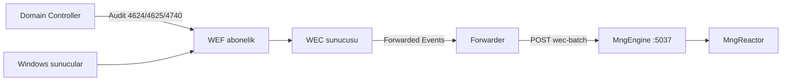

# WEF / WEC kurulum ve forwarder şablonu

**Durum:** ✅ Müşteri ops şablonu (4 Haz 2026)  
**İlişkili:** [SIEM_WEF_WEC_INGEST.md](./SIEM_WEF_WEC_INGEST.md) · [SIEM_PLANNING.md §5](./SIEM_PLANNING.md#5-mimari-akış)

Domain Windows makineler **Windows Event Forwarding (WEF)** ile olayları **Windows Event Collector (WEC)** sunucusunda toplar. MonitraNG **MngEngine** Linux container olduğu için WEC üzerindeki `Forwarded Events` kanalını doğrudan okuyamaz; WEC tarafında bir **forwarder** olayları HTTP ile Engine'e push eder.

---

## 1. Mimari özeti



| Rol | Sorumlu | Not |
|-----|---------|-----|
| Audit policy + WEF GPO | Müşteri IT | DC Security log |
| WEC sunucusu | Müşteri IT | 1 VM (pilot), shard (prod) |
| Forwarder agent | Müşteri IT veya MonitraNG şablon | NxLog / PowerShell (lab) |
| Engine `wec-batch` | MonitraNG | ✅ implementasyon |
| Parser `windows.security.v1` | MonitraNG | ✅ 4624/4625/4740 |

---

## 2. Ön koşullar

| # | Kontrol |
|---|---------|
| 1 | Domain'e join Windows Server (WEC için) |
| 2 | DC ve kaynaklarda **Advanced Audit Policy** — en az Logon/Logoff (4624, 4625, 4740) |
| 3 | WEC ↔ Engine arası TCP **5037** (HTTP) — firewall kuralı |
| 4 | Engine `MngEngine:SecEventQueue:WecIngestEnabled=true` |
| 5 | Reactor erişimi — Engine `config.txt` içinde Reactor URL + token |

**Odak lab:** Engine `http://192.168.20.20:5037`, WEC yoksa fixture forwarder ile S5 E2E yeterli.

---

## 3. WEC sunucusu kurulumu (özet)

### 3.1 Windows Event Collector servisi

WEC sunucusunda (yönetici PowerShell):

```powershell
wecutil qc /q
Set-Service -Name Wecsvc -StartupType Automatic
Start-Service Wecsvc
```

### 3.2 Source-initiated abonelik (GPO ile önerilen)

1. **Computer Configuration → Policies → Administrative Templates → Windows Components → Event Forwarding**
   - `Configure target Subscription Manager` → `Server=HTTPS://WEC01.fqdn:5986/wsman/SubscriptionManager/WEC,Refresh=3600`
2. Kaynak makinelerde **Windows Remote Management (WinRM)** etkin olmalı.
3. WEC'de abonelik oluşturun — örnek XPath (Security, dar filtre):

```xml
<QueryList>
  <Query Id="0" Path="Security">
    <Select Path="Security">
      *[System[(EventID=4624 or EventID=4625 or EventID=4740 or EventID=4720 or EventID=4728 or EventID=4732 or EventID=4771)]]
    </Select>
  </Query>
</QueryList>
```

4. Abonelik tipi: **Source-initiated**, delivery: **Normal** veya **Minimize Bandwidth** (yüksek hacimde).

### 3.3 Doğrulama

WEC'de `Event Viewer → Applications and Services Logs → Microsoft → Windows → EventCollector → Operational` ve `Forwarded Events` kanalında olay akışı görülmeli.

---

## 4. Forwarder → Engine

**Hedef URL:**

```text
http://<engine-host>:5037/api/SecEvents/wec-batch
```

**JSON gövde** ([SIEM_WEF_WEC_INGEST.md §2](./SIEM_WEF_WEC_INGEST.md)):

- `items[].raw` — Windows Event alanları (`EventID`, `TimeCreated`, `TargetUserName`, `IpAddress`, …)
- `items[].source.host` — WEC FQDN (ör. `WEC01.odak.local`)
- `autoFlush: true` — batch sonrası Engine kuyruğu Reactor'a flush eder

### 4.1 Lab — PowerShell forwarder (fixture veya Event Log)

Repo scripti WEC olmadan da çalışır:

```powershell
# Fixture modu (geliştirme / Odak S5 benzeri)
pwsh -NoProfile -ExecutionPolicy Bypass -File .\scripts\wef\Forward-WecEventsToEngine.ps1 `
  -EngineUrl "http://192.168.20.20:5037" `
  -Source Fixture `
  -WecHost "WEC01.odak.local"

# WEC sunucusunda — Forwarded Events'ten canlı okuma
pwsh -NoProfile -ExecutionPolicy Bypass -File .\scripts\wef\Forward-WecEventsToEngine.ps1 `
  -EngineUrl "http://<engine-ip>:5037" `
  -Source EventLog `
  -MaxEvents 50 `
  -Continuous
```

Scheduled Task veya Windows Service olarak periyodik çalıştırılabilir (pilot).

### 4.2 Production — NxLog şablonu

Şablon dosya: [templates/nxlog-wec-to-engine.conf](./templates/nxlog-wec-to-engine.conf)

Kurulum adımları:

1. [NxLog Community/Enterprise](https://nxlog.co/) WEC sunucusuna kurulur.
2. `ENGINE_URL`, `WEC_HOST` ortam değişkenleri veya conf içinde güncellenir.
3. `im_msvistalog` → `Forwarded Events` kanalı, Event ID filtresi.
4. `om_http` modülü JSON batch POST (NxLog `$BatchMode` veya özel exec ile birleştirme — basit POC için PowerShell forwarder tercih edilebilir).

> **Not:** NxLog'da doğrudan MonitraNG batch JSON formatı için `xm_json` + `om_http` pipeline müşteri ortamına göre ince ayar gerektirir. MVP pilot için **§4.1 PowerShell forwarder** yeterli kanıt sağlar; NxLog şablonu başlangıç noktasıdır.

---

## 5. Engine limitleri

| Ayar | Varsayılan | Açıklama |
|------|------------|----------|
| `MaxWecBatchItems` | 500 | Tek `wec-batch` isteği üst sınırı (400 döner) |
| `MaxReactorBatchItems` | 200 | Reactor'a parçalı gönderim |
| `ReactorSendRetryCount` | 3 | Geçici hata yeniden deneme |
| `BatchThreshold` | 100 | Kuyruk eşiği → otomatik flush |

---

## 6. E2E ve doğrulama

| Script | Açıklama |
|--------|----------|
| `scripts/odak/test-engine-wec-ingest-e2e.ps1` | S5 — fixture batch → Engine → Reactor |
| `scripts/wef/Forward-WecEventsToEngine.ps1` | WEC forwarder simülasyonu / canlı |
| `scripts/odak/test-siem-u1-alarm-e2e.ps1` | 4625 → U1 brute-force alarm |

Mongo doğrulama:

```powershell
pwsh scripts/odak/test-engine-wec-ingest-e2e.ps1 -VerifyOdakMongo
```

---

## 6.1 NxLog prod doğrulama (checklist)

Müşteri ortamında şablon ([templates/nxlog-wec-to-engine.conf](./templates/nxlog-wec-to-engine.conf)) devreye alınırken:

| # | Kontrol |
|---|---------|
| 1 | WEC `Forwarded Events` kanalında 4624/4625/4720/4728 olayları görünüyor |
| 2 | NxLog `Output` hedefi Engine `http://HOST:5037/api/SecEvents/wec-batch` |
| 3 | JSON `EventID` + `TimeCreated` + `TargetUserName` alanları dolu |
| 4 | Engine `WecIngestEnabled=true` · Reactor token geçerli |
| 5 | Odak lab smoke: `test-nxlog-wec-template-e2e.ps1` (Engine wec-batch format) |

---

## 7. Sorun giderme

| Belirti | Olası neden | Çözüm |
|---------|-------------|--------|
| `503 wec_ingest_disabled` | `WecIngestEnabled=false` | Engine appsettings / config |
| `400 batch_too_large` | Forwarder çok büyük batch | `MaxWecBatchItems` veya forwarder batch boyutu |
| `enqueued` OK, Mongo boş | Reactor token / flush hatası | Engine log, `POST /api/SecEvents/flush` |
| Forwarded Events boş | WEF GPO / WinRM / firewall | WEC operational log, `wecutil gs` |
| `login_failed` yok | Parser EventID alanı | `raw.EventID` veya `EventRecordID` formatı |

---

## 8. İlgili dokümanlar

- [SIEM_WEF_WEC_INGEST.md](./SIEM_WEF_WEC_INGEST.md) — Engine API
- [SIEM_PARSER_PLAN.md](./SIEM_PARSER_PLAN.md) — `windows.security.v1`
- [SIEM_FAZ1_SPIKE.md](./SIEM_FAZ1_SPIKE.md) — Spike A/B kararı
