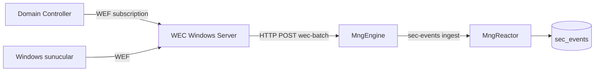

# WEF → WEC → Engine HTTP batch ingest

**Durum:** ✅ Engine endpoint implementasyonu (4 Haz 2026)  
**İlişkili:** [SIEM_PLANNING.md §5](./SIEM_PLANNING.md#5-mimari-akış) · [SIEM_FAZ1_SPIKE.md §3.1](./SIEM_FAZ1_SPIKE.md)

---

## 1. Mimari

Domain Windows makineler **WEF** ile olayları **WEC** sunucusuna iletir. MonitraNG Engine (Linux container) WEC üzerindeki `Forwarded Events` logunu doğrudan okuyamaz; **push** modeli kullanılır:



| Katman | Bileşen | Durum |
|--------|---------|--------|
| Müşteri | WEF GPO + WEC kurulumu | Müşteri IT |
| WEC tarafı | Forwarder (NxLog / Winlogbeat / özel agent) | Planlı — WEC'den Engine'e POST |
| Engine | `POST /api/SecEvents/wec-batch` | ✅ |
| Reactor | `windows.security.v1` parser | ✅ |

> **Not:** Engine üzerinde native Event Log okuma (SIEM §5.4 yol A) için ileride WEC host'ta Windows sidecar düşünülebilir. MVP push yolu lab ve prod POC için yeterlidir.

---

## 2. Engine API

**Endpoint:** `POST /api/SecEvents/wec-batch`

**Body (örnek):**

```json
{
  "autoFlush": true,
  "items": [
    {
      "receivedAt": "2026-06-04T09:00:00.000Z",
      "source": {
        "type": "ad",
        "product": "windows",
        "host": "WEC01.odak.local"
      },
      "raw": {
        "EventID": 4625,
        "TimeCreated": "2026-06-04T09:00:00.000Z",
        "TargetUserName": "admin",
        "IpAddress": "192.168.1.50",
        "Status": "0xC000006D"
      }
    }
  ]
}
```

| Alan | Açıklama |
|------|----------|
| `autoFlush` | `true` (varsayılan): batch sonrası kuyruk Reactor'a flush edilir |
| `items[].raw` | Windows Event JSON veya syslog string |
| `items[].source.host` | WEC veya kaynak host adı |

**Yanıt:**

```json
{
  "enqueued": 1,
  "queueDepth": 0,
  "flushed": true,
  "accepted": 1,
  "published": 1
}
```

**Konfigürasyon** (`MngEngine:SecEventQueue`):

| Ayar | Varsayılan | Açıklama |
|------|------------|----------|
| `WecIngestEnabled` | `true` | Endpoint açık/kapalı |
| `DefaultWecHost` | `wec` | `source` yoksa host adı |

---

## 3. E2E doğrulama

```powershell
# Engine → Reactor (Mongo atlanır)
pwsh -NoProfile -ExecutionPolicy Bypass -File .\scripts\odak\test-engine-wec-ingest-e2e.ps1

# Odak Mongo ile tam doğrulama
pwsh -NoProfile -ExecutionPolicy Bypass -File .\scripts\odak\test-engine-wec-ingest-e2e.ps1 -VerifyOdakMongo
```

Fixture: `tests/fixtures/siem/windows_4625_failed_logon.json` (Event ID 4625 → `login_failed`)

**Deploy sonrası:** Engine config gerekir — `pwsh scripts/odak/setup-mngengine-odak.ps1 -ApplyConfig`

---

## 4. WEC forwarder (müşteri tarafı — şablon)

Production'da WEC sunucusunda forwarder şu hedefe POST eder:

```text
http://<engine-host>:5037/api/SecEvents/wec-batch
```

Forwarder, `Forwarded Events` kanalından 4624/4625/4740 vb. filtrelenmiş olayları yukarıdaki JSON formatına dönüştürür. Detaylı GPO/WEC kurulum şablonu ayrı ops dokümanında (TODO).

---

## 5. İlgili testler

| Script | Akış |
|--------|------|
| `test-engine-syslog-s4.1.ps1` | Firewall syslog → Engine |
| `test-engine-wec-ingest-e2e.ps1` | WEC batch → Engine |
| `test-siem-u1-alarm-e2e.ps1` | login_failed → alarm (Reactor HTTP) |
