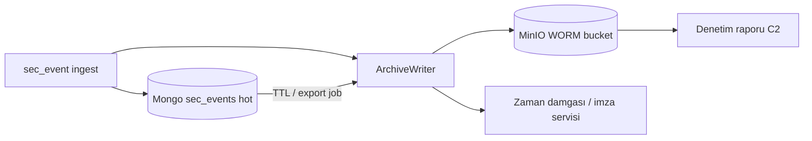

# SIEM Faz C — 5651 / WORM arşiv spike (LogAlarm parite)

**Durum:** Spike / planlama · implementasyon başlamadı  
**Öncelik:** P0 (Türkiye pazarı) · [SIEM_LOGALARM_PARITY_ROADMAP.md](./SIEM_LOGALARM_PARITY_ROADMAP.md) C1  
**Son güncelleme:** 4 Haziran 2026

---

## 1. Amaç

5651 sayılı Kanun kapsamında **log bütünlüğü, zaman damgası/imza ve değiştirilemez arşiv** gereksinimlerini MonitraNG SIEM hattına (`sec_events`) taşımak. LogAlarm’ın en belirgin parite boşluğu burada.

**MVP zinciri (U1–U7) bu epikten bağımsızdır** — operasyonel SIEM çalışır; uyum katmanı eklenir.

---

## 2. Mevcut durum

| Bileşen | Durum |
|---------|--------|
| `sec_events` hot store (Mongo) | ✅ Operasyonel arama |
| `raw` alanı forensic | ✅ Parse başarısız olsa bile saklanır |
| Append-only / WORM | 🔴 Yok — update/delete API yok ama DB düzeyinde koruma yok |
| 5651 zaman damgası / imza | 🔴 Yok |
| Soğuk arşiv (MinIO / object lock) | 🔴 Yok |
| Denetim raporu (C2) | 🔴 Yok |

---

## 3. Hedef mimari (öneri)



### Katmanlar

| Katman | Süre | Teknoloji | Not |
|--------|------|-----------|-----|
| **Hot** | 30–90 gün | Mongo `sec_events` | Mevcut SIEM UI / alarm |
| **Warm** | 1–2 yıl | MinIO standard | Sıkıştırılmış günlük/aylık paketler |
| **Cold WORM** | Yasal süre | MinIO Object Lock (COMPLIANCE) | Append-only, silme yasak |

---

## 4. C1 implementasyon dilimleri

| Dilim | Kapsam | Bağımlılık |
|-------|--------|------------|
| **C1.0** | Spike tamam — bu doküman | — |
| **C1.1** | `SecEventArchiveWriter` — ingest sonrası async JSONL → MinIO (`mng-{domain}/siem-archive/`) | MngReactor, MinIO mevcut |
| **C1.2** | Object Lock bucket policy + retention günü (appsettings) | MngAdmin / ops |
| **C1.3** | Hash zinciri (önceki paket SHA-256 + manifest) | C1.1 |
| **C1.4** | TSA / imza entegrasyonu (Kamu SM veya müşteri HSM) | Hukuk + vendor seçimi |
| **C1.5** | Hot TTL index (opsiyonel export sonrası) | C1.1 |

**İlk kod dilimi (C1.1) tahmini:** Reactor’da fire-and-forget archive queue; Rabbit `sec_events.archive` veya ingest pipeline hook.

---

## 5. Veri sözleşmesi (arşiv paketi)

```json
{
  "packageId": "uuid",
  "domainName": "odak",
  "periodStart": "2026-06-04T00:00:00Z",
  "periodEnd": "2026-06-04T23:59:59Z",
  "eventCount": 1234,
  "contentSha256": "...",
  "previousPackageSha256": "...",
  "sealedAt": "2026-06-05T01:00:00Z",
  "tsaToken": null
}
```

Olay gövdesi: NDJSON satırları, sıkıştırma `gzip`. Paket kapatıldığında manifest yazılır; Object Lock retention başlar.

---

## 6. Açık kararlar

1. **Imza sağlayıcısı:** Kamu SM, müşteri CA, yoksa yalnızca hash zinciri (hukuk onayı)?
2. **Hot retention süresi:** 30 / 60 / 90 gün — müşteri sözleşmesi.
3. **Archive tetikleyici:** Anlık (her ingest) vs batch (saatlik/günlük)?
4. **KVKK:** Kişisel veri maskeleme arşiv öncesi gerekli mi?

---

## 7. Test / kanıt

| Test | Açıklama |
|------|----------|
| Unit | Archive manifest hash zinciri |
| Integration | Ingest → MinIO paket → Object Lock delete reddi |
| Ops | `diagnostic-siem-archive.ps1` (planlanacak) |

---

## 8. Referanslar

- [SIEM_LOGALARM_COMPARISON.md](./SIEM_LOGALARM_COMPARISON.md) §3.5
- [SIEM_PLANNING.md](./SIEM_PLANNING.md) § retention / WORM
- [SIEM_PERFORMANCE_PLAN.md](./SIEM_PERFORMANCE_PLAN.md) — katmanlı retention
