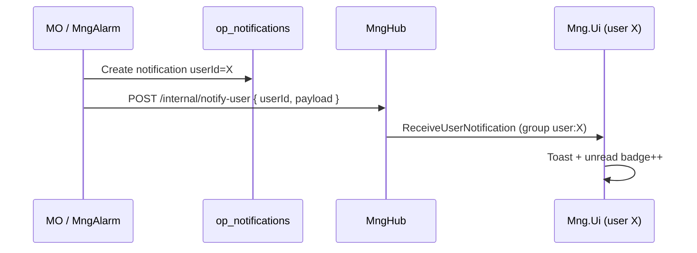

# Uygulama içi bildirim + anlık toaster

**Son güncelleme:** 7 Haziran 2026  
**Durum:** ✅ **T1–T3 + T5 canlı (Odak)** — MO toaster doğrulandı (OCD-0102). Sırada: T4 (alarm dispatch), kalan smoke maddeleri.

**Kapsam:** MO work item olayları + Alarm policy dispatch (ortak altyapı).  
**İlişkili:** [ALARM_NOTIFICATION_POLICIES.md](../alarm/ALARM_NOTIFICATION_POLICIES.md) · MO: `op_notification_policies`

---

## 1. Karar özeti (kilitli)

| Konu | Karar |
|------|--------|
| Inbox | Her inApp bildirim **`op_notifications`** kaydı (toaster dahil) |
| Toaster | `inApp` kanalının **alt modu**: `settings.pushToast: true` (ayrı `toast` kanalı yok) |
| Teslimat | Kalıcı kayıt + **MngHub kullanıcı hedefli push** |
| Offline | Hub yoksa yalnızca inbox; girişte zil/poll ile görünür |
| Hedefleme | **Yalnızca `userId` eşleşen** istemci toast alır (domain broadcast yok) |
| MO | Mevcut orchestrator genişletilir (create sonrası Hub push) |
| Alarm | [ALARM_NOTIFICATION_POLICIES.md](../alarm/ALARM_NOTIFICATION_POLICIES.md) dispatch aynı yazıcıyı kullanır |

---

## 2. Kanal modeli (MO + Alarm UI)

Policy formunda:

```
☑ Uygulama içi (inbox)
    ☑ Anlık toaster göster   → settings.pushToast
☑ E-posta
    [şablon combobox]
```

`channels` dizisi: `["inApp"]`, `["email"]`, `["inApp","email"]`.  
`pushToast` yalnızca `inApp` seçiliyken anlamlı.

---

## 3. Veri modeli (`op_notifications` — genişletme)

Mevcut alanlar korunur. Opsiyonel ek alanlar:

| Alan | Açıklama |
|------|----------|
| `sourceDataset` | `alarms` \| `op_work_items` |
| `sourceRecordId` | alarmId / workItemId |
| `severity` | Alarm için (toast rengi) |
| `deepLink` | `/apps/alarm-center/alarms?...` veya WI profil URL |

`notificationType` örnekleri: `AlarmRaised`, `WorkItemTransitioned`, `CommentMention`, …

---

## 4. Hub mimarisi

### Bugünkü boşluk

- Hub **domain room** — tüm domain kullanıcılarına event
- `op_notifications` **dinlenmiyor**
- Kullanıcı bazlı SignalR group yok

### Hedef



### MngHub değişiklikleri

| Madde | Açıklama |
|-------|----------|
| Connection | JWT → `Groups.AddToGroupAsync(connectionId, "user:{mngPersonId}")` |
| Hub metodu | `ReceiveUserNotification` (client handler) |
| Internal API | `POST /api/v1/internal/user-notify` + `X-Monitra-Notify-Key` (DG chat mention ile aynı desen) |
| Payload | `{ notificationId, title, message, notificationType, deepLink, severity?, createdAt }` |

### MO / Alarm backend

Paylaşılan helper (MO Infrastructure veya küçük shared contract):

```text
CreateInAppNotificationAsync(userId, payload)
  → DG op_notifications INSERT
  → if pushToast: Hub internal notify
```

---

## 5. Mng.Ui değişiklikleri

| Bileşen | İş |
|---------|-----|
| `composables/useAppToast.ts` | Kuyruk, severity renk, action link, auto-dismiss |
| `layouts` veya `app.vue` | Tek global `v-snackbar` |
| `plugins/oc-notifications-hub.client.ts` | Hub subscribe → toast + `NotificationDD` refresh |
| `NotificationDD.vue` | Hub ile anlık badge; 60 sn poll yedek |
| MO policy dialog | `pushToast` checkbox (mail sekmesi / bildirim politikaları) |
| Alarm policy dialog | Aynı checkbox |

**Toast UX (öneri):**

| notificationType / severity | Davranış |
|----------------------------|----------|
| Alarm severity ≥ 8 | Kırmızı, 12 sn veya sticky |
| Normal WI | Mavi/gri, 6 sn |
| Tıklama | `deepLink` navigate |

---

## 6. MO orchestrator güncellemesi

`NotificationOrchestratorService.CreateInAppNotificationsAsync`:

1. Mevcut DG create (değişmez)
2. Policy `settings.pushToast === true` ise Hub notify
3. Yerleşik atama/mention da policy'den bağımsız `pushToast: true` varsayılanı **açık** (ürün kararı — mention/atama anlık görünsün)

MO policy kaydına `settings` object UI'dan yazılır.

---

## 7. Implementasyon fazları

| Faz | İçerik | Servisler |
|-----|--------|-----------|
| **T1** | Hub user group + internal notify API | MngHub |
| **T2** | `useAppToast` + hub plugin + layout | Mng.Ui |
| **T3** | MO orchestrator Hub push + policy `pushToast` UI | MO, Mng.Ui |
| **T4** | Alarm dispatch → aynı inApp yazıcı | MngAlarm, MO (opsiyonel client) |
| **T5** | `@notification_templates`, `toastSeverity`, okunur metin, policy UI | MO, Mng.Ui |
| **T4** | Alarm dispatch → aynı inApp yazıcı | MngAlarm |

**Sıra:** T1 → T2 → T3 → T5 ✅ → **AN-1→AN-2 (alarm policy)** → T4 → kalan smoke.

**Araya planlanan (ayrı oturum):** RabbitMQ diagnostics ve değerlendirme — exchange/kuyruk sağlığı, prefetch, DLQ, `mng.alarms` / `mng.workflow` / Reactor publish yolu. Bkz. [PLATFORM_HANDOFF.md](../PLATFORM_HANDOFF.md) §4.

---

## 8. Güvenlik

- Internal notify endpoint yalnızca servis ağı + API key
- Hub payload'da **hassas veri minimum** (title, message, id, link)
- Client yalnızca `user:{ownPersonId}` grubunda — başka kullanıcı event'i almaz

---

## 9. Test planı (smoke)

1. İki tarayıcı, farklı kullanıcı — A'ya WI atama, B toast almamalı
2. A hub bağlı — toast + zil +1
3. A hub kapalı — yalnızca poll sonrası zil
4. Alarm policy raised → seçilen 2 kullanıcıdan yalnızca ikisi toast
5. `pushToast: false` — inbox var, toast yok
