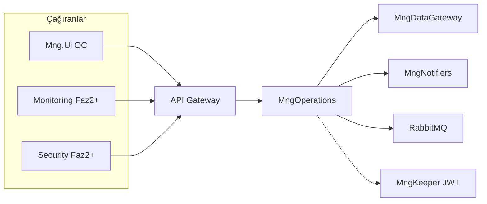

# MngOperations — Servis kapsamı

**Son güncelleme:** 26 Mayıs 2026

---

## 1. Konumlandırma

MngOperations, MonitraNG **Operation Core** modülünün runtime beynidir:

```text
Runtime configurable operational intelligence
= metadata (op_*) + runtime rules + RuntimeContext
```

Klasik task manager veya Jira klonu değildir. Major Plan **§4.8 Operational Workflow & Work Management** somut backend’idir ([major_plan](../major_plan.md)).

---

## 2. Ne yapar (Faz 1)

| Alan | Sorumluluk |
|------|------------|
| **Komut orkestrasyonu** | WorkItem create/update/transition/comment; `from-origin` ile dış modülden iş açma |
| **Transition gate** | Yalnızca `ApplyTransition(transitionKey)`; ham `stateId` patch yok |
| **Rule pipeline** | Default + validation; automation action’ları (inline) |
| **Permission merge** | Workspace, transition, group-first; field-level `visible/readonly/required/masked` |
| **RuntimeContext** | Form, Profile, Board, Dashboard — UI render verisi |
| **Timeline (read)** | `op_comments` + `op_activities` merge |
| **State segments (write)** | `op_work_item_timelines` transition sonrası |
| **WorkItem key** | Workspace prefix + sıralı kod (`TSK-00001`) |
| **SLA foundation** | Yanıt/çözüm due alanları hesaplama (working hours Faz 2) |
| **Bildirim** | `op_notifications` + `op_notification_policies`; MngNotifiers ile e-posta |
| **Olay yayını** | RabbitMQ: `oc.workitem.*` (consumer Faz 1’de zorunlu değil) |

---

## 3. Ne yapmaz (Faz 1)

| Konu | Nerede |
|------|--------|
| `op_*` **şema / metadata CRUD** | **MngDataGateway** (yönetici yapılandırma UI → DG) |
| Ham DG `PATCH` ile iş kuralı bypass | Yasak — operasyonel UI MngOperations komutları |
| UI business logic | **Mng.Ui** yalnızca RuntimeContext render |
| `if (type == …)` hardcoded kurallar | Yasak — `op_rules` + metadata |
| Async automation worker / kuyruk consumer | Faz 2+ |
| Tam escalation / working-hours SLA engine | Faz 2+ |
| AI inference / öneri | Faz 3+ |

---

## 4. Bounded context ilişkileri



---

## 5. Temel ilkeler

1. **Backend decides, UI renders** — [operationcore_phase1.md §2](../operationcore_phase1.md)
2. **Command + context API** — yazma komut; okuma `/runtime/*` ([OPERATION_CORE §5.2.5](../OPERATION_CORE_IMPLEMENTATION_PLAN.md))
3. **En kısıtlayan kazanır** — permission ve field behavior merge
4. **AI-ready iz** — activity, timeline segment, origin, SLA alanları bilinçli doldurulur
5. **Platform entegrasyonu** — `origin` ve RabbitMQ sözleşmesi Major Plan ile uyumlu

---

## 6. İlgili OC kararları

Tasarım kararları üst planda: [OPERATION_CORE_IMPLEMENTATION_PLAN.md §5.2](../OPERATION_CORE_IMPLEMENTATION_PLAN.md). Bu klasör **MngOperations backend planı ve servis** detayını taşır; kod `MngOperations/` solution klasöründedir.
