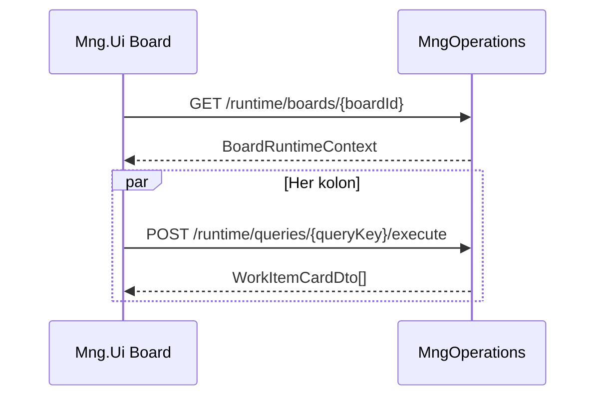

# Operation Core — Mng.Ui Faz 1 planı

**Son güncelleme:** 26 Mayıs 2026  
**Hedef kitle:** Mng.Ui geliştiricileri, OC planlama oturumları  
**Backend:** [MngOperations](../mngoperations/README.md) — `/operations/api/v1` (gateway)

---

## 1. İlkeler

1. **Backend decides, UI renders** — Transition, permission, field behavior, action sırası UI’da türetilmez; `RuntimeContext` + komut yanıtları kaynak alınır ([operationcore_phase1.md §2](../operationcore_phase1.md)).
2. **Operasyonel yol MngOperations** — `op_work_items` üzerinde ham DG `PATCH` ile `stateId` veya iş kuralı bypass **yok**.
3. **Metadata yapılandırma DG** — Workspace, state flow, form, rule tanımları Faz 1’de yönetici ekranı olarak **ertelenebilir**; Odak demo seed yeterli.
4. **Task Manager ayrı kalır** — Route, store, servis OC için **yeni**; TM bileşenleri yalnızca **görsel/düzen** adaptasyonu (Kanban kartı, form grid, profil sekmeleri).
5. **Hata kodu haritası** — API `code` (+ opsiyonel `messageTr`); UI çeviri map ([OPEN_QUESTIONS Q10](../mngoperations/OPEN_QUESTIONS.md)).

---

## 2. Kararlar (Faz 1)

| Konu | Karar |
|------|--------|
| **Route kökü** | `/apps/operation-core` |
| **API prefix** | `{GATEWAY_URL}/operations/api/v1` |
| **Workspace listesi** | DG `GET /data/api/v1/data/op_workspaces` (salt okuma hub) |
| **Board / WI operasyonu** | MngOperations runtime + komutlar |
| **Kanban drop** | Kolon `defaultTransitionKey` → `POST .../transitions/{key}` |
| **Kolon kart verisi** | Board context + kolon başına `POST .../queries/{queryKey}/execute` |
| **Profil geçmişi** | `GET .../timeline` (MO merge); DG merge yok |
| **Dosya ekleri** | DG file API ([RUNTIME_CONTEXT §3](../mngoperations/RUNTIME_CONTEXT.md)) |
| **Metadata admin UI** | Faz 1 dışı (script + DG admin yeterli) |

---

## 3. Route haritası

> TM **Çalışma alanı** deneyimi birincil giriş olacak şekilde güncellendi. Ayrıntı: [OC_UI_NAVIGATION_AND_TM_INSPIRATION.md §2–§6](./OC_UI_NAVIGATION_AND_TM_INSPIRATION.md).

```text
/apps/operation-core
  index.vue                    → redirect → /workspace

/apps/operation-core/workspace
  index.vue                    → Birincil giriş: OcWorkspaceExplorer (ağaç + board link)

/apps/operation-core/workspaces/[workspaceId]
  index.vue                    → (opsiyonel) workspace özeti / board listesi kartları

/apps/operation-core/boards/[boardId]
  index.vue                    → Board runtime (kanban | list)

/apps/operation-core/work-items/new
  index.vue                    → Create form (?workspaceId=, ?boardId=)

/apps/operation-core/work-items/[id]/profile
  index.vue                    → Profile runtime

/apps/operation-core/dashboards/[dashboardId]
  index.vue                    → Dashboard runtime — sprint 5
```

**Derin link örnekleri:**

- Board: `/apps/operation-core/boards/eb118bd9-…`
- Profil: `/apps/operation-core/work-items/{dataId}/profile`
- Create: `/apps/operation-core/work-items/new?workspaceId=f414462a-…&boardId=eb118bd9-…`

---

## 4. API client katmanı

### 4.1 Yeni servis dosyası

`Mng.Ui/services/operationCoreService.ts`

```ts
// Önerilen iskelet — apiService’e fetchFromOperations eklenir
const OPS_PREFIX = '/operations/api/v1';

export function fetchFromOperations(path: string, method = 'GET', body?: unknown) { … }

// Runtime
getBoardContext(boardId)
getFormContext({ mode, workspaceId?, workItemId? })
getProfileContext(workItemId)
getTimeline(workItemId, { skip, take })
getStateSegments(workItemId)
getDashboardContext(dashboardId)
executeQuery(queryKey, body: ExecuteQueryRequest)

// Commands
createWorkItem(body)
patchWorkItem(id, body)
applyTransition(id, transitionKey, body?)
createComment(id, body)
```

`apiService.ts`: mevcut `fetchFromDataGateway` / `fetchFromMngKeeper` pattern’i ile aynı auth (Bearer), gateway base URL.

### 4.2 TypeScript tipleri

`Mng.Ui/types/apps/operationCore.ts` — backend contract’larla hizalı:

- `BoardRuntimeContext`, `BoardColumnDto`, `WorkItemCardDto`
- `FormRuntimeContext`, `FormFieldRuntimeDto`, `FieldBehaviorDto`
- `ProfileRuntimeContext`, `ProfileActionDto`, `SlaSnapshotDto`, `StateSegmentDto`
- `TimelinePage`, `DashboardRuntimeContext`
- Komut yanıtları + `PartialFailureDetails` (`code: "PARTIAL_FAILURE"`)

Kaynak: `MngOperations.Application/Contracts/Runtime/*.cs`

---

## 5. State yönetimi

`Mng.Ui/stores/apps/operationCore.ts` (Pinia)

| State dilimi | İçerik |
|--------------|--------|
| `workspaces` | Hub listesi (DG) |
| `boardContext` | Aktif board metadata |
| `columnItems` | `Record<stateId, WorkItemCardDto[]>` + loading/error |
| `profileContext` | Aktif profil |
| `timeline` | Sayfalı timeline |
| `formContext` | Create/edit form |

**Actions (örnek):**

- `loadBoard(boardId)` → context + paralel kolon query’leri
- `refreshColumn(stateId)` → tek kolon yenile
- `applyTransition(workItemId, key, payload?)` → başarıda profil/kolon invalidate
- `saveWorkItemFields(id, patch)` → `PATCH /work-items/{id}`

TM `stores/apps/taskManager.ts` **kopyalanmaz** — OC action’ları MO endpoint’lerine bağlıdır.

---

## 6. Ekranlar ve kabul kriterleri

### 6.1 Workspace hub (`/apps/operation-core`)

- DG’den workspace listesi; kart: ad, key, açıklama, board sayısı (opsiyonel aggregate veya sabit link).
- Demo ortamda seed workspace’e doğrudan “Board’a git” butonu.
- Menü: **Operasyon Merkezi** → hub.

### 6.2 Board (`/boards/[boardId]`)

**Yükleme akışı:**



**Kanban (viewType = kanban):**

- Kolon başlığı = `column.title` veya state adı.
- Kart: `key`, `title`, `cardFieldKeys` ile dinamik alanlar.
- Sürükle-bırak: hedef kolon `dropEligible` + `defaultTransitionKey` → transition API; **UI geçiş matrisi hesaplamaz**.
- Alternatif geçişler: drop sonrası dialog (`alternativeTransitionKeys`) — sprint 2 sonu.

**Liste (viewType = list):**

- Tek tablo; kolon query’lerini birleştir veya workspace query (`wi_by_workspace`) — board config’e göre.

**Toolbar:**

- Yeni iş → create route (workspaceId + boardId query).
- Yenile → board + kolonlar.
- WI kart tıklama → profil route.

**TM adaptasyonu:** `boards/[boardId]/index.vue` layout, `vue-draggable-next`, kart CSS (`tm-flow` → `oc-flow` ayrı dosya).

### 6.3 Work item profil (`/work-items/[id]/profile`)

**Bölümler (ProfileRuntimeContext):**

| Bölüm | Kaynak | UI |
|-------|--------|-----|
| Header | `header`, `workItem` | Key, title, state badge, SLA chip |
| Actions | `actions[]` (sıralı, `enabled`) | Primary/secondary buttons → transition |
| Fields | `fields` + `fieldBehaviors` | Readonly/edit; PATCH ile kaydet |
| Sidebar | `sidebar` | Metadata JSON layout → bileşen map (Faz 1: basit key-value) |
| Panels | `panels` | Sekmeler: Timeline, Segments, Links, Watchers |
| SLA | `sla` | Due dates + breach renkleri |
| Segments | `stateSegments` (embed) + tam liste API | Mini timeline + “tümü” drawer |

**Timeline sekmesi:** `GET .../timeline?skip=&take=` — sonsuz scroll veya sayfalama.

**Yorum:** `POST .../comments` — TM `TmIssueComments` UX referans; author MO/DG expand.

**Transition sonrası:** profile + timeline + segments yenile; `PARTIAL_FAILURE` → snackbar + `completedSteps` ([PIPELINES §9](../mngoperations/PIPELINES.md)).

**TM adaptasyonu:** `TmIssueProfileView.vue` ızgara; **transition mantığı TM workflow utils kullanılmaz**.

### 6.4 Create / edit form

- `GET .../form?mode=create&workspaceId=` veya `mode=edit&id=`.
- Layout: `op_forms` sections → `OcDynamicForm.vue` (fieldBehaviors: visible/readonly/required/masked).
- Submit: `POST /work-items` veya profil PATCH.
- Validation hataları: API `code` (ör. rule reject) → alan altı mesaj.

**TM adaptasyonu:** `TmNewIssueFormFields.vue` grid/section mantığı; alan listesi **form context**’ten gelir.

### 6.5 Dashboard (Faz 1.5)

- `GET .../runtime/dashboards/{dashboardId}`.
- Widget tipleri: `summaryCard`, `list`, `chart` — mevcut `WidgetRenderer` ile hizalama veya ince OC wrapper.
- Execution hata durumu widget içinde gösterilir (`execution.success === false`).

---

## 7. Task Manager → OC adaptasyon matrisi

| TM kaynağı | OC kullanımı | Karar |
|------------|--------------|--------|
| `pages/apps/task-manager/boards/[boardId]/index.vue` | Kanban/list shell | **Adapt** — veri MO |
| `TmNewIssueFormFields.vue` | Dynamic form grid | **Adapt** — context-driven |
| `TmIssueProfileView.vue` | Profil layout | **Adapt** — actions MO |
| `TmIssueComments.vue` | Yorum listesi | **Adapt** — API MO |
| `utils/taskManagerWorkflow.ts` | Transition allow list | **Kullanma** — MO `actions[]` |
| `taskManagerService.ts` / DG CRUD issues | WI mutasyon | **Kullanma** |
| `stores/apps/taskManager.ts` | State | **Kullanma** — yeni store |
| `assets/css/task-manager.css` | Tema | **Kopyala →** `operation-core.css` |

---

## 8. Bileşen ağacı (öneri)

```text
Mng.Ui/
  components/apps/operation-core/
    OcWorkspaceTree.vue
    OcBoardKanban.vue
    OcBoardColumn.vue
    OcWorkItemCard.vue
    OcDynamicForm.vue
    OcProfileHeader.vue
    OcProfileActions.vue
    OcProfileFields.vue
    OcTimelinePanel.vue
    OcStateSegmentsPanel.vue
    OcSlaChip.vue
    OcPartialFailureAlert.vue
  pages/apps/operation-core/
    index.vue                    # → redirect workspace
    workspace/index.vue          # OcWorkspaceExplorer
    workspaces/[workspaceId]/index.vue
    boards/[boardId]/index.vue
    work-items/new/index.vue
    work-items/[id]/profile.vue
    dashboards/[dashboardId]/index.vue
  services/operationCoreService.ts
  stores/apps/operationCore.ts
  types/apps/operationCore.ts
  composables/useOperationCoreBreadcrumbs.ts
  utils/operationCoreErrors.ts      # code → i18n key
  assets/css/operation-core.css
```

---

## 9. Menü, i18n, welcome

### 9.1 Menü

Detaylı kararlar: [OC_UI_NAVIGATION_AND_TM_INSPIRATION.md §3](./OC_UI_NAVIGATION_AND_TM_INSPIRATION.md).

- MongoDB side menu (Side Menu Manager) + geliştirme fallback `sidebarItem.ts` / `horizontalItems.ts`
- Header: **Operasyon** · kök: **Operasyon Merkezi** → `/apps/operation-core/workspace`
- `pageCode`: `operationCore.menuTitle`
- TM “Görevler” ile **birleştirilmez**

### 9.2 i18n

`utils/locales/tr.json` / `en.json` → kök `operationCore.*`:

- `menuTitle`, `hub.*`, `board.*`, `profile.*`, `form.*`, `errors.*`
- `breadcrumbRoot`, `breadcrumbWorkspace`, … ([navigation plan §4.4](./OC_UI_NAVIGATION_AND_TM_INSPIRATION.md))

### 9.3 Breadcrumb

**Merkezi helper (Sprint 1 zorunlu):** `composables/useOperationCoreBreadcrumbs.ts` — sayfa başına dağınık dizi **yok** (TM §12 borcu tekrarlanmaz).

Ana link: **`/`** (welcome), TM’deki analitik dashboard değil.

### 9.4 Welcome kartı

[WELCOME_HOME.md](../../ui/WELCOME_HOME.md) — `moduleCards`’a OC modülü; birincil link **Çalışma alanı** (`/apps/operation-core/workspace`).

---

## 10. Hata ve edge case UX

| Durum | UI davranışı |
|-------|----------------|
| `PARTIAL_FAILURE` (500) | Kalıcı snackbar; `completedSteps`, `failedStep`, `correlationId`; WI snapshot varsa profili göster |
| Rule validation reject | Form/profil alan hatası; `code` + `details.field` |
| Transition disabled | `actions[].enabled === false` → disabled button + tooltip (MO mesajı varsa) |
| Kolon query hatası | Kolon içi error state; diğer kolonlar çalışır |
| 401 / 403 | Mevcut global unauthorized akışı |

`utils/operationCoreErrors.ts`: bilinen MO kodları → `t('operationCore.errors.{code}')`.

---

## 11. Uygulama sprintleri (önerilen sıra)

**Form tanımı (DEVAM ile hizalı, layout sonrası):**

| Adım | Kapsam | Belge |
|------|--------|--------|
| **F1** | Layout + create + person picker | ✅ [OC_UI_FORM_DEFINITIONS.md](./OC_UI_FORM_DEFINITIONS.md) |
| **F2** | Required UI (#3a) | [DEVAM.md](../mngoperations/DEVAM.md) |
| **F3** | Form alan politikaları v1 (#3b–3c) | [OC_UI_FIELD_POLICY.md](./OC_UI_FIELD_POLICY.md) |
| **F4** | Form politika backlog (§10) | aynı |
| **W** | Workspace politikaları | [OC_UI_WORKSPACE_POLICIES.md](./OC_UI_WORKSPACE_POLICIES.md) |

| Sprint | Kapsam | DoD |
|--------|--------|-----|
| **S1 — Navigasyon** | `useOperationCoreBreadcrumbs`, side menu kaydı, i18n, `/workspace` + redirect, `OcWorkspaceTree` iskelet | Menüden explorer açılır; breadcrumb tutarlı |
| **S2 — Board** | Board context + kolon query + kart + tam sayfa board | Demo board’da kartlar |
| **S3 — Profil okuma** | Profile render, segments, SLA, timeline read-only | Smoke WI profili görüntülenir |
| **S4 — Yazma** | Create form, PATCH alan, transition, yorum | Smoke akışı UI’dan tekrarlanır |
| **S5 — Kanban DnD + dashboard** | Drop transition, alt geçiş dialog, dashboard widget | Gateway üzerinden E2E |
| **S6 — Sertleştirme** | PARTIAL_FAILURE UX, loading/error polish, route guard | Demo script + manuel checklist |

**Paralel olmayan bağımlılık:** S2 → S4 (board’dan profile → transition).

---

## 12. Faz 1 dışı (bilinçli)

- Metadata admin — **kısmi Faz 1:** form layout + [alan politikaları tek sekme](./OC_UI_FIELD_POLICY.md); tam state flow / condition builder Faz 2
- Workspace/board CRUD ekranları (DG script yeterli)
- Saved filter UI, gelişmiş dashboard editörü
- In-app notification inbox (`op_notifications` liste) — sprint 6+ / hub badge
- Working-hours SLA görselleştirme
- TM veri migrasyonu / dual-write

---

## 13. Test stratejisi (UI)

| Katman | Araç |
|--------|------|
| Manuel E2E | [seed-operation-core-demo.ps1](../scripts/seed-operation-core-demo.ps1) `-SmokeTest` (API); UI checklist aynı adımlar |
| Geliştirme | `GATEWAY_URL=http://192.168.20.20:5040`, demo seed json id’leri |
| İleride | Playwright: board load → create → transition → profile assert |

**UI checklist (S4 sonrası):**

1. Hub → demo workspace → board
2. Kart tıkla → profil
3. Transition butonu → state değişimi + segment
4. Yeni iş oluştur → board’da görünür
5. Alan PATCH kaydet
6. Yorum ekle → timeline’da görünür

---

## 14. Açık noktalar (planlama devamı)

| # | Soru | Öneri |
|---|------|--------|
| U1 | TM menüsü OC ile birleşsin mi? | **Hayır** — ayrı modül ([navigation §3.2](./OC_UI_NAVIGATION_AND_TM_INSPIRATION.md)) |
| U2 | Birincil giriş | **`/workspace`** explorer (TM gibi), hub değil |
| U3 | Profil tam sayfa mı drawer mı? | Faz 1 **tam sayfa** |
| U4 | Explorer’da board embed vs tam sayfa | Faz 1 **tam sayfa route**; embed opsiyonel |
| U5 | Metadata admin ne zaman? | Faz 2 — TM `ProjectEditorForm` sekmeli pattern |

---

## 15. İlgili güncellemeler

- [OPERATION_CORE_IMPLEMENTATION_PLAN.md §7](../OPERATION_CORE_IMPLEMENTATION_PLAN.md) — bu belgeye yönlendirir
- [mngoperations/DEVAM.md](../mngoperations/DEVAM.md) — UI handoff + sıradaki işler
- [OC_UI_FIELD_POLICY.md](./OC_UI_FIELD_POLICY.md) — form alan politikaları (tek el)
- Backend değişince önce [RUNTIME_CONTEXT.md](../mngoperations/RUNTIME_CONTEXT.md) + [API_SURFACE.md](../mngoperations/API_SURFACE.md), sonra TS tipleri
