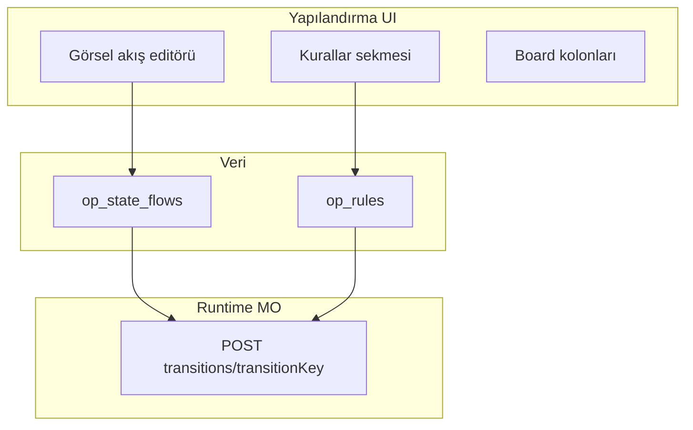

# Operation Core — Durum akışı UX planlama notları

**Durum:** Tartışma kaydı — **implementasyon bekliyor** (karar + öncelik netleşince başlanacak)  
**Son güncelleme:** 3 Temmuz 2026  
**Kapsam:** Workspace Tanımları → **Akışlar** sekmesi; görsel durum akışı editörü; workspace config kullanılabilirliği  
**İlişkili:** [OC_UI_ADMIN_FAZ1_PLAN.md](./OC_UI_ADMIN_FAZ1_PLAN.md) · [OC_UI_WORKSPACE_POLICIES.md](./OC_UI_WORKSPACE_POLICIES.md) · [OC_UI_NAVIGATION_AND_TM_INSPIRATION.md](./OC_UI_NAVIGATION_AND_TM_INSPIRATION.md) · [../mngoperations/DEVAM.md](../mngoperations/DEVAM.md) · [../mngoperations/RULE_ENGINE.md](../mngoperations/RULE_ENGINE.md) · [../mngoperations/PERMISSIONS_LAYERING.md](../mngoperations/PERMISSIONS_LAYERING.md)

---

## 1. Bağlam

Workspace yapılandırması (`/apps/operation-core/admin/workspace-definitions`) teknik olarak çalışıyor; **Durum akışı** sekmesi ise hâlâ admin formu seviyesinde. Karmaşık operasyon akışlarında (helpdesk, kalite, NCR) yapılandırma zorlaşıyor.

**Hedef (ürün):** Durum akışını daha **kolay, görsel ve anlaşılır** bir arayüze taşımak. Sırası geldiğinde kararlaştırılıp implementasyona geçilecek.

---

## 2. Mevcut durum (baseline — Temmuz 2026)

### UI

| Bileşen | Rol |
|---------|-----|
| `OcWorkspaceDefinitionsFlowsTab.vue` | Akış listesi + dialog; geçiş **kart listesi** (from/to, `transitionKey`, label, `requiredFields`, `permissions.groups`) |
| `OcWorkspaceDefinitionsStatesTab.vue` + `OcDefinitionsStatesTab.vue` | Workspace’te aktif durumlar + global `op_states` kataloğu |
| `OcWorkspaceFormTransitionRequirements.vue` | Form ↔ akış çapraz özet (salt okunur + Akışlar linki) |
| `OcWorkspaceBoardColumnEditor.vue` | Board kolonları; `defaultTransitionKey` akıştan seçilir |
| `ProjectWorkflowEditor.vue` (Task Manager) | Geçiş matrisi — **OC’de bilinçli kullanılmıyor** |

### Veri ve runtime

- Yazma: UI → **MngDataGateway** (`op_state_flows`, `op_states`)
- Runtime: **MngOperations** — `POST .../work-items/{id}/transitions/{transitionKey}`
- MO’da state-flow admin CRUD API’si yok

### Üç ekran zinciri

```text
Global durumlar (admin/definitions)
    → Workspace’te hangi durumlar aktif (Değerler → Durumlar)
    → Akış tanımı (Akışlar — kart listesi)
```

### Tamamlanan (E1-P2 — kodda var)

Geçiş kartlarında **`requiredFields`** + **`permissions.groups`** editörü mevcut. Eski plan dokümanlarındaki «yok» ifadeleri güncellenmeli.

---

## 3. Görünen sorunlar

| Sorun | Etki |
|-------|------|
| Görsel graf yok | Döngü, paralel yollar, «bu durumdan nereye?» kafada kuruluyor |
| Manuel `transitionKey` | Typo riski; kurallar, board, otomasyon aynı key’e bağlı |
| Üç ayrı ekran | Tutarlılık kullanıcıya kalıyor |
| `enabledStateIds` vs akış state’leri | Akıştaki state workspace’te seçili değilse sessiz runtime sorunu |
| Detaylar dağınık | requiredFields, izinler, kurallar, board kolonu ayrı sekmelerde |
| `ui` metadata editörü yok | Plan zengin model tanımlı; UI temel alanları yazıyor |
| Validasyon UI’da zayıf | Orphan state, unreachable, aynı from→to çoklu geçiş uyarısı yok |

---

## 4. Mimari sınır (değişmemeli)

Üç katmanlı model ([OPERATION_CORE_IMPLEMENTATION_PLAN](../OPERATION_CORE_IMPLEMENTATION_PLAN.md) §5.2.1):

| Katman | Sorumluluk |
|--------|------------|
| **`op_state_flows.transitions[]`** | Geçiş **grafı** — kanonik tanım |
| **`op_rules`** | Koşul, validation, automation — **yeni geçiş tanımlamaz** |
| **`op_profiles.actions`** | Hangi `transitionKey` profilde görünsün (sunum) |

Görsel editör yalnızca **akış grafını** düzenler; kurallar ve profil ayrı kalır (cross-link ile erişilebilir).



**TM’den alınmayanlar:** `taskManagerWorkflow.ts`, proje `workflow` object UI doğrulaması — OC MO-driven transition modeli.

---

## 5. Hedef UX — üç katman

### 5.1 Görselleştirme (okuma + hızlı düzenleme)

- Durum = **node** (renk/ikon `op_states` kataloğundan)
- Geçiş = **ok** (`transitionKey` / label)
- Başlangıç (`isInitial`) ve kapalı (`isClosed`) durumlar görsel işaret
- Aynı from→to’da birden fazla geçiş: ok üzerinde etiket / sayı

### 5.2 Bağlam paneli (detay)

Node veya ok seçilince sağ panel:

- Label, `transitionKey` (otomatik öneri + düzenleme)
- `requiredFields`, `permissions.groups`
- İlgili kural / otomasyon / board kolonu — **salt okunur link**

### 5.3 Rehberlik

- Akış şablonları: doğrusal, onay hattı, help desk, kalite hold/resume
- Kayıt sonrası «board kolonlarını akıştan öner»
- Validasyon banner: orphan state, unreachable, key çakışması

---

## 6. Teknik seçenekler (henüz karar yok)

| Seçenek | Artı | Eksi | Not |
|---------|------|------|-----|
| **A — Gelişmiş matris** (TM tarzı, OC modeline uyarlanmış) | Düşük risk, hızlı MVP | Karmaşık akışlarda yetersiz | Orta uyum |
| **B — Vue Flow / node-edge editör** | En iyi UX, sürükle-bırak | Yeni bağımlılık, layout | **Önerilen hedef** |
| **C — Mermaid salt okunur önizleme + form** | Hızlı görsel kazanç | Interaktif düzenleme yok | **WF-UX0 adayı** |
| **D — Board kolonlarından tersine mühendislik** | Board odaklı ekipler için sezgisel | Tek kaynak akış değil board | Tamamlayıcı |

**Önerilen yol (taslak):** **C → B** — önce read-only diagram + validasyon; sonra interaktif editör.

**Veri modeli:** Değişiklik gerekmez; UI `op_state_flows.transitions[]` okur/yazar. MO tarafına dokunulmaz.

---

## 7. Faz taslağı (WF-UX)

| Faz | Kod | Kapsam | Bağımlılık |
|-----|-----|--------|------------|
| 0 | **WF-UX0** | Read-only flow diagram + validasyon banner | Mevcut `OcWorkspaceDefinitionsFlowsTab` verisi |
| 1 | **WF-UX1** | Canvas: A→B sürükle ile yeni geçiş; otomatik `transitionKey` önerisi | WF-UX0 |
| 2 | **WF-UX2** | Sağ panel: mevcut kart alanları + kural/board cross-link | WF-UX1 |
| 3 | **WF-UX3** | Akış şablonları + board kolon önerisi + workspace state senkron uyarısı | WF-UX2, `ocBoardColumns` |
| 4 | **WF-UX4** | Geçiş `ui` metadata (buton rengi, ikon) — runtime profil | Planlanmış alan; MO profil katmanı |

**Genişleme (aynı mantık):** Kurallar scope görselleştirme, otomasyon trigger→action mini diyagram — ayrı epik.

---

## 8. Açık kararlar (implementasyon öncesi)

| # | Konu | Seçenekler |
|---|------|------------|
| 1 | **Pilot workspace** | IT Help Desk · Odak Üretim / kalite · OC Demo |
| 2 | **Graf tipi** | Çoğunlukla doğrusal + dallanma · serbest döngülü graf (hold/resume) |
| 3 | **Kullanıcı kitlesi** | Yalnız platform admin · workspace owner da düzenleyebilir |
| 4 | **Editör yaklaşımı** | Basit akışlar için matriz yeter · baştan canvas |
| 5 | **Board entegrasyonu** | Akış + board kolonları aynı ekran (split) · ayrı sekme yeterli |
| 6 | **Bağımlılık kütüphanesi** | Vue Flow · alternatif · Mermaid-only MVP |

---

## 9. İlgili dosyalar (implementasyon referansı)

| Dosya | Not |
|-------|-----|
| `Mng.Ui/components/.../OcWorkspaceDefinitionsFlowsTab.vue` | Mevcut editör — genişletilecek veya yeni bileşen |
| `Mng.Ui/services/operationCore/flows.ts` | CRUD + `mapOpStateFlow` |
| `Mng.Ui/types/apps/operationCore.ts` | `OpStateFlow`, `OpStateFlowTransition` |
| `Mng.Ui/utils/ocBoardColumns.ts` | `suggestBoardColumnsFromFlow` |
| `MngOperations/.../StateFlowCatalog.cs` | Runtime geçiş doğrulama |
| `MngOperations/.../WorkItemCommandService.cs` | Transition pipeline |

---

## 10. Sonraki adım (sıra gelince)

1. Açık kararlar tablosunu (#8) ürün sahibi ile netleştir.
2. Pilot workspace + acceptance criteria (WF-UX0 DoD) yaz.
3. WF-UX0 spike: Mermaid veya Vue Flow POC — layout + 9+ geçişli helpdesk örneği.
4. Admin Faz 1 kapanış checklist’ine «Durum akışı UX» maddesi ekle ([OC_UI_ADMIN_FAZ1_PLAN.md](./OC_UI_ADMIN_FAZ1_PLAN.md)).

**Implementasyon başlamadı.**
