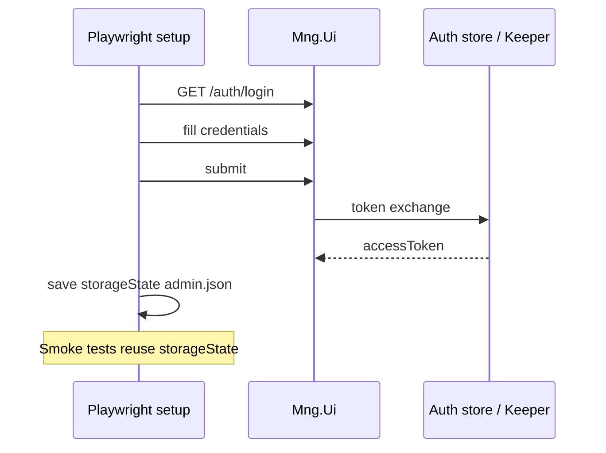

# E2E Araçları — Playwright ve CI

**Durum:** Plan (henüz uygulanmadı)  
**Son güncelleme:** 9 Haziran 2026  
**İlgili:** [TESTPROCS_PLAN.md](./TESTPROCS_PLAN.md) · [TEST_DATA.md](./TEST_DATA.md)

---

## 1. Neden Playwright?

| Kriter | Playwright | Cypress | Vitest only |
|--------|------------|---------|-------------|
| Nuxt 3 SSR/SPA | ✅ | ✅ | ❌ (browser yok) |
| Trace / video | ✅ | Kısıtlı | — |
| Paralel CI | ✅ | ✅ | — |
| Multi-tab / auth | ✅ | Orta | — |
| Mevcut repo | OC planında referans | Yok | Yok |

**Karar:** Playwright ([TESTPROCS_PLAN.md](./TESTPROCS_PLAN.md) T1)

---

## 2. Hedef dizin yapısı

```
Mng.Ui/
  playwright.config.ts
  e2e/
    fixtures/
      auth.setup.ts          # admin/manager/user storageState
      test-env.ts            # page-catalog.yml id loader
    smoke/
      operation-core.spec.ts
      widgets.spec.ts
      welcome.spec.ts
    modules/
      widgets/
        list.spec.ts         # WIDGET_LIST_PAGE_TEST checklist
    helpers/
      console.ts             # console.error collector
      network.ts             # 5xx watcher
  playwright/
    .auth/
      admin.json             # gitignore
```

---

## 3. package.json script'leri (plan)

```json
{
  "scripts": {
    "test:e2e": "playwright test",
    "test:e2e:smoke": "playwright test e2e/smoke",
    "test:e2e:ui": "playwright test --ui",
    "test:e2e:report": "playwright show-report"
  },
  "devDependencies": {
    "@playwright/test": "^1.49.0"
  }
}
```

---

## 4. playwright.config.ts — tasarım notları

```typescript
// Taslak — uygulama sırasında netleştirilecek
import { defineConfig, devices } from '@playwright/test';

export default defineConfig({
  testDir: './e2e',
  fullyParallel: true,
  forbidOnly: !!process.env.CI,
  retries: process.env.CI ? 2 : 0,
  workers: process.env.CI ? 2 : undefined,
  reporter: [
    ['html', { open: 'never' }],
    ['json', { outputFile: 'playwright-report/results.json' }],
    ['list'],
  ],
  use: {
    baseURL: process.env.UI_BASE_URL || 'http://192.168.20.20:3000',
    trace: 'on-first-retry',
    screenshot: 'only-on-failure',
    video: 'retain-on-failure',
  },
  projects: [
    { name: 'setup', testMatch: /auth\.setup\.ts/ },
    {
      name: 'smoke-admin',
      use: {
        ...devices['Desktop Chrome'],
        storageState: 'playwright/.auth/admin.json',
      },
      dependencies: ['setup'],
      testMatch: /smoke\/.*\.spec\.ts/,
    },
  ],
});
```

---

## 5. Auth setup akışı



**Kritik:** Token refresh — uzun suite'lerde `ensureValidToken` için per-test login veya storageState yenileme (Faz 2).

---

## 6. Smoke test şablonu

```typescript
// e2e/smoke/widgets.spec.ts — örnek tasarım
import { test, expect } from '@playwright/test';

const consoleErrors: string[] = [];

test.beforeEach(async ({ page }) => {
  consoleErrors.length = 0;
  page.on('console', (msg) => {
    if (msg.type() === 'error') consoleErrors.push(msg.text());
  });
});

test('widgets list loads for admin', async ({ page }) => {
  await page.goto('/apps/widgets');
  await expect(page).not.toHaveURL(/\/auth\/login/);
  await expect(page.locator('[data-testid="widgets-table"]').or(page.locator('table'))).toBeVisible({
    timeout: 30_000,
  });
  expect(consoleErrors, consoleErrors.join('\n')).toHaveLength(0);
});
```

**Not:** `data-testid` eklenmesi flaky testleri azaltır — modül sprint'lerinde kademeli ekleme önerilir.

---

## 7. page-catalog.yml entegrasyonu

Smoke generator (Faz 2+):

1. `page-catalog.yml` oku
2. `smoke: true` olan route'lar için spec üret veya parametrik test
3. `dynamic_params` → `test-env.json` id'leri

---

## 8. CI entegrasyonu

Mevcut `.github/workflows/ci.yml` → `build-frontend` job'ına eklenecek adımlar (plan):

```yaml
# Taslak — self-hosted runner'da UI_BASE_URL erişilebilir olmalı
- name: Install Playwright browsers
  run: npx playwright install chromium --with-deps
  working-directory: Mng.Ui

- name: E2E smoke (admin)
  run: npm run test:e2e:smoke
  working-directory: Mng.Ui
  env:
    UI_BASE_URL: ${{ secrets.ODAK_UI_BASE_URL }}
    TEST_ADMIN_USER: ${{ secrets.TEST_ADMIN_USER }}
    TEST_ADMIN_PASSWORD: ${{ secrets.TEST_ADMIN_PASSWORD }}

- name: Upload Playwright report
  if: failure()
  uses: actions/upload-artifact@v4
  with:
    name: playwright-report
    path: Mng.Ui/playwright-report/
```

### CI ön koşulları

- Self-hosted runner Odak test sunucusuna (`192.168.20.20`) erişebilmeli
- Veya PR smoke **mock/stub** ile sınırlı tutulur (Faz 1 alternatif — sadece build + lint)

---

## 9. Manuel checklist → spec dönüşümü

| Kaynak checklist | Hedef spec | Öncelik |
|------------------|------------|---------|
| `WIDGET_LIST_PAGE_TEST.md` | `e2e/modules/widgets/list.spec.ts` | Pilot |
| `HUB_TEST_GUIDE.md` | `e2e/modules/hub/*.spec.ts` | P2 |
| `WIDGET_TEST_GUIDE.md` | widget edit/preview | P1 |

Dönüşüm kuralı: Her `- [ ]` maddesi → bir `test()` veya parametrik satır.

---

## 10. Flaky test önlemleri

| Sorun | Çözüm |
|-------|-------|
| Vuetify overlay / dialog | `getByRole`, explicit close |
| ApexCharts / Leaflet | `toBeVisible` + extended timeout; network idle dikkatli |
| SignalR bağlantısı | Sayfa-spesifik ready indicator |
| i18n metin değişimi | `data-testid` veya translation key attribute |
| API yavaş (cold) | Backend diagnostic ile ayrı SLA; UI timeout 30s |

---

## 11. Uygulama checklist (Faz 1)

- [ ] `@playwright/test` devDependency
- [ ] `playwright.config.ts`
- [ ] `e2e/fixtures/auth.setup.ts`
- [ ] `.gitignore`: `playwright/.auth/`, `playwright-report/`, `test-results/`
- [ ] İlk smoke: `/welcome`, `/apps/widgets`, `/apps/datasets`
- [ ] `npm run test:e2e:smoke` yeşil (Odak test env)
- [ ] CI adımı (veya nightly-only kararı)

---

## 12. Cursor agent kullanımı

Agent oturumunda tipik akış:

```powershell
cd Mng.Ui
npm run test:e2e:smoke
npm run test:e2e:report   # fail analizi
```

Agent trace + `results.json` okuyarak [DIAGNOSTIC_REPORTS.md](./DIAGNOSTIC_REPORTS.md) formatında özet üretir.
