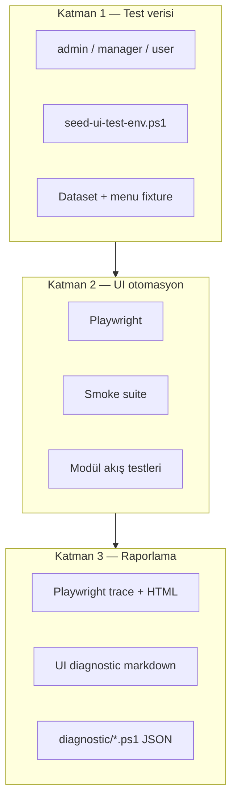

# Mng.Ui Test Prosedürleri — Ana Plan

**Durum:** Planlama  
**Son güncelleme:** 9 Haziran 2026  
**Checkpoint:** [DEVAM.md](./DEVAM.md)

**İlgili dokümanlar:**
- [PAGE_CATALOG.md](./PAGE_CATALOG.md) — sayfa envanteri
- [TEST_DATA.md](./TEST_DATA.md) — veri ve persona
- [E2E_TOOLING.md](./E2E_TOOLING.md) — Playwright ve CI
- [DIAGNOSTIC_REPORTS.md](./DIAGNOSTIC_REPORTS.md) — rapor formatı
- [../diagnostic/DIAGNOSTIC_PLAN.md](../diagnostic/DIAGNOSTIC_PLAN.md) — backend diagnostic (mevcut)

---

## 1. Amaç

Mng.Ui'deki **iş modülü sayfalarının** amaca uygun çalıştığını sistematik biçimde doğrulamak:

1. Sayfa açılır, yetki modeli doğru uygulanır
2. Kritik kullanıcı akışları (liste, filtre, CRUD, yönlendirme) çalışır
3. Console ve network hataları yakalanır
4. Test verisi tekrarlanabilir şekilde üretilir
5. Sonuçlar **diagnostic rapor** olarak arşivlenir

### Ne vaat etmiyoruz?

- ~220 sayfanın tamamının otomatik "iş mantığı doğrulaması" (MaterialPro demo sayfaları kapsam dışı)
- Cursor agent'ın 7/24 sürekli test robotu olarak çalışması (oturum tabanlıdır)

### Ne hedefliyoruz?

- **~40–50 kritik route** için smoke + modül akış testleri
- PR ve nightly CI'da otomatik koşum
- Agent ile fail triage ve hızlı rapor üretimi

---

## 2. Roller: Agent vs otomasyon

```
┌─────────────────────────────────────────────────────────────┐
│  Kalıcı test robotu = Playwright + CI + seed script'leri    │
├─────────────────────────────────────────────────────────────┤
│  Cursor agent = kurulum, spec yazımı, fail analizi, rapor   │
└─────────────────────────────────────────────────────────────┘
```

| Görev | Araç |
|-------|------|
| Her commit'te smoke | GitHub Actions + Playwright |
| Test verisi seed | PowerShell + mevcut OC/widget seed script'leri |
| Fail triage | Cursor agent (trace, log, fix önerisi) |
| Backend performans | Mevcut `diagnostic/*.ps1` (değişmez) |
| Müşteri-facing özet | Document Intelligence diagnostic raporu (opsiyonel genişleme) |

---

## 3. Mimari (üç katman)



### Katman 1 — Test verisi

- Sabit persona kullanıcıları (JWT + menu permission uyumlu)
- Modül bazlı dataset fixture'ları
- Idempotent seed: `test-ui-*` domain veya mevcut demo seed genişletmesi
- Detay: [TEST_DATA.md](./TEST_DATA.md)

### Katman 2 — UI otomasyon

- **Smoke:** route 200, login redirect yok, kritik selector görünür, `console.error` yok
- **Flow:** modül checklist'lerinden türetilmiş senaryolar (CRUD, filtre, pagination)
- **Permission:** aynı route farklı persona ile beklenen `/unauthorized` veya erişim
- Detay: [E2E_TOOLING.md](./E2E_TOOLING.md)

### Katman 3 — Raporlama

- Playwright HTML report + trace (fail anında)
- Birleşik UI diagnostic markdown ([DIAGNOSTIC_REPORTS.md](./DIAGNOSTIC_REPORTS.md))
- İsteğe bağlı: backend diagnostic JSON ile aynı oturumda koşum

---

## 4. Test piramidi

| Seviye | Ne test eder | Hedef süre | CI |
|--------|--------------|------------|-----|
| **Smoke** | Sayfa açılır, temel UI, hata yok | PR: 5–10 dk | Her PR |
| **Modül flow** | CRUD, filtre, navigasyon | Modül başına 15–30 dk | Nightly / manuel |
| **Permission** | admin/manager/user matrisi | Persona × route alt kümesi | Nightly |
| **Regresyon** | Bilinen bug tekrarı | Bug başına 1 test | PR (ilgili modül) |
| **Backend perf** | API wall-clock | Mevcut diagnostic script'leri | Haftalık / release öncesi |

---

## 5. Fazlı yol haritası

### Faz 0 — Planlama ✅ (bu paket)

- [x] `docs/odak/testprocs/` doküman seti
- [ ] Ekip onayı + pilot modül seçimi

### Faz 1 — Altyapı (2–3 gün)

- [ ] Playwright kurulumu (`Mng.Ui/e2e/`)
- [ ] Auth fixture (`storageState`)
- [ ] `seed-ui-test-env.ps1` taslağı
- [ ] 5–10 route smoke (admin)
- [ ] CI: `npm run test:e2e:smoke` (build sonrası)

### Faz 2 — Pilot modül (1 hafta)

**Aday A — Widgets**
- Mevcut checklist: `docs/content/Mng.Ui/support/specs/WIDGET_LIST_PAGE_TEST.md`
- Daha izole; dataset bağımlılığı net

**Aday B — Operation Core**
- Mevcut backend diagnostic: `diagnostic-operation-pages.ps1`
- Yüksek iş değeri; daha karmaşık seed

- [ ] Checklist → Playwright spec
- [ ] İlk `DIAGNOSTIC_REPORT_YYYY-MM-DD.md`
- [ ] page-catalog.yml güncelleme

### Faz 3 — Modül genişletme (devam eden)

Öncelik sırası (öneri):

1. Operation Core
2. Widgets + Dashboards
3. Datasets / Side Menu Manager
4. Monitoring + Alarm Center
5. Document Intelligence
6. SIEM Center
7. Automation Center
8. Task Manager
9. Users / Groups / Domain

### Faz 4 — Persona ve izin matrisi

- [ ] manager suite (admin route → unauthorized)
- [ ] user suite (grup bazlı view/edit)
- [ ] menu-permission middleware senaryoları

### Faz 5 — Operasyonel rutin

- [ ] Nightly smoke (develop)
- [ ] Release öncesi: smoke + backend diagnostic paketi
- [ ] Cursor Automations ile haftalık özet (opsiyonel)

---

## 6. Mevcut varlıklardan yararlanma

| Kaynak | Kullanım |
|--------|----------|
| `WIDGET_LIST_PAGE_TEST.md` | Widget flow spec kaynağı |
| `HUB_TEST_GUIDE.md` | Hub modülü senaryoları |
| `diagnostic-operation-pages.ps1` | OC sayfa → API eşlemesi |
| `operationcore-demo-seed.json` | OC test id'leri |
| `docs/odak/widgets/scripts/*` | Widget seed |
| `ApplicationResources/test_data/mng_keeper/` | Domain oluşturma kalıbı |
| `MngKeeper/tests/*.ps1` | API test pattern |

---

## 7. Başarı kriterleri

| Metrik | Hedef (Faz 2 sonu) |
|--------|-------------------|
| Smoke coverage | ≥ 15 kritik route (admin) |
| Pilot modül flow | Checklist maddelerinin ≥ %60'ı otomatik |
| CI entegrasyonu | PR pipeline'da smoke adımı |
| Fail raporu | Trace + markdown diagnostic ≤ 15 dk triage |
| Flaky test oranı | < %5 (3 ardışık koşum) |

---

## 8. Riskler ve azaltma

| Risk | Azaltma |
|------|---------|
| Çok servisli ortam (Keeper, DG, MO, …) | Tek komut seed + docker-compose test profili |
| Auth / token expire | Playwright `storageState` + refresh fixture |
| Flaky async UI (SignalR, harita, chart) | `data-testid`, network idle, retry sadece CI'da |
| 222 sayfa hedefi | Kapsam dışı demo sayfalar; PAGE_CATALOG ile net sınır |
| Agent oturumu bitince test durur | CI zorunlu; agent destekleyici |

---

## 9. Sonraki aksiyon

1. [DEVAM.md](./DEVAM.md) § Sıradaki adımlar — pilot modül seçimi
2. [E2E_TOOLING.md](./E2E_TOOLING.md) — Faz 1 uygulama adımları
3. İlk PR: Playwright iskelet + admin login smoke
