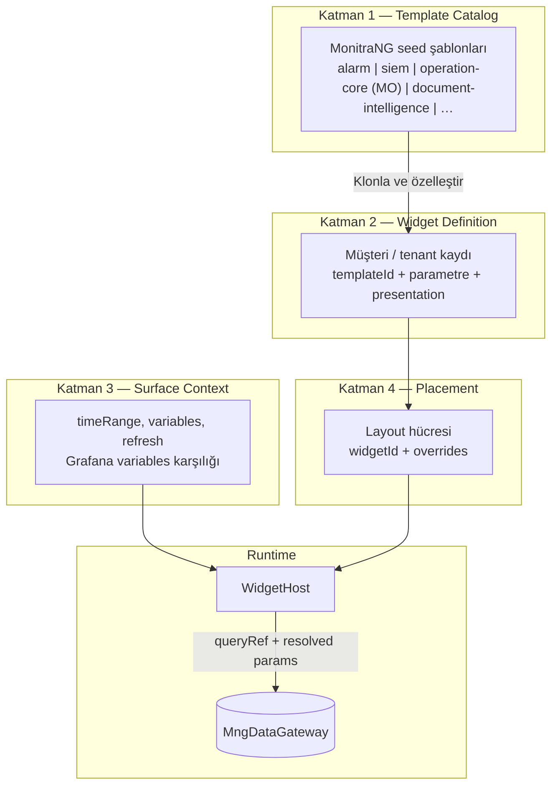
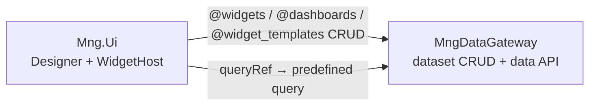

# Widget & Dashboard — Mimari

**Son güncelleme:** 7 Haziran 2026  
**Durum:** ✅ Kararlandı (planlama)  
**İlişkili:** [MANIFEST_SCHEMA.md](./MANIFEST_SCHEMA.md) · [INTERACTIVITY_MODEL.md](./INTERACTIVITY_MODEL.md)

---

## 1. Problem tanımı

MonitraNG’de widget/dashboard yeteneği **parçalı** gelişti:

| Hat | Sorun |
|-----|-------|
| Global `@widgets` + `WidgetForm` | Teknik kullanıcıya yönelik (aggregate, filter string) |
| `MonitoringWidgetForm` | Metrik izleme modülü | **V1 plan dışı** — MO = Operation Core (`operationcore/`) |
| OC `OcDashboardWidgetForm` | Ayrı veri modeli, global widget ile birleşmiyor |
| `AcSiemCenterDashboard` | Hardcoded bileşenler, localStorage layout |

Hedef: **tek widget motoru**, **tek manifest şeması**, **çoklu yüzey**, **teknik olmayan designer**, **zengin seed katalog**.

---

## 2. Katman modeli



### 2.1 Template Catalog (Katman 1)

MonitraNG tarafından domain kurulumunda veya paket güncellemesinde seed edilen **read-only veya klonlanabilir** şablonlar.

- `templateId`: stabil kimlik (`alarm.open-count-stat`)
- `domain`: `alarm` | `siem` | `operation-core` | `document-intelligence` | `generic` (+ ileride `monitoring`, `compliance`)
- `dataBinding.queryRef`: semantic sorgu referansı (UI’da teknik detay yok)
- `parametersSchema`: kullanıcıya gösterilecek parametre formu
- `presentationPresets`: uyumlu görsel preset listesi

**Depolama:** `@widget_templates` DG dataset — MonitraNG seed + tenant klonları; `isSystem: true` sistem şablonları. Paket-only JSON **kullanılmaz**. Ayrıntı: [datasets/DATASETS.md](./datasets/DATASETS.md).

### 2.2 Widget Definition (Katman 2)

Müşterinin oluşturduğu veya şablondan klonladığı kayıt.

- Global dashboard widget’ları: mevcut `@widgets` dataset’i **manifest şemasına** evrilir
- OC workspace widget’ları: aynı şemaya taşınır (gömülü JSON yerine `widgetId` veya inline manifest)

**Geriye dönük uyumluluk:** Mevcut `Widget` entity alanları (`type`, `dataSource`, `config`) → manifest adapter ile okunur; yeni kayıtlar doğrudan manifest yazar.

### 2.3 Surface Context (Katman 3)

Bir yüzeydeki (dashboard, SIEM paneli, workspace paneli) **paylaşılan filtre ve zaman** bağlamı. Grafana **dashboard variables + time range** karşılığı.

```typescript
interface SurfaceContext {
  /** Zaman aralığı — tüm bağlı widget'lara yayılabilir */
  timeRange: {
    preset: '20m' | '1h' | '6h' | '24h' | '7d' | '30d' | 'custom';
    from?: string;  // ISO — preset=custom
    to?: string;
  };

  /** Yüzey değişkenleri — dropdown / gizli bağlam */
  variables: Record<string, string | string[] | number | boolean | null>;

  /** Global yenileme (saniye); null = kapalı */
  refreshSeconds: number | null;

  locale: string;
}
```

**Örnek variables:**

| Anahtar | Yüzey | Açıklama |
|---------|-------|----------|
| `workspaceId` | MO (Operation Core) workspace panel | Gizli — URL’den |
| `severity` | SIEM / Alarm | Kullanıcı dropdown |
| `assetId` | Monitoring (ileride) | Asset seçici — **V1 dışı** |
| `scenarioId` | SIEM | Senaryo filtresi |

Widget parametrelerinde `$variable` sözdizimi context’ten çözülür (bkz. [MANIFEST_SCHEMA.md](./MANIFEST_SCHEMA.md) §4).

### 2.4 Placement (Katman 4)

Layout grid’de widget’ın **konumu ve yerel override’ları**.

```typescript
interface WidgetPlacement {
  widgetId: string;
  span?: number;
  spanMd?: number;
  spanLg?: number;
  overrides?: {
    parameters?: Record<string, unknown>;
    presentation?: Partial<PresentationConfig>;
    refreshSeconds?: number | null;
  };
}
```

Mevcut `@dashboards` layout şemasındaki `widgetId` + `widgetOverrides` bu modele **doğrudan map edilir**.

---

## 3. Surface Policy

Aynı `WidgetHost` farklı yüzeylerde farklı davranır. Politika yüzey başına tanımlanır.

```typescript
type SurfaceKind =
  | 'dashboard'           // /dashboards/:slug
  | 'dashboard-container' // rotasyonlu NOC ekranı
  | 'siem-center'         // güvenlik paneli
  | 'alarm-center'        // alarm özeti paneli (hedef)
  | 'workspace-panel'     // OC board default dashboard
  | 'monitoring-control'  // MO kontrol odası
  | 'report';             // Reporting Servis snapshot

interface SurfacePolicy {
  surface: SurfaceKind;
  allowContextEditing: boolean;   // zaman / filtre UI
  allowWidgetOverrides: boolean;  // çark menüsü (mevcut WidgetWithSettings)
  allowActions: boolean;          // onayla, ata, workflow tetikle
  allowLayoutEdit: boolean;       // sürükle-bırak / layout kaydet
  persistLayout: 'server' | 'local' | 'none';
  persistContext: 'server' | 'local' | 'session' | 'none';
}
```

**Örnek politikalar:**

| Yüzey | Context | Override | Actions | Layout persist |
|-------|---------|----------|---------|----------------|
| `dashboard` | ✅ | ✅ | ⚠️ (widget tipine bağlı) | server |
| `dashboard-container` | ❌ (sabit) | ❌ | ❌ | server (seçim listesi) |
| `siem-center` | ✅ | ✅ | drill-down | local → server (hedef) |
| `workspace-panel` | ⚠️ (workspaceId kilitli) | ✅ | ✅ | server |
| `report` | ❌ (snapshot) | ❌ | ❌ | none |

---

## 4. WidgetHost (tek runtime)

Tüm yüzeyler aynı host bileşenini kullanır.

```
WidgetHost
├── resolveManifest(widgetId | inlineManifest)
├── mergeContext(context, placement.overrides)
├── resolveParameters(manifest, context)  → DG çağrı parametreleri
├── fetchData(queryRef | serviceRef)      → widgetDataService / domain client genişletmesi
├── checkPermissions(manifest, surface)
├── render(presentation.preset → Vue component)
└── handleInteraction(drillDown | action)
```

**Mevcut kod eşlemesi:**

| Yeni | Mevcut |
|------|--------|
| `WidgetHost` | `WidgetRenderer.vue` + `WidgetWithSettings.vue` birleşimi |
| `resolveParameters` | `widgetDataService.ts` — `predefined` ağırlıklı genişletme |
| `presentation.preset` | `ChartWidget`, `StatCard`, `TableWidget` config map |

---

## 5. Data Catalog

Teknik olmayan kullanıcı **queryRef** veya (DI için) **serviceRef** seçer; arka planda DG veya domain API çağrısı üretilir.

### 5.1 queryRef sözleşmesi

```
@{dataset}/queries/{queryName}
```

Örnek: `@alarms/queries/openCount`, `@siem_events/queries/eventsByHour`

UI’da gösterilen: **“Açık alarm sayısı”** — dataset/query adı gizli veya ikincil.

### 5.2 Parametre çözümleme sırası

1. Manifest `parameters` sabit değerleri
2. Placement `overrides.parameters`
3. Surface Context `variables` (`$severity` → context.variables.severity)
4. Surface Context `timeRange` (`$timeRange.from`, `$timeRange.hours`)

### 5.3 Gelişmiş mod (admin)

`WidgetForm` aggregate/query/filter alanları **accordion “Gelişmiş”** altında kalır. Seed template’lerin `dataBinding` iç yapısı admin UI’da düzenlenebilir; standart kullanıcıya kapalı.

### 5.4 getMethod eşlemesi (DG)

| Data Catalog | DG getMethod | Kullanım |
|--------------|--------------|----------|
| predefined queryRef | `predefined` | **Birincil** — tüm seed template’ler |
| visual filter builder | `default` + generated filter | Basit listeler |
| admin advanced | `query` / `aggregate` | Nadir, güç kullanıcı |

### 5.5 serviceRef — DI ve diğer API kaynakları

Bazı domain’ler veriyi yalnızca **domain microservice** üzerinden yetkili şekilde sunar. Widget manifest’inde `dataBinding.serviceRef` kullanılır.

```
mngdocument:{endpointAlias}
```

Örnek: `mngdocument:resources/search` → `GET /documents/api/v1/resources/search` (Mng.Ui `server/api/documents` proxy).

| Domain | Birincil yol | Gerekçe |
|--------|--------------|---------|
| **operation-core (MO)** | `queryRef` → DG `op_work_items` | predefined query + dataset permissions |
| **alarm** | **`serviceRef` → MngAlarm** | Canlı alarm motoru API (D8) |
| **siem** | **`serviceRef` → MngReactor** (+ Alarm snapshot) | Olay summary/list API (D8) |
| **document-intelligence** | **`serviceRef` → MngDocument** | Klasör ACL API’de |
| monitoring | *(V1 plan dışı)* | Metrik modülü hazır olunca |

Ham `@dm_resources` DG sorgusu DI widget’larında **kullanılmaz** (yetki bypass riski).

Detay: [DATA_CATALOG.md](./DATA_CATALOG.md) · domain dokümanları `DOMAIN_*.md`

İleride: `mngoperations:...` batch — MO birincil yol DG queryRef kalır.

---

## 6. Presentation Preset Catalog

Chart/kart **görsel çeşitliliği** preset ile yönetilir; her preset mevcut Vue bileşenine map edilir.

| Preset ID | kind | Map edilen bileşen | Not |
|-----------|------|---------------------|-----|
| `stat-simple` | stat | `StatCard` | Tek sayı + ikon |
| `stat-sparkline` | stat | `StatCard` + mini area | Followers tarzı |
| `chart-line-smooth` | chart | `ChartWidget` type=line | |
| `chart-area-gradient` | chart | `ChartWidget` type=area | |
| `chart-donut-breakup` | chart | `ChartWidget` type=donut | YearlyBreakup tarzı |
| `chart-combo-bar-line` | chart | `ChartWidget` multi-axis | RevenueUpdates tarzı |
| `table-compact` | table | `TableWidget` | |
| `table-drilldown` | table | `TableWidget` + row link | |
| `list-activity` | list | `TableWidget` / yeni `ListWidget` | Timeline tarzı |
| `gauge-threshold` | gauge | `GaugeWidget` | MO |
| `map-assets` | map | `MapWidget` | MO / GIS |

Tema showcase bileşenleri (`components/widgets/charts/*`) doğrudan kopyalanmaz; **preset config** üretir.

---

## 7. Dashboard vs Widget Designer

İki ayrı UX; ortak katalog.

| Designer | Amaç | Çıktı |
|----------|------|-------|
| **Widget Designer** | “Ne gösterilecek?” | `@widgets` kaydı (manifest) |
| **Dashboard Designer** | “Nerede duracak?” | `@dashboards` layout + placement |

Widget Designer adımları (hedef UX):

1. Katalogdan şablon seç (domain filtresi)
2. Parametre formu (teknik alan yok)
3. Presentation preset galerisi + canlı önizleme
4. Davranış: yenileme, drill-down, yetki

Dashboard Designer: mevcut `LayoutEditor` + katalog tabanlı `WidgetPickerModal` — değişmez, picker beslemesi güncellenir.

---

## 8. Dataset hedefleri

| Dataset | Rol |
|---------|-----|
| `@widget_templates` | Seed şablon katalogu — **DG dataset (D1 ✅)** |
| `@widget_categories` | Domain / tip gruplama (mevcut, genişletilir) |
| `@widgets` | Widget Definition (manifest alanları eklenir) |
| `@dashboards` | Layout + placement (mevcut şema uyumlu) |
| `@dashboard_surfaces` | Opsiyonel — SIEM/Alarm panel layout’u server-side (Faz 3) |

---

## 9. Reporting Servis entegrasyonu (hook)

Rapor motoru UI ile **aynı manifest** okur:

- `dataContract.queryRef` + çözülmüş parametreler → server-side DG snapshot
- `presentation` → PDF/PNG render adapter
- `export` bayrakları manifest’te (bkz. MANIFEST_SCHEMA §7)

UI widget’ı = rapor widget’ı; fark yalnızca `SurfacePolicy.surface = 'report'`.

---

## 10. Migrasyon stratejisi

| Sıra | İş | Risk |
|------|-----|------|
| 1 | Manifest şeması + adapter (eski `@widgets` okunabilir) | Düşük |
| 2 | Template seed paketi (Alarm, SIEM, MO) | Orta |
| 3 | Yeni Widget Designer wizard | Orta |
| 4 | SIEM panel → WidgetHost + seed layout | Yüksek |
| 5 | OC dashboard → ortak manifest | Yüksek |
| 6 | Reporting hook | Ayrı proje |

Mevcut `DashboardLayoutRenderer`, `WidgetRenderer`, `@dashboards` builder **atılmez**; üzerine manifest + context katmanı eklenir.

---

## 11. Performans notları

- Dashboard başına N widget = N DG çağrısı — Faz 2+ için **batch fetch** değerlendirilecek (Nuxt BFF veya DG endpoint; **ayrı widget servisi değil**)
- Aynı `queryRef` + parametre → client-side request dedup (5 sn TTL)
- Container rotasyonunda prefetch: sonraki dashboard widget’ları arka planda

---

## 13. Backend sınırı (kilitli karar)

Widget & dashboard designer için **ayrı backend microservice yok** (Faz 0–4).

### 13.1 Runtime yığını



| Sorumluluk | Bileşen |
|------------|---------|
| Tanım saklama | DG: `@widgets`, `@widget_templates`, `@dashboards` |
| Canlı veri | DG: predefined query / default GET (`queryRef`) |
| Manifest çözümleme, render, etkileşim | Mng.Ui (client) |
| Yetkilendirme | JWT + DG dataset permissions + widget `permissions` |
| Template seed | PowerShell / deploy script → DG (notifications pattern) |

### 13.2 Bilinçli olarak yok

| Bileşen | Gerekçe |
|---------|---------|
| `MngWidget` servisi | DG + UI yeterli; duplicate CRUD |
| Widget-specific API gateway | DG zaten domain API |
| Ayrı template registry servisi | `@widget_templates` dataset |

### 13.3 İsteğe bağlı ince katmanlar (yeni servis sayılmaz)

| Katman | Ne zaman | Not |
|--------|----------|-----|
| Nuxt server route (BFF) | Faz 2 batch fetch | Paralel DG çağrılarını tek round-trip’e toplar |
| DG batch / composite query | Faz 2+ | Veri katmanı optimizasyonu |
| **Reporting Servis** | Faz 5 | PDF/snapshot; widget **manifest tüketir**, widget motoru değil |

### 13.4 Sorumluluk kayması

UI sadeleştikçe iş **domain dataset predefined query** tanımına kayar. Bu MngDataGateway / domain schema işidir; yeni servis değil. Seed template başına ilgili dataset’te `queryRef` karşılığı zorunlu.

---

## 14. Kilitli kararlar

| Konu | Karar |
|------|-------|
| **Backend sınırı** | ✅ **Ayrı servis yok** — DG + Mng.Ui (Faz 0–4) |
| **Template depolama (D1)** | ✅ **`@widget_templates` DG dataset** — `isSystem`; paket JSON değil |
| **DI veri yolu (D6)** | ✅ `serviceRef` → MngDocument |
| **Alarm/SIEM veri yolu (D8)** | ✅ `serviceRef` → MngAlarm / MngReactor — DG queryRef değil |
| **V1 katalog (D7)** | ✅ alarm · siem · **operation-core (MO)** · document-intelligence |
| Tek renderer | ✅ `WidgetHost` — yüzey başına ayrı hardcoded panel yok (hedef) |
| Birincil veri yolu | ✅ predefined `queryRef` — aggregate UI’da gizli |
| Context modeli | ✅ SurfaceContext — Grafana variables benzeri |
| Presentation | ✅ preset catalog — tema bileşenleri kopyalanmaz |
| MO / SIEM birleşme | ✅ ortak manifest — OcDashboard ayrı model kaldırılacak (Faz 3–4) |
| Rapor | ✅ aynı manifest — snapshot modu; export Reporting Servis (Faz 5) |

Açık kararlar: [DEVAM.md](./DEVAM.md)
