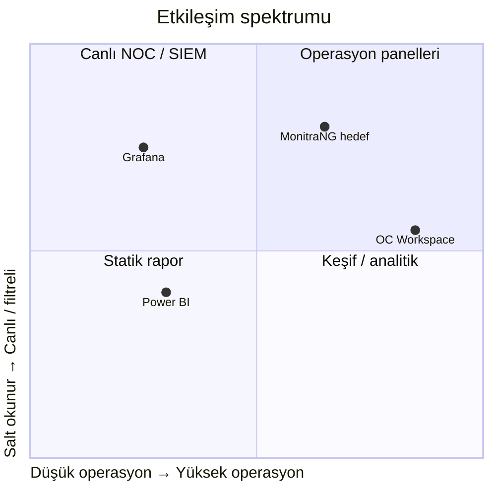
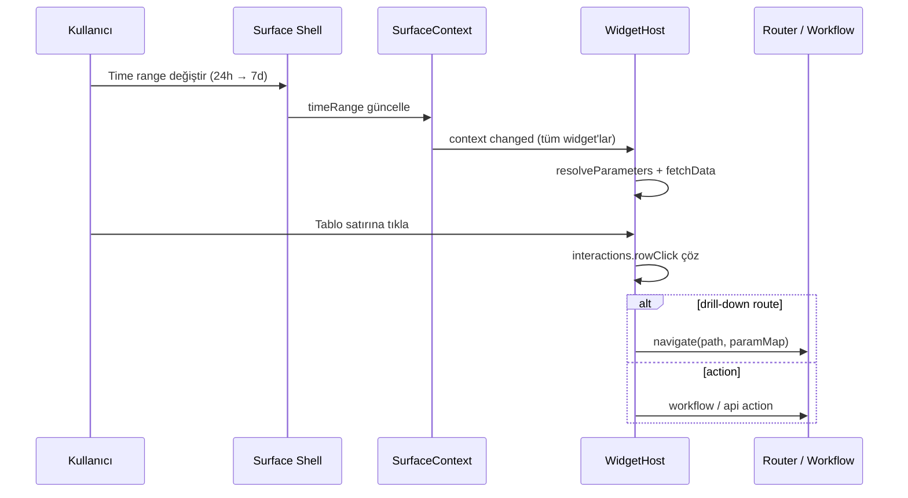

# Widget Etkileşim Modeli

**Son güncelleme:** 7 Haziran 2026  
**Durum:** ✅ Planlama v1  
**İlişkili:** [ARCHITECTURE.md](./ARCHITECTURE.md) · [MANIFEST_SCHEMA.md](./MANIFEST_SCHEMA.md)

---

## 1. Amaç

MonitraNG widget sisteminin **hangi etkileşimleri** desteklemesi gerektiğini tanımlamak; Grafana dashboard modeli ile karşılaştırarak **neyi ödünç alacağımızı**, **nerede farklılaşacağımızı** netleştirmek.

---

## 2. Grafana’da etkileşim ne demek?

Grafana dashboard’ları **statik rapor değildir**. Tipik etkileşimler:

| Tür | Grafana davranışı |
|-----|-------------------|
| **Global zaman aralığı** | Tüm paneller aynı time range kullanır |
| **Dashboard variables** | Dropdown / custom değişken → sorgulara enjekte |
| **Otomatik yenileme** | 5s–30m refresh interval |
| **Legend toggle** | Seri gizle/göster |
| **Grafik zoom** | Seçilen aralık dashboard time range’i günceller |
| **Data links** | Veri noktası / satır → URL veya başka dashboard |
| **Dashboard links** | Parametre taşıyan çapraz gezinme |
| **Repeat panels/rows** | Değişkene göre dinamik panel çoğaltma |
| **Explore drill** | Panel → Explore modu (gelişmiş analiz) |
| **Annotations** | Zaman ekseninde olay işaretleri |

Grafana etkileşimi **analitik keşif** eksenindedir: filtrele, zoom yap, gezin, canlı izle.

### 2.1 Grafana’da zayıf / dışında kalan

| Tür | Durum |
|-----|-------|
| Kayıt onaylama / ticket açma | ❌ Çekirdek değil (plugin gerekir) |
| Form ile veri girişi | ❌ |
| Workspace / board bağlamı | ❌ |
| Teknik olmayan widget tasarımı | ❌ Kullanıcı sorgu yazar |
| Operasyon aksiyon butonları | ❌ Birinci sınıf değil |

---

## 3. MonitraNG etkileşim spektrumu

MonitraNG **Grafana + operasyon uygulaması** kesişiminde konumlanır.



---

## 4. Etkileşim matrisi

### 4.1 Analitik etkileşimler (Grafana hizası — birinci sınıf)

| ID | Etkileşim | Açıklama | Manifest / Context | Öncelik |
|----|-----------|----------|-------------------|---------|
| A1 | **Global time range** | Yüzey toolbar’ından preset / custom | `SurfaceContext.timeRange` | P0 |
| A2 | **Surface variables** | severity, workspace, asset dropdown | `SurfaceContext.variables` | P0 |
| A3 | **Auto refresh** | Global + widget override | `refreshSeconds` | P0 |
| A4 | **Legend / seri toggle** | Chart preset config | `presentation.config` | P1 |
| A5 | **Chart zoom → time range** | Zoom seçimi context’i günceller | context event | P2 |
| A6 | **Cross-filter** | Tablo satırı / chart segment → variable güncelle | `interactions.crossFilter` | P2 |
| A7 | **Drill-down route** | Widget → detay sayfa (param taşıma) | `interactions.drillDown` | P0 |
| A8 | **External link** | Harici URL | `interactions.drillDown.type=external` | P2 |

### 4.2 Operasyonel etkileşimler (MonitraNG farkı — birinci sınıf)

| ID | Etkileşim | Açıklama | Yüzey | Öncelik |
|----|-----------|----------|-------|---------|
| O1 | **Row click → kayıt** | Alarm / iş / olay detayı | table/list | P0 |
| O2 | **Widget action button** | Onayla, ata, kapat | alarm, oc | P1 |
| O3 | **Workflow trigger** | Tanımlı workflow başlat | oc, automation | P2 |
| O4 | **Context lock** | workspaceId URL’den kilitli | workspace-panel | P0 |
| O5 | **Widget override UI** | Çark menüsü: zaman, limit | dashboard, siem, mo | P0 (mevcut MO) |
| O6 | **Layout customize** | Panel sırası / gizle | siem-center | P1 |

### 4.3 Rapor / snapshot etkileşimleri

| ID | Etkileşim | Açıklama | Öncelik |
|----|-----------|----------|---------|
| R1 | **Snapshot freeze** | Parametre + veri zamana kilitli | P2 (Reporting Servis) |
| R2 | **Export CSV/PDF/PNG** | Manifest `export` bayrakları | P2 |
| R3 | **No live refresh** | `surface=report` policy | P2 |

---

## 5. Surface × etkileşim policy tablosu

`allow*` bayrakları hangi etkileşim ailesinin açık olduğunu belirler.

| Etkileşim | dashboard | siem-center | alarm-center | workspace-panel | dashboard-container | report |
|-----------|-----------|-------------|--------------|-----------------|---------------------|--------|
| A1 time range | ✅ | ✅ | ✅ | ⚠️ kilitli preset | ❌ | ❌ snapshot |
| A2 variables | ✅ | ✅ | ✅ | ⚠️ workspace kilitli | ❌ | ❌ |
| A3 refresh | ✅ | ✅ | ✅ | ✅ | ✅ | ❌ |
| A7 drill-down | ✅ | ✅ | ✅ | ✅ | ⚠️ | ❌ |
| O2 actions | ⚠️ | ❌ | ✅ | ✅ | ❌ | ❌ |
| O5 override UI | ✅ | ✅ | ⚠️ | ✅ | ❌ | ❌ |
| O6 layout edit | ✅ | ✅ | ⚠️ | ✅ admin | ❌ | ❌ |
| R1 snapshot | ❌ | ❌ | ❌ | ❌ | ❌ | ✅ |

---

## 6. Grafana’dan ödünç alınan pattern’ler

### 6.1 Surface Context = Variables + Time range

Grafana’da her panel sorgusuna `$host`, `$interval` enjekte edilir. MonitraNG’de:

```
Panel sorgusu değil → queryRef + resolved parameters
Context değişince → tüm bağlı widget'lar yeniden fetch
```

**Uygulama:** Yüzey üst bar’ında time range + variable chip’leri; widget başına tekrar etme yok.

### 6.2 Drill-down = Data links

Grafana data link:
```
/dashboard/siem?var-source=${__field.labels.source}
```

MonitraNG drillDown:
```json
{
  "path": "/apps/siem-center/events",
  "paramMap": { "source": "$row.source", "from": "$timeRange.from" }
}
```

Aynı mental model; route tabanlı (SPA uyumlu).

### 6.3 Repeat panels → gelecek (P3)

Grafana `$host` repeat ile N panel üretir. MonitraNG karşılığı:

```
variables.assetIds = ["a1","a2","a3"]
→ layout engine repeat row → aynı templateId, farklı $variables.assetId
```

Faz 3+; manifest şimdiden `repeat?: { variable: string }` alanı rezerve edilebilir.

---

## 7. Grafana’dan bilinçli sapmalar

| Konu | Grafana | MonitraNG kararı | Gerekçe |
|------|---------|------------------|---------|
| Sorgu yazımı | PromQL/SQL zorunlu | predefined queryRef | Teknik olmayan kullanıcı |
| Panel = sorgu+viz | Tek JSON blob | Template / Definition / Placement ayrımı | Rapor + çoklu yüzey |
| Aksiyon | Yok | `interactions.actions` | Operasyon merkezi |
| Layout persist | Dashboard JSON | server (+ SIEM geçici local) | Tenant yönetimi |
| Explore modu | Var | Detay sayfalarına drill-down | Uygulama UX tutarlılığı |

---

## 8. Kullanıcı persona × etkileşim

| Persona | Tipik yüzey | Etkileşim ihtiyacı |
|---------|-------------|-------------------|
| **NOC operatörü** | SIEM, dashboard container | A1–A3, A7, O5 — hızlı filtre, canlı refresh |
| **Güvenlik analisti** | SIEM events drill | A6 cross-filter, A7, tablo export |
| **IT helpdesk** | OC workspace panel | O1, O2, O4 — iş listesi + aksiyon |
| **Yönetici** | Dashboard | A1, A7, R2 export |
| **Tenant admin** | Widget/Dashboard designer | Wizard — etkileşim tanımı basit form |
| **Rapor tüketicisi** | Report | R1, R2 — salt okunur snapshot |

Designer’da operatör **etkileşim kodu yazmaz**; form alanları:

- “Tıklanınca git” → route picker + parametre eşleme UI
- “Satır aksiyonu” → öntanımlı action listesi (Onayla, Detay aç)

---

## 9. Etkileşim olay akışı



---

## 10. Mevcut kodda etkileşim durumu

| Özellik | Mevcut | Hedef |
|---------|--------|-------|
| Dashboard global refresh | ✅ `[slug].vue` inject | SurfaceContext |
| Widget override (MO) | ✅ `WidgetWithSettings` | O5 — tüm domain’ler |
| SIEM layout customize | ✅ localStorage draft | O6 — server persist |
| SIEM stat → events link | ✅ hardcoded | A7 manifest drillDown |
| Chart legend toggle | ✅ ApexCharts default | A4 |
| Cross-filter | ❌ | A6 Faz 2 |
| Widget action button | ❌ | O2 Faz 2 |
| Report snapshot | ❌ | R1 Reporting Servis |

---

## 11. Öncelik özeti

**Faz 1 (P0):** A1, A2, A3, A7, O4, O5 — SurfaceContext + drillDown manifest + mevcut override genelleme

**Faz 2 (P1):** O1, O2, O6, A4 — row click, action button, SIEM layout server-side

**Faz 3 (P2):** A5, A6, A8, O3, R1, R2 — zoom cross-filter, workflow, reporting

**Faz 4 (P3):** Repeat panels, annotations, gelişmiş Explore benzeri analiz sayfası

---

## 12. Kilitli ilkeler

1. **Canlı yüzeyler** Grafana kadar etkileşimli olmalı (filtre + refresh + drill-down).
2. **Operasyon yüzeyleri** Grafana’nın yapamadığı aksiyonları birinci sınıf desteklemeli.
3. **Rapor yüzeyi** bilinçli olarak etkileşimsiz — snapshot doğruluğu öncelik.
4. **Designer** etkileşim tanımını kod yerine form ile sunmalı.
5. **Aynı widget** tüm yüzeylerde aynı manifest; fark yalnızca Surface Policy.

Açık sorular: [DEVAM.md](./DEVAM.md)
